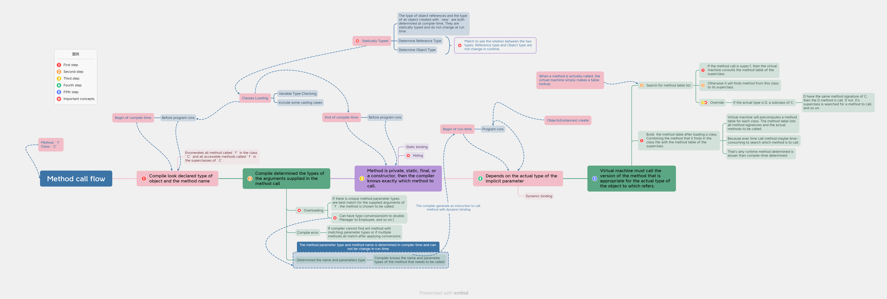

This Article is try to figure out some very tricky concepts in Java like:

**1. Static binding/Compile-Time binding/Early binding/Method overloading.(in same class)**

**2. Dynamic binding/Run-Time binding/Late binding/Method overriding.(in different classes)**

**3. Overload vs Override vs Hiding(Shadow)**

**4. Variable Hiding vs Method Hiding**

**5. Type Casting**

**6. Compile error vs Runtime error**

**7. Reference Type vs Object Type**

---

*Note:* The above terminology is saying that, static is determined in compile time.

## A very tricky example

Before we start clarify the difference, let we look an example:

```java
public class Dog {
    public String a = "In the Dog class";
    public static void makeNoise(Dog d) {/* Static Method F */}
    public void bark(Dog d) { /* Method A */ }
}

public class Corgi extends Dog {
    public String a = "In the Corgi class"; // hiding variable in Dog
    public static void makeNoise(Corgi c) {/* Static Method G */}
    public void bark(Corgi c) { /* Method B */ }

    @Override
    public void bark(Dog d) { /* Method C */ }

    public void play(Dog d) { /* Method D */ }
    public void play(Corgi c) { /* Method E */ }
}

public class Main {
    public static void main(String[] args) {
        Dog d = new Corgi();
        Corgi c = new Corgi();

        d.play(d); // Compile-Error
        d.play(c); // Compile-Error
        c.play(d); // D
        c.play(c); // E
        
        c.bark(d); // C
        c.bark(c); // B
        d.bark(d); // C
        d.bark(c); // C
        
        // The following are bad Java code style but just for fun.
        d.makeNoise(d); // F
        d.makeNoise(c); // F
        c.makeNoise(d); // F
        c.makeNoise(c); // G
        
        // Showing the hiding variable
        System.out.println(d.a); // In the Dog class
        System.out.println(c.a); // In the Corgi class
    }
}

```

When first seen these tricky example may have a little scary, but don’t worry about that, we will analyze these more deeply in the rest of the article.

## Polymorphism

For understanding these tricky concepts, we need to know above concepts are a part of polymorphism. The definition of polymorphism: 

> @Source: [Polymorphism](https://docs.oracle.com/javase/tutorial/java/IandI/polymorphism.html)
>
> The dictionary definition of *polymorphism* refers to a principle in biology in which an organism or species can have many different forms or stages. This principle can also be applied to object-oriented programming and languages like the Java language. Subclasses of a class can define their own unique behaviors and yet share some of the same functionality of the parent class.
>
> ---
>
> *Note:* The Java virtual machine (JVM) calls the appropriate method for the object that is referred to in each variable. It does not call the method that is defined by the variable's type. This behavior is referred to as *virtual method invocation* and demonstrates an aspect of the important polymorphism features in the Java language.

### Difference between Compile-time and Run-time Polymorphism - Type Polymorphism

After known polymorphism, we should know the difference of Compile-time and Run-time Polymorphism:

> @Source: [Difference Between Compile-time and Run-time Polymorphism in Java](https://byjus.com/gate/difference-between-compile-time-and-run-time-polymorphism-in-java/)
>
> **What Is Compile-time Polymorphism?**
>
> Compile-time polymorphism is obtained through **method overloading**. The term method overloading allows us to have more than one method with the same name. Since this process is executed during compile time, that’s why it is known as Compile-Time Polymorphism.
>
> **What Is Run-time Polymorphism?**
>
> When a polymorphism receives the information to call a method and that to be in runtime, then it is called runtime polymorphism.
>
> **Difference Between Compile-time and Run-time Polymorphism in Java**
>
> | **Sr.No** | **Compile Time Polymorphism**                                | **Runtime Polymorphism**                                     |
>| --------- | ------------------------------------------------------------ | ------------------------------------------------------------ |
> | 1         | We can explain compile-time polymorphism through **method overloading**. Compile-time polymorphism allows us to have more than one method share the same name with different signatures and different return types. | We can explain run-time polymorphism through **method overriding**. Run-time polymorphism is allied in different classes but allows us to have the same method with the same signature name. |
> | 2         | In this, the call is determined by the compiler.             | In this, the call is not determined by the compiler.         |
> | 3         | The method is executed quite earlier at the compile-time, and that’s why it provides fast execution. | The method is executed at the run-time, and that’s why it provides slow execution. |
> | 4         | This polymorphism is also known as early binding, overloading, and static binding. | This polymorphism is also known as late binding, dynamic binding, and overriding. |
> | 5         | It is obtained by **operator overloading and function overloading**. | It is obtained by **pointers and virtual functions**.        |
> | 6         | It is less manageable as it performs at compile time.        | It is more flexible as it executes at run time.              |

> @Source: [Everything About Method Overloading Vs Method Overriding](https://www.programmingmitra.com/2017/05/everything-about-method-overloading-vs-method-overriding.html)
>
> While overloading has nothing to deal with polymorphism but Java programmers also refer method overloading as **Compile Time** **Polymorphism** because which method is going to get called will be decided at compile time only.

## Compile-time and Runtime

### Runtime and Compile time

According to [What is static and dynamic binding](https://javarevisited.blogspot.com/2012/03/what-is-static-and-dynamic-binding-in.html):

> @Source: [What is Static and Dynamic binding in Java with Example](https://javarevisited.blogspot.com/2012/03/what-is-static-and-dynamic-binding-in.html)
>
> This resolution(Dynamic binding) happens only at runtime because **objects are only created during runtime** and are called dynamic binding in Java. Dynamic binding is slower than static binding because it occurs in runtime and spends some time to find out the actual method to be called.

### Run-time type and Compile-time type

**Static vs. Dynamic Type** Every variable in Java has a static type. This is the type specified when the variable is declared, and is checked at **compile time**. Every variable also has a dynamic type; this type is specified when the variable is instantiated, and is checked at runtime. As an example:

```java
Thing a;
a = new Fox();
```

Here, `Thing` is the static type, and `Fox` is the dynamic type. This is fine because all foxes are things. We can also do:

```java
Animal b = a;
```

This is fine, because all foxes are animals too. We can do:

```java
Fox c = b;
```

This is fine, because `b` points to a `Fox`. Finally, we can do:

```java
a = new Squid()
```

This is fine, because the static type of `a` is a `Thing`, and `Squid` is a thing.

Something you need to know:

- Dynamic type must be the same or a subclass of the static type. 
- Box analogy: static type is the label on the box, dynamic type is the actual class the object is constructed as. you can put a fish, salmon, shark, or any other type of fish into a box labeled Fish. You cannot put a Fish into a box labeled Salmon (what if it’s a shark??)
- Type checking is done at compile time. 

### What happen when compile time

In order to know the different behavior between run-time and compile-time in Java, we should know what happen when compile-time:

> @Source: [What are the things are checked at compile time by Java?](https://www.quora.com/What-are-the-things-are-checked-at-compile-time-by-Java)
>
> 1. **Primitive type casting**
> 2. **Function binding ( overloaded methods as well as normal methods except overridden methods )**
> 3. **Reference / Object types ( Match to see the relation between the two types )**
> 4. Constructor match
> 5. Class references , correct packages.
> 6. **Return type matching the return type declared and expected.**
> 7. Function signature declared and called.
> 8. Overridden methods implemented or not.
> 9. Abstract methods declared without declaring class abstract.
> 10. Class implementing Interface defined methods or not.
> 11. **Overridden method hiding by making the method static in derived class.**
> 12. Using Abstract and Final together.
> 13. Reassigning Final Variables.
> 14. Overriding Final method.
> 15. Extending Final Class.
> 16. Accessing instance variable directly within static method.
> 17. **Type checking**.
> 18. Replace the constant String and primitive type name with its value(if the value is known in compile time).

From the above list, we can know that overload and hiding are taken in the compile-time, and also determine reference and objects type. But not for override.

---

*Note:* classes are load at compile-time, and objects(instances) are create at run-time. The compiler doesn’t know that the object on the right side of the equals sign is actually an instance of what type, it was check in runtime.

## What is `Static`

> @Source: [Understanding Class Members](https://docs.oracle.com/javase/tutorial/java/javaOO/classvars.html)
>
> **Class Variable**
>
> Sometimes, you want to have variables that are common to all objects. This is accomplished with the `static` modifier. Fields that have the `static` modifier in their declaration are called *static fields* or *class variables*. They are associated with the class, rather than with any object. Every instance of the class shares a class variable, which is in one fixed location in memory. Any object can change the value of a class variable, but class variables can also be manipulated without creating an instance of the class.
>
> **Note:** You can also refer to static fields with an object reference like
>
> ```java
> myBike.numberOfBicycles
> ```
>
> but this is discouraged because it does not make it clear that they are class variables.
>
> 
>
> **Class Methods**
>
> The Java programming language supports static methods as well as static variables. Static methods, which have the `static` modifier in their declarations, should be invoked with the class name, without the need for creating an instance of the class, as in
>
> ```java
> ClassName.methodName(args)
> ```
>
> ------
>
> **Note:** You can also refer to static methods with an object reference like
>
> ```java
> instanceName.methodName(args)
> ```
>
> but this is discouraged because it does not make it clear that they are class methods.
>
> A common use for static methods is to access static fields. For example, we could add a static method to the `Bicycle` class to access the `numberOfBicycles` static field:
>
> ```java
> public static int getNumberOfBicycles() {
>     return numberOfBicycles;
> }
> ```
>
> Not all combinations of instance and class variables and methods are allowed:
>
> - Instance methods can access instance variables and instance methods directly.
> - Instance methods can access class variables and class methods directly.
> - Class methods can access class variables and class methods directly.
> - Class methods **cannot** access instance variables or instance methods directly—they must use an object reference. Also, class methods cannot use the `this` keyword as there is no instance for `this` to refer to.
>
> **Constants**
>
> The `static` modifier, in combination with the `final` modifier, is also used to define constants. The `final` modifier indicates that the value of this field cannot change.
>
> For example, the following variable declaration defines a constant named `PI`, whose value is an approximation of pi (the ratio of the circumference of a circle to its diameter):
>
> ```java
> static final double PI = 3.141592653589793;
> ```
>
> Constants defined in this way cannot be reassigned, and it is a compile-time error if your program tries to do so. By convention, the names of constant values are spelled in uppercase letters. If the name is composed of more than one word, the words are separated by an underscore (_).
>
> ------
>
> **Note:** If a primitive type or a string is defined as a constant and the value is known at compile time, the compiler replaces the constant name everywhere in the code with its value. This is called a *compile-time constant*. If the value of the constant in the outside world changes (for example, if it is legislated that pi actually should be 3.975), you will need to recompile any classes that use this constant to get the current value.


## What is Hiding(Shadow), Overload and Override

Before we introduce dynamic binding and static binding, we first come to see what is hiding, override and overload.

### Overload

The definition of Overload:

> @Source: [Defining Methods](https://docs.oracle.com/javase/tutorial/java/javaOO/methods.html)
>
> **Overloading Methods**
>
> The Java programming language supports *overloading* methods, and Java can distinguish between methods with different *method signatures*. This means that methods **within a class** can have the same name if they have different parameter lists (there are some qualifications to this that will be discussed in the lesson titled "Interfaces and Inheritance").
>
> Overloaded methods are differentiated by the number and the type of the arguments passed into the method. In the code sample, `draw(String s)` and `draw(int i)` are distinct and unique methods because they require different argument types.
>
> You cannot declare more than one method with the same name and the same number and type of arguments, because the compiler cannot tell them apart.
>
> The compiler does not consider return type when differentiating methods, so you cannot declare two methods with the same signature even if they have a different return type.
>
> ------
>
> **Note:** Overloaded methods should be used sparingly, as they can make code much less readable.

### Override

The definition of Override: 

> @Source: [Overriding and Hiding Methods (The Java™ Tutorials > Learning the Java Language > Interfaces and Inheritance) (oracle.com)](https://docs.oracle.com/javase/tutorial/java/IandI/override.html)
>
> **Instance Methods**
>
> An instance method in a **subclass** with the same signature (name, plus the number and the **type** of its parameters) and return type as an instance method in the superclass *overrides* the superclass's method.

---

*Note:* The parameters have to be **exactly** the same to be overriding. i.e. `swim(Salmon fish)` is not overriding `swim(Fish fish)`, even if they have inheritance relationship.

#### Some tips for override

> @Source: Core-Java-Volume-I-Fundamentals-12th-Edition-Cay-S.-Horstamnn #5.1.6 Understanding Method calls
>
> When you override a method, the subclass method must be at least as visible as the superclass method. In particular, if the superclass method is public, the subclass method must also be declared public. It is a common error to accidentally omit the public specifier for the subclass method. The compiler then complains that you try to supply a more restrictive access privilege.

> @Source: [Overriding and Hiding Methods (The Java™ Tutorials > Learning the Java Language > Interfaces and Inheritance) (oracle.com)](https://docs.oracle.com/javase/tutorial/java/IandI/override.html)
>
> The ability of a subclass to override a method allows a class to inherit from a superclass whose behavior is "close enough" and then to modify behavior as needed. The overriding method has the same name, number and type of parameters, and return type as the method that it overrides. **An overriding method can also return a subtype of the type returned by the overridden method.** This subtype is called a *covariant return type*.
>
> **When overriding a method, you might want to use the `@Override` annotation that instructs the compiler that you intend to override a method in the superclass.** If, for some reason, the compiler detects that the method does not exist in one of the superclasses, then it will generate an error. For more information on `@Override`, see [`Annotations`](https://docs.oracle.com/javase/tutorial/java/annotations/index.html).

### Hiding

The definition of hiding: 

> @Source: [Overriding and Hiding Methods (The Java™ Tutorials > Learning the Java Language > Interfaces and Inheritance) (oracle.com)](https://docs.oracle.com/javase/tutorial/java/IandI/override.html)
>
> **Static Methods**
>
> If a **subclass** defines a **static** method with the same signature as a static method in the superclass, then the method in the subclass *hides* the one in the superclass.
>
> The distinction between hiding a static method and overriding an instance method has important implications:
>
> - The version of the overridden instance method that gets invoked is the one in the subclass.
>- The version of the hidden static method that gets invoked depends on whether it is invoked from the superclass or the subclass.
> 

By the way, static method in superclass can inherited by subclass, you can check in [Inheritance (The Java™ Tutorials > Learning the Java Language > Interfaces and Inheritance) (oracle.com) ](https://docs.oracle.com/javase/tutorial/java/IandI/subclasses.html), [inheritance - Are static methods inherited in Java? - Stack Overflow](https://stackoverflow.com/questions/10291949/are-static-methods-inherited-in-java).

### Difference between Overload and Override

**Method Overloading** In Java, methods in a class can have the same name, but different parameters. For example, a `Math` class can have an `add(int a, int b)` method and an `add(float a, float b)` method as well. The Java compiler is smart enough to choose the correct method depending on the parameters that you pass in. Methods with the same name but different parameters are said to be overloaded.

**Overriding** For each method in `AList` that we also defined in `List`, we will add an @Override right above the method signature. As an example:

```java
@Override
public Item get(int i) { ... }
```

This is not necessary, but is good style and thus we will require it. Also, it allows us to check against typos. If we mistype our method name, the compiler will prevent our compilation if we have the @Override tag.

---

*Note:* Overriding is tied to inheritance, Overloading is not, but you can also overload a method in subclass with the one in the superclass [Object.equals() Overload](#Actually Overload `Object.equals()` rather than Override).

### Difference between Override and Hiding

Can we override static method or not:

> @Source: [Java Method Hiding and Overriding: Override Static Method in Java • Crunchify](https://crunchify.com/java-method-hiding-and-overriding-override-static-method-in-java/)
>
> **Can we override static method in Java?**
>
> `No, you cannot override static method in Java` because method overriding is based upon dynamic binding at [runtime](https://crunchify.com/java-runtime-get-free-used-and-total-memory-in-java/). Usually static methods are bonded using static binding at compile time before even program runs.
>
> Basically, keyword `static` modifies the [lifecycle](https://crunchify.com/org-apache-catalina-lifecycleexception/) of variable and method. **If you specify static method or variable then those are created at the time of class is loaded and not at runtime. `Nonstatic` variables and methods are only available during runtime.**

### The main difference of override, overload and hiding

Through the definition of overload, override and hiding, we know how to differentiate them. In conclusion:

- Override and Hiding are occur in the superclass and subclass.
- Overload is occur in the same class.
- Method Override occurs only with instance methods, it supports dynamic binding and is determined at runtime.
- Method Hiding works with static ones, it is determined at compile time.
- Overload is determined at compile time.
- A static method does not have run-time polymorphism. Because the static method is determined at compile time.
- Override replace the superclass method, but hiding not.

Also according to [What is static and dynamic binding](https://javarevisited.blogspot.com/2012/03/what-is-static-and-dynamic-binding-in.html):

> @Source: [What is Static and Dynamic binding in Java with Example (javarevisited.blogspot.com)](https://javarevisited.blogspot.com/2012/03/what-is-static-and-dynamic-binding-in.html)
>
> That's all on the **difference between static and dynamic binding in java**. The bottom line is **static binding is a compile-time** operation while the **dynamic binding is a runtime**. one uses Type and the other uses Object to bind. static, private, and final methods and variables are resolved using static binding which makes their execution fast because no time is wasted to find the correct method during runtime.

---

*Note:* Not only method can hiding, but also for variable. See the article [Variable-Method-Hiding](https://www.baeldung.com/java-variable-method-hiding#local). If you are interested in variable hiding and variable shadow and maybe also their difference, you can check in [Variable Shadowing and Hiding in Java - DZone](https://dzone.com/articles/variable-shadowing-and-hiding-in-java). 


## Why we need Overload and Override

According to the article [What is static and dynamic binding](https://javarevisited.blogspot.com/2012/03/what-is-static-and-dynamic-binding-in.html):

> @Source: [What is Static and Dynamic binding in Java with Example (javarevisited.blogspot.com)](https://javarevisited.blogspot.com/2012/03/what-is-static-and-dynamic-binding-in.html)
>
> If you have more than one method of the same name ([method overriding](http://javarevisited.blogspot.com/2011/12/method-overloading-vs-method-overriding.html)) or two variables of the same name in the same class hierarchy it gets tricky to find out which one is used during runtime as a result of their reference in code. This problem is resolved using *static and dynamic binding in Java*. For those who are not familiar with the binding operation, its process is used to a link which method or variable to be called as a result of their reference in code.
>
> Most of the references are resolved during compile time but some references which depend upon Object and [polymorphism in Java](http://javarevisited.blogspot.com/2011/08/what-is-polymorphism-in-java-example.html) are resolved during runtime when the actual object is available. 
>
> *The difference between static and dynamic binding* is a [popular Java programming interview question](http://javarevisited.blogspot.com/2011/04/top-20-core-java-interview-questions.html) that tries to explore candidates' knowledge on having compiler and [JVM](http://javarevisited.blogspot.com/2011/12/jre-jvm-jdk-jit-in-java-programming.html) finds which methods to call if there is more than one method of the same name as it's the case in method overloading and overriding. 

So, in order to solve above problems, Java introduce the dynamic/run-time binding and static/compile binding. And we also known that Java execute compile before interpret, so compile-time is earlier than run-time. For example, in command-line, we have

```shell
javac Animal.java # which call the java compile
java Animal # which means java interpret
```

and that's why **JVM** first using static binding and then check for dynamic binding.


## What happen when method is called

This part will help you when you encounter some very very tricky example especially when there are some parameters have inheritance relationship. To clear how overload and override and hiding operate, we need to know how method is called. According to `5.1.6 Understanding Method Calls` of `Core-Java-Volume-I-Fundamentals-12th-Edition-Cay-S.-Horstmann` :

> @Source: Core-Java-Volume-I-Fundamentals-12th-Edition-Cay-S.-Horstamnn #5.1.6 Understanding Method calls
>
> It is important to understand exactly how a method call is applied to an object. Let’s say we call x.f(args), and the implicit parameter x is declared to be an object of class C. Here is what happens:
>
> 1. **The compiler looks at the declared type of the object and the method name**. Note that there may be multiple methods, all with the same name, f, but with different parameter types. For example, there may be a method f(int) and a method f(String). The compiler enumerates all methods called f in the class C and all accessible methods called f in the superclasses of C. (Private methods of the superclass are not accessible.) Now the compiler knows all possible candidates for the method to be called.
> 2. Next, **the compiler determines the types of the arguments supplied in the method call**. If among all the methods called f there is a unique method whose parameter types are a best match for the supplied arguments, that method is chosen to be called. This process is called *overloading resolution*. For example, in a call x.f("Hello"), the compiler picks f(String) and not f(int). The situation can get complex because of type conversions (int to double, Manager to Employee, and so on). **If the compiler cannot find any method with matching parameter types or if multiple methods all match after applying conversions, the compiler reports an error. Now the compiler knows the name and parameter types of the method that needs to be called.**
> 3. **If the method is private, static, final, or a constructor, then the compiler knows exactly which method to call.** (The final modifier is explained in the next section.) This is called **static binding**. Otherwise, the method to be called depends on the actual type of the implicit parameter, and **dynamic binding** must be used at runtime. In our example, the compiler would generate an instruction to call f(String) with dynamic binding.
> 4. When the program runs and uses dynamic binding to call a method, the virtual machine must call the version of the method that is appropriate for the actual type of the object to which x refers. Let’s say the actual type is D, a subclass of C. If the class D defines a method f(String), that method is called. If not, D’s superclass is searched for a method f(String), and so on.
>
> It would be time-consuming to carry out this search every time a method is called. Instead, the virtual machine precomputes a method table for each class. The method table lists all method signatures and the actual methods to be called.
>
> The virtual machine can build the method table after loading a class, by combining the methods that it finds in the class file with the method table of the superclass.
>
> When a method is actually called, the virtual machine simply makes a table lookup. In our example, the virtual machine consults the method table for the class D and looks up the method to call for f(String). That method may be D.f(String) or X.f(String), where X is some superclass of D.
>
> There is one twist to this scenario. If the call is super.f(param), then the virtual machine consults the method table of the superclass.

### Dynamic Method Selection

**Dynamic Method Selection** The rule is, if we have a static type `X`, and a dynamic type `Y`, then if `Y` overrides the method from `X`, then on runtime, we use the method in `Y` instead.

**Overloading and Dynamic Method Selection** Dynamic method selection plays no role when it comes to overloaded methods. Consider the following piece of code, where `Fox extends Animal`.

```java
1  Fox f = new Fox();
2  Animal a = f;
3  define(f);
4  define(a);
```

Let’s assume we have the following overloaded methods in the same class:

```java
public static void define(Fox f) { ... }
public static void define(Animal a) { ... }
```

Line 3 will execute `define(Fox f)`, while line 4 will execute `define(Animal a)`. Dynamic method selection only applies when we have overridden methods. There is no overriding here, and therefore dynamic method selection does not apply.

- Dynamic method selection happens for **overridden methods** only. 
- If the static type doesn’t have the method, it’s a compiler error, EVEN if the dynamic type does have it. 
- Compile time: static method lookup
- Run time: dynamic method lookup

At run time, must use a method with the **same exact method signature** as looked up at compile time. 


## Declared Type(Static Type) and Actual Type(Dynamic Type)

### Dynamic Binding and Static Binding

According to [What is static and dynamic binding](https://javarevisited.blogspot.com/2012/03/what-is-static-and-dynamic-binding-in.html):

> @Source: [What is Static and Dynamic binding in Java with Example (javarevisited.blogspot.com)](https://javarevisited.blogspot.com/2012/03/what-is-static-and-dynamic-binding-in.html)
>
> 1) Static binding in Java occurs during Compile time while Dynamic binding occurs during Runtime.
> 2) **[private](http://docs.oracle.com/javase/tutorial/java/javaOO/variables.html), [final](http://javarevisited.blogspot.com/2011/12/final-variable-method-class-java.html) and [static](http://javarevisited.blogspot.com/2011/11/static-keyword-method-variable-java.html) methods and variables** use static binding and are bonded by the compiler while virtual methods are bonded during runtime based upon runtime object.
> 3) Static binding uses Type([Class in Java](http://javarevisited.blogspot.com/2011/10/class-in-java-programming-general.html)) information for binding while Dynamic binding uses Object to resolve to bind.
> 4) [Overloaded methods](http://javarevisited.blogspot.com/2011/12/method-overloading-vs-method-overriding.html) are bonded using static binding while overridden methods are bonded using dynamic binding at runtime.

### There is no dynamic typing(not binding) in Java

The type of object references and the type of an object created with `new` are both determined at compile-time, They are statically typed and do not change at run time.

> @Source: [inheritance - Difference between Dynamic and Static type assignments in Java - Stack Overflow](https://stackoverflow.com/questions/20504714/difference-between-dynamic-and-static-type-assignments-in-java)
>
> I think you are confusing a bit the terms `static and dynamic` types with compile-time and run-time types (or as in C++ when you assign the address of a object of type A to a pointer of type B with B being the parent class of A.)
>
> **Barring reflection tricks, there is no dynamic typing in Java. Everything is statically typed at compile time. The type of an object at run-time is the same as the one it got compiled to.**
>
> What is happening is that you are confusing object references (a, b, c, f) with actual objects instantiated in the heap (anything created with `new`.)
>
> In Java, `f` is an object reference, not the object itself. Moreover, the reference type of `f` is `Fruit and sub-classes of it`. The object (`new Fruit()`) that you assign to it happens to be of type `Fruit`.
>
> Now all the other references in your sample code, a is of type `reference to A and sub-classes of it`; b is of type `reference to B and sub-classes of it`; etc, etc.
>
> **Keep this in mind because it is very important.**
>
> > Alpha a = f; Will be of type Alpha at at compile time (static) and type Fruit at runtime (dynamic).
>
> Remember, a, b, g, f, they are not objects. They are references or handles to objects created one way or another with the `new` operator.
>
> A reference variable such as a, b or f are different beasts from the objects created with `new`. But it just so happen that the former can point to the later.
>
> **The type of the object created with new at run-time is the same as the one determined at compile time.**
>
> > Gamma g = f; Will be of type Gamma at compile time (static) and type Fruit at runtime (dynamic).
>
> Same as above. The variable `g` is an object reference of type `reference to type Gamma and sub-classes`. In this assignment, `g` is made to point to the same object pointed by `f`. **What is the type of that object? The same given at compile time: Fruit.**
>
> > However I do not know the other two answers. Beta b = f is an instance in which two subclasses of the same super class are assigned to one another so I'm not sure if it would be of type Beta or type Alpha at compile time (static).
>
> b is of type `reference to type Beta and sub-classes of it`. The object it points to after the assignment `b = f` is of type `Fruit`, the type it had at compile time.
>
> 1. The type of object references a, b, g, and f is determined at compile time. They are statically typed and do not change at run-time.
> 2. The type of an object created with `new` is also determined at compile time. They are also statically typed and do not change at run-time.
> 3. The objects, the stuff object references a, b, g and f point to **at run-time**, that is determined by whether the statements are found valid by the compiler. The assignments can change, but that has nothing do with whether the object references or the object themselves are statically or dynamically typed.

---

*Note:* When there is no casting, reference type can be point to this class or subclass of this class but not for superclass, and it was done in compile time.


## Type Casting

### What type casting can do

You can put a subclass in a variable which reference type is the superclass:

```java
Object obj = new Animal();
Animal cat = obj; // compile-time error
Bike bike = (Bike) obj; // run-time error
Animal cat = (Animal) obj; // you can do this
```

Also, you can using explicitly casting an superclass into a subclass if the actual class is the subclass rather than other class. If you explicitly casting superclass into an irrelevant class, it will result in run-time error. Or you didn’t using explicitly casting, it will result in compile-time error because the compile not known what is the actual type in the reference variable. The explicitly casting is a promise to compile that we confirm that casting wouldn’t cause error that is to say we know what we are doing. And the compile can safely assume that casting is right. If it is wrong, an exception will be thrown in run-time. You can check in the [Inheritance (The Java™ Tutorials > Learning the Java Language > Interfaces and Inheritance) (oracle.com)](https://docs.oracle.com/javase/tutorial/java/IandI/subclasses.html).  

---

*Note:* Casting forces the compile-time type of an object

### Casting: compiler error and runtime error

> @Source: [Casting: compiler and runtime errors | Carlo Cruz-Albrecht](https://carloc.me/teaching/casting)
>
> Both compiler errors *and* runtime errors can occur in regards to casting.
>
> ```txt
> (A) var
> ```
>
> 1. The compiler will allow you to cast var to `A` as long as `A` is a superclass or subclass of the static type of `var`. Even though we don’t get compile errors in this case, we still could get a runtime error.
> 2. If `A` is not a super/sub class of the static type of `var`, then the compiler knows something is wrong and we get a compiler error.

For further reading about casting error examples in compile-time and runtime, check the [Type Casting Compile and Runtime Error (herongyang.com)](https://www.herongyang.com/Java/Reference-Type-Compile-and-Runtime-Casting-Error.html).

> @Source:[castingErrorsCompileRuntime (cornell.edu)](https://www.cs.cornell.edu/courses/JavaAndDS/files/castingErrorsCompileRuntime.pdf)
>
> **Compile-time casting rule.** Consider a cast-expression 
>
> *(name) expression*
>
> where name is the name of some class[^1] and the type of *expression* is some class-type C. 
>
> 1. If it can be determined solely from the declarations of C and *name* (and their subclasses and superclasses)  that no object can be constructed that has both a C partition and a *name* partition, then this expression is  syntactically incorrect, and it will not be compiled. 
> 2. If at least one object can be constructed that has both a C partition and a name partition, then the expression  is OK and will be compiled.
>
> **When casting at runtime may throw a ClassCastException**
>
> The type of the *expression* `new Animal()` is `Animal`. As said above, objects can be created that have both  `Animal` and `Cat` partitions. Therefore, the expression is syntactically OK and can be compiled! Of course, at  runtime it will throw a `ClassCastException`. 
>
> Here is the important point: *The compile-time casting rule does not look at the particular value of the expression  but only at its type*. You and I know that evaluation of this expression will throw a `ClassCastException`, but according to the compile-time casting rule, it is allowed. **The compiler does not look at the object itself but only its  type.**
>
> [^1]: For simplicity, we mention only classes. But in all generality, interfaces should be included. For example, name can be an interface and C can be an interface.

### Widening Reference Conversion and Narrowing Reference Conversion

> @Source: [Chapter 5. Conversions and Promotions (oracle.com)](https://docs.oracle.com/javase/specs/jls/se7/html/jls-5.html#jls-5.1.5) - 5.1.5 - 5.1.6
>
> **Widening Reference Conversion**
>
> A *widening reference* conversion exists from any reference type S to any reference type T, provided S is a subtype ([§4.10](https://docs.oracle.com/javase/specs/jls/se7/html/jls-4.html#jls-4.10)) of T.
>
> Widening reference conversions never require a special action at run time and therefore never throw an exception at run time. They consist simply in regarding a reference as having some other type in a manner that can be proved correct at compile time.
>
> **Narrowing Reference Conversion**
>
> Six kinds of conversions are called the *narrowing reference conversions*:
>
> - From any reference type S to any reference type T, provided that S is a proper supertype of T ([§4.10](https://docs.oracle.com/javase/specs/jls/se7/html/jls-4.html#jls-4.10)).
>
>   An important special case is that there is a narrowing reference conversion from the class type `Object` to any other reference type ([§4.12.4](https://docs.oracle.com/javase/specs/jls/se7/html/jls-4.html#jls-4.12.4)).
>
> - From any class type C to any non-parameterized interface type K, provided that C is not `final` and does not implement K.
>
> - From any interface type J to any non-parameterized class type C that is not `final`.
>
> - From any interface type J to any non-parameterized interface type K, provided that J is not a subinterface of K.
>
> - From the interface types `Cloneable` and `java.io.Serializable` to any array type T`[]`.
>
> - From any array type SC`[]` to any array type TC`[]`, provided that SC and TC are reference types and there is a narrowing reference conversion from SC to TC.
>
> Such conversions require a test at run time to find out whether the actual reference value is a legitimate value of the new type. If not, then a `ClassCastException` is thrown.


## Variable Hiding

### What is Variable Hiding

For information about variable hiding: 

> @Source: [Variable Shadowing and Hiding in Java - DZone](https://dzone.com/articles/variable-shadowing-and-hiding-in-java)
>
> But in variable hiding, the child class hides the inherited variables instead of replacing them, so when we try to access the variable from the **parent's reference by holding the child's object**, it will be accessed from the parent class.
>
> When an instance variable in a subclass has the same name as an instance variable in a super class, then the instance variable is chosen from the **reference type**.

### Variable not support polymorphism

Variable hiding can hiding the same name of variable in superclass even if their types are different. And variables are not support polymorphism in Java, because variables are determined in compile-time:

> @Source: [Why Instance Variable Of Super Class Is Not Overridden In Sub Class | Programming Mitra](https://www.programmingmitra.com/2018/11/why-instance-variable-of-super-class-is-not-overridden-In-sub-class.html)
>
> Because variables in Java do not follow polymorphism and overriding is only applicable to methods but not to variables. And when an instance variable in a child class has the same name as an instance variable in a parent class, then the instance variable is chosen from the reference type.
>
> In Java, when we define a variable in Child class with a name which we have already used to define a variable in the Parent class, Child class's variable hides parent's variable, **even if their types are different**. And this concept is known as **Variable Hiding.**

### Variable Hiding is not the same as Method Overriding

Variable hiding not **replace** the variable which is the same name in the superclass, but just hiding it. And Method Overriding do replace in the superclass:

> @Source: [Why Instance Variable Of Super Class Is Not Overridden In Sub Class | Programming Mitra](https://www.programmingmitra.com/2018/11/why-instance-variable-of-super-class-is-not-overridden-In-sub-class.html)
>
> In the case of **method overriding**, overriding methods completely replaces the inherited methods so when we try to access the method from parent's reference by holding child's object, the method from child class gets called. You can read more about overriding and how overridden methods completely replace the inherited methods on [Everything About Method Overloading Vs Method Overriding](https://programmingmitra.com/2017/05/everything-about-method-overloading-vs-method-overriding.html), [Why We Should Follow Method Overriding Rules](https://programmingmitra.com/2017/12/why-we-should-follow-method-overriding-rules.html).
>
> But in **variable hiding** child class hides the inherited variables instead of replacing which basically means is that the object of Child class contains both variables but Child's variable hides Parent's variable. so when we try to access the variable from within Child class, it will be accessed from the child class.

### Why Variable Hiding Is Designed This Way

If variable override the superclass variable, it might break method inherited from the superclass if we change its type in the subclass:

> @Source: [Why Instance Variable Of Super Class Is Not Overridden In Sub Class | Programming Mitra](https://www.programmingmitra.com/2018/11/why-instance-variable-of-super-class-is-not-overridden-In-sub-class.html)
>
> Because variable overriding might break methods inherited from the parent if we change its type in the child class.
>
> We know every child class inherits variables and methods (state and behaviour) from its parent class. Imagine if Java allows variable overriding and we change the type of a variable from `int` to `Object` in the child class. It will break any method which is using that variable and because the child has inherited those methods from the parent, the compiler will give errors in `child` class.

---

*Note:* you can access the hiding variable in the subclass using keyword `super`. You can even **change the variable type** when variable hiding(the subclass’ variable has the same name with the superclass variable)!


## Some other tricky examples

### Actually Overload `Object.equals()` rather than Override

> @Source: [inheritance - Java dynamic binding and method overriding - Stack Overflow](https://stackoverflow.com/questions/321864/java-dynamic-binding-and-method-overriding)
>
> ```java
> /* @source: https://stackoverflow.com/questions/321864/java-dynamic-binding-and-method-overriding
> * What is the output of the following program? */
> 
> public class Test {
> 
>   public boolean equals( Test other ) { // overload the Object.equals() because has a different param type than Object.equals()
>     System.out.println( "Inside of Test.equals" );
>     return false;
>   }
> 
>   public static void main( String [] args ) {
>     Object t1 = new Test();
>     Object t2 = new Test();
>     Test t3 = new Test();
>     Object o1 = new Object();
> 
>     int count = 0;
>     System.out.println( count++ );// prints 0
>     t1.equals( t2 ) ;
>     System.out.println( count++ );// prints 1
>     t1.equals( t3 );
>     System.out.println( count++ );// prints 2
>     t3.equals( o1 );
>     System.out.println( count++ );// prints 3
>     t3.equals(t3); // only this line print.
>     System.out.println( count++ );// prints 4
>     t3.equals(t2);
>   }
> }
> ```
>


### Combining overloading and overriding

```java
/* @source: https://convincedcoder.com/2018/12/08/Java-overloading-overriding-method-hiding/ */
class CombinedTestSuper {
    public void testMethod(Object object) {
        System.out.println("super object");
    }
}

class CombinedTestSub extends CombinedTestSuper {
    @Override
    public void testMethod(Object object) {
        System.out.println("sub object");
    }
    
    public void testMethod(String string) {
        System.out.println("sub string");
    }
}

class Main {
    CombinedTestSuper testSuper = new CombinedTestSuper();
	CombinedTestSub testSub = new CombinedTestSub();
	CombinedTestSuper testSubAsSuper = testSub;

	String testString = "testString";
	Object testStringAsObject = testString;
    
    testSuper.testMethod(testString); // super object
	testSuper.testMethod(testStringAsObject); // super object

	testSub.testMethod(testString); // sub string
	testSub.testMethod(testStringAsObject); // sub object

	testSubAsSuper.testMethod(testString); // sub object
	testSubAsSuper.testMethod(testStringAsObject); // sub object
}
```

> @Source: [Java overloading, overriding and method hiding | Convinced Coder](https://convincedcoder.com/2018/12/08/Java-overloading-overriding-method-hiding/)
>
> The results of the calls on `testSuper` should not be surprising: it has only one method. The results for `testSub` show method overloading at work: even though we are actually passing the same object instance twice, its compile-time type determines the actual signature of the method that is called.
>
> The method calls on `testSubAsSuper` are a bit more interesting. We see that, because `testSubAsSuper` is actually a `CombinedTestSub` instance, the method implementations that are invoked are the ones in `CombinedTestSub`. However, even though that class uses method overloading to change its behavior based on the compile-time type passed to `testMethod`, we see that the same implementation is called twice. How is this possible?
>
> Remember that `testSubAsSuper` has a compile-time type of `CombinedTestSuper`. If we call its `testMethod` method on `testString` (with compile-time type `String`), **the Java compiler uses these compile-time types to determine the exact signature of the method to invoke**. Because `CombinedTestSuper` only has a definition of `testMethod` with a parameter of type `Object`, the compiler determines that the signature of the method to invoke is `testMethod(Object)`.
>
> At runtime, the actual implementation to use is determined based on the runtime type of `testSubAsSuper`, which is `CombinedTestSub`. **However, Java only considers implementations which match the signature determined at compile time.** Because that signature is `testMethod(Object)`, Java executes the `testMethod(Object)` implementation on `CombinedTestSub`, even though it also has a `testMethod(String)`.


### Type Conversion in compile-time

```java
class Paper{
    private int height;
    private int width;

    Paper(int height, int width){
            this.height= height;
            this.width = width;
        }
    @Override
    public boolean equals(Object obj){
        System.out.println("A");
            return this == obj;
    }
    // Overload
    public boolean equals(Paper p){
        System.out.println("B");
        return this == p; 
    }
}
class Main {
    //set up
	Paper paper = new Paper(297, 140);
	Object object = paper;
	// 1 to 3
	object.equals( object ); // A
	object.equals( (Paper) object ); // A
	object.equals( paper ); // A
	// 4 to 6 
	paper.equals( object ); // A
	paper.equals( (Paper) object ); // B
	paper.equals( paper ); // B
}
```


> @Source: [Compile-Time Type Vs Run-Time Type - OOP & Java #3 - DEV Community](https://dev.to/tlylt/compile-time-type-vs-run-time-type-oop-java-3-5fgn)
>
> - Method call 1 is safe. During compile-time, we loosely understand method call 1 as `(Object) object.equals( (Object) object )`. Since we do have the `equals` method within `Object` class, we know at the very least, `equals` method can be called from within `Object` class. Come run-time, we realize that object has a run-time type of `Paper`. We now check for any override (not overload!), and turns out that there is an overriding `equals` method within the child `Paper` class and hence that method is invoked and printed "A".
> - Method call 2 is safe. We can see that due to typecasting, a `Paper` object is being passed into the `equals` method. **Although we do not have a particular `equals` method in Object class that takes in `Paper`, we can treat the parameter as `Object`. This is because `Paper` is a subclass of `Object` (by default, all objects in Java inherit from `Object`)**. Hence, following the same logical reasoning of method call 1, the `equals` method within `Paper` class is invoked and printed "A".
> - Method call 3 is safe. Reasoning follows method call 2.
>
> Additional note:
>
> - The ability to invoke the overriding method in the subclass instead of the overridden method in the parent class supports polymorphism. This means given objects of the same parent, we can call a particular method and invoke different implementations of that method within each child class.
>
> 
>
> - Method call 4 is safe. We do have an `equals` method within the `Paper` class and looking at the method signature, we know that we will call the one that specifically takes in `Object`, which outputs "A".
> - Method call 5 is safe. `(Paper)object` signals that we want the object to be used as `Paper` when this method is run. During compile-time, We see that the parameter is typecast into `Paper`, so we look for a specific method call that match this. We have the second `equals` method within `Paper` that specify that it takes in `Paper` and outputs "B".
> - Method call 6 is safe. Reasoning is similar to method call 5.
>
> Additional note:
>
> - The only time that the overloaded method `equals(Paper)` can be invoked is when the compile-time type of the variable is `Paper`.

### Casting is dangerous

> @Source: [Discussion 4 - Google 幻灯片](https://docs.google.com/presentation/d/1uN5LwebE8ntlJHJTsCixhP4squ-r_xVUC2vcq8FfUXM/edit#slide=id.g306ea6a40e_0_70)
>
> - Casting tricks the compiler into thinking an object’s static type is different
> - You can’t cast anything to anything, it has to be in the same hierarchy or it won’t compile
> - Casting is dangerous!! 

```java
Fish redFish = new Fish();
Fish blueFish = new Salmon();

blueFish.swim(5); /* This wouldn’t compile before */

((Salmon) blueFish).swim(5); /* Now it does! */

((Salmon) redFish).swim(5); /* This compiles but gives you a runtime error (ClassCastException) */
```

### Cast the line

> @Source:[examprep04sol.pdf (datastructur.es)](https://sp18.datastructur.es/materials/discussion/examprep04sol.pdf)
>
> ```java
> public static void main(String[] args) {
>     // No casting
> 	Cat c = new Animal(); //Compile Error 
>     Animal a = new Cat(); //No Error 
>     Dog d = new Cat(); //Compile Error 
>     Tree t = new Animal(); //Compile Error 
>     
>     // Have casting
>     Animal a = (Cat) new Cat(); //No Error 
>     Animal a = (Animal) new Cat(); //No Error 
>     Dog d = (Dog) new Animal(); //Runtime Error 
>     Cat c = (Cat) new Dog(); //Compile Error 
>     Animal a = (Animal) new Tree(); //Compile Error 
> }
> ```


## Conclusion



