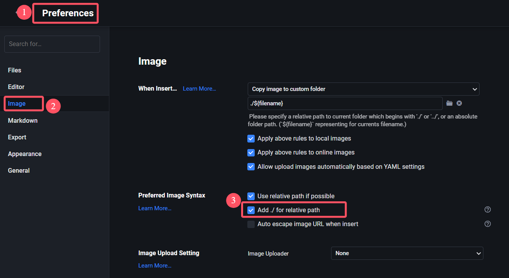

## 下载Hexo和安装Fluid主题

关于这部分的内容可以参考Hexo和Fluid的官方文档来配置和下载，里面会有详细的说明，这边就不赘述。

- [Hexo Fluid 用户手册 (fluid-dev.com)](https://hexo.fluid-dev.com/docs/)
- [Hexo](https://hexo.io/zh-cn/)

## 美化（魔改）Fluid主题

关于美化Fluid主题，这个属于个人的偏好，可以通过搜索引擎的关键词 `Hexo` 和 `Fluid` 来找到相关的资料，下面是我参考过的一些资料，可以按需取用。

- [Hexo's Fluid 主题私人定制（持续更新） - Eren の 宇宙船 (erenship.com)](https://www.erenship.com/posts/40222.html)
- [🔵Hexo Fluid主题美化 - 清山的博客 (qingshaner.com)](https://qingshaner.com/hexoFluid%E4%B8%BB%E9%A2%98%E7%BE%8E%E5%8C%96/)
- [Hexo-Fluid美化 - 柯南简Akkn (cnwjy.site)](https://cnwjy.site/2022/01/04/Hexo-Fluid%E7%BE%8E%E5%8C%96/)

## 部署个人网站到Github

如果对Github比较熟悉的同学应该都知道 `Github Page` 可以做成个人网站，这个在网上也有很夺教程，这边也不重复了，下面给的是一些用 `CDN` 来加速网站加载的文章，可以参考。

- [Deploy a Hexo site · Cloudflare Pages docs](https://developers.cloudflare.com/pages/framework-guides/deploy-a-hexo-site/)
- [你不爱我了QAQ (julydate.com)](https://www.julydate.com/post/60859300/)
- [GitHub Pages 快速入门 - GitHub 文档](https://docs.github.com/zh/pages/quickstart)

## 前端知识的学习资料

搭建个人博客网站避免不了需要了解一些前端的相关知识，下面是你可能需要的学习资料。

- [web 入门 - 学习 Web 开发 | MDN (mozilla.org)](https://developer.mozilla.org/zh-CN/docs/Learn/Getting_started_with_the_web)
- [前言 | 千古前端图文教程 (qianguyihao.com)](https://web.qianguyihao.com/)

## 如何发布一篇博客

接下来的内容假设你已经搭建好了个人博客并且通过 `Github Pages` 发布了个人博客。

<a id="anchor1"></a>

### 创建博客文章

创建博客文章的一般方法可以参考[Hexo的相关文档](https://hexo.io/zh-cn/docs/writing)，这里主要介绍我自己使用的自动化方案，相应的代码可以在我的仓库[BlogManager](https://github.com/chen-huaneng/BlogManager)中找到。

#### 我的博客创建自动化方案

我的博客文章存放方案：按照日期放在相应的文件夹中，比如今天是2024年10月13日，那么今天写的文章就会存放在 `source\_posts\2024\10\13` 这个文件夹中，相应的图片会存放在 `source\_posts\2024\10\13` 这个文件夹中和 `.md` 文件同名的文件夹中。

可以写一个 `Python` 脚本来自动化这个过程：输入文章的标题，自动检测是否存在同名文件，创建文件，移动文件到相应的目录等功能。

#### 协调 `Hexo` 和 `Typora` 插入图片的最佳实践

出现这个需求的主要原因是我经常使用 `Typora` 编辑器进行本地 `Markdown` 文件的修改（文章的写作等等），而 `Hexo` 这个框架下的图片引用方式和 `Typora` 的图片引用方式不一样（相对地址的起点不一致），导致我如果要写一篇文章就要手动修改文章图片的引用方式，而不能直接使用 `Typora` 提供的拖动图片的方式。

问题描述：使用 `Typora` 进行 `Markdown` 的写作时，我希望能够直接将图片拖进 `Typora` 中实现插入图片的功能（这也是 `Typora` 提供的功能），但是如果直接使用 `Typora` 提供的功能，会遇到 `Hexo` 发布在网页上不能正确识别图片路径的问题。比如，我在 `Typora` 中有这样一个图片：``，`Typora` 会识别为当前 `.md` 文件的目录下的 `image.webp`，比如当前的 `test.md` 文件的路径是 `\source\_posts\2024\10\17\2024-10-17-test.md`，`Typora` 识别的图片路径在 `\source\_posts\2024\10\17\image.webp`，但是 `Hexo` 需要图片的路径是 `\source\_posts\2024\10\17\2024-10-17-test\image.webp` 才能在网页上正常显示。

想实现的功能：既能够使用 `Typora` 方便的拖进编辑器就能插入图片的功能，同时又能正确在 `Hexo` 中显示图片，并且不需要我手动修改图片的路径。

解决方案：首先，我查阅了 `Hexo` 的[文档](https://hexo.io/zh-cn/docs/asset-folders)找到了一个实现 `Hexo` 识别当前文章目录下相对路径的方法，然后找到了这个[解决方案](https://dcr309duan.github.io/2024/05/05/hexo-typora-%E6%8F%92%E5%85%A5%E5%9B%BE%E7%89%87%E7%9A%84%E6%9C%80%E4%BD%B3%E5%AE%9E%E8%B7%B5/)并进行了改进，一个改进是通过编写 `Python` 脚本来实现标题出现空格的问题，另一个改进是通过 `Typora` 的图片引用添加 `` 的前缀功能使得不需要手动删除 `Typora` 会自动添加的 `/` 导致的 `Hexo` 识别不了的问题，同时又能直接在 `Typora` 中看到图片。

> 注意：别忘了根据[Typora文档](https://support.typoraio.cn/Images/#when-insert-images)的提示在文章开头的 YAML Front Matters 部分加上 `typora-root-url:<your path>` 字段。



可以参考的其他解决方案：

- [hexo + typora调教指南 | Notype 的博客 (notnotype.com)](https://blog.notnotype.com/2023/02/28/hexo-typora的博客体验/)
- [Hexo + Typora + 开发Hexo插件 解决图片路径不一致-腾讯云开发者社区-腾讯云 (tencent.com)](https://cloud.tencent.com/developer/article/1970544)
- [markdown picture Defect · Issue #3145 · hexojs/hexo (github.com)](https://github.com/hexojs/hexo/issues/3145)
- [求助：写文章时，插入图片怎么用相对地址？ · Issue #909 · fluid-dev/hexo-theme-fluid (github.com)](https://github.com/fluid-dev/hexo-theme-fluid/issues/909)

#### 可视化创建、修改、发布、本地浏览博客

出现这个需求的主要原因是，每次修改文章的时候都需要手动打开相应博客对应的文件夹，由于我的博客是按照时间顺序的文件夹安排的，所以我就思考如何做一个可视化的界面来完成，最后的解决方案就是做一个类似日历的 GUI 来可视化哪些日期是有写博客的，有写博客的日期点击该日期就能直接打开相应的文件夹，方便我修改博客。最终的效果如下（相应的 Github 仓库[在这里](https://github.com/chen-huaneng/BlogManager)）：


> 提醒：自动化脚本可以做的内容远不止这些，还可以完成很多重复繁琐的工作，所以当你遇到一个重复性的工作的时候，可以思考一下是否可以用自动化的脚本来实现。

### 编辑博客

#### 使用 `Markdown` 编辑器

编辑博客一般是在本地编辑完，然后通过本地查看之后没有问题再推送到远程仓库来实现发布。

编辑博客有两种方式，一种是先使用 `hexo` 创建文件：

```shell
hexo new post --path 20231203Hello/Hello # 指定路径创建名为Hello的.md文件，路径可以省略
```

```shell
hexo new "Hello World!" # 默认是post，如果博客名称有空格需要用双引号包裹起来
```

然后使用类似 `Typora`、`sublime`、`Obsidian` 等 `Markdown` 编辑器编辑完之后再用 `hexo` 的命令在本地预览，没有问题之后再推送到远程仓库。

```shell
hexo clean # 清除缓存
hexo g # hexo generate
hexo s # hexo server
# 详细的命令说明: https://hexo.io/zh-cn/
```

另外一种是使用插件。

#### 使用 `Hexo-admin` 插件

关于详细的安装和使用说明可以参考这个链接: [jaredly/hexo-admin: An Admin Interface for Hexo (github.com)](https://github.com/jaredly/hexo-admin?tab=readme-ov-file#3-profit)

安装的命令 `npm install --save hexo-admin` ，安装之后在博客的目录下执行 `hexo server -d` 然后在浏览器打开 `http://localhost:4000/admin/` 就可以进行博客的编辑了。之后的推送到远程仓库的步骤是一样的。

### 本地预览

<a id="anchor2"></a>

要本地预览编辑完的博客可以使用 `hexo clean` 清除缓存，然后用 `hexo g` 生成必要的文件，然后执行 `hexo s` 来启动本地的服务，之后在浏览器打开 `http://localhost:4000/` 就能看到编辑完之后的效果。如果效果满意就可以准备推送到远程仓库了。

如果觉得每次在本地预览都要重新输入三个命令显得很麻烦可以将这三个命令写成一个 `PowerShell` (针对 `Windows 10`)的脚本，然后每次在本地预览的时候执行这个脚本即可。比如我写了一个脚本来执行上面这三个操作简化我的工作：

```powershell
npx hexo clean
npx hexo g
npx hexo s -p 8080
```

###  推送编辑完的博客到远程仓库

`Git` 推送到远程仓库的一般步骤：

```shell
git pull origin main --rebase # 也可以不是rebase，按需选择
git add . # 个人习惯把修改的内容全部一次添加
git commit -m "message" # 提交的说明
git push -u origin main # 提交到远程仓库
```

推送之后到个人的 `Github` 相关的仓库查看是否推送成功，如果推送成功就可以在发布的Page中查看了，比如我的个人博客的 `Github` 地址就是 <https://chen-huaneng.github.io/>。

### 使用 `Hexo` 提供的一键部署方案

除了使用 `Github Actions` 实现自动部署之外，还可以采用 `Hexo` 提供的一键部署方案，只需要一行命令即可

```bash
hexo deploy
```

具体的配置参考官方文档:[一键部署 | Hexo](https://hexo.io/zh-cn/docs/one-command-deployment)

## 有用的一些编辑技巧

下面是一些有用的编辑技巧，注意下面的技巧适用于发布博客，并且使用的主题是 `Fluid` ，用 `Hexo` 驱动，可能存在部分语法和 `Markdown` 不兼容，比如图片可能在 `Markdown` 编辑器中并不能实时渲染。

> 由于我把博客从 Hexo 迁移到 Hugo 了，所以下面的部分代码的显示效果可能有所不同。

### 在文本中插入一张图片

在 `Fluid` 主题中，默认的路径是博客文件夹下的 `source` 文件夹，所以你可以通过相对路径来引用一张图片，比如我现在要引用一张 `source/imgs/posts/2023/12/03/banner.webp` 那么我就可以在 `Markdown` 中使用下面的命令来引用：

```markdown

```


### 在文本中插入代码块

如果想要在博客的文章中插入代码块，可以参考[代码高亮 | Hexo](https://hexo.io/zh-cn/docs/syntax-highlight)的说明来写，当然如果你使用 `Fluid` 并且配置了相关的设置，那么使用正常的 `Markdown` 语法是能够正常渲染出来的。下面是一个演示：

```java
public static void main(String args[]) {
    System.out.println("Hello World!");
}
```

要渲染上面的代码块，在 `Markdown` 中的语法是：

````markdown
```java
public static void main(String args[]) {
    System.out.println("Hello World!");
}
```
````

### 在文本中使用脚注

在 `Fluid` 主题中支持自动生成脚注的引用，相关说明参考[配置指南 | Hexo Fluid 用户手册 (fluid-dev.com)](https://hexo.fluid-dev.com/docs/guide/#脚注)，下面是一个演示：

这是一句话[^1] ，在文章末尾有脚注。

相关的 `Markdown` 语法如下面命令所示，建议把所有的脚注放在文章末尾，方便管理：

```markdown
这是一句话[^1] ，在文章末尾有脚注。
[^1]: 这是对应的脚注
```

### Tag插件

`Fluid` 主题还内置了一些相关的Tag插件可以使用，详细的说明参考[配置指南 | Hexo Fluid 用户手册 (fluid-dev.com)](https://hexo.fluid-dev.com/docs/guide/#脚注)。

在 markdown 中加入如下的代码来使用便签：

```markdown

文字 或者 `markdown` 均可

```

或者使用 HTML 形式：

```html
<p class="note note-primary">标签</p>
```

效果展示：

<p class="note note-primary">标签</p>


文字 或者 `markdown` 均可


可选便签：

<p class="note note-primary">primary</p>

<p class="note note-secondary">secondary</p>

<p class="note note-success">success</p>

<p class="note note-danger">danger</p>

<p class="note note-warning">warning</p>

<p class="note note-info">info</p>

<p class="note note-light">light</p>

使用时 `&{&% note primary &%&}` 和 `&{&% endnote &%&}` 需单独一行，否则会出现问题。

#### 行内标签

在 markdown 中加入如下的代码来使用 Label：

```markdown

```

可选 Label：



#### 折叠块

使用折叠块，可以折叠代码、图片、文字等任何内容，你可以在 markdown 中按如下格式：

```markdown

需要折叠的一段内容，支持 markdown

```

`info` 字段有和行内标签类似的可选参数，`title` 字段是折叠块上的标题，下面是一些例子。


需要折叠的一段内容，支持 markdown




```java
public static void main(String args[]) {
    System.out.println("Hello World!");
}
```








#### 勾选框

在 markdown 中加入如下的代码来使用 Checkbox：

```markdown

```

`text` 字段表示显示的文字，`checked` 字段表示默认是否已勾选，默认值是 false，`incline` 表示是否内联（可以理解为后面的文字是否换行），默认值是 false。

示例：

```markdown




 后面文字不换行

 也可以只传入一个参数，文字写在后边（这样不支持外联）
```





 后面文字不换行

 也可以只传入一个参数，文字写在后边（这样不支持外联）

#### 按钮

你可以在 markdown 中加入如下的代码来使用 Button：

```markdown

```

或者使用 HTML 形式：

```html
<a class="btn" href="url" title="title">text</a>
```

`url` 字段表示跳转链接，`text` 字段表示显示的文字，`title` 字段表示鼠标悬停时显示的文字（可选）。

效果展示：



<a class="btn" href="https://chen-huaneng.github.io/2023/12/02/2023-12-02-2023-12-03-how-to-write-blog/" title="本篇博客">HTML形式</a>

#### 组图

如果想把多张图片按一定布局组合显示，你可以在 markdown 中按如下格式：

```markdown

  
  
  
  
  

```

`total` 字段表示图片总数量，对应中间包含的图片 url 数量，`n1-n2-...` 字段表示每行的图片数量，可以省略，默认单行最多 3 张图，求和必须相等于 total，否则按默认样式。下面是示例：






---






---






### LaTeX数学公式



Hexo 5.0 以上，可尝试 Hexo 官方的 [hexo-math (opens new window)](https://github.com/hexojs/hexo-math)插件，支持更多定制化参数，使用方式参照链接内的文档，以下介绍的是主题内置的 LaTeX 功能。



当需要使用 [LaTeX](https://www.latex-project.org/help/documentation/) 语法的数学公式时，可手动开启本功能，需要完成三步操作：

**1. 设置主题配置**

```yaml
post:
  math:
    enable: true
    specific: false
    engine: mathjax
```

`specific`: 建议开启。当为 true 时，只有在文章 [front-matter](https://hexo.io/zh-cn/docs/front-matter) 里指定 `math: true` 才会在文章页启动公式转换，以便在页面不包含公式时提高加载速度。

`engine`: 公式引擎，目前支持 `mathjax` 或 `katex`。

**2. 更换 Markdown 渲染器**

由于 Hexo 默认的 Markdown 渲染器不支持复杂公式，所以需要更换渲染器（`mathjax` 可选择性更换）。

然后根据上方配置不同的 `engine`，推荐更换如下渲染器：

针对 `mathjax`

```bash
npm uninstall hexo-renderer-marked --save
npm install hexo-renderer-pandoc --save
```

**并且还需安装 [Pandoc](https://github.com/jgm/pandoc/blob/master/INSTALL.md)**

针对 `katex`

```bash
npm uninstall hexo-renderer-marked --save
npm install hexo-renderer-markdown-it --save
npm install @traptitech/markdown-it-katex --save
```

然后在**站点配置**中添加：

```yaml
markdown:
  plugins:
    - "@traptitech/markdown-it-katex"
```

**3. 安装完成后执行 `hexo clean`**

书写公式的格式：

```markdown
$$
E=mc^2
$$
```

数学公式行间示例：

$$
E = mc^2
$$

行内公式展示：$h = \frac{v}{2}$。



- 如果公式没有被正确渲染，请仔细检查是否符合上面三步操作。
- 不可以同时安装多个渲染插件，包括 `hexo-math` 或者 `hexo-katex` 这类插件，请注意检查 `package.json`。
- 如果更换公式引擎，对应渲染器也要一并更换。
- 不同的渲染器，可能会导致一些 Markdown 语法不支持，或者渲染样式有细微差异。
- 自定义页面默认不加载渲染，如需使用，需在 front-matter 中指定 `math: true`



#### 行间公式编号及引用

如果要给行间公式编号，并且引用该行间公式，需要在博客文件夹下的 `\node_modules\hexo-theme-fluid\layout\_partials\plugins\math.ejs` 文件中修改 `MathJax` 相关配置如下：

```js
window.MathJax = {
	tex    : {
        inlineMath: { '[+]': [['$', '$']] },
        tags: 'ams'
},
```

具体的原因可以参考[MathJax文档](https://docs.mathjax.org/en/latest/input/tex/eqnumbers.html)和[这篇博客](https://www.cnblogs.com/wangbingbing/p/18791626)，这里给出一个示例代码：

```markdown
$$
\begin{equation}
\left( \sum_{i = 1}^na_ib_i\right)^2 \leq \left( \sum_{i = 1}^na_i^2 \right)\left(\sum_{i = 1}^nb_i^2\right)\label{eq:real-number}
\end{equation}
$$

引用 $\eqref{eq:real-number}$
```

效果展示：
$$
\begin{equation}
\left( \sum_{i = 1}^na_ib_i\right)^2 \leq \left( \sum_{i = 1}^na_i^2 \right)\left(\sum_{i = 1}^nb_i^2\right)\label{eq:real-number}
\end{equation}
$$

引用 $\eqref{eq:real-number}$

### 文档内部任意跳转

文档内部任意跳转主要是方便某些较长的文章在某个地方要引用到文章自身的某个段落或者标题，或者要建立类似于目录之类的方便跳转的关系。比如下面的代码就实现了跳转到 `创建博客文章` 标题和跳转到 `本地预览` 标题下的第一段的功能：

```html
<!--跳转到标题-->
<a id="anchor1"></a>
### 创建博客文章
...
[跳转到 `创建博客文章` 标题](#anchor1)

<!--跳转到段落-->
<a id="anchor2"></a>
要本地预览编辑完的博客可以使用 `hexo clean` 清除缓存，然后用 `hexo g` 生成必要的文件，然后执行 `hexo s` 来启动本地的服务，之后在浏览器打开 `http://localhost:4000/` 就能看到编辑完之后的效果。如果效果满意就可以准备推送到远程仓库了。
...
[跳转到 `本地预览` 标题下的第一段](#anchor2)
```

效果展示：

[跳转到 `创建博客文章` 标题](#anchor1)

[跳转到 `本地预览` 标题下的第一段](#anchor2)


[^1]: 这是对应的脚注