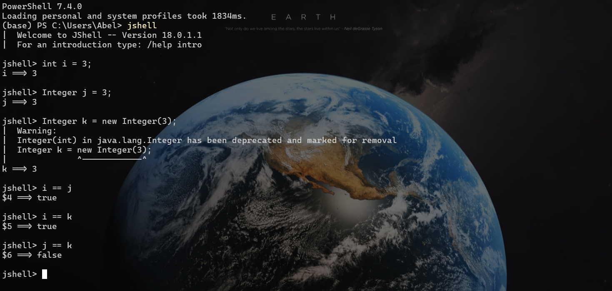

这篇文章是为了介绍 Java中 Integer 缓存(Cache)的。这是Java 5之后引出的新功能，目的是为了节省内存空间和提高性能。在开始正式介绍之前先来看以下的一些例子，并猜测一下它们的输出：

```java
package java.integercache;

public class JavaIntegerCache {
	public static void main(String[] strings) {

		Integer integer1 = 3;
		Integer integer2 = 3;

		if (integer1 == integer2) {
			System.out.println("integer1 == integer2");            
        } else {
			System.out.println("integer1 != integer2");            
        }

		Integer integer3 = 300;
		Integer integer4 = 300;
		
		if (integer3 == integer4) {
			System.out.println("integer3 == integer4");            
        } else {
			System.out.println("integer3 != integer4");            
        }

        Integer integerNew = new Integer(3); // deprecated constructor but just for test integer cache mechanism
        int integerP = 3;
        
        if (integerNew == integer1) {
            System.out.println("integerNew == integer1");
        } else {
            System.out.println("integerNew != integer1");
        }
        
        if (integerP == integer1) {
            System.out.println("integerP == integer1");
        } else {
            System.out.println("integerP != integer1");
        }
        
        if (integerP == integerNew) {
            System.out.println("integerP == integerNew");
        } else {
            System.out.println("integerP != integerNew");
        }
				
	}
}
```

我们期望的结果应该是前三个测试都为 `false` ，最后两个测试是`true`。另外，当我们检查两个对象是否相等的时候，不应该使用 `==` 而应该使用 `equals()`，因为 `==` 检查的是引用的是否是同一个对象，而不是检查对象内的值是否相等，关于这部分的内容可以参考[What's the difference between primitive and reference types?] [^1]。


但是实际上输出的结果是：

```shell
integer1 == integer2 # Integer Cache
integer3 != integer4 # Out range of Integer Cache
integerNew != integer1 # Integer Cache only for Autoboxing not for constructor
integerP == integer1 # Unboxing Integer when encounter int
integerP == integerNew # Same as above
```

除了第一个之外的输出都是符合预期的，接下来我们深入探究一下其中的原理。

## 自动装箱 (Autoboxing)

首先先来了解一下自动装箱(Autoboxing)，根据[Java Tutorial] [^2]：

> *Autoboxing* is the automatic conversion that the Java compiler makes between the primitive types and their corresponding object wrapper classes. For example, converting an `int` to an `Integer`, a `double` to a `Double`, and so on. If the conversion goes the other way, this is called *unboxing*.

自动装箱主要是为了让基本数据类型(primitive type)用在一些泛型(generics)编程的时候语法更加简洁，不需要显式地转换成对象(object)。对应的，自动把对象类型转换成相应的基本数据类型的过程叫做自动拆箱(unboxing)。


所以上面最后两个的输出就能够用自动装箱和自动拆箱来解释，当混合基本数据类型和它的包装类型(wrapper class)进行比较的时候，就会自动把包装类型自动拆箱成基本数据类型再进行比较，所以最后两个的比较实际上就是两个基本数据类型的比较。

## Integer 缓存池(Integer Cache)

对于第二个和第三个的输出很好理解，因为当我们对对象使用 `==` 判断的时候，实际上并不是判断对象中存储的内容，而是判断变量存储的对象的地址是否相等，显然，当我们每创建一个新对象的时候，这个对象的地址都是唯一且不同于其他对象的，所以第二个和第三个的输出都是 `false` 。接下来就是最难理解的第一个输出，在解释原因之前，先看一下官方文档[Conversions and Contexts] [^3]关于 `Integer` 的说明：

> If the value `p` being boxed is an integer literal of type `int` between `-128` and `127` inclusive ([§3.10.1](https://docs.oracle.com/javase/specs/jls/se8/html/jls-3.html#jls-3.10.1)), or the boolean literal `true` or `false` ([§3.10.3](https://docs.oracle.com/javase/specs/jls/se8/html/jls-3.html#jls-3.10.3)), or a character literal between `'\u0000'` and `'\u007f'` inclusive ([§3.10.4](https://docs.oracle.com/javase/specs/jls/se8/html/jls-3.html#jls-3.10.4)), then let `a` and `b` the results of any two boxing conversions of `p`. It is always the case that `a` `==` `b`.
>
> Ideally, boxing a primitive value would always yield an identical reference. In practice, this may not be feasible using existing implementation techniques. The rule above is a pragmatic compromise, requiring that certain common values always be boxed into indistinguishable objects. The implementation may cache these, lazily or eagerly. For other values, the rule disallows any assumptions about the identity of the boxed values on the programmer's part. This allows (but does not require) sharing of some or all of these references. Notice that integer literals of type `long` are allowed, but not required, to be shared.
>
> This ensures that in most common cases, the behavior will be the desired one, without imposing an undue performance penalty, especially on small devices. Less memory-limited implementations might, for example, cache all `char` and `short` values, as well as `int` and `long` values in the range of -32K to +32K.
>
> A boxing conversion may result in an `OutOfMemoryError` if a new instance of one of the wrapper classes (`Boolean`, `Byte`, `Character`, `Short`, `Integer`, `Long`, `Float`, or `Double`) needs to be allocated and insufficient storage is available.

也就是说其实Java内部是有缓存(Cache) `Integer` 的机制的，这个范围是 `[-128, 127]` ，加上一个符号位，刚好是一个字节(byte) 的长度。查询Java的源代码我们可以发现，在包(package) `java.lang.Integer` 中有一个静态嵌套类 `IntegerCache` ：

```java
    /**
     * Cache to support the object identity semantics of autoboxing for values between
     * -128 and 127 (inclusive) as required by JLS.
     *
     * The cache is initialized on first usage.  The size of the cache
     * may be controlled by the {@code -XX:AutoBoxCacheMax=<size>} option.
     * During VM initialization, java.lang.Integer.IntegerCache.high property
     * may be set and saved in the private system properties in the
     * jdk.internal.misc.VM class.
     *
     * WARNING: The cache is archived with CDS and reloaded from the shared
     * archive at runtime. The archived cache (Integer[]) and Integer objects
     * reside in the closed archive heap regions. Care should be taken when
     * changing the implementation and the cache array should not be assigned
     * with new Integer object(s) after initialization.
     */

    private static class IntegerCache {
        static final int low = -128;
        static final int high;
        static final Integer[] cache;
        static Integer[] archivedCache;

        static {
            // high value may be configured by property
            int h = 127;
            String integerCacheHighPropValue =
                VM.getSavedProperty("java.lang.Integer.IntegerCache.high");
            if (integerCacheHighPropValue != null) {
                try {
                    h = Math.max(parseInt(integerCacheHighPropValue), 127);
                    // Maximum array size is Integer.MAX_VALUE
                    h = Math.min(h, Integer.MAX_VALUE - (-low) -1);
                } catch( NumberFormatException nfe) {
                    // If the property cannot be parsed into an int, ignore it.
                }
            }
            high = h;

            // Load IntegerCache.archivedCache from archive, if possible
            CDS.initializeFromArchive(IntegerCache.class);
            int size = (high - low) + 1;

            // Use the archived cache if it exists and is large enough
            if (archivedCache == null || size > archivedCache.length) {
                Integer[] c = new Integer[size];
                int j = low;
                for(int i = 0; i < c.length; i++) {
                    c[i] = new Integer(j++);
                }
                archivedCache = c;
            }
            cache = archivedCache;
            // range [-128, 127] must be interned (JLS7 5.1.7)
            assert IntegerCache.high >= 127;
        }

        private IntegerCache() {}
    }

```

从上面的源代码中，我们可以看到在 `Integer` 内部有一个静态的私有的嵌套类(nested class) `IntegerCache`  其中的一段代码用循环创建了一个用于缓存的 `Integer` 数组：

```java
            // Use the archived cache if it exists and is large enough
            if (archivedCache == null || size > archivedCache.length) {
                Integer[] c = new Integer[size];
                int j = low;
                for(int i = 0; i < c.length; i++) {
                    c[i] = new Integer(j++);
                }
                archivedCache = c;
            }
```

这说明在VM运行的时候，在用户第一次使用 `Integer` 类的时候，会初始化并缓存一个 `Integer` 数组用于减少后期使用 `Integer` 创建新对象的时候的开销，优化性能。参考 `Integer` 的文档[valueOf] [^4]，我们可以看到缓存的 `Integer` 数组用于 `valueOf` 的调用的时候来优化性能：

> ```java
> public static Integer valueOf(int i)
> ```
>
> Returns an `Integer` instance representing the specified `int` value. If a new `Integer` instance is not required, this method should generally be used in preference to the constructor [`Integer(int)`](https://docs.oracle.com/javase/8/docs/api/java/lang/Integer.html#Integer-int-), as this method is likely to yield significantly better space and time performance by caching frequently requested values. This method will always cache values in the range -128 to 127, inclusive, and may cache other values outside of this range.
>
> - **Parameters:**
>
>   `i` - an `int` value.
>
> - **Returns:**
>
>   an `Integer` instance representing `i`.
>
> - **Since:**
>
>   1.5

从源代码来看会更明显：

```java
    /**
     * Returns an {@code Integer} instance representing the specified
     * {@code int} value.  If a new {@code Integer} instance is not
     * required, this method should generally be used in preference to
     * the constructor {@link #Integer(int)}, as this method is likely
     * to yield significantly better space and time performance by
     * caching frequently requested values.
     *
     * This method will always cache values in the range -128 to 127,
     * inclusive, and may cache other values outside of this range.
     *
     * @param  i an {@code int} value.
     * @return an {@code Integer} instance representing {@code i}.
     * @since  1.5
     */
    @IntrinsicCandidate
    public static Integer valueOf(int i) {
        if (i >= IntegerCache.low && i <= IntegerCache.high)
            return IntegerCache.cache[i + (-IntegerCache.low)];
        return new Integer(i);
    }

```

根据[Java Integer Cache] [^5] 的博客文章，我们可以发现在自动装箱的过程中，其实是相当于内部调用了`valueOf` 。所以当我们使用自动装箱创建 `Integer` 对象的时候，VM内部自动调用 `valueOf` ，而 `valueOf` 会先检查在缓存池中是否存在需要创建的 `Integer` 对象，也就是范围是不是在`[-128, 127]` 中，如果已经存在，那么就会指向同一个 `Integer` 对象（如果有多个相同的对象都是同样的值），如果不在范围之内，那么就会使用内部的 `constructor` 创建一个对象。经过上面的解释，我们就能理解第一个输出的结果，因为Java的内部存在 `Integer` 的缓存池，所以当基本数据类型的值在缓存池的范围内，那么内部就会进行一个优化，让这些对象变量指向同一个对象，因为不会有被某个引用改变之后导致其他引用也被改变的危险（`Integer` 对象是不可改变的 ——源代码中`Integer` 是 `final class`），所以使用 `==` 比较两个较小数值的 `Integer` 对象是会输出 `true` 的。

## -XX:AutoBoxCacheMax=<size>参数

在 `IntegerCache` 的源代码的文档中，我们看到可以通过 `-XX:AutoBoxCacheMax=<size>` 参数来改变VM默认的指定的缓存池的大小，下面是一个简单的测试：


这是测试的源文件 `Flik.java`：

```java
public class Flik {
    public static boolean isSameNumber(Integer a, Integer b) {
        return a == b;
    }

    public static void main(String[] args) {
        for (int i = -140, j = -140; i < 300; ++i, ++j) {
            String message = "i:" + i + " j:" + j;
            System.out.println(isSameNumber(i, j) + " at " + message);
        }
    }
}
```

这是在命令行的运行命令：

```shell
javac Flik.java
java Flik
```

这是输出的结果：

```txt
false at i:-140 j:-140
false at i:-139 j:-139
false at i:-138 j:-138
false at i:-137 j:-137
false at i:-136 j:-136
false at i:-135 j:-135
false at i:-134 j:-134
false at i:-133 j:-133
false at i:-132 j:-132
false at i:-131 j:-131
false at i:-130 j:-130
false at i:-129 j:-129
true at i:-128 j:-128
true at i:-127 j:-127
true at i:-126 j:-126
true at i:-125 j:-125
true at i:-124 j:-124
true at i:-123 j:-123
// ...omit many many true line
true at i:-4 j:-4
true at i:-3 j:-3
true at i:-2 j:-2
true at i:-1 j:-1
true at i:0 j:0
true at i:1 j:1
true at i:2 j:2
true at i:3 j:3
true at i:4 j:4
true at i:5 j:5
true at i:6 j:6
// ...omit many many true line
true at i:116 j:116
true at i:117 j:117
true at i:118 j:118
true at i:119 j:119
true at i:120 j:120
true at i:121 j:121
true at i:122 j:122
true at i:123 j:123
true at i:124 j:124
true at i:125 j:125
true at i:126 j:126
true at i:127 j:127
false at i:128 j:128
false at i:129 j:129
// ...omit many many false line
false at i:298 j:298
false at i:299 j:299
```

这是第二次加了参数的命令行的运行命令：

```shell
javac Flik.java
java -XX:AutoBoxCacheMax=200 Flik
```

这是第二次的输出结果：

```txt
false at i:-140 j:-140
false at i:-139 j:-139
false at i:-138 j:-138
false at i:-137 j:-137
false at i:-136 j:-136
false at i:-135 j:-135
false at i:-134 j:-134
false at i:-133 j:-133
false at i:-132 j:-132
false at i:-131 j:-131
false at i:-130 j:-130
false at i:-129 j:-129
true at i:-128 j:-128
true at i:-127 j:-127
true at i:-126 j:-126
true at i:-125 j:-125
true at i:-124 j:-124
// ...omit many many true line
true at i:-3 j:-3
true at i:-2 j:-2
true at i:-1 j:-1
true at i:0 j:0
true at i:1 j:1
true at i:2 j:2
true at i:3 j:3
true at i:4 j:4
true at i:5 j:5
true at i:6 j:6
true at i:7 j:7
true at i:8 j:8
true at i:9 j:9
true at i:10 j:10
// ...omit many many true line
true at i:124 j:124
true at i:125 j:125
true at i:126 j:126
true at i:127 j:127
true at i:128 j:128
true at i:129 j:129
true at i:130 j:130
true at i:131 j:131
true at i:132 j:132
true at i:133 j:133
// ...omit many many true line
true at i:197 j:197
true at i:198 j:198
true at i:199 j:199
true at i:200 j:200 // different from first output
false at i:201 j:201
false at i:202 j:202
false at i:203 j:203
false at i:204 j:204
false at i:205 j:205
// ...omit many many false line
false at i:294 j:294
false at i:295 j:295
false at i:296 j:296
false at i:297 j:297
false at i:298 j:298
false at i:299 j:299
```

从上面的结果中可以看到，我们确实可以通过 `-XX:AutoBoxCacheMax=<size>` 参数来改变缓冲池的大小，这是Java留给用户的一个用来优化性能的参数，当然可能在之后会被移除，但是现在还没有能够改变最小值的 `-XX:AutoBoxCacheMin=<size>` 参数，具体原因可以参考 [minCache] [^6] 。但是要注意，这个最大值是有限制的[Cache Max] [^7]，最大缓存大小不能超过 `-Xmx`（JVM 堆大小）。堆大小由 VM 参数 `-Xmxm` 定义。但是，一旦 JVM 初始化，它就会分配内存用于缓存目的。但是无法为 `AutoBoxCache` 分配整个`(-Xmx in byte)/4`（4 `byte` 是 `int` 的大小），因为需要加载其他对象。如果超出这个范围，可能最终会得到 `java.lang.OutOfMemoryError: Java heap space` 。此外，对于除了 `Integer` 之外的包装类型，最大只有到127的固定大小缓存。

## 为什么是[-128, 127]这个范围

根据 [ Why caching this range] [^7] 和 [Immutable Objects] [^8] ，这是因为在这个范围内的数字最经常被使用，并且能够使得 `valueOf` 的调用的性能更高，我个人推测还有一个原因是这个范围刚好是一个字节(byte)的大小（有一个bit用于存储符号位），对于计算机内部的运算更加快速（或许和内存对齐有关），可以参考[Memory usage of objects in Java (javamex.com)](https://www.javamex.com/tutorials/memory/)，[Memory Usage Estimation in Java | Better Programmer (kiyanpro.com)](http://blog.kiyanpro.com/2016/10/07/system_design/memory-usage-estimation-in-java/)，[How to calculate the memory usage of Java objects (javamex.com)](https://www.javamex.com/tutorials/memory/object_memory_usage.shtml)。还有一种可能是，这个范围和整数的编码规则有关系，具体涉及到**原码、反码、补码**的知识，推测的原因是 `byte` 的范围也是 [-128, 127]，想要更深入了解相关的知识的，可以参考[3.3  数字编码 * - Hello 算法 (hello-algo.com)](https://www.hello-algo.com/chapter_data_structure/number_encoding/)。

当然缓存的解决方案也是对现有技术的一种妥协，由于现有技术不能做到使得基本数据类型的包装类型使用 `==` 能够都得到完全相等的类型（这对于我们理解来说更加直观，所见即所得），所以使用缓存机制来使得部分的包装类型能够达到相等的效果，也是对一些小设备的兼容，使得这些小设备能够在完成基本的 `Integer` 类的功能的情况下，不用创建大量值相同的对象占用大量内存，参考[Boxing Conversion] [^3]：

> Ideally, boxing a primitive value would always yield an identical reference. In practice, this may not be feasible using existing implementation techniques. The rule above is a pragmatic compromise, requiring that certain common values always be boxed into indistinguishable objects. The implementation may cache these, lazily or eagerly. For other values, the rule disallows any assumptions about the identity of the boxed values on the programmer's part. This allows (but does not require) sharing of some or all of these references. Notice that integer literals of type `long` are allowed, but not required, to be shared.
>
> This ensures that in most common cases, the behavior will be the desired one, without imposing an undue performance penalty, especially on small devices. Less memory-limited implementations might, for example, cache all `char` and `short` values, as well as `int` and `long` values in the range of -32K to +32K.

## 其他的包装类型(wrapper class)

当然不止对于 `Integer` 这个类有缓存的机制，其他的包装类型也有相应的缓存机制，根据[Java Integer Cache] [^5]包括：

> This caching behavior is not only applicable for `Integer` objects. We have similar caching implementation for all the integer type classes.
>
> - We have `ByteCache` doing the caching for Byte objects.
> - We have `ShortCache` doing the caching for Short objects.
> - We have `LongCache` doing the caching for Long objects.
> - We have `CharacterCache` doing the caching for Character objects.
>
> Byte, Short, Long has fixed range for caching, i.e. values between –127 to 127 (inclusive). For Character, the range is from 0 to 127 (inclusive). Range cannot be modified via argument but for Integer, it can be done.

根据[Boxing Conversion] [^3]中的说法：

> Ideally, boxing a primitive value would always yield an identical reference. In practice, this may not be feasible using existing implementation techniques. The rule above is a pragmatic compromise, requiring that certain common values always be boxed into indistinguishable objects. The implementation may cache these, lazily or eagerly. For other values, the rule disallows any assumptions about the identity of the boxed values on the programmer's part. This allows (but does not require) sharing of some or all of these references. Notice that integer literals of type `long` are allowed, but not required, to be shared.

`long` 类型允许被缓存，但是不是必须的。


参考[Immutable Objects] [^8]，`char`类型只有[0,127]的缓存，因为负值的数字没有对应的字符。`Float` 类没有缓存，`BigDecimal` 也使用了缓存机制，但是和 `Integer` 等的缓存机制不同，`Integer` 等使用一个嵌套类来缓存对象，而 `BigDecimal` 则使用了预定义的静态数组(pre-defined in a static array)，并且只缓存了[0,10]范围的数字：

```java
// Cache of common small BigDecimal values.
private static final BigDecimal zeroThroughTen[] = {
new BigDecimal(BigInteger.ZERO,		0,  0),
new BigDecimal(BigInteger.ONE,		1,  0),
new BigDecimal(BigInteger.valueOf(2),	2,  0),
new BigDecimal(BigInteger.valueOf(3),	3,  0),
new BigDecimal(BigInteger.valueOf(4),	4,  0),
new BigDecimal(BigInteger.valueOf(5),	5,  0),
new BigDecimal(BigInteger.valueOf(6),	6,  0),
new BigDecimal(BigInteger.valueOf(7),	7,  0),
new BigDecimal(BigInteger.valueOf(8),	8,  0),
new BigDecimal(BigInteger.valueOf(9),	9,  0),
new BigDecimal(BigInteger.TEN,		10, 0),
};
```

## Only for autoboxing `Integer` not for constructor

在前面的测试中，我们测试了 `integerNew == integer1`，结果是 `false`，这在我们了解缓存机制之前没有问题，因为 `==` 判断的是两个对象变量引用的是否是同一个对象，但是当我们了解了缓存机制之后，这似乎和我们的解释有一些不同：



从上面的图中的运行结果来看，`i == j` 和 `i == k` 都没有问题，而 `j == k` 却是 `false`。参考[Java Integer Cache] [^9]，这是因为缓存的机制只针对自动装箱的包装类，而不能对 `Integer` 的 `constructor` 生效：

> In Java 5, a new feature was introduced to save the memory and improve performance for Integer type objects handling. Integer objects are cached internally and reused via the same referenced objects.
>
> - This is applicable for Integer values in the range between –128 to +127.
> - This Integer caching works only on auto-boxing. Integer objects will not be cached when they are built using the constructor.

另外，`Integer` 的 `constructor` 已经被标记为 `deprecated` 不建议再使用，并且根据上面的解释和[valueOf] [^4]的说明，使用自动装箱能够使用内部缓存的 `Integer` 来提高性能，而且使用自动装箱在语法上更加简洁，所以没有更好的理由使用`constructor`。

## One more thing

关于 `Integer` 的缓存机制，在之前的讨论中，我们能够看到缓存带来的性能优化，那有没有存在缺陷呢，答案是肯定的，因为完美在现实中是不存在的，我们可以通过缓存机制修改一些内部的值来改变Java的行为，导致一些意想不到的结果，具体可以参考 [1 + 1 = 3] [^10]。当然我自己也尝试了文章中的做法，并没有实现文章中所说的效果，可能在更新的Java版本（我测试使用的Java版本是18.0.1.1）中已经修复了这个问题，但是会不会存在其他的问题，还是一个未知数……


[^1]: <https://stackoverflow.com/questions/8790809/whats-the-difference-between-primitive-and-reference-types> (java - What's the difference between primitive and reference types? - Stack Overflow)
[^2]: <https://docs.oracle.com/javase/tutorial/java/data/autoboxing.html> (Autoboxing and Unboxing - The Java™ Tutorials > Learning the Java Language > Numbers and Strings - oracle.com)
[^3]: <https://docs.oracle.com/javase/specs/jls/se8/html/jls-5.html#jls-5.1.7> (Chapter 5. Conversions and Contexts - oracle.com)
[^4]: <https://docs.oracle.com/javase/8/docs/api/java/lang/Integer.html#valueOf-int-> (Integer - Java Platform SE 8 - oracle.com)
[^5]: <https://javapapers.com/java/java-integer-cache/> (Java Integer Cache - Javapapers)
[^6]: <https://bugs.openjdk.org/browse/JDK-6968657> ([JDK-6968657\] IntegerCache should have a minCache value as well as current -XX:AutoBoxCacheMax - Java Bug System - openjdk.org)
[^7]: <https://www.thegeekyway.com/java-autoboxing-xxautoboxcachemax/> (The Geeky Way – Java: Autoboxing and -XX:AutoBoxCacheMax)
[^8]: <https://wiki.owasp.org/index.php/Java_gotchas#Immutable_Objects_.2F_Wrapper_Class_Caching> (Java gotchas - OWASP)
[^9]: <https://www.geeksforgeeks.org/java-integer-cache/> (Java Integer Cache - GeeksforGeeks)
[^10]: <https://pedrorijo.com/blog/java-integer-cache/> (When 1 + 1 = 3 - pedrorijo.com)

