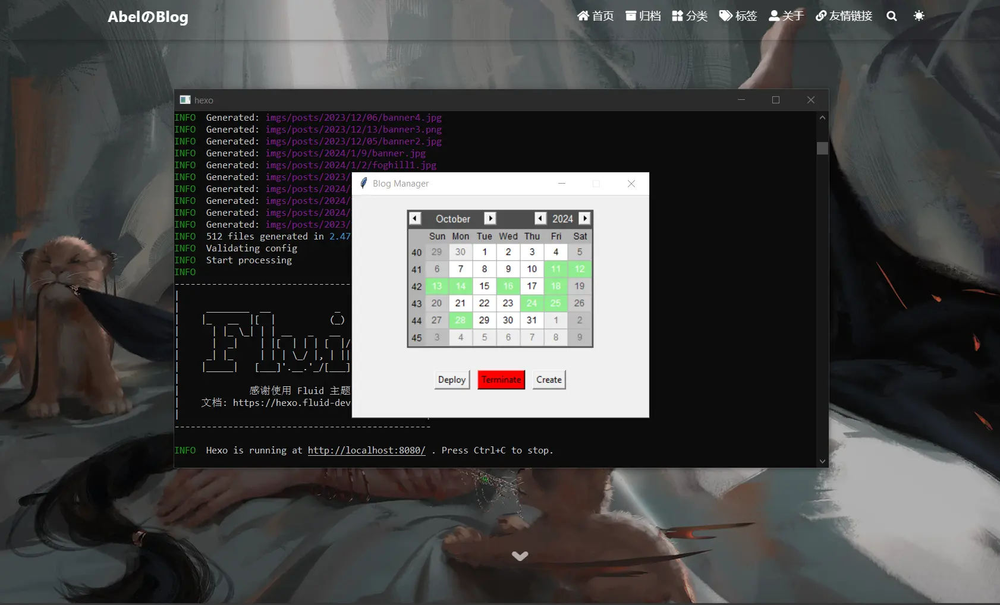

## 环境准备

建议在开始尝试 Tkinter 的时候先创建一个虚拟环境进行测试，首先先用 Conda 创建一个虚拟环境：

```powershell
conda create --name <name of your environment> python=3.8
```

其中 `python=3.8` 是可选项，也可以指定下载其他的 Python 版本。

然后激活环境：

```powershell
conda activate <name of your environment>
```

安装 Pip ，因为有些包不能通过 Conda 安装，而这个时候就需要使用 Pip，这里要注意一个点，要首先激活 Conda 的环境，然后在激活的虚拟环境中再通过 Conda 重新下载一个 Pip[^1]，否则这时的虚拟环境中是不存在 Pip 的，所以如果直接执行 Pip 的命令会对原本的环境生效。

[^1]: [conda虚拟环境使用pip下载包到当前环境的两种方法 - Python技术站 (pythonjishu.com)](https://pythonjishu.com/sqsvggluonzijtk/)

```powershell
conda install pip
```

这个时候通过查看 Conda 和 Pip 的环境可以查看是不是在虚拟环境中：

```powershell
conda list
pip list
```

如果结果和原本环境中的输出是不一样的，那么就是成功创建虚拟环境并且激活虚拟环境了。

## Tkinter 是什么[^2]

[^2]: [【python】tkinter程序打包成exe可执行文件 全流程记录（windows系统）_tkinter打包exe-CSDN博客](https://blog.csdn.net/weixin_47920722/article/details/128546996)

`tkinter`  是 `Python` 标准的GUI库，可以使用这个库快速地创建GUI应用。

## 如何将 `Python` 文件编译成 `.exe` 文件[^3]

[^3]:[Tk图形用户界面(GUI) — Python 3.12.2 文档](https://docs.python.org/zh-cn/3/library/tk.html)

1. 安装编译工具 `pyinstaller`

   ```cmd
   pip install pyinstaller
   ```

2. 在文件路径下执行编译命令，其中 `-w` 参数是为了使得 `dos` 窗口不会随着 `tkinter` 窗口出现

   ```cmd
   pyinstaller -F -w demo.py #demo.py是待编译的代码文件名
   ```

   

3. 编译完成后一般会在当前文件夹中生成一个 `dist` 的文件夹，一个 `build` 文件夹和 一个 `demo.spec` 文件，编译后的 `.exe` 文件就在 `dist` 文件夹中。

### 编译后 `.exe` 文件太大的问题

原因是在编译时会把 `Python` 环境及库一起打包到 `.exe` 文件中，如果当前的 `Python` 环境中安装了很多的包，那么就会把所有的库带上，导致编译后的 `.exe` 文件过大。

因此解决方案就是为该文件单独创建相应的 `Python` 虚拟环境，只安装要编译 `Python` 文件所依赖的库。具体步骤如下：

1. 安装 `virtualenv` 用于创建虚拟环境

   ```cmd
   pip install virtualenv
   ```

   

2. 创建一个虚拟环境，建议将这个虚拟环境放在需要打包的 `Python` 文件夹中，便于后面的处理

   ```cmd
   virtualenv py3exe_env #自定义命名虚拟环境的名称，这里是py3exe_env
   ```

3. 创建完成之后进入到该目录

   ```cmd
   cd py3exe_env/Script
   ```

4. 在该目录下找到 `activate.ps1` 并执行

   ```cmd
   activate.ps1
   ```

5. 然后在该虚拟环境下安装要编译的文件需要依赖的 `Python` 库，当然也要重新安装 `pyinstaller`。

   ```cmd
   pip install pyinstaller
   pip install conda #比如这里安装conda
   ```

6. 然后在该虚拟环境中回到要编译的文件目录下输入编译命令：

   ```cmd
   pyinstaller -F -w test.py #运行时不出现dos命令窗口
   ```

### 如何给 Tkinter 添加自定义图标

首先将要设置为图标的图片转换成 `.ico` 的格式，很多在线网站都能实现[^4]。然后在运行 pyinstaller 之前给它加上一个参数[^5]：

[^5]: [如何给python生成的exe程序换图标 | PingCode智库](https://docs.pingcode.com/baike/1258257)

```shell
pyinstaller -F -w --icon=<file name>.ico test.py #运行时不出现dos命令窗口
```

比如你的 `.ico` 文件是 `icon.ico` 那么完整命令应该是：

```shell
pyinstaller -F -w --icon=icon.ico test.py #运行时不出现dos命令窗口
```

还有一种方法是利用 Tkinter 的方法[^6]：

[^6]: [Tkinter 修改应用程序和任务栏图标 – Python/Tkinter|极客笔记 (deepinout.com)](https://deepinout.com/tkinter/tkinter-questions/306_tkinter_changing_the_application_and_taskbar_icon_pythontkinter.html)

```python
import tkinter as tk

# 创建主窗口
window = tk.Tk()
window.title("我的应用程序")

# 设置图标
window.iconbitmap("icon.ico") # 把 icon.ico 文件名改成你的文件名

# 修改任务栏图标
window.wm_iconbitmap("icon.ico") # 这里也要改

window.mainloop()
```

还有一种方法是将图标硬编码进代码中[^7]，首先获取图标的二进制数据：

[^7]: [硬编码tkinter的图标而不依赖于外部文件（不生成临时图标文件！）_python tinker logo可以不依赖外部文件吗-CSDN博客](https://blog.csdn.net/Pragmatism_3568/article/details/105625881)

```python
import base64

with open('icon.ico', 'rb') as open_icon:
    b64str = base64.b64encode(open_icon.read())
    print(b64str)
```

输出的字符串即为图标文件的二进制数据。假设输出为`b'abcdefg'`。然后利用获取的二进制数据，可以写出代码：

```python
import tkinter as tk
from PIL import ImageTk		# pip install --upgrade Pillow
from base64 import b64decode

window = tk.Tk()
window.title('My Window')
window.geometry('500x300')
# window.iconbitmap('icon.ico')
icon_img = b'abcdefg'   # 这里替换成你自己图标文件的二进制数据
icon_img = b64decode(icon_img)
icon_img = ImageTk.PhotoImage(data=icon_img)
window.tk.call('wm', 'iconphoto', window._w, icon_img)

window.mainloop()
```

这里注意一个点，PIL 已经不再维护了，所以需要 `pip install Pillow`，接口的代码是一样的。

[^4]: [文件转换器 - FreeConvert.com](https://www.freeconvert.com/zh)

## Tkinter 快速入门

- [Tkinter简明教程 - 知乎 (zhihu.com)](https://zhuanlan.zhihu.com/p/75872830)
- [Calendar — tkcalendar 1.5.0 documentation](https://tkcalendar.readthedocs.io/en/stable/Calendar.html#) - 和显示日历相关的包

## Tkinter 实战

用 Tkinter 实现了一个博客管理器，主要用于管理我自己的博客文章，源代码和程序仓库[请点我](https://github.com/chen-huaneng/BlogManager)。



