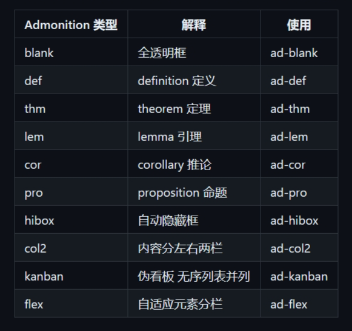

## 参考资料

- 官方文档：[Callouts - Obsidian Help](https://help.obsidian.md/Editing+and+formatting/Callouts)
- 中文教程：
  - [Obsidian 样式：Callout 样式 (pkmer.cn)](https://pkmer.cn/Pkmer-Docs/10-obsidian/obsidian%E5%A4%96%E8%A7%82/css-%E7%89%87%E6%AE%B5/obsidian%E6%A0%B7%E5%BC%8F-callout%E6%A0%B7%E5%BC%8F/)
  - [Callout语法 - Obsidian中文教程 - Obsidian Publish](https://publish.obsidian.md/chinesehelp/01+2021%E6%96%B0%E6%95%99%E7%A8%8B/Callout%E8%AF%AD%E6%B3%95)
  - [callout标注块 | obsidian文档咖啡豆版 (coffeetea.top)](https://coffeetea.top/zh/markdown/callout.html)
  - [Callout — 🌱 oldwinterの数字花园](https://notes.oldwinter.top/callout)

[Obsidian - 简单入门 - Abel's Blog (chen-huaneng.github.io)](https://chen-huaneng.github.io/2024/10/11/2024-10-11-2024-10-11-how-to-use-obsidian/)中相关的段落

## 具体实现及效果（需要在Obsidian中输入代码块中的内容才可以看到效果）

>提要：中英文测试文本分别采用  
>The quick brown fox jumps over the lazy dog  
>一去二三里烟村四五家亭台六七座八九十支花  

>注意：在Callout语法中的段落中不能出现空行，否则空行以下的文本将不会被包含在框内

### Obsidian内置的Callout样式

参考官方给出的文档：[Callouts - Obsidian Help](https://help.obsidian.md/Editing+and+formatting/Callouts)

> 提示：想看Callout的效果也可以点击上面的官方文档查看

### Blue-Topaz主题内置的Callout样式

```obsidian
>[!info] 前置条件
> - Blue topaz 主题更新到最新
> - 使用分栏效果，需要安装 Admonition 插件，并添加上面表格中的类型，比如blank,col2,flex等类型
> - 需要安装style settings 插件 并开启3.1
```

[Blue-Topaz](https://github.com/PKM-er/Blue-topaz-example)主题内置的一些Callout样式见下表：



#### blank

```obsidian
>[!blank] blank
>The quick brown fox jumps over the lazy dog  
>一去二三里烟村四五家亭台六七座八九十支花  
```

#### def

```obsidian
>[!def] def
>The quick brown fox jumps over the lazy dog  
>一去二三里烟村四五家亭台六七座八九十支花  
```

#### thm

```obsidian
>[!thm] thm
>The quick brown fox jumps over the lazy dog  
>一去二三里烟村四五家亭台六七座八九十支花  
```

#### lem

```obsidian
>[!lem] lem
>The quick brown fox jumps over the lazy dog  
>一去二三里烟村四五家亭台六七座八九十支花  
```

#### cor

```obsidian
>[!cor] cor
>The quick brown fox jumps over the lazy dog  
>一去二三里烟村四五家亭台六七座八九十支花  
```

#### pro

```obsidian
>[!pro] pro
>The quick brown fox jumps over the lazy dog  
>一去二三里烟村四五家亭台六七座八九十支花  
```

#### hibox

```obsidian
>[!hibox] hibox
>The quick brown fox jumps over the lazy dog  
>一去二三里烟村四五家亭台六七座八九十支花  
```

#### col2

```obsidian
>[!col2] col2
>The quick brown fox jumps over the lazy dog  
>一去二三里烟村四五家亭台六七座八九十支花  
```

#### kanban

```obsidian
>[!kanban] kanban
>The quick brown fox jumps over the lazy dog  
>一去二三里烟村四五家亭台六七座八九十支花  
```

#### flex

```obsidian
>[!flex] flex
>The quick brown fox jumps over the lazy dog  
>一去二三里烟村四五家亭台六七座八九十支花  
```

