> 前排提醒：
>
> 1. 本文可以看作一个手册，需要哪部分的内容就查看哪部分的内容，不必顺序浏览。
> 2. 本文具有时效性，可能部分内容已经过时，仅供参考。
> 3. 部分内容若有侵权，请联系我删除。

# 📖Obsidian入门手册

以下的Obsidian简称OB或ob

## 📚可以参考的资料（链接）

### 📌为什么选择Obsidian

- [一个大学生与Obsidia - 玩转Obsidian的保姆级教 - 知乎](https://zhuanlan.zhihu.com/p/409095645)

### 📌新手建议（建议优先阅读）

- [本人对obsidian新手的建议（2022版本）by 软通达](https://publish.obsidian.md/chinesehelp/01+2021%E6%96%B0%E6%95%99%E7%A8%8B/%E6%9C%AC%E4%BA%BA%E5%AF%B9obsidian%E6%96%B0%E6%89%8B%E7%9A%84%E5%BB%BA%E8%AE%AE%EF%BC%882022%E7%89%88%E6%9C%AC%EF%BC%89+by+%E8%BD%AF%E9%80%9A%E8%BE%BE)

### 📌新手教程

- [官方文档|中文版](https://publish.obsidian.md/help-zh/%E7%94%B1%E6%AD%A4%E5%BC%80%E5%A7%8B)
- [适合新手的入门教程-莉莉安](https://forum-zh.obsidian.md/t/topic/192)
- [入门教程及插件推荐-二丫](https://wiki.eryajf.net/pages/6ed7fe/#show-file-path)
- [极为全面的入门教程-山鸡大佬](https://publish.obsidian.md/chinesehelp/01+2021%E6%96%B0%E6%95%99%E7%A8%8B/2021%E5%B9%B4%E6%96%B0%E6%95%99%E7%A8%8B)
- [obsidian新手不完全指南 by windily](https://publish.obsidian.md/chinesehelp/01+2021%E6%96%B0%E6%95%99%E7%A8%8B/obsidian%E6%96%B0%E6%89%8B%E4%B8%8D%E5%AE%8C%E5%85%A8%E6%8C%87%E5%8D%97+by+windily)
- [obsidian新手入门](https://publish.obsidian.md/chinesehelp/01+2021%E6%96%B0%E6%95%99%E7%A8%8B/obsidian%E6%96%B0%E6%89%8B%E5%85%A5%E9%97%A8%EF%BC%88MOC%EF%BC%89)

### 📌提问前我该做什么

- [《提问的智慧》精读注解版 ](https://rymcu.com/article/80)
- [提问的智慧 - Github](https://github.com/ryanhanwu/How-To-Ask-Questions-The-Smart-Way/blob/main/README-zh_CN.md)
- [How To Ask Questions The Smart Way ](http://www.catb.org/~esr/faqs/smart-questions.html#translations)
- [Asking - Help Center - Stack Overflow](https://stackoverflow.com/help/asking)
- [How to Ask - Stack Overflow](https://stackoverflow.com/questions/ask/advice)
- [How do I ask a good question? - Help Center - Stack Overflow](https://stackoverflow.com/help/how-to-ask)
- [帮助中心 - SegmentFault 思否](https://segmentfault.com/help#what-should-ask)

### 📌如何利用搜索引擎

- [信息检索 - CS自学指南 (csdiy.wiki)](https://csdiy.wiki/必学工具/信息检索/)
- [高级搜索_百度百科 (baidu.com)](https://baike.baidu.com/item/高级搜索/1743887?fr=aladdin)
- [高级搜索关键字 (microsoft.com)](https://help.bing.microsoft.com/#apex/bing/zh-CHS/10001/-1)
- [高级搜索选项 (microsoft.com)](https://help.bing.microsoft.com/apex/index/18/zh-CHS/10002)
- [恕我直言，你可能连 GitHub 搜索都不会用 - 如何精准搜索的神仙技巧 - 知乎 (zhihu.com)](https://zhuanlan.zhihu.com/p/273766377)

### 📌论坛

- [Obsidian 优质中文内容合集 - 少数派](https://sspai.com/post/68427)
- [Ob新手入门必读——常见Q&A|OB中文论坛](https://forum-zh.obsidian.md/t/topic/3222)
- [Obsidian 中文论坛](https://forum-zh.obsidian.md/)

### 📌官方文档

- [Home - Obsidian Help](https://help.obsidian.md/Home)
- [由此开始 - Obsidian 中文帮助 - Obsidian Publish](https://publish.obsidian.md/help-zh/%E7%94%B1%E6%AD%A4%E5%BC%80%E5%A7%8B)

### 📌常见问题

- [obsidian使用中常见问题（MOC）](https://publish.obsidian.md/chinesehelp/05+%E5%B8%B8%E8%A7%81%E9%97%AE%E9%A2%98/obsidian%E4%BD%BF%E7%94%A8%E4%B8%AD%E5%B8%B8%E8%A7%81%E9%97%AE%E9%A2%98%EF%BC%88MOC%EF%BC%89)
- [初阶教程](https://publish.obsidian.md/chinesehelp/03+%E6%95%99%E7%A8%8B/%E5%88%9D%E9%98%B6%E6%95%99%E7%A8%8B%EF%BC%88MOC%EF%BC%89)


## 🗻Obsidian 语法

### 📌Obsidian的基础语法

#### Markdown语法学习

- [Markdown 官方教程|nofavicon](https://markdown.com.cn/)
- [MarkDown语法 超详细教程 - 经验分享 - Obsidian 中文论坛](https://forum-zh.obsidian.md/t/topic/435)
- [Markdown超级教程 Obsidian版 - 秃秃的小屋 - Obsidian Publish](https://publish.obsidian.md/csj-obsidian/0+-+Obsidian/Markdown/Markdown%E8%B6%85%E7%BA%A7%E6%95%99%E7%A8%8B+Obsidian%E7%89%88#%E4%BB%80%E4%B9%88%E6%98%AF+Markdown)

#### 双链的用法

- 链接到某一篇笔记：`[[ ]]`
- 链接到某一篇笔记（可以链接正在使用的笔记）中的某个标题：`[[某篇笔记的名称 # 该篇笔记的某个标题]]` 如果链接的笔记是正在编辑的笔记则可以省略 `#` 之前的笔记名称，如果要时展示的链接名称与链接的笔记的标题不一样：`[[#原来的标题名称|要展示的标题名称]]`，例如：

```md
[[#🗻Obsidian 基本语法|Obsidian基本语法]]
[[MarkDown教程 Obsidian版 2022.4.22#什么是 Markdown|什么是Markdown]]
```

- 链接到某一篇笔记中的某个段落（块）：`[[ # ^ ]]`
- 为链接创建定义（关键词）：`[[ | 关键词]]`
- 链接到外部文件如某个网站：`[关键词]（链接）`

#### 表格

##### 语法格式

Markdown 制作表格使用 | 来分隔不同的单元格，使用 - 来分隔表头和其他行。

```md
|  表头   | 表头  |
|  ----  | ----  |
| 单元格  | 单元格 |
| 单元格  | 单元格 |
```

效果：

| 表头   | 表头   |
| ------ | ------ |
| 单元格 | 单元格 |
| 单元格 | 单元格 |

##### 对齐方式

-   -: 设置内容和标题栏居右对齐。
-   :- 设置内容和标题栏居左对齐。
-   :-: 设置内容和标题栏居中对齐。

示例如下：

```md
| 左对齐 | 右对齐 | 居中对齐 |
| :-----| ----: | :----: |
| 单元格 | 单元格 | 单元格 |
| 单元格 | 单元格 | 单元格 |
```

效果：

| 左对齐 | 右对齐 | 居中对齐 |
| :----- | -----: | :------: |
| 单元格 | 单元格 |  单元格  |
| 单元格 | 单元格 |  单元格  |

##### 单元格合并

**方法一：**

1.  从 word 或 excel 中复制表格
2.  打开链接： [No-Cruft Excel to HTML TableConverter](http://pressbin.com/tools/excel_to_html_table/index.html)
3.  贴上复制的文字，然后按convert，就会得到这个表格的html代码
4.  将html代码贴到markdown编辑器

**方法二（嵌入 HTML 代码）：**

1.  可以先用 Markdown 语法生成未合并单元格的 HTML 代码
2.  进行修改, 增加rowspan或colspan属性来实现合并单元格
3.  再把更改后的HTML代码粘贴到markdown文件中

#### 文字

##### 文字缩进

「Markdown 语言」不负责实现段首缩进，所以我们只能手写，添加空格转义符，[前端HTML空格转义符总结](https://blog.csdn.net/a1056244734/article/details/106410927)

```html
`Math.abs(x)`
&emsp;&emsp;返回一个数的绝对值。`在这里插入代码片`
```

效果如下，成功缩进两字符:

`Math.abs(x)`  
  返回一个数的绝对值。

##### 文字对齐（居中、左对齐、右对齐）

对于标准的 markdown 文本，是不支持居中对齐的。不过 markdown 支持 html 语言，所以我们采用 html 语法格式书写即可。

**居中**

```html
<center>此行居中</center>
<!-- or -->
<p align="center">align居中</p>

```

效果：

<center>此行居中</center>

<!-- or -->

<p align="center">align 居中</p>

**左对齐**

```html
<p align="left">左对齐</p>
```

效果：

<p align="left">左对齐</p>

**右对齐**

```html
<p align="right">右对齐</p>
```

效果：

<p align="right">右对齐</p>

##### 文字的字体及颜色

###### 字体更换

同样我们也需要遵照其标准的语法格式

```html
<font face="黑体">我是黑体字</font>
<font face="微软雅黑">我是微软雅黑</font>
<font face="STCAIYUN">我是华文彩云</font>
```

效果：

<font face="黑体">我是黑体字</font>
<font face="微软雅黑">我是微软雅黑</font>
<font face="STCAIYUN">我是华文彩云</font>

###### 大小更换

大小的属性名为 size，Size 规定文本的尺寸大小，取值从 1 到 7，浏览器默认值是 3。

```html
<font face="黑体" size=2>我是黑体2号字</font>
<font face="黑体" size=3>我是黑体3号字</font>
<font face="黑体" size=7>我是黑体7号字</font>
```

效果：

<font face="黑体" size=2>我是黑体 2 号字</font>
<font face="黑体" size=3>我是黑体 3 号字</font>
<font face="黑体" size=7>我是黑体 7 号字</font>

###### 颜色替换

在 html 语言中，颜色属性名为 color，所以可以表示如下

```html
<font color=red size=72>红色</font>
```

效果：

<font color=red size=72>红色</font>

##### 文字添加下划线

使用html标签：`<hr/>`

```html
用爱劈开黑暗，像一道曙光，
<hr>
是非真假无法判断，不如坚强。
<hr>
```

效果：

用爱劈开黑暗，像一道曙光，

<hr>
是非真假无法判断，不如坚强。
<hr>


或者使用 `u` 标签

```html
<u>下划线文本</u>
```

效果：

<u>下划线文本</u>

#### 颜色

##### 背景色

```html
<table>
  <tbody>
  <tr>
    <th>颜色名</th>
    <th>十六进制颜色值</th>
    <th>颜色</th>
  </tr>
  <tr>
    <td><font color="AliceBlue">AliceBlue</font></td>
    <td><font color="AliceBlue">F0F8FF</font></td>
    <td bgcolor="AliceBlue">rgb(240, 248, 255)</td>
  </tr>
  <tr>
    <td><font color="AntiqueWhite">AntiqueWhite</font></td>
    <td><font color="AntiqueWhite">#FAEBD7</font></td>
    <td bgcolor="AntiqueWhite">rgb(250, 235, 215)</td>
  </tr>
  <tr>
    <td><font color="Lavender">Lavender</font></td>
    <td><font color="Lavender">#E6E6FA</font></td>
    <td bgcolor="Lavender">rgb(230, 230, 250)</td>
  </tr>
  <tr>
    <td><font color="LavenderBlush">LavenderBlush</font></td>
    <td><font color="LavenderBlush">#FFF0F5</font></td>
    <td bgcolor="LavenderBlush">rgb(255, 240, 245)</td>
  </tr>
  <tr>
    <td><font color=" LightPink"> LightPink</font></td>
    <td><font color=" LightPink">#FFB6C1</font></td>
    <td bgcolor=" LightPink">rgb(255, 182, 193)</td>
  </tr>
  <tr>
    <td><font color="LightSalmon">LightSalmon</font></td>
    <td><font color="LightSalmon">#FFA07A</font></td>
    <td bgcolor="LightSalmon">rgb(255, 160, 122)</td>
  </tr>
  <tr>
    <td><font color="MintCream">MintCream</font></td>
    <td><font color="MintCream">#F5FFFA</font></td>
    <td bgcolor="MintCream">rgb(245, 255, 250)</td>
  </tr>
  <tr>
    <td><font color="MistyRose">MistyRose</font></td>
    <td><font color="MistyRose">#FFE4E1</font></td>
    <td bgcolor="MistyRose">rgb(255, 228, 225)</td>
  </tr>
  <tr>
    <td><font color="Moccasin">Moccasin</font></td>
    <td><font color="Moccasin">#FFE4B5</font></td>
    <td bgcolor="Moccasin">rgb(255, 228, 181)</td>
  </tr>
  <tr>
    <td><font color="MintCream">MintCream</font></td>
    <td><font color="MintCream">#F5FFFA</font></td>
    <td bgcolor="MintCream">rgb(245, 255, 250)</td>
  </tr>
  <tr>
    <td><font color="PaleVioletRed">PaleVioletRed</font></td>
    <td><font color="PaleVioletRed">#D87093</font></td>
    <td bgcolor="PaleVioletRed">rgb(216, 112, 147)</td>
  </tr>
</table>

```

效果：

<table>
  <tbody>
  <tr>
    <th>颜色名</th>
    <th>十六进制颜色值</th>
    <th>颜色</th>
  </tr>
  <tr>
    <td><font color="AliceBlue">AliceBlue</font></td>
    <td><font color="AliceBlue">F 0 F 8 FF</font></td>
    <td bgcolor="AliceBlue">rgb (240, 248, 255)</td>
  </tr>
  <tr>
    <td><font color="AntiqueWhite">AntiqueWhite</font></td>
    <td><font color="AntiqueWhite"> #FAEBD7 </font></td>
    <td bgcolor="AntiqueWhite">rgb (250, 235, 215)</td>
  </tr>
  <tr>
    <td><font color="Lavender">Lavender</font></td>
    <td><font color="Lavender"> #E6E6FA </font></td>
    <td bgcolor="Lavender">rgb (230, 230, 250)</td>
  </tr>
  <tr>
    <td><font color="LavenderBlush">LavenderBlush</font></td>
    <td><font color="LavenderBlush"> #FFF0F5 </font></td>
    <td bgcolor="LavenderBlush">rgb (255, 240, 245)</td>
  </tr>
  <tr>
    <td><font color=" LightPink"> LightPink</font></td>
    <td><font color=" LightPink"> #FFB6C1 </font></td>
    <td bgcolor=" LightPink">rgb (255, 182, 193)</td>
  </tr>
  <tr>
    <td><font color="LightSalmon">LightSalmon</font></td>
    <td><font color="LightSalmon"> #FFA07A </font></td>
    <td bgcolor="LightSalmon">rgb (255, 160, 122)</td>
  </tr>
  <tr>
    <td><font color="MintCream">MintCream</font></td>
    <td><font color="MintCream"> #F5FFFA </font></td>
    <td bgcolor="MintCream">rgb (245, 255, 250)</td>
  </tr>
  <tr>
    <td><font color="MistyRose">MistyRose</font></td>
    <td><font color="MistyRose"> #FFE4E1 </font></td>
    <td bgcolor="MistyRose">rgb (255, 228, 225)</td>
  </tr>
  <tr>
    <td><font color="Moccasin">Moccasin</font></td>
    <td><font color="Moccasin"> #FFE4B5 </font></td>
    <td bgcolor="Moccasin">rgb (255, 228, 181)</td>
  </tr>
  <tr>
    <td><font color="MintCream">MintCream</font></td>
    <td><font color="MintCream"> #F5FFFA </font></td>
    <td bgcolor="MintCream">rgb (245, 255, 250)</td>
  </tr>
  <tr>
    <td><font color="PaleVioletRed">PaleVioletRed</font></td>
    <td><font color="PaleVioletRed"> #D87093 </font></td>
    <td bgcolor="PaleVioletRed">rgb (216, 112, 147)</td>
  </tr>
</table>


### 🎯Obsidian的进阶语法

#### YAML语法

##### 简单教程

- [obsidian如何使用YAML语言制作模板做标签，并且使用dateview实现结果输出？ - 知乎 (zhihu.com)](https://www.zhihu.com/question/543975493)
- [YAML front matter - Obsidian 中文帮助 - Obsidian Publish](https://publish.obsidian.md/help-zh/%E9%AB%98%E7%BA%A7%E7%94%A8%E6%B3%95/YAML+front+matter)

##### 语法说明

YAML front matter **必须放在Obsidian的.md文件的开头部分才能被识别**，基本语法如下：

```YAML
---
key: value
key2: value2
key3: [one, two, three]
key4:
- 4
- 5
- 6
---
```

如果是用在Obsidian中，则可以用以下语法来生成.md开头的表示文件的元信息。

```Yaml
---
aliases: 
tags: ["Tag1", "Tag2"]
source: 
created: {{date}}
---
```

其中aliases是表示这个笔记的别名,tags表示给这个笔记打的标签,source可以用来记录笔记的来源,created后面的`{{date}}`是Obsidian设置中用来表示当下时间的,当然还可以自己加上一些字段,比如author之类的。

#### Callout语法

- 在[Obsidian - Callout语法 - Abel's Blog (chen-huaneng.github.io)](https://chen-huaneng.github.io/2024/10/11/2024-10-11-2024-10-11-how-to-use-obsidian-callout/)里，包含了Callout语法从入门到进阶的各种用法，可以参考。

#### 块引用以及文本块引用

- 参考文章：[几招教你提高 Obsidian 中块引用的操作体验 - 知乎 (zhihu.com)](https://zhuanlan.zhihu.com/p/411484717)

官方文档看[这个](https://help.obsidian.md/Linking+notes+and+files/Embedding+files)，简单来说就是，如果想在某个笔记中链接其他笔记的某段文本或者某个标题，那么就可以用双链的高级用法，具体语法如下所示：

```markdown
[[🔮Obsidian手册#块引用以及文本块引用]] 这是链接某个笔记的标题的用法
[[🔮Obsidian手册#^a762a6]] 这是链接某个笔记的某段文本的用法
[[🔮Obsidian手册#块引用以及文本块引用|块引用]] 还可以结合别名使用
[[🔮Obsidian手册#^a762a6|段文本引用]] 段文本同样支持
```

## ⛰️Obsidian环境配置

### 🌈主题

- Theme：Blue Topaz
  Github地址：[whyt-byte/Blue-Topaz_Obsidian-css: A blue theme for Obsidian. (github.com)](https://github.com/whyt-byte/Blue-Topaz_Obsidian-css)

### 🔗第三方插件

以下给出有关插件的信息和使用，在名称中贴出了相关插件的Github的链接，具体使用方法建议阅读插件的Github文档。

#### 0. 所需插件的功能及如何安装插件

##### 0.1 如何安装插件

- [插件安装篇-Johnny学OB](https://www.bilibili.com/video/BV1Dy4y1375P/?spm_id_from=333.788&vd_source=8f6ac8ba344f8ea3b071481f41e2ce0d)

##### 0.2 所需插件的功能介绍

- [入门教程及插件推荐-二丫](https://wiki.eryajf.net/pages/6ed7fe/#show-file-path)
- [插件周刊-二丫](http://ob-plugin.eryajf.net/#/)
- [OB插件汇总](https://ob.pory.app/)
- [bon的知乎插件推荐](https://www.zhihu.com/people/kio-mis/posts)
- [Obsidian（黑曜石）软件基础操作教程 by 蚕子]([Obsidian（黑曜石）软件基础操作教程_哔哩哔哩_bilibili](https://www.bilibili.com/video/BV1qD4y1m7nv/?vd_source=8f6ac8ba344f8ea3b071481f41e2ce0d))
- [Awesome stuff for Obsidian - Github](https://github.com/kmaasrud/awesome-obsidian)
- [obsidian 软件技巧 - 知乎](https://www.zhihu.com/column/c_1302994040707948544)
- [历经一年，我保留了这些 Obsidian 插件 - 知乎 ](https://zhuanlan.zhihu.com/p/410202700)
- [Obsidian插件列表与教程（MOC）](https://publish.obsidian.md/chinesehelp/01+2021%E6%96%B0%E6%95%99%E7%A8%8B/Obsidian%E6%8F%92%E4%BB%B6%E5%88%97%E8%A1%A8%E4%B8%8E%E6%95%99%E7%A8%8B%EF%BC%88MOC%EF%BC%89)

#### 1. 我用过的插件介绍

##### 1. cm-editor-syntax-highlight-obsidian

>**信息**
>
>- 名称：[cm-editor-syntax-highlight-obsidian](https://github.com/deathau/cm-editor-syntax-highlight-obsidian)
>- 功能：提供了在编辑模式中一些代码语法高亮的效果。
>
>**使用**
>
>插件安装之后即可直接使用，没有单独的配置项，功能如下图所示：
>
>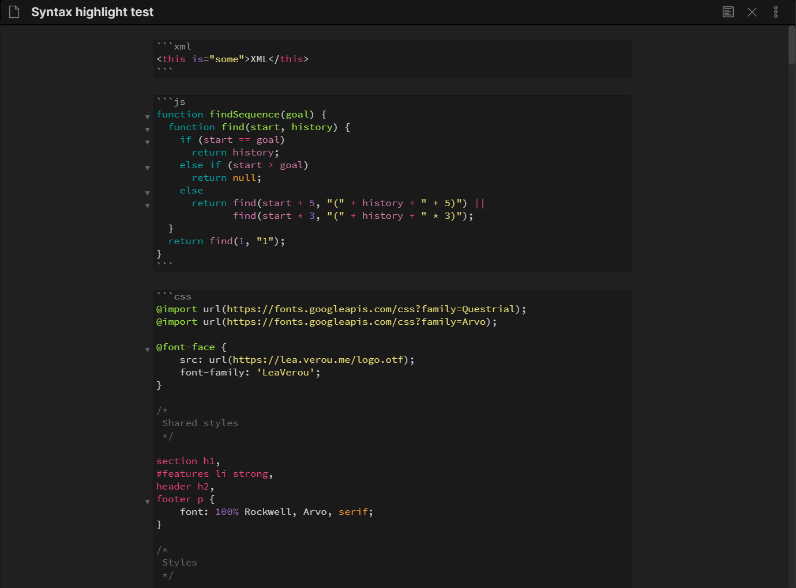

##### 2. Advanced Tables

> **信息**
>
> - 名称：Advanced Tables
> - 功能：更好用的表格编辑体验。
>
> **使用**
>
> 通常在markdown里编辑表格的体验都比较糟糕，一些使用者有时会借助一些在线表格工具，通过工具渲染的Markdown内容再粘贴过来，这款插件为简单表格编辑提供了一些辅助角度。
>
> 所以现在一些简单的表格，我都会在ob里边直接编写。插件的配置项比较简单，我为了便于使用时判断是否启用，一般都会把插件里边的选项信息汉化一下，这里截图放一下机翻汉化的配置信息说明：
>
> 

##### 3. Obsidian Activity History

> **信息**
>
> - 名称：[obsidian-activity-history](https://github.com/Darakah/obsidian-activity-history)
> - 功能：能够展示类似github提交历史那样的本地笔记活动历史。
>
> **使用**
>
> 作者在README提供了三种视图的示例，如下：
>
> 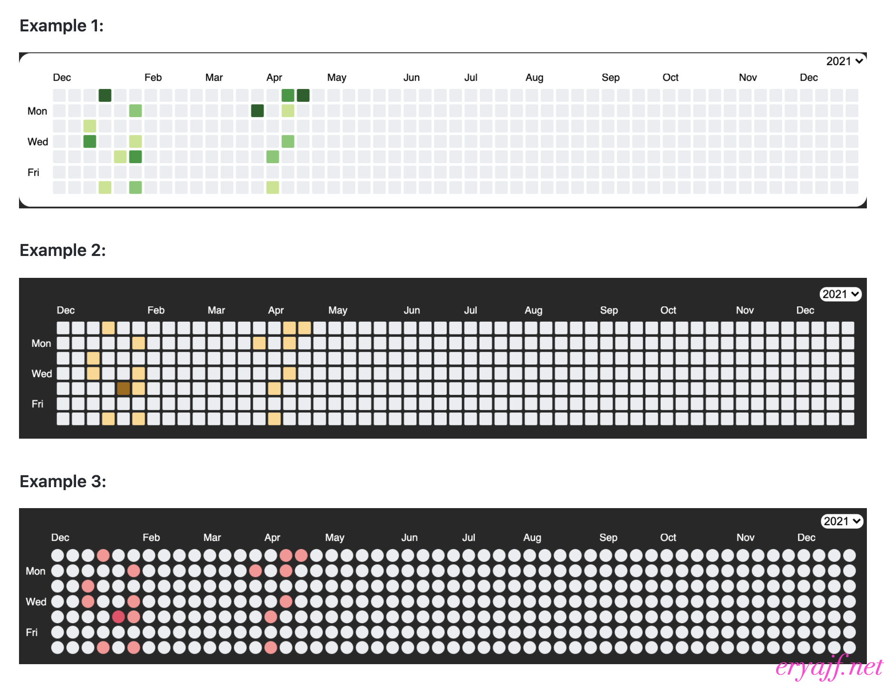
>
> 因为第三种比较好看，因此我这里记录下个人配置出第三种效果的配置信息，同样本地针对插件的配置项做了简单的汉化处理：
>
> 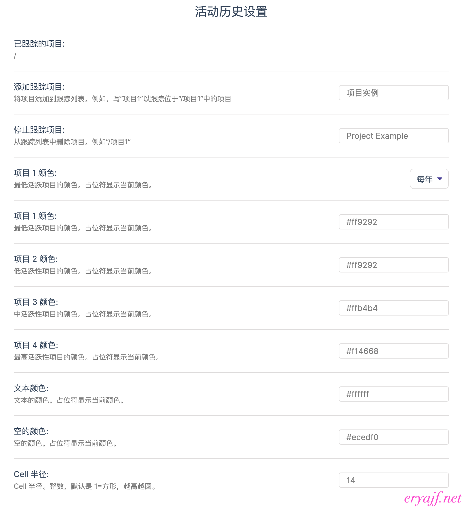
>
> 配置完毕之后，在任意你想展示此活动历史的地方，添加如下代码切换到预览即可看到效果。
>
> ````
> ```ActivityHistory
> /
> ```
> ````
>
> `注意：`此插件仅展示安装之后的活动状态记录，之前的历史并不会展示。

##### 4. Clearing Unused Images

> **信息**
>
> - 名称：[oz-clear-unused-images-obsidian](https://github.com/ozntel/oz-clear-unused-images-obsidian)
> - 功能：一键清理未被引用的图片。
>
> **使用**
>
> 配置信息如图：
>
> 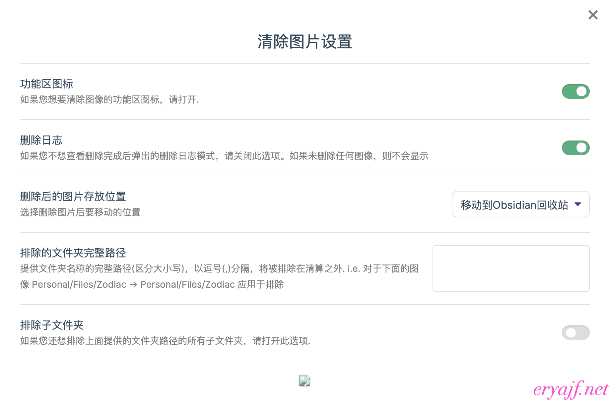
>
> 这是个非常优秀的插件，通常我会打开命令面板调用命令将未使用的图片进行清理。之前在typora中则没有这样的插件，慢慢地已经积累了不少无用的图片在附件库，有了这个插件，从此不会再有这种顾虑。

##### 5. Checklist

> **信息**
>
> - 名称：[obsidian-checklist-plugin](https://github.com/delashum/obsidian-checklist-plugin)
> - 功能：能够将带有todo标签的任务卡汇总在右侧边栏展示的插件。
>
> **使用**
>
> 配置信息如图：
>
> 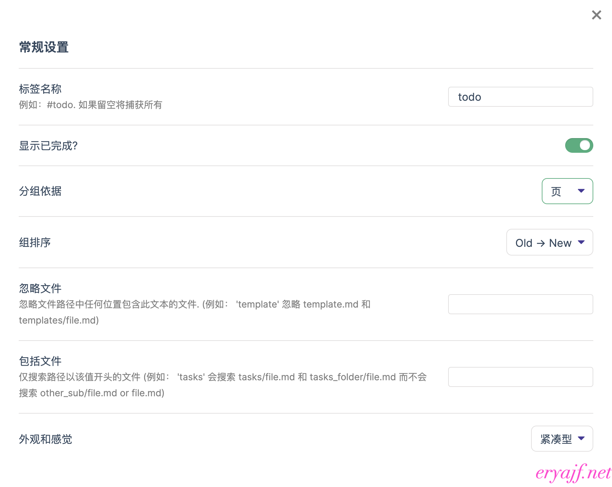
>
> 只需要在待办列表之前添加tudo标签即可自动捕获，当然这个可调整。 
>
> **效果展示**
>
> 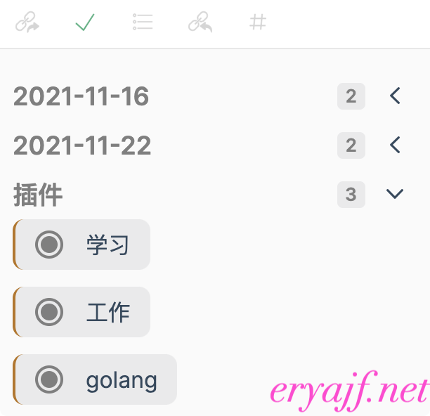

##### 6. Admonition

> **信息**
>
> - 名称：[obsidian-admonition](https://github.com/valentine195/obsidian-admonition)
> - 功能：能够为ob添加注释块风格的插件。
> - 官方文档：[Admonitions - (javalent.com)](https://plugins.javalent.com/admonitions)
>
> **效果展示**
>
> 官方提供的动图已经非常直观了，这里直接借用展示：
>
> 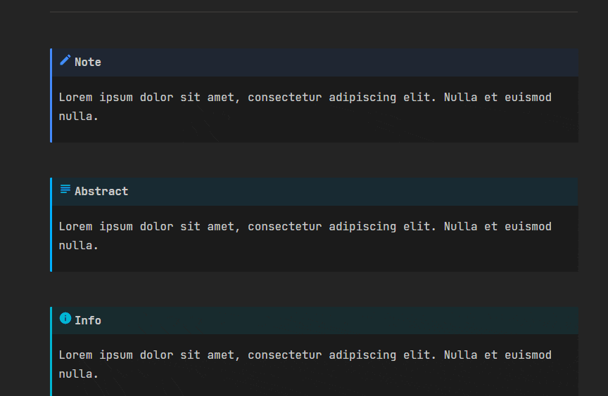
>
> [Obsidian - Callout语法 - Abel's Blog (chen-huaneng.github.io)](https://chen-huaneng.github.io/2024/10/11/2024-10-11-2024-10-11-how-to-use-obsidian-callout/)
>
> 不过现在Obsidian似乎已经新增（或者说是合并了admonition）了能够匹敌admonition的callout功能了。
>
> - 官方文档：[Callouts - Obsidian Help](https://help.obsidian.md/Editing+and+formatting/Callouts)
> - 中文教程：
>   - [Obsidian 样式：Callout 样式 (pkmer.cn)](https://pkmer.cn/Pkmer-Docs/10-obsidian/obsidian%E5%A4%96%E8%A7%82/css-%E7%89%87%E6%AE%B5/obsidian%E6%A0%B7%E5%BC%8F-callout%E6%A0%B7%E5%BC%8F/)
>   - [Callout语法 - Obsidian中文教程 - Obsidian Publish](https://publish.obsidian.md/chinesehelp/01+2021%E6%96%B0%E6%95%99%E7%A8%8B/Callout%E8%AF%AD%E6%B3%95)
>   - [callout标注块 | obsidian文档咖啡豆版 (coffeetea.top)](https://coffeetea.top/zh/markdown/callout.html)
>   - [Callout — 🌱 oldwinterの数字花园](https://notes.oldwinter.top/callout)

##### 7. BetterFn

> **信息**
>
> - 名称：[better-fn](https://github.com/aidenlx/better-fn)
> - 功能：改插件在光标悬停在脚注上时自动显示注释内容，让你无需跳转至文末。
>
> **效果展示**
>
> 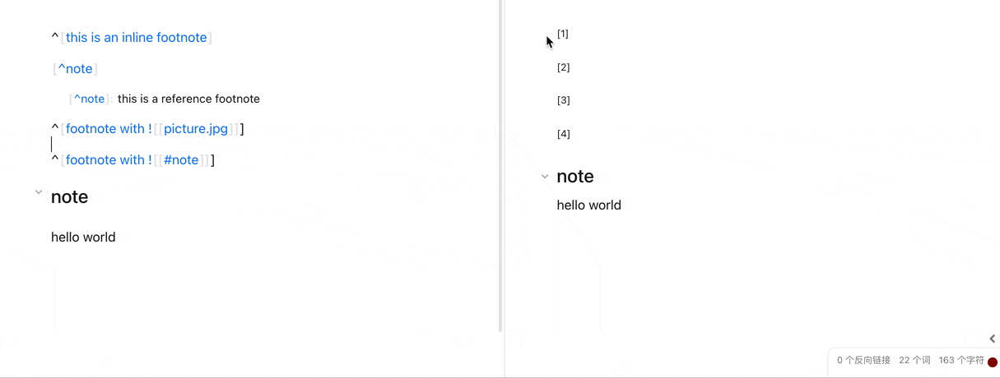

##### 8. Dataview

> **信息**
>
> - 名称：[obsidian-dataview](https://github.com/blacksmithgu/obsidian-dataview)
> - 功能：提供了强大的查询语言，检索出符合条件的内容。
>
> **使用**
>
> 这是个强大的插件，网上也有不少介绍的文章，有机会一定要好好学习了解一下。
>
> 比如，可以用下边的语法，查询所有doing标签的文件：
>
> ````
> ```dataview
> task from #doing
> ```
> ````
>
> 然后就能将带有doing标签的文件都展示出来了。

##### 9. enhancing-mindmap

> **信息**
>
> - 名称：[obsidian-enhancing-mindmap](https://github.com/MarkMindCkm/obsidian-enhancing-mindmap)
> - 功能：提供了在ob中创建思维导图的功能。
>
> **使用**
>
> 通过命令面板创建思维导图：
>
> 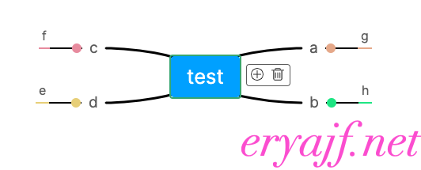
>
> 还可以将文件切换到Markdown模式进行管理与编辑。
>
> 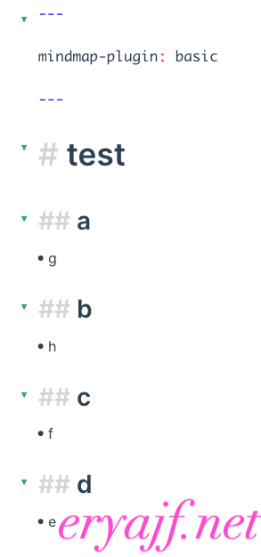

##### 10. Mind Map

> **信息**
>
> - 名称：[obsidian-mind-map](https://github.com/lynchjames/obsidian-mind-map)
> - 功能：能够将标题，无序列表渲染为思维导图的插件，还能直接导出为图片。
>
> **使用**
>
> 使用姿势如下图：
>
> 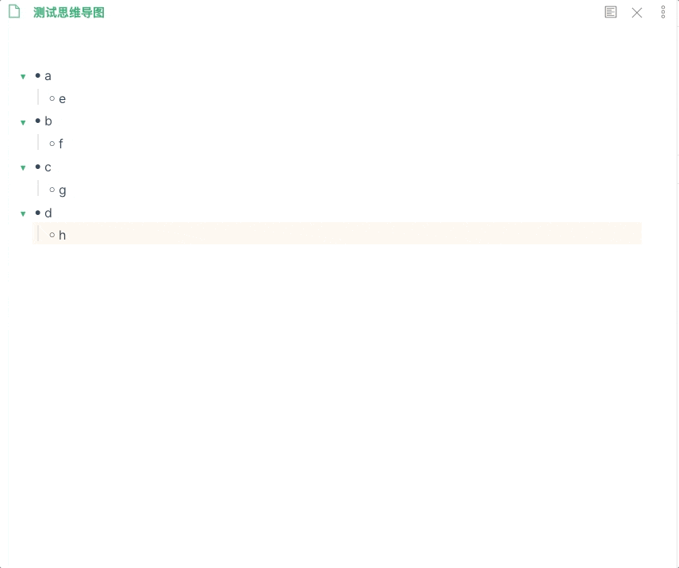

##### 11. Footnote Shortcut

> **信息**
>
> - 名称：[obsidian-footnotes](https://github.com/akaalias/obsidian-footnotes)
> - 功能：给添加角标的功能提供了快捷键的一个插件
>
> **使用**
>
> 我在用的是Window电脑，建议将热键设置为 `ctrl + alt + 1`，操作如下图(借用官方介绍的图)：
>
> 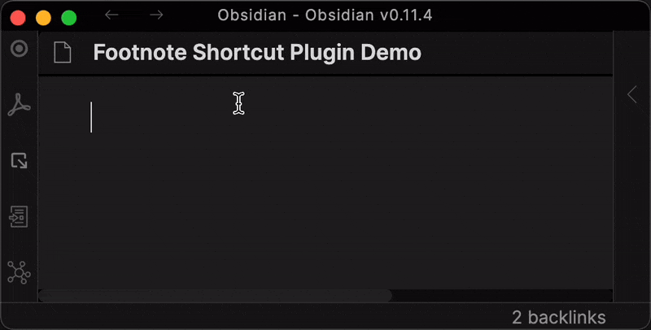

##### 12. Image Toolkit

> **信息**
>
> - 名称：[obsidian-image-toolkit](https://github.com/sissilab/obsidian-image-toolkit)
> - 功能：当你点击一个图片时，该图片将被会弹出，此时您可以预览查看、拖拽、缩放、旋转、反色图片。
>
> **使用**
>
> 使用操作如图：
>
> 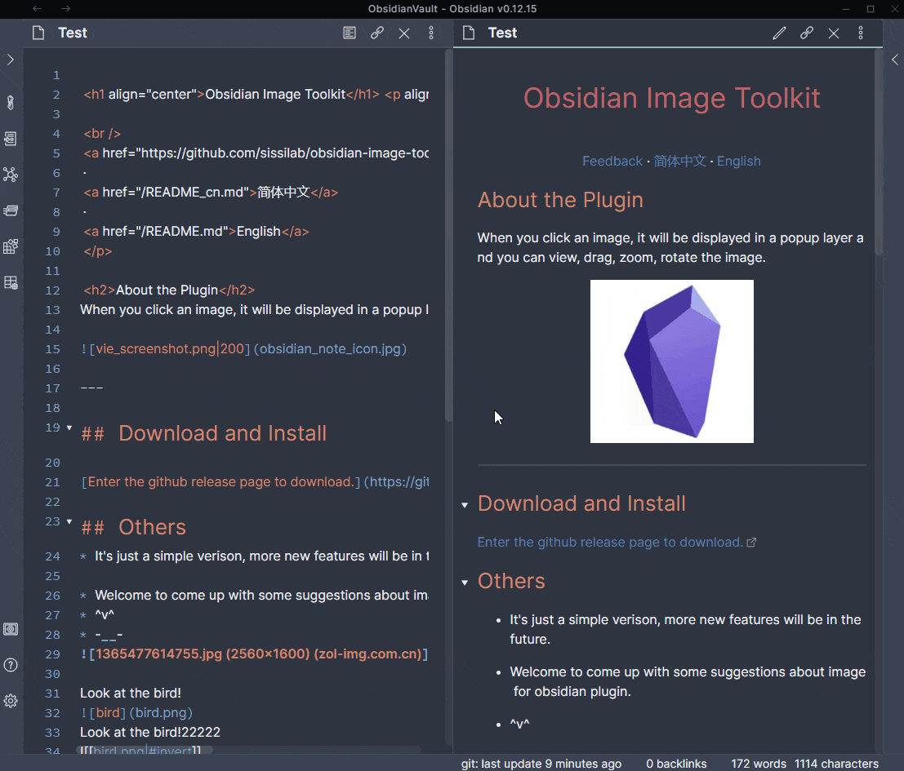
>
> 我借助编辑模式预览的插件能实时展示图片，只不过编辑模式下该插件无法工作。[issue](https://github.com/sissilab/obsidian-image-toolkit/issues/26)已经有人提过，期待后期适配。


##### 13. Media Extended BiliBili Plugin

> **信息**
>
> - 名称：[mx-bili-plugin](https://github.com/aidenlx/mx-bili-plugin)
> - 功能：提供了插入bilibili视频，并添加了一些特性。
>
> **使用**
>
> 这里摘录一下官方介绍： 为Media Extended v2.9.0+添加高级Bilibili支持
>
> - 文档嵌入视频片段 Embed Video Fragment
> - 文档嵌入时间戳 Timestamp Link
> - 高清分辨率 High Resolution Video
> - 倍速/循环/自动播放 Speed Control/Loop/Autoplay
> - 画中画 Picture-in-Picture
> - 更多... and more...


##### 14. Natural Language Dates

> **信息**
>
> -   名称：[nldates-obsidian](https://github.com/argenos/nldates-obsidian)
> -   功能：提供了快捷插入日期时间的功能，包括其他一些扩展能力。
>
> **使用**
>
> 简单用法如下图：
>
> 

##### 15. Remember cursor position

> **信息**
>
> - 名称：[obsidian-remember-cursor-position](https://github.com/derwish-pro/obsidian-remember-cursor-position)
> - 功能：记住每个音符的光标位置和滚动。这在您在笔记之间切换、从链接到链接、返回时非常方便，无需滚动到上次所在的位置。
>
> **使用**
>
> 插件没有什么特殊配置，但是功能非常好。


##### 16. show-file-path

> **信息**
>
> - 名称：[obsidian-show-file-path](https://github.com/ravimashru/obsidian-show-file-path)
> - 功能：一个能够在底部状态栏显示当前文件路径的插件。很赞！
>
> **使用**
>
> 如果你通过搜索打开某篇笔记，左侧侧边栏并不会随着笔记展开，这个插件能够在右下角展示当前文件的路径：
>
> 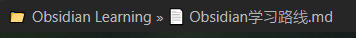

##### 17. Tidy Footnotes

> **信息**
>
> - 名称：[obsidian-tidy-footnotes](https://github.com/charliecm/obsidian-tidy-footnotes)
> - 功能：自动整理笔记中的角标顺序


##### 18. Various Complements

> **信息**
>
> - 名称：[obsidian-various-complements-plugin](https://github.com/tadashi-aikawa/obsidian-various-complements-plugin)
> - 功能：一款强大的智能提示补全插件。
>
> **使用**
>
> 默认情况下，当你在笔记里编辑的时候，该插件会自动智能解析相同的关键字并提示给你：
>
> 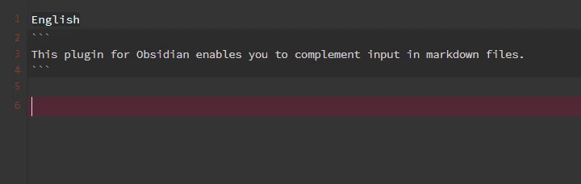
>
> 同时还支持自定义词库，可以先在表格编辑添加，三列内容如下：
>
> 您可以为字典文件中的每一行定义一个单词。
>
> | Col1 |    Col2     | Col3 and later |
> | :--: | :---------: | :------------: |
> | word | description |    aliases     |
>
> - 它使用 `'<TAB>'` 作为分隔符
> - 用`%%`括起来表示注释 (ex: `%%This is a comment%%`)
>

##### 19. Recent Files

> **信息**
>
> - 名称：[recent-files-obsidian](https://github.com/tgrosinger/recent-files-obsidian)
> - 功能：可在侧边栏显示最近打开的文件列表，推荐安装。
>
> **使用**
>
> 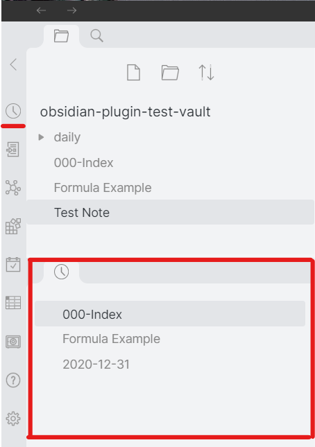

##### 20. Typewriter Scroll Obsidian Plugin

> **信息**
>
> - 名称：[cm-typewriter-scroll-obsidian](https://github.com/deathau/cm-typewriter-scroll-obsidian)
> - 功能：打字机风格的滚动，使视图保持在编辑器的中心,如果你用过 typora 的打字机模式，那你对这个插件提供的能力一定熟悉。
>
> **使用**
>
> 官方动图如下：
>
> 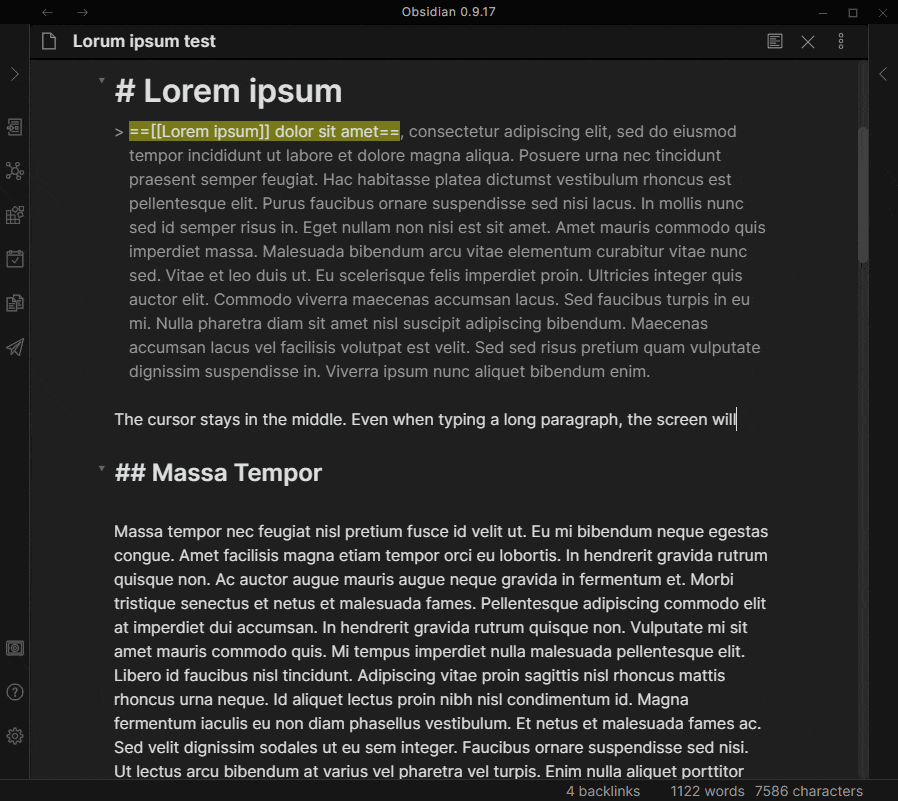

##### 21. Maximise Active Pane（在最新版本的ob中似乎不能正常工作）

> **信息**
>
> - 名称：[maximise-active-pane-obsidian](https://github.com/deathau/maximise-active-pane-obsidian)
> - 功能：能够将当前编辑活动区域放大，并且支持绑定一个快捷键来快速切换，非常推荐安装。
>
> **使用**
>
> 官方动图如下：
>
> 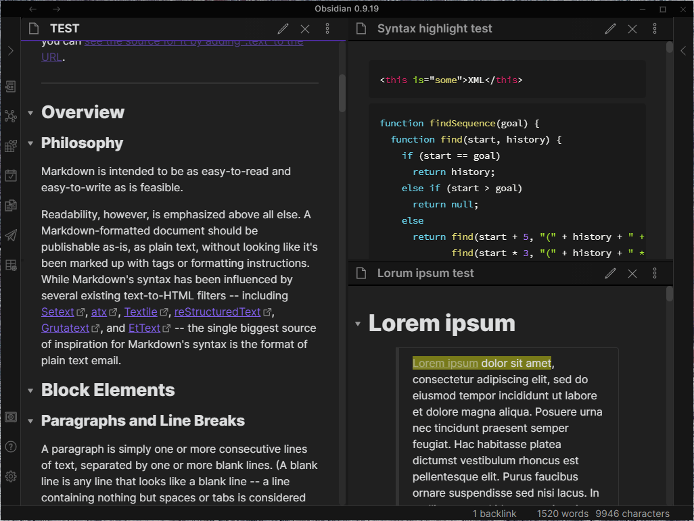

##### 22. Emoji Toolbar

> **信息**
>
> - 名称：[obsidian-emoji-toolbar](https://github.com/oliveryh/obsidian-emoji-toolbar)
> - 功能：快速搜索表情符号并将其插入编辑器。
>
> **使用**
>
> 官方动图如下：
>
> 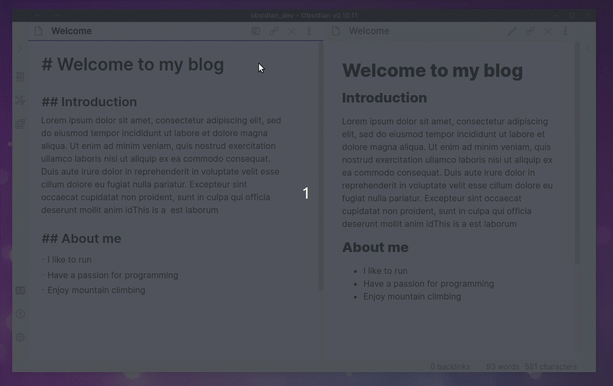

##### 23. Obsidian Charts

> **信息**
>
> - 名称：[obsidian-charts](https://github.com/phibr0/obsidian-charts)
> - 功能：这个插件可以让你轻松地在黑曜石中创建图表！提供了强大的 chars 能力，支持折线图，饼图，矩阵图等。专业人士可尽情折腾。
>
> **使用**
>
> 官方动图如下：
>
> 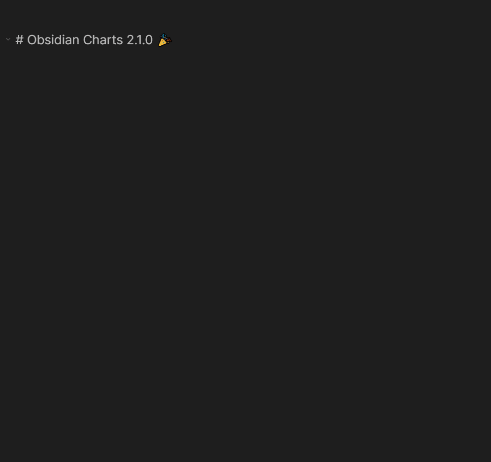
>
> 以及：
>
> 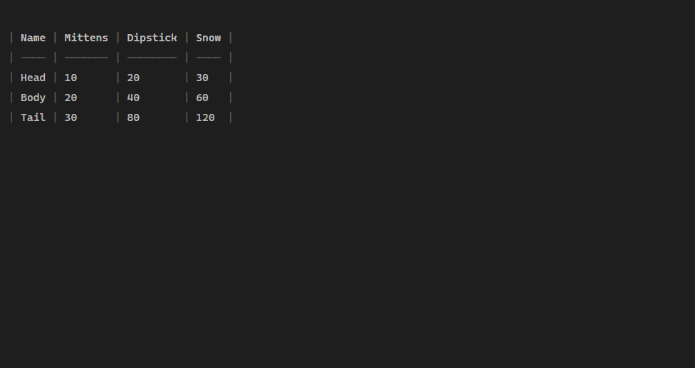

##### 24. Autocomplete

> **信息**
>
> - 名称：[autocomplete-obsidian](https://github.com/Yeboster/autocomplete-obsidian)
> - 功能：此插件提供文本自动补全功能，以提高打字速度。
>
> **使用**
>
> 官方动图如下：
>
> 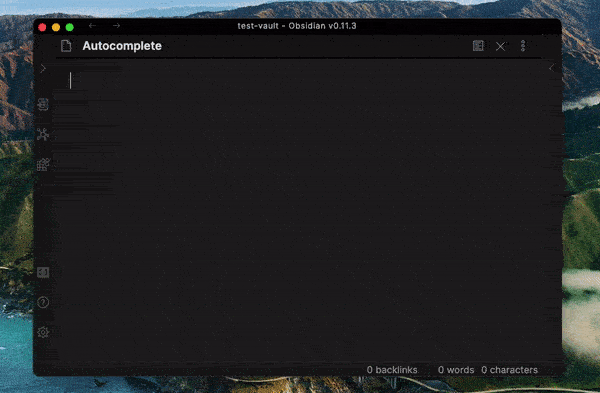

##### 25. Search on Internet

> **信息**
>
> - 名称：[obsidian-search-on-internet](https://github.com/HEmile/obsidian-search-on-internet)
> - 功能：提供了类似浏览器中右键搜的能力，并且可以配置搜索的引擎，以及在浏览器打开，还是在 ob 中打开搜索。
>
> **使用**
>
> 配置信息如图：
>
> 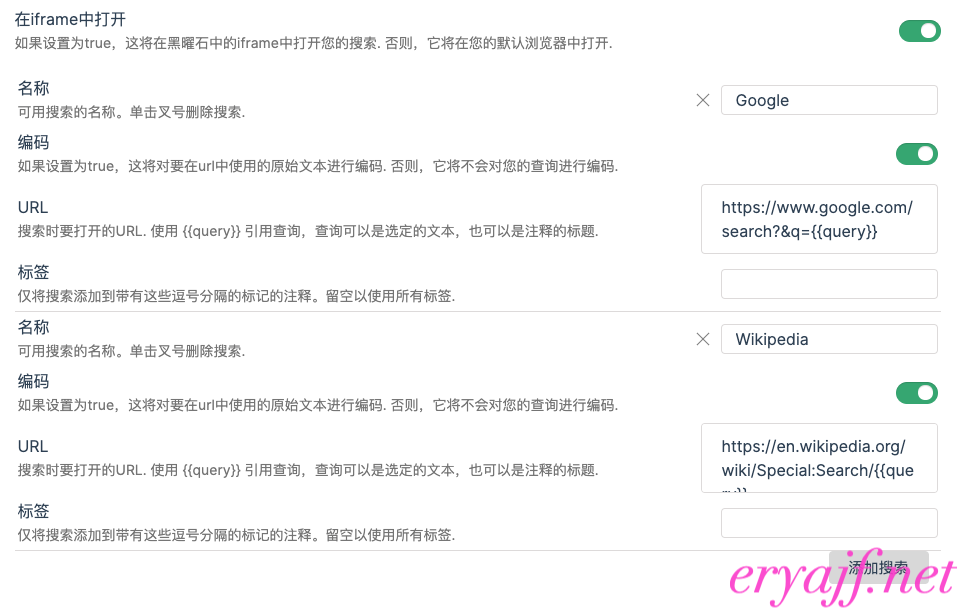
>
> 可以添加自定义的搜索引擎，我这里添加了Bing搜索。
>
> **效果展示**
>
> 官方动图如下：
>
> 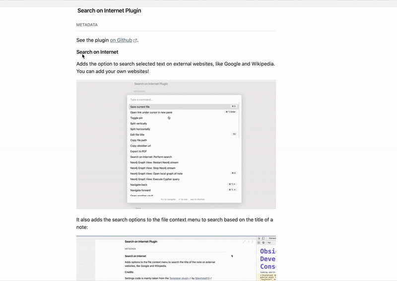

##### 26. Obsidian Orthography

> **信息**
>
> - 名称：[obsidian-orthography](https://github.com/denisoed/obsidian-orthography)
> - 功能：用于检查和修复文本中的拼写错误的黑曜石插件
>
> **使用**
>
> 官方动图如下：
>
> 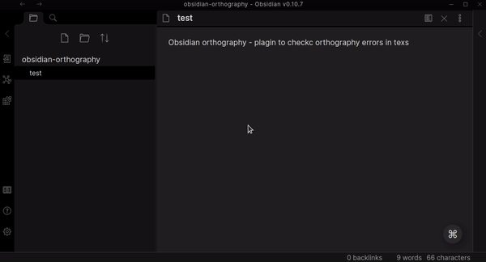

##### 27. Text Snippets

> **信息**
>
> - 名称：[text-snippets-obsidian](https://github.com/ArianaKhit/text-snippets-obsidian)
> - 功能：用于更快打字的代码片断。它允许您替换文本模板以加快输入速度，创建自己的片段，几乎就像在许多文本编辑器和 IDE 中一样。
>
> **使用**
>
> 官方动图如下：
>
> 

##### 28. Extract url content

> **信息**
>
> - 名称：[obsidian-extract-url](https://github.com/trashhalo/obsidian-extract-url)
> - 功能：提取 URL 将内容转换为标记。一款快速将网页内容转为 Markdown 的插件，理想情况下，这个插件能够快速将你想剪藏的网页内容落到你的 ob 中。
>
> **使用**
>
> 官方动图如下：
>
> 

##### 29. Link Favicons

> **信息**
>
> - 名称：[obsidian-link-favicon](https://github.com/joethei/obsidian-link-favicon)
> - 功能：提供外部链接的 icon，例如 github 相关的链接的前边加上一个章鱼猫 icon。
>
> **使用**
>
> - Disabling on specific links
>
> If you have a link where you do not want to see the favicon, add `|nofavicon` to the link alias.
>
> `[Display text|nofavicon](https://example.org)`
>
> **效果展示**
>
> 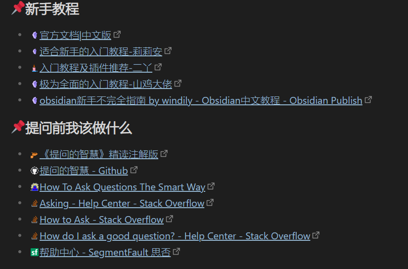

##### 30. Obsidian Annotator

> **信息**
>
> - 名称：[obsidian-annotator](https://github.com/elias-sundqvist/obsidian-annotator)
> - 功能：It allows you to open and annotate PDF and EPUB files.
> - 教程：[Johnny学OB 第13集](https://www.bilibili.com/video/BV1YQ4y1C7Fy/?vd_source=8f6ac8ba344f8ea3b071481f41e2ce0d)
>
> **使用**
>
> Warning! In the above gif I use Dataview syntax to specify the annotation-target. If you do not have the dataview plugin installed, you must instead write the annotation-target in the frontmatter, like this:
>
> ```
> ---
> annotation-target: https://arxiv.org/pdf/2104.13478.pdf
> ---
> ```
>
> **效果展示**
>
> 

##### 31. Obsidian Weread

> **信息**
>
> - 名称：[Obsidian Weread Plugin](https://github.com/zhaohongxuan/obsidian-weread-plugin)
> - 功能：Obsidian 微信读书插件是一个社区插件，用来同步微信读书中书籍元信息、高亮标注，划线感想、书评等，并将这些信息转换为 markdown 格式保存到 Obsidian 的文件夹中，初次使用，如果笔记数量较多，更新会比较慢，后面再去更新的时候只会更新划线数量或者笔记数量有变化的书籍，一般速度很快。
> - 教程：
>
> 1.  [zhaohongxuan/obsidian-weread-plugin: Obsidian Weread Plugin is a plugin to sync Weread (微信读书) hightlights and annotations into your Obsidian Vault. (github. com)](https://github.com/zhaohongxuan/obsidian-weread-plugin)
> 2.  [Weread obsidian plugin markdown template usage · zhaohongxuan/obsidian-weread-plugin Wiki (github.com)](https://github.com/zhaohongxuan/obsidian-weread-plugin/wiki/Weread-obsidian-plugin-markdown-template-usage)
> 3.  [使用Dataview进行书籍管理 · zhaohongxuan/obsidian-weread-plugin Wiki (github.com)](https://github.com/zhaohongxuan/obsidian-weread-plugin/wiki/%E4%BD%BF%E7%94%A8Dataview%E8%BF%9B%E8%A1%8C%E4%B9%A6%E7%B1%8D%E7%AE%A1%E7%90%86)


##### 32. obsidian-tasks-calendar-wrapper

> **信息**
>
> - 名称：[obsidian-tasks-calendar-wrapper](https://github.com/Leonezz/obsidian-tasks-calendar-wrapper)
> - 功能：This plugin currently provides a timeline view to display your tasks from your obsidian valut, with customizable filters and renderring options.
> - 相关的插件：
>   - [Obsidian-Tasks-Timeline](https://github.com/702573N/Obsidian-Tasks-Timeline)
>   - [Obsidian-Tasks-Calendar](https://github.com/702573N/Obsidian-Tasks-Calendar)

# 🔖Obsidian进阶宝典

## 1. 🏘基于Git的分布式版本控制

### 1.1 Version History Diff

> **信息**
>
> - 名称：[version-history-diff](https://github.com/kometenstaub/obsidian-version-history-diff)
> - 功能：Version History Diff (for Sync and File Recovery Core plugins and Git)

### 1.2 Obsidian Git

> **信息**
>
> - 名称：[obsidian-git](https://github.com/denolehov/obsidian-git)
> - 功能：Plugin that allows you to back up your [Obsidian.md](https://obsidian.md/) vault to a remote Git repository (e.g. private repo on GitHub).  
>
> Requirements, installation steps (including setup for mobile), tips and tricks, common issues and more can be found in the [documentation](https://publish.obsidian.md/git-doc).  
>
> For mobile users see [Mobile](https://github.com/denolehov/obsidian-git#mobile) section below.
>
> - 教程：
>
> 1. [用 Git 在 Android 和 Windows 间同步 Obsidian 数据库 - 少数派 (sspai.com)](https://sspai.com/post/68989#!)
> 2. [Git教程 - 廖雪峰的官方网站 (liaoxuefeng.com)](https://www.liaoxuefeng.com/wiki/896043488029600)


## 2. 📻如何把外刊（英语）学习融入到Obsidian

通过以下两个插件可以简化[如何使用Obsidian进行高效外刊精读 - 知乎 (zhihu.com)](https://zhuanlan.zhihu.com/p/453566669?theme=dark)这个文章的流程，当然这篇文章的实现思路也是不错的。

### 2.1 obsidian-language-learner

> **信息**
>
> - 名称：[obsidian-language-learner](https://github.com/guopenghui/obsidian-language-learner)
> - 功能：
>
> 1. **查词功能**。直接在笔记中划词查词，词典为有道词典，支持柯林斯例句、近义词辨析。
> 2. **添加笔记**。数据被保存在obsidain的indexDB数据库中。每个单词/短语支持多条笔记、多条例句（包括文本、翻译和出处）
> 3. **解析页面**。将每个单词变成一个按钮，通过点击就可以边读边查边记笔记。如果有音频链接的话可以边听边读。
> 4. **统计页面**。目前支持显示7天内每天自己记的单词数和总的单词数。
>
> 5. 联动其他插件功能：
>
>  6. 联动various complements插件，将数据库中的单词保存在本地的一个note中。这样就可以在写作时得到自己之前记过的单词/短语的**自动提示和补全**
>
>     2.  联动spaced repetition插件，将数据库中的单词保存在本地的note中。这样就可以制作成卡片，进行**间隔复习**。
>
> - 教程：
>
> 1. 推荐插件作者自己写的Tutorial，在[插件的Github网页](https://github.com/guopenghui/obsidian-language-learner)中能够找到
> 2. [如何使用Obsidian进行高效外刊精读 - 知乎 (zhihu.com)](https://zhuanlan.zhihu.com/p/453566669?theme=dark)


### 2.2 obsidian-spaced-repetition

> **信息**
>
> - 名称：[obsidian-spaced-repetition](https://github.com/st3v3nmw/obsidian-spaced-repetition)
> - 功能：Fight the forgetting curve & note aging by reviewing flashcards & notes using spaced repetition on Obsidian.md
> - 教程：[官方文档](https://www.stephenmwangi.com/obsidian-spaced-repetition/)


## 3. 🏡Homepage 的构建

### 0. 开箱即用库

- [obsidian开箱即用示例库 — 🌱 oldwinterの数字花园](https://notes.oldwinter.top/obsidian%E5%BC%80%E7%AE%B1%E5%8D%B3%E7%94%A8%E7%A4%BA%E4%BE%8B%E5%BA%93)
- [玩转 Obsidian 08：利用 Dataview 打造自动化 HomePage - 少数派 (sspai.com)](https://client.sspai.com/post/73958#!)
- [给 Obsidian 来个起始页：：木木木木木 (immmmm.com)](https://immmmm.com/obsidian-start-me-page/)
- [PKM-er/Blue-topaz-example: Blue topaz themes example vault for Obsidian (github.com)](https://github.com/PKM-er/Blue-topaz-example)
- [index--Obsidian online publish (pptest.com.cn)](https://cuman.pptest.com.cn/Blue-topaz-example-online/index.html)

### 1. 参考视频

- [Obsidian 主页模块功能分析讲解_哔哩哔哩_bilibili](https://www.bilibili.com/video/BV1aY411j7vQ/?zw&spm_id_from=888.80996.embed_old&vd_source=8f6ac8ba344f8ea3b071481f41e2ce0d)
- [cuman的个人空间_哔哩哔哩_bilibili](https://space.bilibili.com/1970226/channel/series)

### 2. 核心插件支持

#### 3.2.1 Banners

> **信息**
>
> - 名称：[Banners](https://github.com/noatpad/obsidian-banners)
> - 功能：An Obsidian plugin to add banner images (and icons) to your notes!
>
> **使用**
>
> ```yaml
> # The source path of your banner image, can be a URL or an internal link to an image.
> # NOTE: Make sure it's wrapped in quotes to avoid parsing errors, such as "![[file]]"
> banner: string
> 
> # The banner's center position. A number between 0-1
> banner_x: number
> banner_y: number
> 
> # Determines if the banner is locked in place or not
> banner_lock: boolean
> 
> # The banner icon. Can be an emoji or any string really (but it'll only accept the first letter)
> banner_icon: string
> ```
>
> **效果展示**
>
> 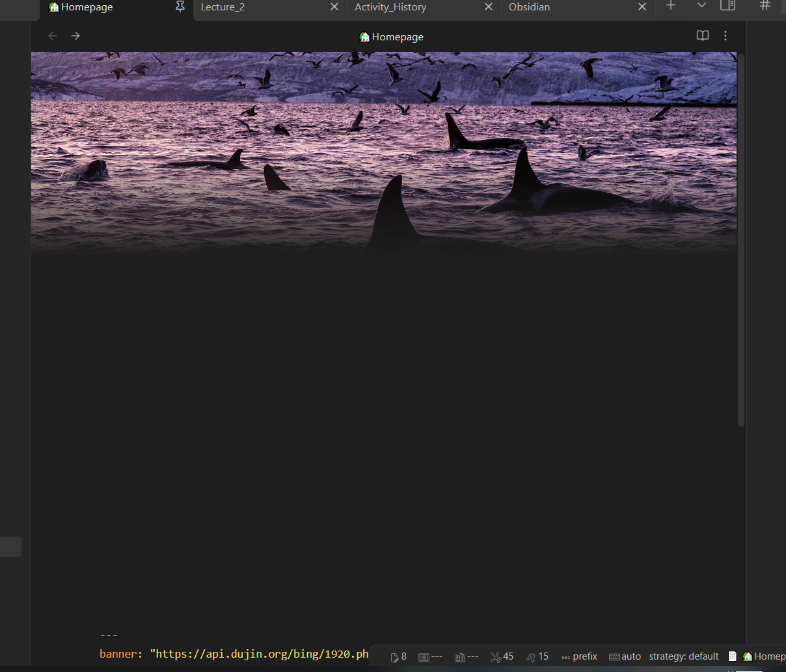

#### 3.2.2 Templater 

>
> **信息**
>
> - 名称：[Templater](https://github.com/SilentVoid13/Templater)
> - 功能：Templater is a template plugin for Obsidian.md. It defines a templating language that lets you insert variables and functions results into your notes. It will also let you execute JavaScript code manipulating those variables and functions.

#### 3.2.3 Quickadd 

>
> **信息**
>
> - 名称：[QuickAdd](https://github.com/chhoumann/quickadd)
> - 功能：QuickAdd is a powerful combination of four tools (called choices): templates, captures, macros, and multis.


#### 3.2.4 Buttons 

>
> **信息**
>
> - 名称：[Buttons](https://github.com/shabegom/buttons)
> - 功能：Run commands and open links by clicking on ✨ Buttons ✨


#### 3.2.5 Style Settings

>
> **信息**
>
> - 名称：[Style Settings](https://github.com/mgmeyers/obsidian-style-settings)
> - 功能：This plugin allows snippet, theme, and plugin CSS files to define a set of configuration options. It then allows users to see all the tweakable settings in one settings pane. Style Settings allows both toggling classes on and off the `body` element, as well as setting numeric, string, and color CSS variables.


#### 3.2.6 Workspaces Plus

>
> **信息**
>
> - 名称：[Workspaces Plus](https://github.com/nothingislost/obsidian-workspaces-plus)
> - 功能：Workspaces Plus is a plugin that expands the functionality of workspaces in Obsidian.

#### 3.2.7 参考前面介绍的Dataview插件

#### 3.2.8 参考前面介绍的Admonition插件

## 4. 🧿Canvas（白板）的十八般武艺

### 4.1 简单介绍及使用案例

- [【Obsidian白板功能详解】让信息更好的可视化、逻辑化！_哔哩哔哩_bilibili](https://www.bilibili.com/video/BV18V4y1F7sC/?spm_id_from=333.788.recommend_more_video.1&vd_source=8f6ac8ba344f8ea3b071481f41e2ce0d)
- [Obsidian的白板比Heptabase好吗？_哔哩哔哩_bilibili](https://www.bilibili.com/video/BV1wA41197F4/?vd_source=8f6ac8ba344f8ea3b071481f41e2ce0d)
- [知识管理神器 Obsidian，终于有了白板功能！ - 少数派 (sspai.com)](https://sspai.com/post/77463)
- [一起来看看大佬们的Obsidian白板（Canvas）使用案例分享 - 知乎 (zhihu.com)](https://zhuanlan.zhihu.com/p/597131166)
- [Obsidian Canvas - Visualize your ideas](https://obsidian.md/canvas)


### 4.2 拓展插件支持

#### 4.2.1 Obsidian-Canvas-MindMap（似乎现在的版本还不能正常使用）

>
> **信息**
>
> - 名称：[Obsidian-Canvas-MindMap](https://github.com/Quorafind/Obsidian-Canvas-MindMap)
> - 功能：A plugin to make your canvas work like a mindmap.


#### 4.2.2 Obsidian-Link-Nodes-In-Canvas

>
> **信息**
>
> - 名称：[Obsidian-Link-Nodes-In-Canvas](https://github.com/Quorafind/Obsidian-Link-Nodes-In-Canvas)
> - 功能：A plugin for you to add edges between notes in Canvas based on there links.


#### 4.2.3 Obsidian-Canvas-Presentation

>
> **信息**
>
> - 名称：[Obsidian-Canvas-Presentation](https://github.com/Quorafind/Obsidian-Canvas-Presentation)
> - 功能：A plugin to help you display cards based on sequence.


#### 4.2.4 Obsidian-Link-Nodes-In-Canvas

>
> **信息**
>
> - 名称：[Obsidian-Link-Nodes-In-Canvas](https://github.com/Quorafind/Obsidian-Link-Nodes-In-Canvas)
> - 功能：- Use command to generate edges between nodes(selected) in canvas.


#### 4.2.5 obsidian-optimize-canvas-connections

>
> **信息**
>
> - 名称：[obsidian-optimize-canvas-connections](https://github.com/felixchenier/obsidian-optimize-canvas-connections)
> - 功能：An Obsidian plugin that declutters a canvas by reconnecting notes using their nearest edges.
> - Tips：建议用`Ctrl`+`P`命令快速搜索optimize-canvas-connection然后选择Preserve axes的选项，这样比较保险，虽然Shortest path选项也能达成目的，但是可能不一定按照你设想的方式，另外，当你没有选择Canvas中的结点的时候，默认对整个Canvas应用该选项。

### 4.3 使用教程

- [ob 1.1.8版本公开发布，白板功能正式实装 by 软通达 - Obsidian中文教程 - Obsidian Publish](https://publish.obsidian.md/chinesehelp/01+2021%E6%96%B0%E6%95%99%E7%A8%8B/ob+1.1.8%E7%89%88%E6%9C%AC%E5%85%AC%E5%BC%80%E5%8F%91%E5%B8%83%EF%BC%8C%E7%99%BD%E6%9D%BF%E5%8A%9F%E8%83%BD%E6%AD%A3%E5%BC%8F%E5%AE%9E%E8%A3%85+by+%E8%BD%AF%E9%80%9A%E8%BE%BE)
- [Canvas - Obsidian Help](https://help.obsidian.md/Plugins/Canvas)
- [白板 - Obsidian 中文帮助 - Obsidian Publish](https://publish.obsidian.md/help-zh/%E6%8F%92%E4%BB%B6/%E7%99%BD%E6%9D%BF)

## 5. 📎Obsidian 和 Zotero 的梦幻联动

- [obsidian联合 zotero到底解决了什么问题？ - 知乎](https://www.zhihu.com/question/533885202)
- [zotero 与 obsidian 配合提高阅读效率 - 知乎](https://zhuanlan.zhihu.com/p/389205793)

### 5.1 📌科研文献阅读——Zotero和Obsidian联动最优解决方案：Better BibTex+BibNotes Formatter+Zotero Obsidian Citations

- [科研文献阅读——Zotero和Obsidian联动最优解决方案 - 知乎](https://zhuanlan.zhihu.com/p/480911605)
- [安装流程演示——Zotero和Obsidian联动最优解决方案 - 知乎 ](https://zhuanlan.zhihu.com/p/483844415)
- [Zotero 插件 Bibtex for Zotero 介绍和安装 - 倔强的小蜗牛 ](https://snailwish.com/291/)
- [Zotero 插件 Zotero Obsidian Citations 下载](https://github.com/cbx812/zotero-obsidian-citations)

## 6. 🖇️Work Flow 的构建

- [日常学习工作流 - CS自学指南](https://csdiy.wiki/%E5%BF%85%E5%AD%A6%E5%B7%A5%E5%85%B7/workflow/)
- [3000+小时积累的学习工作流 - 少数派 ](https://sspai.com/post/75969)
- [Obsidian 的高级玩法|打造能跳转到任何格式文件的笔记 - 掘金](https://juejin.cn/post/7145351315705577485#heading-48)

## 7. 📋笔记系统的构建

- [笔记方法论（MOC）](https://publish.obsidian.md/chinesehelp/01+2021%E6%96%B0%E6%95%99%E7%A8%8B/%E7%AC%94%E8%AE%B0%E6%96%B9%E6%B3%95%E8%AE%BA%EF%BC%88MOC%EF%BC%89)
- [闲者时间_王掌柜 的文章 - 少数派](https://sspai.com/u/5b3wva6y/posts)
- [Latest Knowledge management topics - Obsidian Forum](https://forum.obsidian.md/c/knowledge-management/6)
- [卡片笔记之困与秩序的重建 - 少数派](https://sspai.com/post/68607)
- [TOC 和 MOC：重组我的 Obsidian 和 Zotero 知识管理系统 - 知乎](https://zhuanlan.zhihu.com/p/374178962)

### 7.1 📌KG笔记法 

- [如何构建自己的笔记系统？ - 知乎](https://www.zhihu.com/question/23427617/answer/1461195696)
- [如何构建笔记系统-实际操作篇 - 知乎](https://zhuanlan.zhihu.com/p/353521308)
- [KG笔记法](https://github.com/11-check-it-out/KGnotes-demo)
- [图谱真的没用吗？知识图谱视角下的双链笔记](https://forum-zh.obsidian.md/t/topic/1425)
- [释放图谱的力量——KG笔记法](https://forum-zh.obsidian.md/t/topic/2059)

#### 中国图书馆分类法

- [汉语主题词表服务系统 ](https://ct.istic.ac.cn/site/organize/word)
- [中图法（第五版）分类目录——亿文工具箱](http://tool.51yww.com/shm/17.html)
- [中国图书分类法简表 ](http://ztflh.com/)

## 8. ✨优质内容分享者

- [八角经刀的个人空间_哔哩哔哩_bilibili](https://space.bilibili.com/241033241)
- [理行天道 - 简书 ](https://www.jianshu.com/u/56a8cbef0e7a)

### 8.1 📌信息源收集

- [obsidian的信息源（MOC）](https://publish.obsidian.md/chinesehelp/07+%E4%BF%A1%E6%81%AF%E6%BA%90%E4%B8%8E%E8%B4%A1%E7%8C%AE%E8%80%85/obsidian%E7%9A%84%E4%BF%A1%E6%81%AF%E6%BA%90%EF%BC%88MOC%EF%BC%89)

## 9. 📑任务管理（类似Trello的看板功能）

### 9.1 拓展插件支持

#### 9.1.2 obsidian-kanban

>
> **信息**
>
> - 名称：[obsidian-kanban](https://github.com/mgmeyers/obsidian-kanban)
> - 功能：Create markdown-backed Kanban boards in Obsidian.
> - 官方文档：[Obsidian Kanban Plugin - Obsidian Kanban Plugin - Obsidian Publish](https://publish.obsidian.md/kanban/Obsidian+Kanban+Plugin)
>
> **使用**
>
> 可以在看板的卡片中使用`@`和`@@`来添加时间（要记得在标题的后面打个空格再`@`），也可以用`#`来添加标签，还可以用Obsidian的双链语法来添加双联笔记。


#### 9.1.2 quickadd

>
> **信息**
>
> - 名称：[quickadd](https://github.com/chhoumann/quickadd)
> - 功能：QuickAdd is a powerful combination of four tools (called choices): templates, captures, macros, and multis.
> - 官方文档：[Home | QuickAdd (obsidian.guide)](https://quickadd.obsidian.guide/)


### 9.2 相关教程

- [在obsidian中如何使用QuickAdd和Kanban插件来管理日程_哔哩哔哩_bilibili](https://www.bilibili.com/video/BV1mb4y1y7R6/?vd_source=8f6ac8ba344f8ea3b071481f41e2ce0d)

## 10. 🎓基于考研需求的知识管理

### 10.1 参考文章

- [集大成者学习软件obsidian教程——基于考研需求 - 知乎 (zhihu.com)](https://zhuanlan.zhihu.com/p/512240644?theme=dark)

## 11. 📋网页剪藏

### 相关的文章

- [如何进行网页剪藏（MOC） - Obsidian中文教程 - Obsidian Publish](https://publish.obsidian.md/chinesehelp/07+%E4%BF%A1%E6%81%AF%E6%BA%90%E4%B8%8E%E8%B4%A1%E7%8C%AE%E8%80%85/%E5%A6%82%E4%BD%95%E8%BF%9B%E8%A1%8C%E7%BD%91%E9%A1%B5%E5%89%AA%E8%97%8F%EF%BC%88MOC%EF%BC%89#%E5%85%B6%E4%BB%96%E6%96%B9%E5%BC%8F)

### 11.1 基于omnivore的解决方案

#### 11.1.1 拓展插件支持

##### 11.1.1.1 obsidian-omnivore

>
> **信息**
>
> - 名称：[obsidian-omnivore](https://github.com/omnivore-app/obsidian-omnivore)
> - 功能：用于同步omnivore这个软件（Edge浏览器插件）剪藏的文章链接，暂时不能够实现全文剪藏，只能够同步相关的原文链接和omnivore阅读的链接到obsidian，所以如果要实现全文剪藏需要通过其他途径实现。
> - 官方文档：
>   - [欢迎来到 Omnivore | Omnivore 使用文档](https://docs.omnivore.app/zh/)
>   - [Welcome to Omnivore | Omnivore Docs](https://docs.omnivore.app/)


### 11.2 基于Cubox的解决方案

- 信息：[欢迎来到 Cubox | Cubox 帮助文档](https://help.cubox.pro/)
- 功能：通过Cubox剪藏网页的文章，然后将剪藏在Cubox中的网页文章导出为Markdown格式的文件储存在本地中，实现与Obsidian的联动。
- 效果展示：


- 解决的痛点：原文链接失效或者原文丢失。
- 配置：[官网](https://cubox.pro/)下载Cubox并注册就可以使用了。

### 11.3 基于简悦的解决方案（比较繁琐而且可能需要付费）

#### 11.3.1 官方文档

- [简悦手册|nofavicon](https://www.yuque.com/kenshin/simpread)
- [Kenshin/simpread: 简悦 ( SimpRead ) - 让你瞬间进入沉浸式阅读的扩展 (github.com)](https://github.com/Kenshin/simpread)
- [文档中心 - 简悦 SimpRead - 如杂志般沉浸式阅读体验的扩展 (ksria.com)](http://ksria.com/simpread/docs/#/)
- [Kenshin/simpread · Discussions · GitHub](https://github.com/Kenshin/simpread/discussions?discussions_q=label%3Aobsidian)

#### 11.3.2 参考的工作流

- [利用 Dataview + Blue Topaz + Markdown 辅助增强 + 导入到 Obsidian 插件，实现对标注的汇总与回顾 · Kenshin/simpread · Discussion #3807 (github.com)](https://github.com/Kenshin/simpread/discussions/3807)
  - 当从简悦导入的笔记数量多了之后可以参考上面那篇文章的Dataview的用法来索引
- [自动导入标注到 Obsidian（不使用同步助手方案） - 知乎 (zhihu.com)](https://zhuanlan.zhihu.com/p/504280066)
- [导出 md + assets 格式 · Kenshin/simpread · Discussion #4041 (github.com)](https://github.com/Kenshin/simpread/discussions/4041#discussioncomment-3930228)
  - 在开启简悦·同步助手后台运行的情况下，只需要在阅读文章的时候进入简悦的阅读模式，然后按下快捷键`a`+`t`就可以触发保存文章为`.md`格式并且把文章中的图片转为本地的图片，前提是按照上面的教程配置好了设置，然后就可以在配置好的路径下找到`.md`文件和相对应的图片了。


##### 11.3.2.1 拓展插件支持

###### 11.3.2.1.1 obsidian-local-rest-api

>
> **信息**
>
> - 名称：[obsidian-local-rest-api](https://github.com/coddingtonbear/obsidian-local-rest-api)
> - 功能：Unlock your automation needs by interacting with your notes in Obsidian over a secure REST API.

###### 11.3.2.1.2 参考前面对于dataview插件的介绍

###### 11.3.2.1.3 参考前面对于style-setting插件的介绍


# 🗃️附录

## 📐不同笔记软件之间的比较

- [NoteApps.info: 29 best note taking apps analyzed over 281 features](https://noteapps.info/)

## 🎨如何挑选你喜欢的颜色（RGB）

- [中国色|RGB颜色预览](http://zhongguose.com/)

## 💭一些碎碎念

- 要在编辑模式下实现双链的实时预览的悬浮窗口需要加上`ctrl`才能实现，而在阅读模式下只需把鼠标指向该位置就可以。

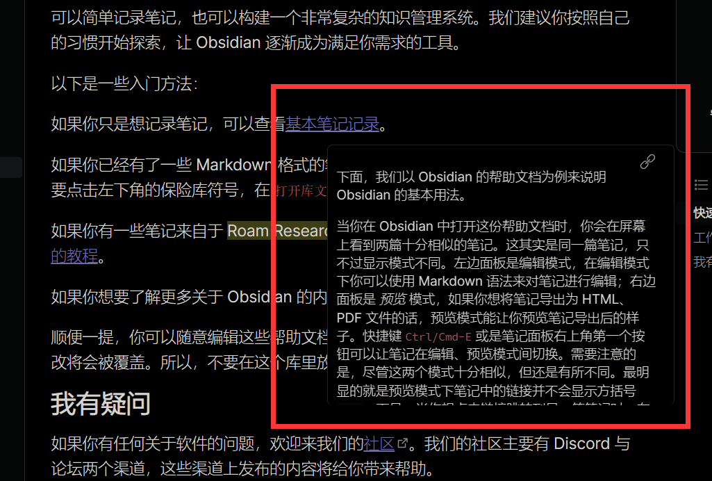

- Obsidian自带的大纲可以直接拖动大纲标题实现标题及标题内容的移动，可以用在移动标题及内容到某个特定位置的功能。

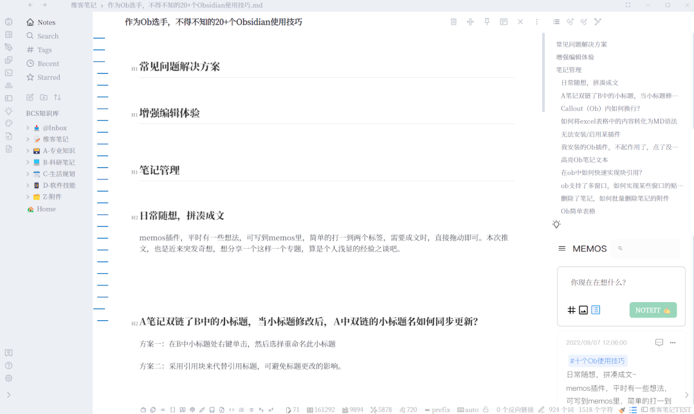

