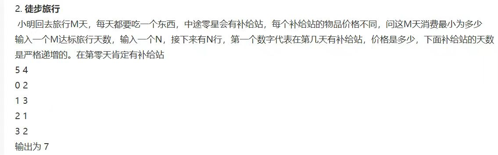

## Bytedance 实习 测试岗 2023.6

### 丢西瓜捡芝麻策略



**解法一**：直接从起点开始走，遇到比手上有的物品价格低的就换成买价格低的物品，直到终点，这样就能确保买到的价格最低。算法的时间复杂度为 $O(n)$。

```c
#include <stdio.h>
#include <string.h>
#include <stdlib.h>
#define MAX 100

typedef struct Expense
{
	long int day;
	long int cost;
};

int main()
{
	Expense arr[MAX];
	long int min_cost = 1e9 + 7;
	int k = 0;
    long long int M, N, ans = 0;
	memset(arr, 0, sizeof(arr));
	scanf("%lld%lld", &M, &N);
    for (int i = 0; i < N; i++)
	{
        scanf("%ld%ld", &arr[i].day, &arr[i].cost);
	}
	for (int i = 0; i < N; i++)
	{
		if (arr[i].cost < min_cost)
		{
			ans += arr[k].cost * (arr[i].day - arr[k].day);
			k = i;
			min_cost = arr[i].cost;
		}
	}
	ans += arr[k].cost * (M - arr[k].day);
	printf("%lld\n", ans);
    return 0;
}
```

**解法二（贪心算法+计数排序）**：先用计数排序从小到大排好各个补给站的物品价格，先选最小的物品价格作为起点，然后在该物品的补给站之前找到最小的物品价格，如此迭代，直到回到起点为止，这样取得的同样是最小的花费。算法时间复杂度为 $O(m*n)$

```c
#include <stdio.h>
#include <stdlib.h>
#include <string.h>
#define MAX 10000

typedef struct Travel
{
	long int day;
	long int cost;
}Expense;


void print_arr(Expense* arr, int n) //打印排序结果
{
    int i;
    printf("%d", arr[0].cost);
    for (i = 1; i < n; i++)
    {
        printf(" %d", arr[i].cost);
    }
    printf("\n");
}

int main()
{
	long long int M, N;
    int* count_arr = (int*)malloc(sizeof(int) * MAX);

    memset(count_arr, 0, MAX);
	scanf("%lld%lld", &M, &N);
    Expense* sorted_arr = (Expense*)malloc(sizeof(Expense) * N);
    Expense* arr = (Expense*)malloc(sizeof(Expense) * N);
    for (int i = 0; i < N; i++)
    {
        arr[i].cost = arr[i].day = 0;
    }
	for (int i = 0; i < N; i++)
	{
        int j = scanf("%ld%ld", &arr[i].day, &arr[i].cost);
        if (j == 2) //计数排序
        {
            count_arr[arr[i].cost]++;
        }
		while (char ch = getchar() != '\n');
	}
    print_arr(arr, N);
    for (int k = 1; k < MAX; k++)//累加次数
    {
        count_arr[k] += count_arr[k - 1];
    }
    for (int j = N; j > 0; j--)
    {
        sorted_arr[--count_arr[arr[j - 1].cost]] = arr[j - 1];
    }
    print_arr(sorted_arr, N);
    int k = 0;
    long int remain_day = M, day = sorted_arr[k].day;
    long long int total_cost = 0;
    do
    {
        total_cost += (remain_day - sorted_arr[k].day) * sorted_arr[k].cost;
        for (int i = 0; i < N; i++)
        {
            if (sorted_arr[i].day < sorted_arr[k].day)
            {
                day = sorted_arr[k].day;
                remain_day = sorted_arr[k].day;
                k = i;
                break;
            }
        }
    } while (sorted_arr[k].day != 0);
    total_cost += day * sorted_arr[k].cost;    
    printf("%lld", total_cost);
    free(arr);
    free(count_arr);
    free(sorted_arr);
	return 0;
}
```

### 计数排序参考：

- [1.8 计数排序 | 菜鸟教程 (runoob.com)](https://www.runoob.com/w3cnote/counting-sort.html)

- [JS-Sorting-Algorithm/8.countingSort.md at master · hustcc/JS-Sorting-Algorithm (github.com)](https://github.com/hustcc/JS-Sorting-Algorithm/blob/master/8.countingSort.md)

- [计数排序 - 维基百科，自由的百科全书 (wikipedia.org)](https://zh.wikipedia.org/wiki/计数排序)

