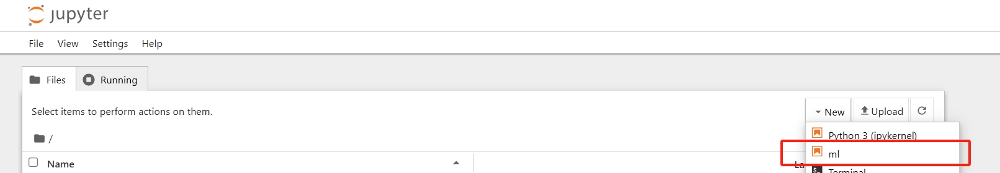
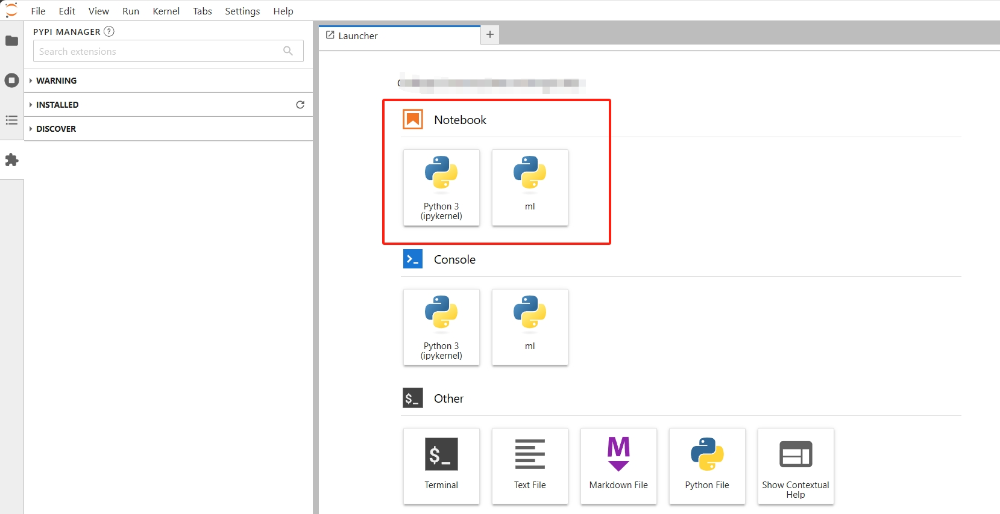
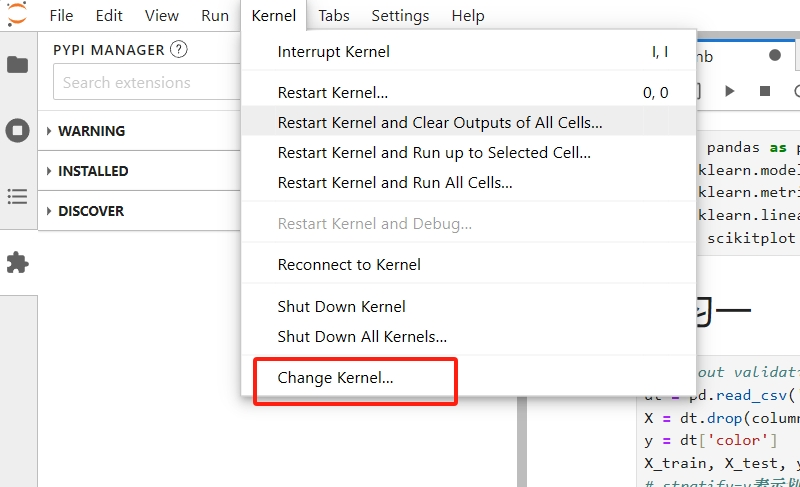
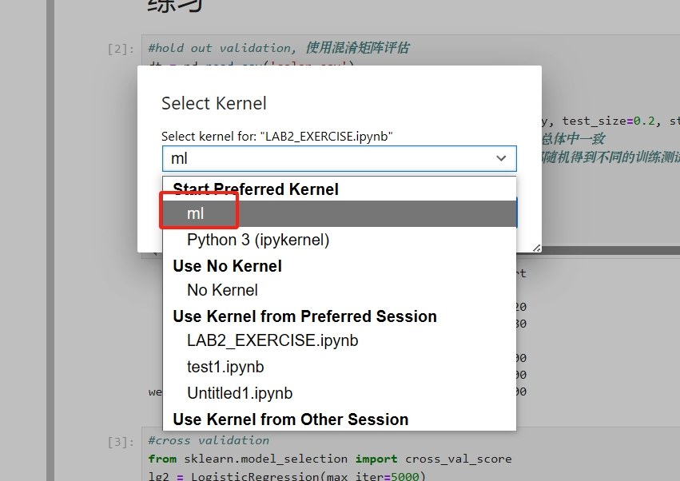
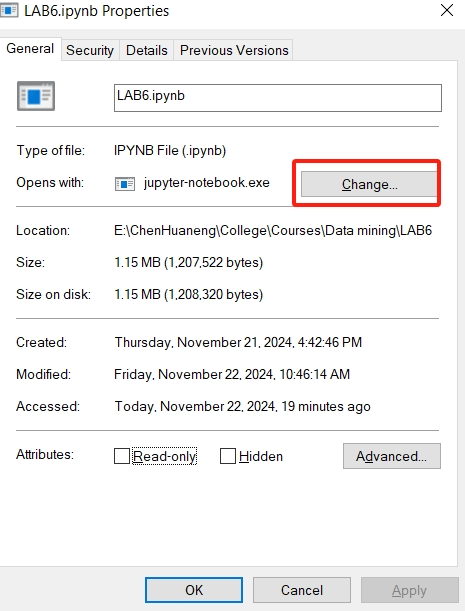

## 环境配置

### 创建虚拟环境

由于较新的版本可能出现部分库不兼容的问题，因此本文采用 `Python 3.8`，推荐使用 `Conda` 来隔离不同的 `Python` 环境，方便后面出现问题进行调试。

首先在 `Conda` 中创建一个名为 `ml` 的新环境，激活环境并安装一些机器学习常用的库。

```shell
conda create --name ml python=3.8
conda activate ml
conda install numpy pandas scikit-learn scikit-plot jupyterlab
```

这里可以安装 `Jupyter Notebook` 也可以安装 `JupyterLab`（`Jupyter notebook` 的更加现代化的版本）。

### `Jupyter Notebook` 可视化切换虚拟环境

鉴于每次启用虚拟环境都需要进行繁琐的命令行操作，下面介绍一个可以实现打开 `Jupyter notebook` 之后切换虚拟环境的办法。

首先按照前面说明的方法创建虚拟环境 `ml` 并启动虚拟环境 `conda activate ml`，接下来的操作都需要在这个虚拟环境中执行：

```shell
conda install ipykernel
python -m ipykernel install --name <虚拟环境的名字，如ml> --display-name <你想显示的名称，比如"machine learning">
```

接下来就可以直接打开 `Jupyter notebook` 直接切换虚拟环境了。



同样，在 `Jupyter Lab` 中也可以直接切换虚拟环境：

新建一个在 `ml` 虚拟环境下的新 `.ipynb` 文件，默认在当前目录下新建。



在已有的 `.ipynb` 文件下切换内核。





### 如何将多个 `.ipynb` 文件合成一个 `.ipynb` 文件

首先安装 `nbmerge` 包：
```shell
conda install nbmerge
```

然后执行：

```shell
nbmerge a.ipynb b.ipynb c.ipynb > merge.ipynb
```

在这里演示合并 `a.ipynb`，`b.ipynb`，`c.ipynb` 文件成为 `merge.ipynb` 文件，合并的个数不限，但是至少需要两个。

### `Conda` 的基本使用

`Conda` 是一个开源的包管理系统和环境管理器，常用于管理 `Python` 和 `R` 语言的依赖包和虚拟环境（展开下面的折叠块查看常用的命令）。



检查 `Conda` 版本：

```bash
conda --version
```

获取帮助：

```bash
conda --help
```

可以通过 `conda create` 命令创建虚拟环境，并指定 Python 版本：

> 注意：可以不在当前目录下激活之前创建的环境，在当前目录下创建环境只是意味着这个环境的配置存储在当前目录下。

```bash
conda create --name myenv python=3.8
```

在创建环境后，可以通过以下命令激活环境：

```bash
conda activate myenv
```

要退出当前激活的环境，使用以下命令：

```bash
conda deactivate
```

如果想删除某个环境，可以使用以下命令：

```bash
conda remove --name myenv --all
```

查看系统上所有的 `Conda` 环境：

```bash
conda env list
```

要在当前激活的环境中安装一个包（如 `numpy`），使用以下命令：

```bash
conda install numpy
```

还可以指定安装包的版本：

```bash
conda install numpy=1.21
```

使用以下命令查看当前环境中已安装的包：

```bash
conda list
```

可以使用 `conda update` 命令升级指定的包：

```bash
conda update numpy
```

也可以升级当前环境下所有的包：

```bash
conda update --all
```

如果需要删除某个包，使用以下命令：

```bash
conda remove numpy
```

可以使用以下命令查找特定包：

```bash
conda search package_name
```

可以将环境的配置导出为 `YAML` 文件，方便在其他设备上重现相同环境：

```bash
conda env export > environment.yml
```

在新设备上，可以使用 `YAML` 文件重新创建环境：

```bash
conda env create -f environment.yml
```

可以克隆已有的环境：

```bash
conda create --name newenv --clone oldenv
```

要更新 `conda` 本身，使用以下命令：

```bash
conda update conda
```

`Conda` 会在安装和更新时缓存一些文件，使用以下命令可以清理它们：

```bash
conda clean --all
```



### 利用 `CUDA` 进行GPU加速

用 CPU 进行机器学习速度比较慢，可以考虑利用 GPU 进行加速，以下是可以参考的安装教程：

- [CUDA与CUDNN在Windows下的安装与配置（超级详细版）_cudnn安装windows-CSDN博客](https://blog.csdn.net/YYDS_WV/article/details/137825313)

- [全网最详细的安装pytorch GPU方法，一次安装成功！！包括安装失败后的处理方法！-CSDN博客](https://blog.csdn.net/qlkaicx/article/details/134577555)

> 注意：如果下载 `Pytorch` 要记得下载对应于 `CUDA` 的版本，一般是向下兼容的。

### 双击 `.ipynb` 文件直接进入Jupyter编辑界面，无需调整文件目录的方法

右键点击任意的 `.ipynb` 文件的属性页面，更改默认的打开方式。



搜索找到 Anaconda 的安装文件夹，我个人安装的路径是：

```bash
D:\Scoop\apps\anaconda3\current\App\Scripts\jupyter-notebook.exe
```

在Scripts文件夹中有一个 `jupyter-notebook.exe`，选择其作为默认打开方式。之后打开任何 `.ipynb` 文件只需直接双击该文件就会进入浏览器的文件工作界面。

### 将 Jupyter Notebook 文件转换为各种格式的文件

在命令行中输入：

```bash
jupyter nbconvert --to script filename.ipynb
```

就可以把 Jupyter Notebook 文件转换为 `.py` 文件，其中 `filename.ipynb` 是要转换的 Jupyter Notebook 文件名。执行后就会在当前目录下生成和 Jupyter Notebook 同名的 `.py` 文件，该文件包含了 Jupyter Notebook 中所有的代码。

如果要将 Jupyter Notebook 文件转换为其他格式，可以将 `--to` 参数替换为相应的格式，比如转换为 `.pdf` 的命令：

```bash
jupyter nbconvert --to pdf filename.ipynb
```

更多的命令可以用下面的命令查看：

```bash
jupyter nbconvert --help
```


