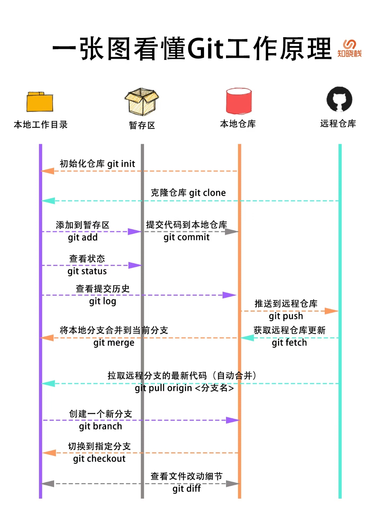

## 学习 Git

视频教程：

- [尚硅谷新版Git快速入门(3h迅速掌握git)_哔哩哔哩_bilibili](https://www.bilibili.com/video/BV1wm4y1z7Dg/?spm_id_from=0.0.favlist.content.click&vd_source=8f6ac8ba344f8ea3b071481f41e2ce0d) 适合新手快速入门
- [Version Control (Git) · Missing Semester](https://missing.csail.mit.edu/2020/version-control/) 适合有一定计算机基础之后再看，国内观看：[[自制双语字幕\] 计算机教育缺失的一课(2020) - 第1讲 - 课程概览与 shell_哔哩哔哩_bilibili](https://www.bilibili.com/video/BV1uc411N7eK/?spm_id_from=0.0.favlist.content.click&vd_source=8f6ac8ba344f8ea3b071481f41e2ce0d) 或者 [【中字】The Missing Semester 第1讲 - 课程概览与 Shell - MIT 公开课(2020)_哔哩哔哩_bilibili](https://www.bilibili.com/video/BV1Eo4y1d7KZ/?spm_id_from=0.0.favlist.content.click&vd_source=8f6ac8ba344f8ea3b071481f41e2ce0d)

推荐的书籍和图文：

- [Git](https://git-scm.com/book/en/v2) 权威指南，中文版：[progit/progit2-zh](https://github.com/progit/progit2-zh)
- [简介 - Git教程 - 廖雪峰的官方网站](https://liaoxuefeng.com/books/git/introduction/index.html)
- [Simple Git tutorial for beginners | Nulab](https://nulab.com/zh-cn/learn/software-development/git-tutorial/)
- [pcottle/learnGitBranching: An interactive git visualization and tutorial. Aspiring students of git can use this app to educate and challenge themselves towards mastery of git!](https://github.com/pcottle/learnGitBranching) 玩游戏的方式学 Git

## Git 使用指南



### Git 如何推送当前目录到远程仓库

1. 初始化本地仓库为`Git` 仓库：在项目根目录下运行命令 `git init` ，这会创建一个 `.git` 目录，把当前目录变成一个 `Git` 仓库。

2. 添加文件到暂存区：可以用 `git add .` 命令将项目中的所有文件添加到 `Git` 的暂存区，也可以指定特定的文件 `git add <文件名>`。

3. 提交更改：使用命令 `git commit -m "提交内容的描述"` 提交暂存区中的更改到本地仓库，`-m` 后面的内容是提交的说明，描述此次提交的变更。

4. 连接远程仓库：获取远程仓库的 URL 地址，比如 GitHub 上仓库的 HTTPS 或 SSH 地址（当然需要提前先在远程建立一个仓库），然后使用命令 `git remote add origin <远程仓库URL>` 将本地仓库与远程仓库（如 `GitHub` 、`GitLab` 等）进行连接。`origin` 是远程仓库的默认名称，也可以指定为其他名称。

5. 拉取远程更新（当远程仓库和本地仓库的内容不一致的时候需要先拉取远程仓库的内容）：使用命令 `git pull origin main --rebase` 同步远程仓库（`origin`）的主分支 `main` 中的代码到本地。一般远程仓库的主分支叫 `main` 或者 `master` （`Github` 默认是 `main` ）。

   > 关于 `merge` 和 `rebase` 的区别可以参考：[Git：图解 merge 和 rebase 的区别 - 知乎 (zhihu.com)](https://zhuanlan.zhihu.com/p/686538265)

6. 推送本地代码到远程仓库：使用命令 `git push -u origin main` 将本地的代码推送到远程仓库的指定分支（通常是 `main` 或者 `master`）。 

   > 当使用 `git push -u origin <branch>` 之后，本地的 `<branch>` 分支会与远程的 `<branch>` 分支建立跟踪关系。此后，Git 记住你推送的远程仓库和分支，因此以后只需要运行 `git push`，而无需再次指定远程仓库和分支。同样，拉取时也可以使用简化后的命令 `git pull`。所以只有第一次推送时需要添加 `-u origin main` 参数。

### .gitignore 如何添加已经 commit 过的文件到不追踪规则中

首先删除 track 的文件（已经 commit 的文件）：

```shell
git rm -r --cached <file name>
```

`<file name>` 代表要取消 commit 的文件，接受多个参数，比如要取消追踪 `test.py` 文件和 `hello` 文件夹可以这样：

```shell
git rm -r --cached test.py hello
```

然后在 .gitignore 文件中添加 ignore 条目，比如：`test.py` 和 `hello`，然后提交 .gitignore 文件：

```shell
git commit -a -m "delete some unused file."
```

### 如何丢弃现有的更改退回到最近一次提交

要丢弃所有未暂存的修改，将工作目录恢复到最近一次提交的状态，按照以下步骤操作：

丢弃工作目录所有修改（保留未跟踪文件）

   ```bash
git restore .   # Git 2.23+ 推荐方式（最安全）
   ```

这会丢弃所有已跟踪文件（tracked files）的修改，恢复到最近一次 `git commit` 的状态。未跟踪的文件（Untracked files）不会被删除（如新创建的文件）。

如果还需删除未跟踪的文件/目录（如新增的无用文件）

   ```bash
git clean -df   # 删除未跟踪文件/目录（强制删除）
   ```

注意事项：

- 不可恢复：这些操作会永久丢弃本地修改，确认不需要这些更改后再执行。

- 检查状态：操作前建议先用 `git status` 查看修改内容，确认无误再执行。

- 暂存区的修改：如果文件已 `git add`（在暂存区），先用

  ```bash
  git reset -- .   # 将暂存区文件移出（但保留工作目录修改）
  ```

  然后再执行 `git restore .`

### Git 嵌套 Git[^1][^2]

[^1]: [Git嵌套Git仓库|极客教程](https://geek-docs.com/git/git-questions/1152_git_nested_git_repositories.html)
[^2]: [[toolschain\] 怎么运用git 嵌套git 管理（子文件夹中也有个git） 并且如何简单设置使用repo的笔记 本文是求助GPT的记录 实践有用-CSDN博客](https://blog.csdn.net/weixin_46479223/article/details/134838519)

**添加子模块**：需要将子模块添加到主项目中。可以通过`git submodule add <仓库URL> <子模块路径>`命令完成。例如，假设我们的子模块是一个名为`common`的库，并且需要放在主项目的`libs`目录下，那么可以使用以下命令：

```bash
git submodule add https://github.com/example/common.git libs/common
```

或者添加和 `common` 平级目录下的 `example` 库：

```bash
git submodule add https://github.com/example/common.git example
```

**初始化和更新子模块**：添加子模块后，我们需要初始化和更新子模块。可以通过以下两个命令完成：

- `git submodule init`：用于初始化子模块，只需要运行一次。
- `git submodule update`：用于更新子模块，可以在每次子模块发生变化时运行。

**提交和同步变更**：当子模块有变更时，我们需要在主项目中提交和同步这些变更。可以通过以下命令完成：

- `git add <子模块路径>`：用于将子模块的变更添加到主项目中。
- `git commit -m "Update submodule"`：用于提交变更。
- `git submodule update --remote`：用于同步子模块的最新变更。

## Lazygit

当然，如果觉得 Git 要一直输入命令好麻烦，还有一个适合命令行的 [Lazygit](https://github.com/jesseduffield/lazygit?tab=readme-ov-file) 非常推荐，适合像我一样不喜欢自己输入这种重复命令的同学使用。

安装了 Lazygit 之后在命令行中输入 `lazygit` 就可以启动了。

在启动 Lazygit 并提示“未在 Git 仓库中”时，它允许你直接在当前目录下创建一个新的 Git 仓库。可以按照以下步骤完成初始化：

1. 创建新 Git 仓库：当 Lazygit 提示是否要创建一个新的 Git 仓库时，输入 `y` 并按回车键。

2. 设置分支名称：Lazygit 会询问你要设置的分支名称。可以选择：
   - 留空：直接按回车，将使用 Git 的默认分支名称（一般是 `main` 或 `master`，取决于 Git 配置）。
   - 自定义名称：输入自定义分支名称并按回车。

完成这两步后，Lazygit 会创建一个新的 Git 仓库，并切换到你指定的分支名称，接着你就可以正常使用 Lazygit 进行文件暂存、提交、推送等操作了。

Lazygit 提供了快捷键操作，常见的有以下几个：

- **`↑ / ↓`**：上下移动光标，选择不同文件或提交记录。
- **`Enter`**：查看详细内容（如文件变更或提交详情）。
- **`Space`**：暂存/取消暂存文件。
- **`a`**：暂存所有修改。
- **`c`**：打开提交消息输入界面，完成后保存提交。
- **`P`**：推送代码到远程仓库。
- **`f`**、**`p`**：从远程仓库拉取代码。
- **`b`**：切换或新建分支。
- **`q`**：退出 Lazygit。
- **`?`**：查看所有快捷键说明。
