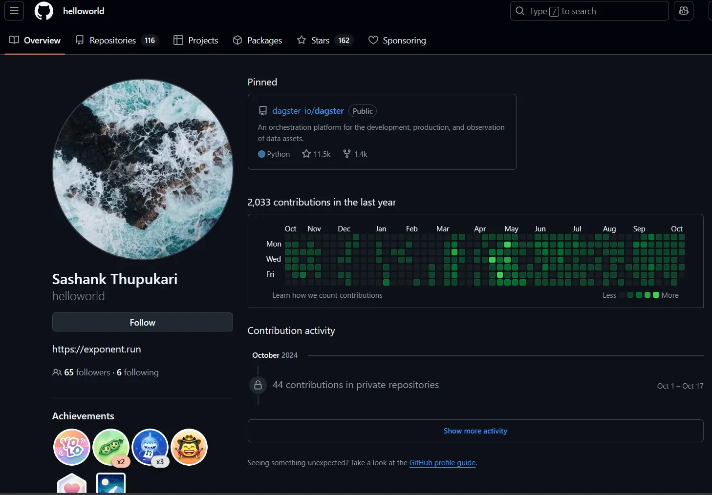
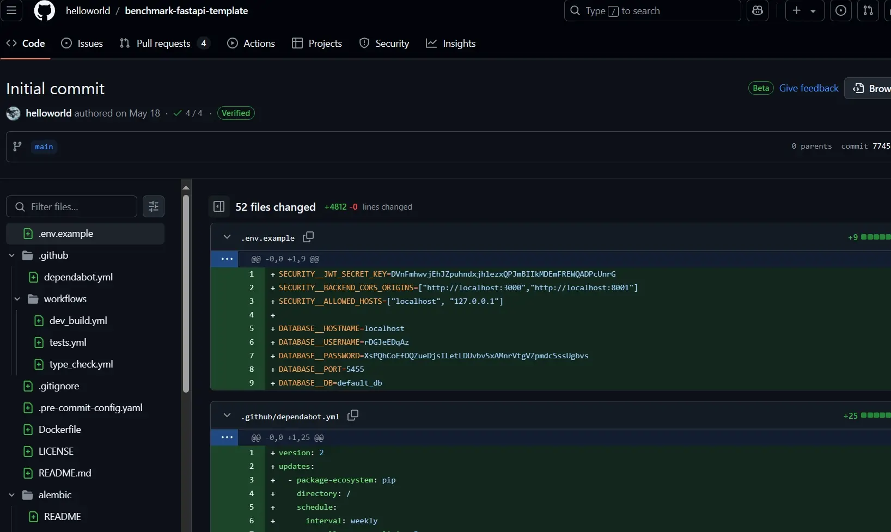
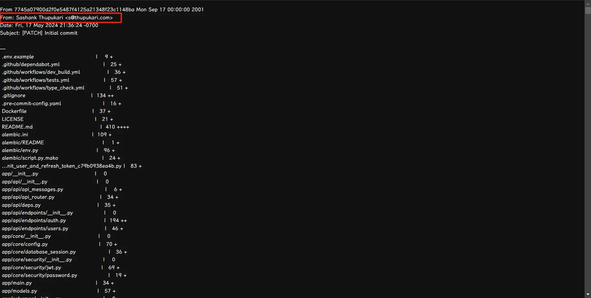
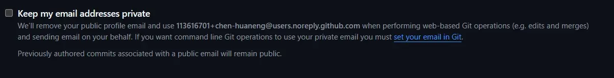
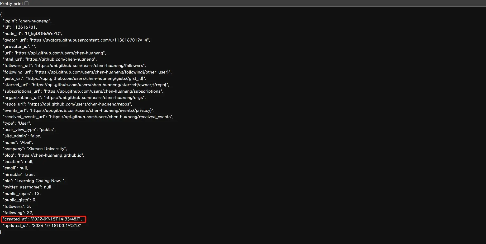

## `GitHub` 使用技巧

### 如何根据 `GitHub` 用户的名称找到邮箱[^1]

[^1]:[一日一技：如何找到Github用户的邮箱？ | 谢乾坤 | Kingname](https://kingname.info/2024/06/02/find-email-of-github/)

有时候会遇到这样的情况，当你找到一个很不错的项目的时候，想和开发者交流一些相关的问题。于是你找到该用户的主页，一般情况下，开发者会在 `GitHub` 主页留下自己的联系邮箱，如下图所示，这是我的 `GitHub` 个人主页：

但是有的开发者不会留邮箱，比如：

这种情况下你可以发 Issus，但是这样别人也会看到，但是还有一个更隐蔽的方法，可以拿到这个开发者的邮箱。

首先，找到这个开发者的一个Repo，随便找一条Commit记录：

这个Commit对应的链接是 `https://github.com/helloworld/benchmark-fastapi-template/commit/7745a07900d2f0e5487f4125a21348f23c1148ba` ，现在只需要在这个链接的末尾加上 `.patch` ，变成 `https://github.com/helloworld/benchmark-fastapi-template/commit/7745a07900d2f0e5487f4125a21348f23c1148ba.patch` 就可以看到纯文本形式的Commit记录。而开发者的邮箱就在上面。

如果开发者设置了邮箱不可见的选项，就可能看不到邮箱，但是可以通过找Repo里面最早的提交记录来获取，也许有机会在开发者刚开始Commit的时候还没有设置邮箱不可见，如果还是不能成功，还是发Issue或者通过其他渠道获取吧。

> 注意：如果自己设置了邮箱不可见，记得在本地的 `Git` 中设置 `git config --global user.email "username@users.noreply.github.com"`，如果在设置之前提交了还要记得重置上次提交的作者信息 `git commit --amend --reset-authorc`，否则远程仓库会拒绝提交[^2]。

[^2]: [github启用了隐私邮箱后如何git push-腾讯云开发者社区-腾讯云 (tencent.com)](https://cloud.tencent.com/developer/article/1835148)

### 如何查看 `GitHub` 用户的注册时间[^3][^4]

[^3]:[Getting started with the REST API - GitHub Docs](https://docs.github.com/en/rest/using-the-rest-api/getting-started-with-the-rest-api?apiVersion=2022-11-28#rate-limiting)
[^4]:[Setting your commit email address - GitHub Docs](https://docs.github.com/en/account-and-profile/setting-up-and-managing-your-personal-account-on-github/managing-email-preferences/setting-your-commit-email-address)

1. 打开一个新的浏览器标签页，输入以下链接：`https://api.github.com/users/{your-username}`，将 `{your-username}` 替换成 `GitHub` 用户名。
2. 按下回车键后，会得到一个JSON格式的返回结果。
3. 在返回结果中，可以找到一个 `created_at` 字段，值就是用户注册时间。

### 如何美化 `GitHub` 个人主页

- [超详细的 GitHub 个人主页美化教程 - peterjxl - 博客园 (cnblogs.com)](https://www.cnblogs.com/PeterJXL/p/18437094)

### 管理版本和维护Changelog的最佳实践

如何给版本命名可以参考[Semantic Versioning 2.0.0 | Semantic Versioning](https://semver.org/)，如何维护良好的Changelog可以参考[Keep a Changelog](https://keepachangelog.com/en/1.0.0/)。

