### Windows Users用户目录下看不到自己当前用户文件夹[^1]

[^1]: [解决windows Users用户目录下看不到自己的问题_用户不在目录中-CSDN博客](https://blog.csdn.net/weixin_43031092/article/details/109115922)

一般来说，在 `C:\Users` 这个路径下应该有一个当前用户的文件夹，比如在下面的图中应该有一个 `Abel` 的文件夹，并且查看选项中已经勾选了显示隐藏文件这一个选项：

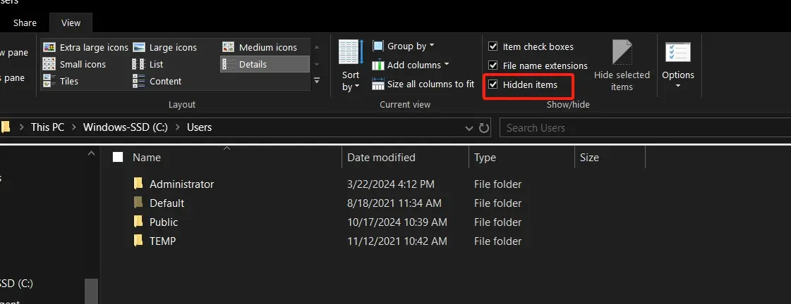

在查看菜单最右边有一个选项，单击打开“文件夹选项”，选中“查看”一栏，在高级设置里取消勾选“隐藏受操作系统保护的文件”，应用后就能看到自己的用户文件夹，最后选择确定。

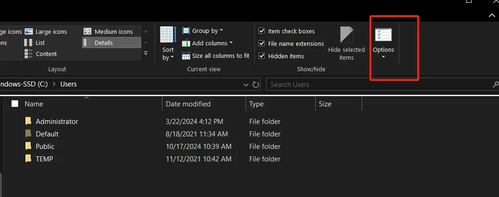

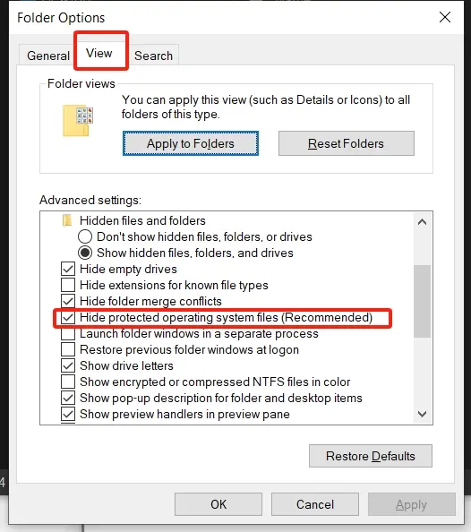

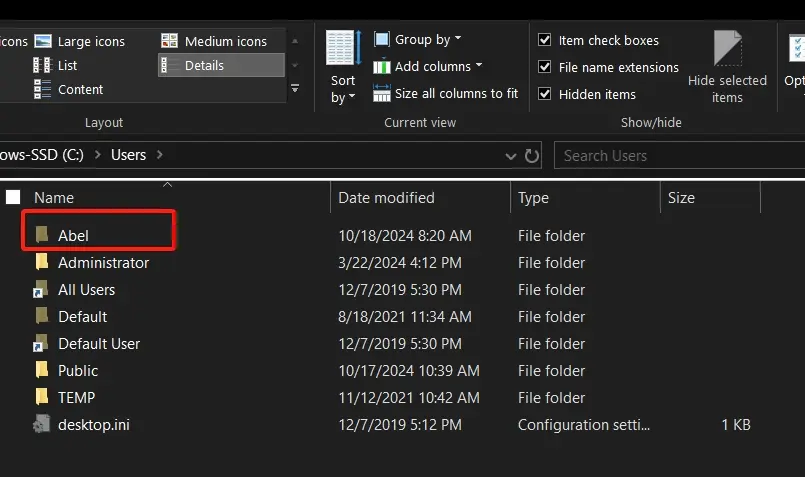

> 提示：找到你想要的文件做好修改之后最后还是把这些文件隐藏显示会安全一点。

### 重定向桌面路径和下载路径时不小心将下载路径和桌面路径合并了[^2][^3]

[^2]:[windows桌面和下载成一个文件夹了，怎么分开? - 知乎 (zhihu.com)](https://www.zhihu.com/question/457965061)
[^3]: [不小心把桌面路径改成下载路径了现在下载文件夹变桌面文件夹了 - Microsoft Community](https://answers.microsoft.com/zh-hans/windows/forum/all/不小心把桌/f8a784af-a6d5-47c3-9f4a-0b40f1bdba41)

在系统C盘存储不够时，我们常常会把系统自带的文件路径移动到除C盘以外的其他盘去，但是一不小心就将文件移动到其他盘的根路径去了，这时候再通过简单的更换路径是更换不了的，系统这些自带的桌面、下载、图片、文档、音乐、视频本身就是一个文件夹，只是windows系统将他们单独拿出来方便大家使用。

这里是将下载的路径移动到C盘根路径去了，再次通过`右键->属性->位置`移动到其他路径各种报错。

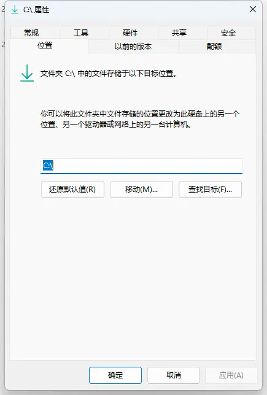

我们本身已经将下载位置移动到C盘根路径了，再次右键打开的属性已经是C盘磁盘分区的属性了，修改磁盘分区的路径本身就是一种错误的操作，解决思路是通过修改注册表直接修改下载的文件存储位置。

1. 按 `Win + R` 调出命令行运行窗口，输入 `regedit` 并按回车。
2. 在弹出的注册表窗口里，打开下面路径 `计算机\HKEY_CURRENT_USER\SOFTWARE\Microsoft\Windows\CurrentVersion\Explorer\User Shell Folders` ，直接将路径复制上去打开也可以。
3. 找到下载对应的ID串需要修改的项，修改对应值为你要设置的路径位置。

具体ID对应的名称如下：

```mysql
{F42EE2D3-909F-4907-8871-4C22FC0BF756}  Document文档
{A0C69A99-21C8-4671-8703-7934162FCF1D}  Music音乐
{7d83ee9b-2244-4e70-b1f5-5393042af1e4}  Downloads下载
{374DE290-123F-4565-9164-39C4925E467B}  Downloads下载
{754AC886-DF64-4CBA-86B5-F7FBF4FBCEF5}  Desktop桌面
{35286A68-3C57-41A1-BBB1-0EAE73D76C95}  Videos视频
{0DDD015D-B06C-45D5-8C4C-F59713854639}  Pictures图片
```

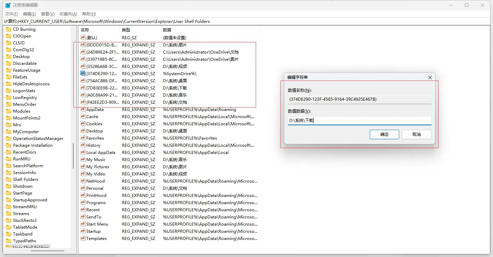

最后重启电脑即可。

### C 盘太满了怎么办[^4]

[^4]: [没有在C盘装东西，桌面也没文件，为什么C盘莫名其妙就满了？ - 知乎 (zhihu.com)](https://www.zhihu.com/question/456677257/answer/1899626991)

**清理系统文件**

右键系统 C 盘，然后选择：属性、磁盘清理、点击”清理系统文件“、然后在“以前的 Windows 安装”及“临时 Windows 安装文件”选项打勾并进行清理。

**清理系统更新文件**

1. Win + R 键打开运行窗口输入 `services.msc`
2. 找到 WindowsUpdate 服务项，右键选择禁用
3. 打开 `C:\Windows\SoftwareDistribution`，可以删除 DataStore 和 Download 文件夹下的所有临时更新文件
4. 按照 1. 2. 的步骤重新开启 WindowsUpdate 服务项

**转移各种应用数据，2~40G**

Windows 从 Vista 开始引入 UAC 后，默认情况下应用程序运行时不允许修改默认程序安装目录下(“C:\Program Files”和“C:\Program Files(x86)”)的文件。因此应用程序运行时如果需要保存部分数据到硬盘中，通常放在“C:\ProgramData”（不区分用户，一般来说很小）或者“C:\Users\<用户登录名>\AppData”下。

根据安装的具体应用以及应用使用情况，应用安装运行一段时间后，“C:\Users\<用户登录名>\AppData”这个文件的大小通常在2G以上，上限可能会很大。例如Android Studio，默认会把SDK和AVD放在这个目录下，使用多个模拟器的话可能会占用数十G空间。

某些软件可以自行设定数据文件的保存位置，一劳永逸的办法是把AppData放到其它分区，并且创建目录链接到原位置。具体操作：

- **按住Shift键重启系统，进入高级选项。然后选择“疑难解答”、“高级选项”、“命令提示符”，进入命令行模式。**
- **按住Shift键重启系统，进入高级选项。然后选择“疑难解答”、“高级选项”、“命令提示符”，进入命令行模式。**
- **按住Shift键重启系统，进入高级选项。然后选择“疑难解答”、“高级选项”、“命令提示符”，进入命令行模式。**
- 然后顺序输入以下命令，尖括号中的内容根据实际情况替换：

```cmd
mkdir <d:\登录名>
robocopy C:\Users\<登录名>\AppData <d:\登录名>\AppData /e /copyall /move /sl /r:1 /w:1
rmdir C:\Users\<登录名>\AppData
mklink /j C:\Users\<登录名>\AppData <d:\登录名>\AppData
```

关闭命令行窗口，正常重启进入Windows。

**转移各种软件的安装包，1~10G**

很多使用MSI安装包的软件，安装时Windows会把整个MSI缓存一份到“C:\Windows\Installer”目录下，以便将来修复重装软件、增删可选软件模块、卸载软件时使用。有些软件的MSI包非常大，一个就几百兆甚至数GB，尤其是微软自家软件的补丁安装包，累积下来整个目录占用了十几G不少见。

这个文件夹直接删除里面的msi/msp文件不会影响系统和软件运行，但修复重装软件、增删可选软件模块、卸载软件的时候会出错。所以建议移动到其它分区，如果电脑同时安装有固态硬盘和大容量的机械硬盘，可以移动到机械键盘上的分区以免占用宝贵的固态硬盘空间，毕竟这些文件访问频率很低。具体操作：

- **按住Shift键重启系统，进入高级选项。然后选择“疑难解答”、“高级选项”、“命令提示符”，进入命令行模式。**
- **按住Shift键重启系统，进入高级选项。然后选择“疑难解答”、“高级选项”、“命令提示符”，进入命令行模式。**
- **按住Shift键重启系统，进入高级选项。然后选择“疑难解答”、“高级选项”、“命令提示符”，进入命令行模式。**
- 然后顺序输入以下命令，尖括号中的内容根据实际情况替换：

```cmd
mkdir <e:\Backup>
robocopy C:\Windows\Installer <e:\Backup>\Installer /e /copyall /move /sl /r:1 /w:1
rmdir C:\Windows\Installer
mklink /j C:\Windows\Installer <e:\Backup>\Installer
```

关闭命令行窗口，正常重启进入Windows。

**更改默认的数据存放路径：文档、桌面、图片、音乐、视频、下载**

这几个文件夹，也会经常被一些软件作为默认的数据存储位置。例如微信、QQ，默认把聊天记录、接收到的文件存放在文档里面，使用时间长了，又经常在一些群里面还有那么几个人天天发表情包、福利图、转发视频的话，也会占用大量空间。不过这几个文件夹的转移很方便，右键点击，属性，位置，移动就可以了。如果是全新的电脑，并且系统是Win10的话，直接在设置、系统、存储、更改新内容的保存位置，在这里操作会更方便一点。

### Microsoft Edge 浏览器更新一直显示“正在进行更新，请等待几分钟”的解决方法

按下 Win 徽标键，直接键入 `services` 或者 `服务` 打开第一个：

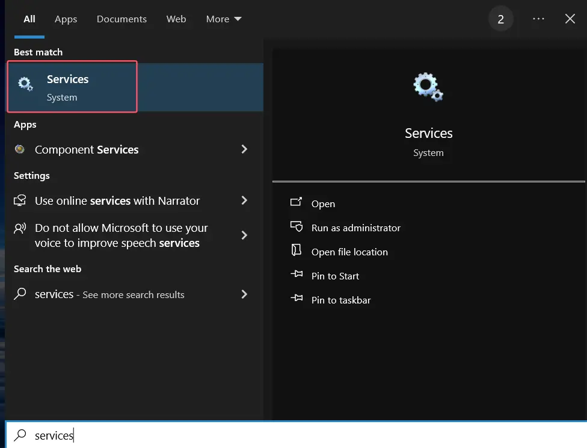

找到跟 Microsoft Edge 更新有关的两个选项，右键选择属性，将启动类型改为自动，重新更新 Edge 即可：

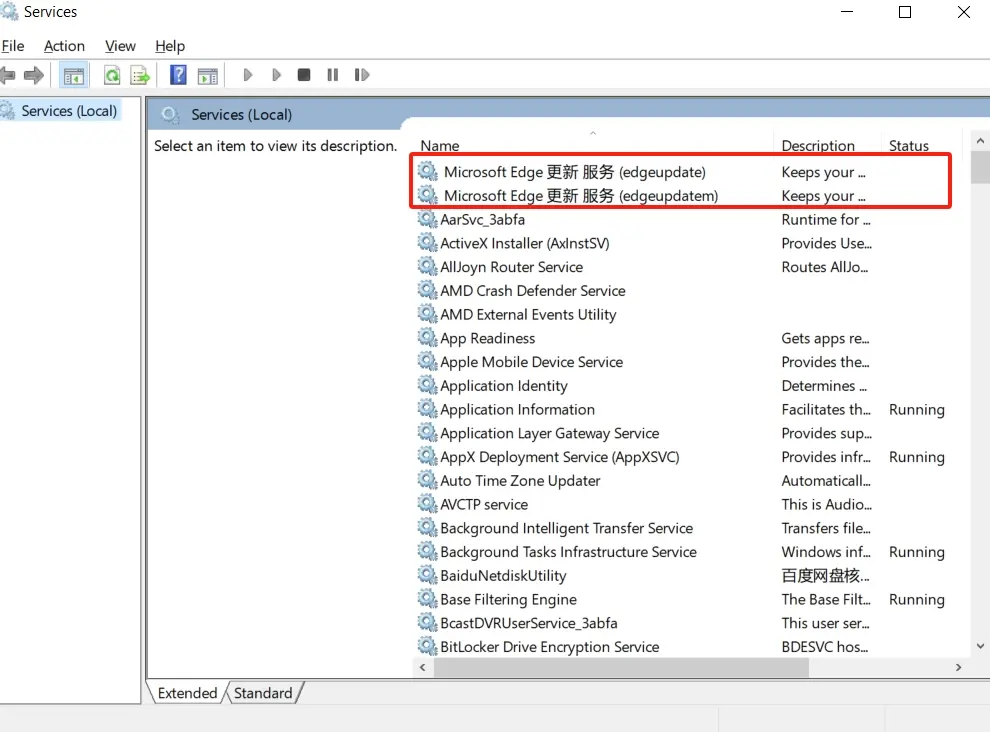

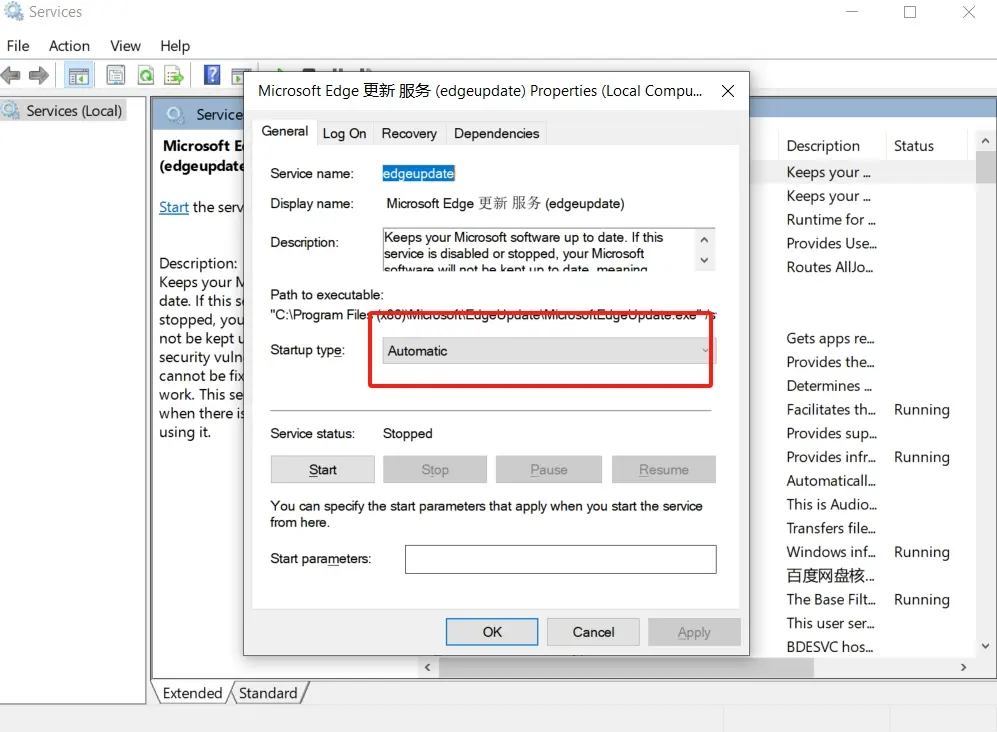

### 添加软件到开机自启

在运行输入框中输入 `shell:startup` 命令后点击确定。打开系统启动项目文件夹。

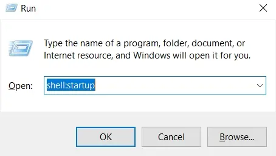

把要添加的程序快捷方式拖到该文件夹下即可。

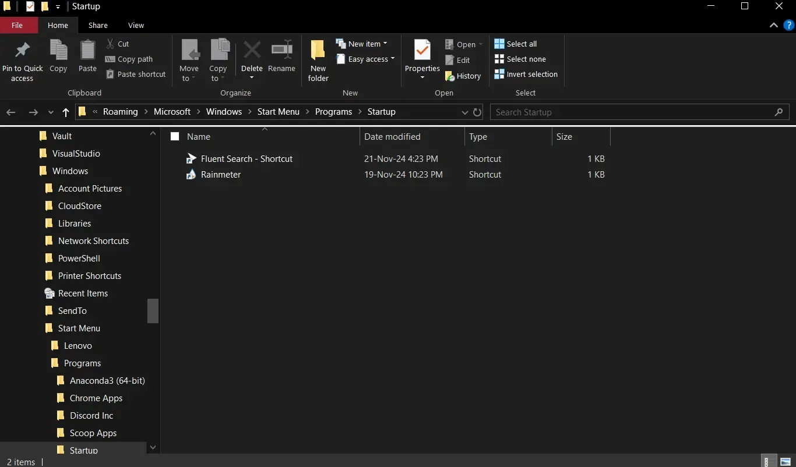

### 关闭 Windows 的自动更新

打开注册表：Win + R，输入 `regedit` 回车，在注册表编辑界面找到路径：

```text
\HKEY_LOCAL_MACHINE\SOFTWARE\Microsoft\WindowsUpdate\UX\Settings
```

看到这里面有几个参数设置选项：

- PauseFeatureUpdatesEndTime
- PauseQualityUpdatesEndTime
- PauseUpdatesExpiryTime

分布双击这 3 个选项，在弹出的编辑框里，把日期的年份，直接修改到想要暂停更新的年份，比如想暂停到 2035 年，那就输入 `2035`。

### C 盘中几个目录的用途说明

- **C:\\Program Files**，64 位的软件安装目录，所有用户都能使用，程序安装到这里需要管理员权限。若程序数据也写在这个目录下，软件每次启动都会要求授予管理员权限，存在很大的安全隐患。
- **C:\\Program Files(x86)**， 和上面的一样，只是该目录用于存放 32 位的应用。
- **C:\\Users\\用户名\\AppData\\Roaming**，通过环境变量 %AppData% 可以访问，这里用来存放当前登录用户所产生的数据，对其他的用户不可见。如果你在公司网络，加入了域，这个文件夹会通过网路同步，让你的数据在不同的计算机上漫游。该目录常被滥用。
- **C:\\Users\\用户名\\AppData\\Local**，通过环境变量 %LocalAppData% 可以访问，这个目录和上面的基本一样，不过仅限本地，加入了域也不会同步。一般情况下，如果不加入域，Roaming 和 Local 并没有什么区别，但是需要网络同步的时候，尽量把不必要的数据留在本地。个人使用的软件可以装在 C:\\Users\\用户名\\AppData\\Local\\Programs 下面 。
- **C:\\ProgramData**，和 AppData 的区别在于，这里存放的数据是公用的，如果你希望软件的数据在所有的用户之间保持一致，那么程序生成的数据应当存放在这里。
- **C:\\Users\\用户名**，用户的家目录。Linux 和 MacOS 用户应该很熟悉，所有个人数据都应该放在家目录下。一些跨平台软件喜欢在这里写数据，并生成一堆文件名以 `.` 开头的文件，这在 Linux 下是隐藏文件，但 Windows 文件管理器并不按这个逻辑处理，用户只能主动给所有点号开的文件加上隐藏属性，并文件管理器里设置成不显示。
- **C:\\Users\\用户名\\Documents**，又称我的文档。看名字就知道，这里存放的是用户主动保存的数据。比如各种文稿，照片，音乐，视频，档案 之类的。有的软件会无脑把程序数据写在这里，导致文档目录混乱。有些数据（日志、配置、缓存数据）是给软件服务的，用户无法直接使用这些文件，那么这些数据就应该放到 AppData 下面去。

关于软件安装和数据存放的位置，取决于软件开发者和安装包制作工具的设定。希望所有的开发者都遵循规范，做到程序和数据分离，不要在程序安装目录下写数据，更不要把数据写到 `C:\` 根目录下，简直是灾难。将程序和数据放在正确的位置，数据备份和软件升级也会更容易。

