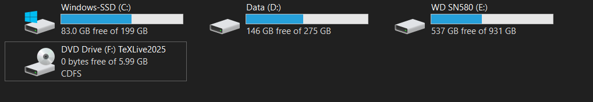
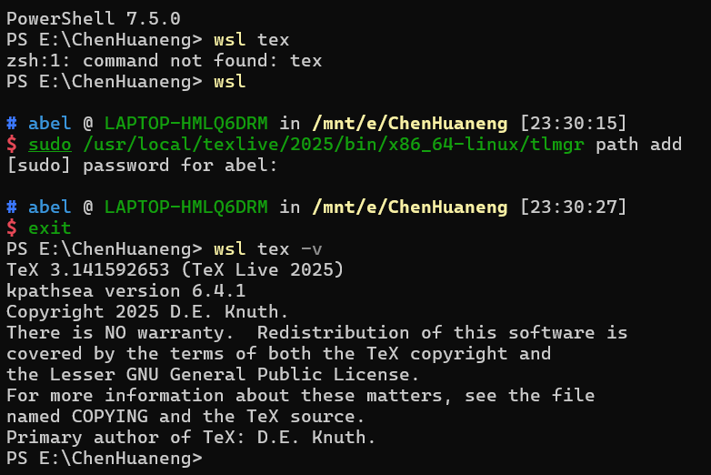

## Windows 10 安装 $\TeX\, Live$

### 环境说明

这里主要针对 Windows 10环境进行安装 $\TeX\, Live$，关于其他的 $\LaTeX$ 发行版和不同安装环境可以参考以下链接：

- [texlive-zh-cn.pdf (tug.org) ](https://tug.org/texlive/doc/texlive-zh-cn/texlive-zh-cn.pdf)- $\TeX\,Live$ 指南
- [install-latex-guide-zh-cn.pdf (ctan.org)](https://tug.ctan.org/info/install-latex-guide-zh-cn/install-latex-guide-zh-cn.pdf) - 一份简短的关于 $\LaTeX$ 安装的介绍
- [TeX Live - TeX Users Group (tug.org)](https://tug.org/texlive/) - 官方文档

如果不清楚想要安装什么发行版，可以先阅读上面给出的文档，里面有关于发行版之间的区别。

### 卸载旧 $\TeX \, Live$ 的版本

在跨版本升级 $\TeX\, Live$ 时，由于在 Windows 10 下没有类 Unix 的升级程序，需要进行重新安装。下面介绍几种卸载方法。

#### 使用批处理文件

如果之前已经安装过 $\TeX \, Live$，需要先卸载当前的版本，下载新版本，我这里已经安装了 $\TeX \, Live\, 2023$，我想要安装 $\TeX \, Live\, 2024$，所以要先进行卸载，如果之前没有安装过可以跳过这一步。

在这里参考[文档](https://tug.ctan.org/info/install-latex-guide-zh-cn/install-latex-guide-zh-cn.pdf)1.2节的内容进行操作：

命令行执行：

```powershell
kpsewhich -var-value TEXMFROOT
```

可以查看 TEXMFROOT 的值，该值即为 $\TeX\, Live$ 的安装路径，接下来执行安装路径中的卸载批处理文件即可执行卸载，如默认安装时执行：

```powershell
C:\texlive\2024\tlpkg\installer\uninst.bat
```

> 需要注意的点：
>
> - 这里可能存在两个 `uninst.bat`，先点击 `uninst.bat` 再点击 `uninst2.bat`
> - 如果没有任何反应，需要你在命令操作界面随机点击一个按键开始卸载程序

然后就静静等待卸载结束了。结束以上步骤后，手动删除用户文件夹[^1]中的 .texlive2024。

[^1]: 用户文件夹一般是指当前计算机系统为多用户环境专设的不同用户所各自私有的文件夹，比如我的用户名叫 `Beta`，那么用户文件夹一般是 `C:\Users\Beta`。

卸载后，用户需要清理注册表，按下 `Win徽标键+R` 输入 `regedit`，清除以下内容（这里以卸载 $\TeX \, Live\, 2024$ 为例：

```powershell
HKEY_CURRENT_USER\Software\Classes\TL.bitmap2eps.convert.2024
HKEY_CURRENT_USER\Software\Classes\TL.DVIOUT.view.2024
HKEY_CURRENT_USER\Software\Classes\TL.TeXworks.edit.2024
HKEY_CURRENT_USER\Software\Classes\TL.PSViewer.view.2024
HKEY_CURRENT_USER\SOFTWARE\Microsoft\Windows\CurrentVersion\ApplicationAssociationToasts\TL.bitmap2eps.convert.2024_.jpg
HKEY_CURRENT_USER\SOFTWARE\Microsoft\Windows\CurrentVersion\ApplicationAssociationToasts\TL.bitmap2eps.convert.2024_.png
HKEY_CURRENT_USER\SOFTWARE\Microsoft\Windows\CurrentVersion\ApplicationAssociationToasts\TL.TeXworks.edit.2024_.sty
HKEY_CURRENT_USER\SOFTWARE\Microsoft\Windows\CurrentVersion\ApplicationAssociationToasts\TL.TeXworks.edit.2024_.tex
```

如果在安装时使用管理员权限”为所有人安装“，则注册表位置变为：

```powershell
HKEY_LOCAL_MACHINE\SOFTWARE\Classes\TL.bitmap2eps.convert.2024
HKEY_LOCAL_MACHINE\SOFTWARE\Classes\TL.DVIOUT.view.2024
HKEY_LOCAL_MACHINE\SOFTWARE\Classes\TL.TeXworks.edit.2024
HKEY_LOCAL_MACHINE\SOFTWARE\Classes\TL.PSViewer.view.2024
```

#### 手动卸载

如果执行批处理文件 `uninst.bat` 出错，用户也可以手动删除安装文件夹，之后再清理 $\TeX\, Live$ 的环境变量，并且清理注册表。

### 开始安装

#### 下载安装镜像[^2]

[^2]: [TeX Live 2024 安装教程（Windows/WSL/Linux） - Eslzzyl - 博客园 (cnblogs.com)](https://www.cnblogs.com/eslzzyl/p/17358405.html)

到某个国内的 CTAN 镜像站下载最新版的 $\TeX \,Live$ 镜像，比如[清华大学开源软件镜像站](https://mirrors.tuna.tsinghua.edu.cn/CTAN/systems/texlive/Images/)。

目前最新的 $\TeX \,Live$ 版本为 2024，该文件夹下包含 3 个 `.iso` 文件，这 3 个文件仅有文件名不同，内容完全相同，你可以任选一个下载。该文件夹下还包含有 `md5` 摘要文件，你也可以下载下来以备校验。后面会提供 2024 版 $\TeX \,Live$ 镜像的 `md5` 值。

#### 校验安装镜像

这一步是**可选的**，主要是检查下载过程中镜像有没有出现损坏，以及镜像是否被第三方篡改过。实际上现在的网络条件很好了，一般不会出问题。如果从正规的镜像站下载，也不必担心篡改的问题。

在 PowerShell 中切换到镜像所在的文件夹（例： `D:\`），然后执行

```powershell
certutil -hashfile texlive2024.iso md5
```

`md5` 计算需要完整读取整个镜像文件，因此计算会持续一段时间，取决于你机器的运算速度和硬盘读取速度，请耐心等待。

如果是正确的版本并且没有被篡改，你应该可以得到 $\TeX\, Live \,2024$ 镜像文件的 `md5` 值 `a54f5524e51267dee37e72e3b3fd31c4`。

#### 图形化安装

这部分内容可以参考[最新2024版LaTeX安装教程【LaTeX环境与编译器安装到位】【论文排版必备】【图解超详细】_latex编辑器-CSDN博客](https://blog.csdn.net/m0_57407372/article/details/140807831)。接下来就是耐心等待安装完成，这个过程会比较久。

最后在命令行中输入 `tex -version`，如果显示了版本的信息就说明安装成功了，比如成功安装 $\TeX \, Live \,2024$ 会显示如下的信息：

```powershell
(base) PS C:\> tex -version
TeX 3.141592653 (TeX Live 2024)
kpathsea version 6.4.0
Copyright 2024 D.E. Knuth.
There is NO warranty.  Redistribution of this software is
covered by the terms of both the TeX copyright and
the Lesser GNU General Public License.
For more information about these matters, see the file
named COPYING and the TeX source.
Primary author of TeX: D.E. Knuth.
```

#### 升级宏包

安装完成后，用户可以升级宏包以获得更好的使用体验。下面将介绍使用命令行升级宏包的方法。打开 cmd 窗口，首先执行下面命令指定升级使用的镜像源。ctan 表示系统在升级时将自动寻求最近的源进行下载。

```powershell
tlmgr option repository ctan
```

接下来, 用户执行命令：

```powershell
tlmgr update --list
```

可查看目前源上可升级的宏包都有哪些。高级用户可以根据自己的需求选择升级特定宏包。建议初级用户直接升级全部宏包。用户只需执行：

```powershell
tlmgr update --self --all
```

同时升级 tlmgr 本身和全部宏包。

## WSL 安装 $\TeX\, Live$

### 安装 $\TeX\, Live$

首先在主系统中下载 `ios` 镜像文件，可以选择国内源加快下载速度。下载方式和文件验证方式和 Windows 10 中下载和验证的方式一致。在正式安装前，需要在 `bash` 中执行以减少后续字体问题：

```bash
sudo apt install fontconfig
```

参考[在WSL中安装LaTeX - 知乎](https://zhuanlan.zhihu.com/p/202865739)这篇文章，如果要在 `WSL` 中使用 `Windows`  字体，在 `/etc/fonts` 新建一个文件夹 `local.conf`，添加以下内容：

```local.conf
<?xml version="1.0"?>
<!DOCTYPE fontconfig SYSTEM "fonts.dtd">
<fontconfig>
    <dir>/mnt/c/Windows/Fonts</dir>
</fontconfig>
```

然后用 `fc-cache -fv` 刷新一下字体缓存，就可以使用 `Windows` 中的字体了。

接下来，在主系统中将镜像装载，装载成功后会如图显示一个光盘和硬盘的图标 `DVD Drive (F:) TeXLive2025` 例如这里挂载到 `F\` 中，而后进入 `bash` （或者 `zsh`）并执行命令：



```bash
sudo mkdir /mnt/f # 注意更改路径
sudo mount -t drvfs F: /mnt/f # 注意更改路径
```

然后就可以在 `bash` 中找到装载的光盘镜像，之后执行进行安装：

```bash
sudo /mnt/f/install-tl
```

在屏幕上应该能见到以下内容：

```markdown
======================> TeX Live installation procedure <=====================

======>   Letters/digits in <angle brackets> indicate   <=======
======>   menu items for actions or customizations      <=======
= help>   https://tug.org/texlive/doc/install-tl.html   <=======

 Detected platform: GNU/Linux on x86_64

 <B> set binary platforms: 1 out of 15

 <S> set installation scheme: scheme-full

 <C> set installation collections:
     40 collections out of 41, disk space required: 8779 MB (free: 968663 MB)

 <D> set directories:
   TEXDIR (the main TeX directory):
     /usr/local/texlive/2025
   TEXMFLOCAL (directory for site-wide local files):
     /usr/local/texlive/texmf-local
   TEXMFSYSVAR (directory for variable and automatically generated data):
     /usr/local/texlive/2025/texmf-var
   TEXMFSYSCONFIG (directory for local config):
     /usr/local/texlive/2025/texmf-config
   TEXMFVAR (personal directory for variable and automatically generated data):
     ~/.texlive2025/texmf-var
   TEXMFCONFIG (personal directory for local config):
     ~/.texlive2025/texmf-config
   TEXMFHOME (directory for user-specific files):
     ~/texmf

 <O> options:
   [ ] use letter size instead of A4 by default
   [X] allow execution of restricted list of programs via \write18
   [X] create all format files
   [X] install macro/font doc tree
   [X] install macro/font source tree
   [ ] create symlinks to standard directories
   [X] after install, set CTAN as source for package updates

 <V> set up for portable installation

Actions:
 <I> start installation to hard disk
 <P> save installation profile to 'texlive.profile' and exit
 <Q> quit

Enter command:
```

直接点击 `i` 使用默认配置安装，安装完成后需要在 `bash` 中执行弹出已装载的光盘镜像：

```bash
sudo umount /mnt/f
sudo rmdir /mnt/f
```

默认安装完成后，需要设置环境变量，继续在 `bash` 中执行：

```bash
nvim ~/.profile
```

如果是 `zsh` 则执行：

```bash
nvim ~/.zshrc
```

在打开的文件末尾添加并保存退出：

```bash
# Add TeX Live to the PATH, MANPATH, INFOPATH
export PATH=/usr/local/texlive/2025/bin/x86_64-linux:$PATH
export MANPATH=/usr/local/texlive/2025/texmf-dist/doc/man:$MANPATH
export INFOPATH=/usr/local/texlive/2025/texmf-dist/doc/info:$INFOPATH
```

退出 `WSL` 再重新进入，执行：

```bash
tex -v
```

如果成功则会显示：

```markdown
TeX 3.141592653 (TeX Live 2025)
kpathsea version 6.4.1
Copyright 2025 D.E. Knuth.
There is NO warranty.  Redistribution of this software is
covered by the terms of both the TeX copyright and
the Lesser GNU General Public License.
For more information about these matters, see the file
named COPYING and the TeX source.
Primary author of TeX: D.E. Knuth.
```

接下来仿照 `Ubuntu 22.04` 处理字体，首先将配置文件复制到系统，在 `bash` 中执行：

```bash
sudo cp /usr/local/texlive/2025/texmf-var/fonts/conf/texlive-fontconfig.conf /etc/fonts/conf.d/09-texlive.conf
```

然后在 `bash` 中执行刷新字体缓存：

```bash
sudo fc-cache -fsv
```

另外，参考[在WSL中安装LaTeX - 知乎](https://zhuanlan.zhihu.com/p/202865739)这篇文章，可以通过在 `WSL` 中执行下面的命令来实现在 `Windows` 的 `Powershell` 中直接使用 $\TeX$：

```bash
sudo /usr/local/texlive/2025/bin/x86_64-linux/tlmgr path add
```

然后在 `Powershell` 中就可以直接使用 $\TeX$ 的命令了：



### 升级宏包

首次升级前，在 `Terminal` 中执行：

```bash
sudo visudo
```

将 `/usr/local/texlive/2025/bin/x86_64-linux:` 添加在 `secure_path` 中（这里说的是 `x86_64` 下默认安装的情况），然后执行 `Ctrl` + `X`， `Y` ，`Enter` 保存退出。接下来在 `Terminal` 中执行：

```bash
sudo tlmgr option repository ctan
```

让系统自动选择源，同样可以使用大陆地区的源升级，然后执行命令可以查看目前源上可升级的宏包都有哪些：
```bash
sudo tlmgr update --list
```

高级用户可以根据自己的需求选择升级特定宏包，建议初级用户执行命令同时升级 `tlmgr` 本身和全部宏包：

```bash
sudo tlmgr update --self --all
```

### 调出宏包手册

由于 `WSL` 的 `bash` 默认是无窗口化的纯命令行，因此将 $\TeX\, Live$ 安装至 `WSL` 后，用户无法直接通过命令 `texdoc` 打开相应的手册，因此这里使用[有关 WSL 尚未解决问题的可能解决思路 · Issue #13 · OsbertWang/install-latex-guide-zh-cn](https://github.com/OsbertWang/install-latex-guide-zh-cn/issues/13)这个 Issue 中提出的方法来解决。首先在 `bash` 中执行：

```bash
texdoc --files
```

系统会返回类似如下内容：

```txt
/usr/local/texlive/2025/texmf-dist/scripts/texdoc/texdoclib.tlu 4.1.1
Configuration file(s):
    active      /usr/local/texlive/2025/texmf-dist/texdoc/texdoc.cnf
Recommended file(s) for personal settings:
    /home/abel/texmf/texdoc/texdoc.cnf
```

这里给出了 `texdoc` 的配置文件所在位置，打开用户文件夹下的配置文件：

```bash
nvim ~/texmf/texdoc/texdoc.cnf
```

如果失败则要先创建相应的文件：

```bash
mkdir -p ~/texmf/texdoc
cd ~/texmf/texdoc/
nvim texdoc.cnf
```

在文件内写入下面的内容并且保存退出，然后再执行 `texdoc` 即可打开相应文档：

```texdoc.cnf
viewer_pdf = (powershell.exe -Command Start-Process $(wslpath -w %s)) &
```

