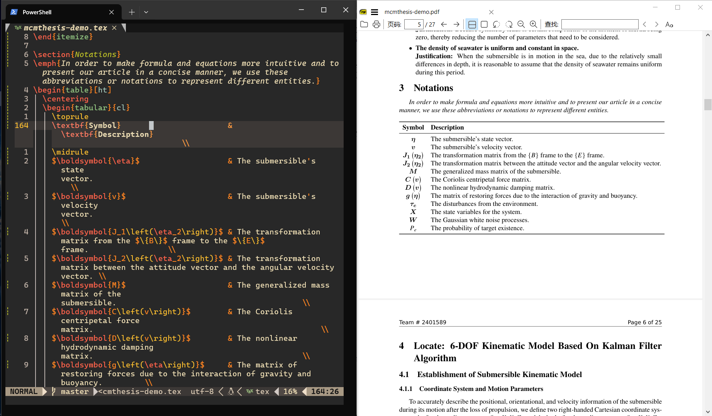

> 前排提示：我采用的配置是基于[这个配置](https://github.com/benbrastmckie/.config)进行改进的，如果对 Neovim 和 LaTeX 有基本的使用经验可以直接参考给出的链接。

如果对哪些部分不清楚或者对某个部分的具体实现感兴趣，可以私信或者评论，我会针对内容进行更新。

最终效果展示：



## 为什么有这篇文章

在写这篇文章之前，我已经使用 Vim （主要是用的 VS Code 的 Neovim 插件）和 $\LaTeX$ 一段时间了，之前一直都是使用 VS Code 和 $\LaTeX$ 插件的解决方案，但是最终还是觉得 Neovim 的实现更加优雅，也更符合我的习惯和解决我的一些痛点：

- 经常使用 Windows Terminal
- VS Code 的 Neovim 插件时不时会遇到一些无法解决的 Bug
- 使用 Neovim 插件没办法实现一些自定义的操作和更改配置，这点在我要增加一些功能的时候尤为难受
- 加快启动和编译的速度，特别是针对大文件
- ~~保留上个世纪程序员的炫酷~~

参考了很多解决方案，都没有一个比较完美的符合我痛点的配置，于是只好自己根据现有的解决方案改良了一下，主要的功能有：

- 语法高亮
- $\LaTeX$ 正向搜索、反向搜索
- 文件检索、模糊查找
- 整合 Lazygit 实现版本管理
- 采用 Lua 编写，更加符合 Neovim 的习惯
- 利用 VimTeX 实现编译、查看 $\LaTeX$ 文件
- 支持 [LSP](https://learn.microsoft.com/zh-cn/visualstudio/extensibility/language-server-protocol?view=vs-2022) 自动补全、代码提示（支持 $\LaTeX$, C++）
- 格式化代码（支持 $\LaTeX$, C++）
- 支持在 Neovim 中刷 LeetCode
- 支持中英输入法混用（在 Normal 模式英文输入法，在 Insert 模式下中文输入法）
- ……

## 什么是 Neovim

如果你听过编辑器之神 Vim 和神之编辑器 Emacs 的话，那么就很好理解 Neovim 了，它就是 Vim 的一个社区版，如果你对它的历史感兴趣，可以到 [Neovim 的官网](https://neovim.io/doc/user/vim_diff.html#vim-differences) 查看。

> 关于 Vim 和 Neovim 的历史还可以查看：[Vim 和 Neovim 的前世今生 · jdhao's digital space](https://jdhao.github.io/2020/01/12/vim_nvim_history_development/)

## 一些可能有用的链接

### 快速入门

- [neovim/neovim: Vim-fork focused on extensibility and usability (github.com)](https://github.com/neovim/neovim) - Neovim 的 GitHub 仓库
- [Learn Lua in Y Minutes (learnxinyminutes.com)](https://learnxinyminutes.com/docs/lua/) - 快速入门 Lua 语言（主要是为了 Neovim 的配置）
  - [Lua-guide - Neovim docs](https://neovim.io/doc/user/lua-guide.html#lua-guide) - Neovim 提供的 Lua 手册

- [Home - Neovim](https://neovim.io/) - Neovim 的官网（可以用来查看 API 和入门文档
  - [Help - Neovim docs](https://neovim.io/doc/user/) - 帮助文档
  - [Usr_toc - Neovim docs](https://neovim.io/doc/user/usr_toc.html#user-manual) - 文档的目录（快速定位需要阅读的部分）


### 快捷键速查表

- [Index - Neovim docs](https://neovim.io/doc/user/vimindex.html#index)
- [Quickref - Neovim docs](https://neovim.io/doc/user/quickref.html#quickref)
- 或者在 Neovim 中输入 `:help index`

### 在哪里找插件

- [Trending Neovim Plugins in 2024 (dotfyle.com)](https://dotfyle.com/neovim/plugins/trending)
- [rockerBOO/awesome-neovim: Collections of awesome neovim plugins. (github.com)](https://github.com/rockerBOO/awesome-neovim)
- [Modules labeled 'neovim' - LuaRocks](https://luarocks.org/labels/neovim)
- [nvimawesome (nvim-awesome.vercel.app)](https://nvim-awesome.vercel.app/)
- [neovimcraft](https://neovimcraft.com/)

### 学习 Vim & Neovim

- [Vim - CS自学指南 (csdiy.wiki)](https://csdiy.wiki/必学工具/Vim/) - 可以在里面找到一些学习的参考资料
- [💻【Linux】Vim 入门笔记 (imageslr.com)](https://imageslr.com/2021/vim.html) - 主要介绍如何使用 Vim 的一些技巧
- [yangyangwithgnu/use_vim_as_ide: use vim as IDE (github.com)](https://github.com/yangyangwithgnu/use_vim_as_ide) - 比较完善的文档，略长，但是太长时间没有更新，仅供参考
- [wsdjeg/vim-galore-zh_cn: Vim 从入门到精通 (github.com)](https://github.com/wsdjeg/vim-galore-zh_cn) - 主要介绍 Vim 的一些基础概念
- [wsdjeg/Learn-Vim_zh_cn: 聪明地学习Vim (github.com)](https://github.com/wsdjeg/Learn-Vim_zh_cn) - 中文学习 Vim 的参考资料
- [Learn Vimscript the Hard Way (stevelosh.com)](https://learnvimscriptthehardway.stevelosh.com/) - 英文学习 Vim 的参考资料
- [《Practical Vim 2nd Edition》 | 开发者工具论坛 (learnku.com)](https://learnku.com/docs/practical-vim-2nd-edition) - 系统学习 Vim 的参考书

### 配置 Neovim

- [Lua-guide - Neovim docs](https://neovim.io/doc/user/lua-guide.html#lua-guide) - 官方关于如何配置的文档
- [VIM 中文帮助: 总览及快速参考 (yianwillis.github.io)](https://yianwillis.github.io/vimcdoc/doc/help.html) - 中文帮助，适合对阅读官方英文有困难的同学，主要针对 Vim

第三方博客的介绍：

**中文博客**

- [你需要知道的使用 lua 配置 neovim 的一切 - 知乎 (zhihu.com)](https://zhuanlan.zhihu.com/p/596879980) - 主要看关于 `o` ,`wo` ,`bo`,`g`,`env`,`opt`之间关系的说明
- [Neovim: 把 init.vim 迁移到 init.lua - 知乎 (zhihu.com)](https://zhuanlan.zhihu.com/p/467939053) - 适合之前使用 Vim 要迁移到 Neovim 的同学
- [从零开始配置 Neovim(Nvim) - MartinLwx's Blog](https://martinlwx.github.io/zh-cn/config-neovim-from-scratch/) - 轻量化配置 Neovim，适合新手同学逐步跟着配置，针对 MacOS
- [neovim入门指南(一)：基础配置 - ISLAND (youngxhui.top)](https://youngxhui.top/2023/07/nvim-guideline-1basic-config/) - 系列文章，比较适合想要逐层递进学习的同学，涵盖了 Neovim 的基本使用、一些插件的介绍、LSP如何配置等内容
- [从零开始的现代化Vim配置指南——前言 - 知乎 (zhihu.com)](https://zhuanlan.zhihu.com/p/480049712) - 系列文章，似乎很久没有更新了，不是很推荐
- [我用 neovim 代替了 MS Office, IDEA, Visual Studio... - 知乎 (zhihu.com)](https://zhuanlan.zhihu.com/p/464902429) - 过时的文章，可以不参考
- [neovim 配置记录 - 知乎 (zhihu.com)](https://zhuanlan.zhihu.com/p/388397656) - 比较简略地介绍了一些插件，可以参考一下插件的功能
- [我的现代化 NeoVim 配置介绍/教程 - 知乎 (zhihu.com)](https://zhuanlan.zhihu.com/p/467428462) - 可以参考其中的插件介绍
- [我的现代化Neovim配置 - 知乎 (zhihu.com)](https://zhuanlan.zhihu.com/p/382092667) - 介绍不是很详细，更像是个人记录，不推荐参考
- [Neovim/Vim基础教程（面向萌新&推荐&感想） - 知乎 (zhihu.com)](https://zhuanlan.zhihu.com/p/301008305) - 给的大多是链接，质量不高，不推荐
- [用 Nvim 打造超强的个性化 IDE - LazyPool's Blog (lazypool-blog.netlify.app)](https://lazypool-blog.netlify.app/2023/12/07/nvim/) - 相对比较容易懂，配置文档也比较详细，介绍了一些有用的插件

**英文博客**

- [Supercharged LaTeX using Vim/Neovim, VimTeX, and snippets | ejmastnak](https://ejmastnak.com/tutorials/vim-latex/intro/) - 主要跟数学公式的支持有关
- [bryant-video/neovim-tutorial (github.com)](https://github.com/bryant-video/neovim-tutorial?tab=readme-ov-file) - 比较简单的配置，基本上涵盖了必要的内容

### 为什么是 Neovim 而不是 Vim

- [Vim还是Neovim？为什么你应该使用后者？ 新维姆 在Vim和/或Neovim之间感到困惑？下面是我说服你今天使用N - 掘金 (juejin.cn)](https://juejin.cn/post/7090094882588459045) - 对于 Vim 和 Neovim 的比较
- [Geoff Greer's site: Why Neovim is Better than Vim](https://geoff.greer.fm/2015/01/15/why-neovim-is-better-than-vim/) - 为什么选择 Neovim 而不是 Vim 的理由

### 遇到问题请看我

- [Helphelp - Neovim docs](https://neovim.io/doc/user/helphelp.html#helphelp)
- [Message - Neovim docs](https://neovim.io/doc/user/message.html#message.txt)
- 在 Neovim 中输入 `:help faq`

### 一些建议

- [Tips - Neovim docs](https://neovim.io/doc/user/tips.html#tips)

### 其他链接

- [ASCII Art Archive](https://www.asciiart.eu/) - 美化 Neovim 启动界面

## 安装 Neovim

由于我使用 Windows 10 的 scoop 软件来管理安装其他软件，所以只需要一行命令就能安装：

```powershell
scoop install main/neovim
```

如果是其他的安装方法可以参考[官方文档](https://github.com/neovim/neovim/blob/master/INSTALL.md)。

如果你还不熟悉 Vim 的操作，可以打开 Neovim，然后进入命令模式，输入下面的代码就可以进入一个大概30分钟的交互式教程：

```vim
:Tutor
```

## 配置 Neovim

无论是开箱即用还是自己配置，最终目的都是为了方便自己，切莫本末倒置。也不必追求一次性就将自己的配置做到最优，可以在使用中发现缺少什么再去补全，这样会使得整个过程更加容易一些，当然如果想要体验一下完全体还是建议先下载几个开箱即用的配置试试看。

### 开箱即用

如果不想自己配置 Neovim 也有很多开箱即用的配置可以参考：

- [nvim-lua/kickstart.nvim: A launch point for your personal nvim configuration (github.com)](https://github.com/nvim-lua/kickstart.nvim)
- [SpaceVim/SpaceVim: A modular Vim/Neovim configuration (github.com)](https://github.com/SpaceVim/SpaceVim)
- [NvChad/NvChad: Blazing fast Neovim config providing solid defaults and a beautiful UI, enhancing your neovim experience. (github.com)](https://github.com/NvChad/NvChad) - 推荐阅读英文原版，中文文档更新比较慢
  - [NvChad中文站 | NvChad中文站 (iwiki.rs)](https://nvchad.iwiki.rs/) - 中文翻译
- [LunarVim/LunarVim: 🌙 LunarVim is an IDE layer for Neovim. Completely free and community driven. (github.com)](https://github.com/LunarVim/LunarVim)
- [LazyVim/LazyVim: Neovim config for the lazy (github.com)](https://github.com/LazyVim/LazyVim) - 注意别和插件 [lazy.nvim](https://github.com/folke/lazy.nvim) 搞混

### 打造属于自己的 Neovim

Windows 10 中 Neovim 的配置文件一般在 `~/AppData/Local/nvim/init.vim   (Windows)` 这个路径下， `~` 表示当前用户的目录，比如用户名为 `Beta` 的用户的路径一般为 `C:/Users/Abel/AppData/Local/nvim/init.vim` 。Neovim 启动时会加载 `init.vim` 文件，所以只需要在这个文件中进行配置就可以。

我的配置文件会加上大部分的注释，基本上是自解释的，如果还有不懂的部分，比如 `o` 和 `g` 分别是什么，可以参考官方给出的[文档](https://neovim.io/doc/user/lua-guide.html#lua-guide)，下面给出我的配置文件的结构，以下默认当前文件夹是在前面提到的 `nvim` 下：

```markdown
~/AppData/Local/nvim
│   init.lua -- 自动加载
│   lazy-lock.json
│   
│   
└───lua
    ├───config --存放配置文件
    │       keymaps.lua -- 按键映射设置
    │       lazy.lua -- lazy.nvim 懒加载插件用于管理插件
    │       options.lua -- 原生 Neovim 支持的设置
    │       
    └───plugins

```

> 如何生成文件树：利用 Windows 10 的 `tree` 命令：
>
> ```powershell
> tree /f >tree.txt
> ```
>
> 会将当前目录下的文件树的结果导出到 tree.txt 文件中，如果没有这个文件则会创建文件并写入结果。

#### 配置文件

`init.lua` 文件是 Neovim 启动时会加载的配置文件，可以按照文件树结构来安排各种设置，便于分类和查找：

```lua
-- ---------- 本地配置 ---------- --
require("config.options") -- 选项
require("config.keymaps") -- 按键设置

-- ---------- 插件管理 ---------- --
require("config.lazy") -- Lazy.nvim 进行插件管理
```

`options.lua` 文件主要放了 Neovim 原本就支持的一些设置，包括行号、高亮、编码等等，所以会显得比较杂乱：

```lua
-- local g = vim.g
-- local opt = vim.opt

-- opt.completeopt = "menu, menuone, noselect, noinsert", -- 补全选项设置

-- leader 按键设置
-- g.mapleader = " "
-- g.maplocalleader = "\\"

local options = {

  -- GENERAL
  timeoutlen = 500,               -- time to wait for a mapped sequence to complete (in milliseconds), 键盘快捷键等待时间
  updatetime = 300,               -- faster completion (4000ms default), 更新检查间隔时间
  swapfile = false,               -- creates a swapfile, 禁止创建 swap 文件
  undofile = true,                -- enable persistent undo
  writebackup = false,            -- if a file is being edited by another program, it is not allowed to be edited, 禁止写入备份文件
  backup = false,  				  -- 禁止创建备份文件
  confirm = true,  				  -- 没有保存或文件只读时弹出确认

  -- APPEARANCE
  fileencoding = "utf-8",         -- the encoding written to a file, 保存文件的时候使用 UTF-8 编码
  encoding = "UTF-8", 			  -- 当处理文本的时候使用 UTF-8 编码
  -- guifont = "monospace:h17",      -- the font used in graphical neovim applications
  background = "dark",            -- colorschemes that can be light or dark will be made dark, 设置背景为暗色
  termguicolors = true,           -- set term gui colors (most terminals support this), 开启终端真彩色支持
  conceallevel = 0,               -- so that `` is visible in markdown files
  number = true,                  -- set numbered lines, 显示行号
  relativenumber = true,          -- set relative numbered lines, 使用相对行号
  -- numberwidth = 2,                -- set number column width to 2 {default 4}
  signcolumn = "yes",             -- always show the sign column, otherwise it would shift the text each time, 左侧始终显示符号列
  cursorline = true,              -- highlight the current line, 高亮当前行
  -- colorcolumn = "100",             -- highlight vertical colorcolumn (moved to after/python.lua), 右侧第 100 列显示颜色参考线
  wrap = true,                    -- display lines as one long line, 启用折行
  showbreak = "  ",               -- set indent of wrapped lines
  cmdheight = 1,                  -- space in the neovim command line for displaying messages, 命令行高度
  pumheight = 10,                 -- pop up menu height, 补全菜单高度为 10 行
  wildmenu = true, 				  -- 显示补全菜单
  -- showmode = false,               -- we don't need to see things like -- INSERT -- anymore
  splitbelow = true,              -- force all horizontal splits to go below current window, 水平分屏默认在下方
  splitright = true,              -- force all vertical splits to go to the right of current window, 垂直分屏默认在右侧
  scrolloff = 999,                  -- minimal number of screen lines to keep above and below the cursor, 光标上下保持 999 行距离，实现类似 Typora 的打字机的效果
  sidescrolloff = 8,              -- minimal number of screen columns either side of cursor if wrap is `false`, 光标左右保持 8 列距离
  shortmess = "filnxtToOFc",      -- which errors to suppress
  mousemoveevent = true,
  -- shortmess:append "atI", 		  -- 隐去启动的提示信息

  -- INDENT
  tabstop = 4,                    -- insert 4 spaces for a tab, Tab 键相当于 4 个空格
  shiftwidth = 4,                 -- the number of spaces inserted for each indentation, 自动缩进时移动 4 个空格
  softtabstop = 4,                -- insert 2 spaces for a tab, 编辑时 Tab 键为 4 个空格
  expandtab = true,               -- convert tabs to spaces, Tab 替换为空格
  breakindent = true,             -- tab wrapped lines
  linebreak = true,               -- companion to wrap, don't split words
  backspace = "indent,eol,start", -- allow backspace on indent, end of line or insert mode start position
  smarttab = true, 				  -- 开启智能 Tab
  shiftround = true,              -- 使用 >> 和 << 移动时对齐到 shiftwidth 的倍数
  cindent = true,				  -- C 文件自动缩进
  autoindent = true,			  -- 新行缩进对齐到当前行
  smartindent = true,			  -- 开启智能缩进

  -- EDIT
  -- spell = true,                   -- turns on spellchecker, 支持拼写检查
  -- spelllang = { 'en_us', 'cjk' },        -- sets spelling dictionary, 对英文进行拼写检查, 忽略中文的拼写检查
  clipboard = "unnamedplus",      -- allows neovim to access the system clipboard, 使用系统剪贴板
  mouse = "a",                    -- allow the mouse to be used in neovim, 开启鼠标支持
  mousescroll = "ver:2,hor:4",    -- change the speed of the scroll wheel
  ignorecase = true,              -- ignore case in search patterns, 搜索时不区分大小写
  smartcase = true,               -- smart case, 搜索包含大写字母时，自动区分大小写
  hlsearch = true, 				  -- 搜索高亮
  incsearch = true, 			  -- 输入搜索模式时，每输入一个字符，就自动跳到第一个匹配的结果
  showmatch = true, 			  -- 高亮匹配的括号
  virtualedit = "block",          -- vitualblock mode doesn't get stuck at the end of line
  inccommand = "split",           -- shows all inline replacements in split
  autoread = true,				  -- 外部文件修改自动加载
  whichwrap = "<,>,[,]",		  -- 光标移到行首或行尾时，可跨行移动
  list = false,					  -- 不显示不可见字符
  listchars = "space:·,tab:>-",   -- 空格和 Tab 的显示方式

}

-- turns on all values in options table above
for k, v in pairs(options) do
  vim.opt[k] = v
end
```

在 Neovim/Vim 中直接输入 `/` 就可以查找，比如 `/include` 就是查找文件中包含 `include` 的词，同样有大小写敏感，要关闭大小写敏感，可以使用命令 `vim.o.ignorecase = true`。

查看查找的历史记录可以输入 `/` 之后用方向键来查找之前查找的记录。当然这需要在查找之后按下回车进行实际的查找才会进行记录，否则如果只是在命令中查找而不按下回车键是不会进行记录的。

如果记得之前查找历史中的某个开头的字母，比如之前运用过 `/search` 命令查找了 `search` 这个单词，然后之后又进行了多次查询，并且在查询之后都按下了回车键，这会把查找历史记录下来，那么想要快速找到之前的某个查找记录，那么就可以先输入 `/sea` 然后按下方向键就可以在以 `sea` 开头的查找记录中跳转。

当然 `:` 的命令模式也有类似以上的功能，但是 `:` 命令的历史记录和 `/` 命令的历史记录是分开的。

搜索当前光标指示的单词，当然可以使用 `/` 命令手动输入当前光标所指示的单词，但是也可以用 `*` 来直接搜索当前光标所指示的单词在文本中出现的下一个位置，这样不容易在 `/` 输入中拼写错误，而 `#` 命令向相反的方向做同样的事情。不过这两个命令会自动进行全字匹配，如果想要部分匹配的话可以用命令 `g#` 和 `g*` 。

`keymaps.lua` 主要存放一些经常用的快捷键（可以自己设置）：

```lua
-- 暂时还没有
```

`lazy.lua` 文件是一个管理 Neovim 插件的[插件](https://github.com/folke/lazy.nvim)，具体的设置可以参考[官方文档](https://lazy.folke.io/)：

```lua
-- 安装 lazy.nvim 插件
local lazypath = vim.fn.stdpath("data") .. "/lazy/lazy.nvim"
if not (vim.uv or vim.loop).fs_stat(lazypath) then
  local lazyrepo = "https://github.com/folke/lazy.nvim.git"
  local out = vim.fn.system({
  				"git", 
  				"clone", 
  				"--filter=blob:none", 
  				"--branch=stable", 
  				lazyrepo, 
  				lazypath })
  if vim.v.shell_error ~= 0 then
    vim.api.nvim_echo({
      { "Failed to clone lazy.nvim:\n", "ErrorMsg" },
      { out, "WarningMsg" },
      { "\nPress any key to exit..." },
    }, true, {})
    vim.fn.getchar()
    os.exit(1)
  end
end
vim.opt.rtp:prepend(lazypath)

-- 设置 lazy.nvim 插件
require("lazy").setup({
  spec = {
    -- 安装插件
    -- VimTeX 主要用于支持 LaTeX 的功能
    {
      "lervag/vimtex",
      lazy = false,     -- VimTeX 不需要懒加载
      -- tag = "v2.15", -- 取消注释以固定在某个版本
      init = function()
        -- 下面是有关 VimTeX 的设置
        -- VimTeX 在 Windows 中如果能找到 SumatraPDF 就会自动设置用它打开
        -- vim.g.vimtex_view_method = "SumatraPDF"
      end
    },
  },  
  checker = { enabled = true }, -- 自动检查插件更新
  -- 不想使用 Nerd Font，用Unicode的图标替代
  ui = {
    icons = { -- 各种元素的图标配置
      cmd = "⌘",
      config = "🛠",
      event = "📅",
      ft = "📂",
      init = "⚙",
      keys = "🗝",
      plugin = "🔌",
      runtime = "💻",
      require = "🌙",
      source = "📄",
      start = "🚀",
      task = "📌",
      lazy = "💤 ",
    },
  },
```

这里有个坑，安装 `lazy.nvim` 是要先安装 `git` 的，而且安装之后在 Neovim 中执行 `:checkhealth lazy` 时可能会遇到和 `luarocks` 有关的报错，我的解决方案是通过 `Scoop` 安装 `luarocks` 和 `lua`：

```powershell
scoop install main/luarocks
scoop install main/lua
```

#### 插件

**lazy.nvim**：用于插件管理的一个插件，可以进行快速地安装、卸载、更新插件。

- Git 仓库：[folke/lazy.nvim: 💤 A modern plugin manager for Neovim (github.com)](https://github.com/folke/lazy.nvim)
- 文档：[🚀 Getting Started | lazy.nvim (folke.io)](https://lazy.folke.io/)

**vimtex**：Vimtex 是一个专门为 Vim 和 Neovim 设计的 LaTeX 插件，它提供了包括语法高亮、自动补全、编译支持、预览和错误检查等功能。

- Git 仓库：[lervag/vimtex: VimTeX: A modern Vim and neovim filetype plugin for LaTeX files. (github.com)](https://github.com/lervag/vimtex)

**neovim-session-manager**：Session manager是一个类似于 `VS Code` 管理文件夹的进程管理插件，能够保存当前进程到一个文件中方便后面直接打开。 

- Git 仓库：[Shatur/neovim-session-manager: A simple wrapper around :mksession.](https://github.com/Shatur/neovim-session-manager)
  - 相关的插件：[stevearc/dressing.nvim: Neovim plugin to improve the default vim.ui interfaces](https://github.com/stevearc/dressing.nvim)

我的相关配置文件 `sessions.lua`：

```lua
return {
  "Shatur/neovim-session-manager",
  commit = 'a0b9d25154be573bc0f99877afb3f57cf881cce7', -- replace with the desired commit hash
  event = "VimEnter",
  dependencies = {
    "nvim-lua/plenary.nvim",
    "stevearc/dressing.nvim",
    "nvim-telescope/telescope-ui-select.nvim",
  },
  config = function()
    local Path = require('plenary.path')
    local config = require('session_manager.config')
    require('session_manager').setup({
      -- sessions_dir = Path:new(vim.fn.stdpath('data'), 'sessions'), -- The directory where the session files will be saved.
      sessions_dir = Path:new(vim.fn.stdpath('config'), 'sessions'), -- The directory where the session files will be saved.
      -- session_filename_to_dir =  '~/.config/nvim/sessions/', -- Function that replaces symbols into separators and colons to transform filename into a session directory.
      -- dir_to_session_filename = '~/.config/nvim/sessions/', -- Function that replaces separators and colons into special symbols to transform session directory into a filename. Should use `vim.uv.cwd()` if the passed `dir` is `nil`.
      -- path_replacer = '__', -- The character to which the path separator will be replaced for session files.
      -- colon_replacer = '++', -- The character to which the colon symbol will be replaced for session files.
      autoload_mode = config.AutoloadMode.Disabled, -- Define what to do when Neovim is started without arguments. See "Autoload mode" section below.
      autosave_last_session = true, -- Automatically save last session on exit and on session switch.
      autosave_ignore_not_normal = true, -- Plugin will not save a session when no buffers are opened, or all of them aren't writable or listed.
      autosave_ignore_dirs = {}, -- A list of directories where the session will not be autosaved.
      autosave_ignore_filetypes = { -- All buffers of these file types will be closed before the session is saved.
        'gitcommit',
        'gitrebase',
      },
      autosave_ignore_buftypes = {}, -- All buffers of these bufer types will be closed before the session is saved.
      autosave_only_in_session = true, -- Always autosaves session. If true, only autosaves after a session is active.
      max_path_length = 80,  -- Shorten the display path if length exceeds this threshold. Use 0 if don't want to shorten the path at all.
    })
  end,
}
```

`dressing.lua`：

```lua
return {
  "stevearc/dressing.nvim",
  event = "VeryLazy",
  config = function()
    require('dressing').setup({
      input = {
        -- Set to false to disable the vim.ui.input implementation
        enabled = true,

        -- Default prompt string
        default_prompt = "Input:",

        -- Can be 'left', 'right', or 'center'
        prompt_align = "center",

        -- When true, <Esc> will close the modal
        insert_only = true,

        -- When true, input will start in insert mode.
        start_in_insert = true,

        -- These are passed to nvim_open_win
        override = function(conf)
          -- This is the config that will be passed to nvim_open_win.
          -- Change values here to customize the layout
          return conf
        end,
        border = "rounded",
        -- 'editor' and 'win' will default to being centered
        relative = "cursor",

        -- These can be integers or a float between 0 and 1 (e.g. 0.4 for 40%)
        prefer_width = 40,
        width = nil,
        -- min_width and max_width can be a list of mixed types.
        -- min_width = {20, 0.2} means "the greater of 20 columns or 20% of total"
        max_width = { 140, 0.9 },
        min_width = { 20, 0.2 },

        -- Window transparency (0-100)
        -- winblend = 20, -- causing errors
        -- Change default highlight groups (see :help winhl)
        -- winhighlight = "", -- causing errors

        -- Set to `false` to disable
        mappings = {
          n = {
            ["<Esc>"] = "Close",
            ["<CR>"] = "Confirm",
          },
          i = {
            ["<C-c>"] = "Close",
            ["<CR>"] = "Confirm",
            ["<Up>"] = "HistoryPrev",
            ["<Down>"] = "HistoryNext",
          },
        },


        -- see :help dressing_get_config
        get_config = nil,
      },
      select = {
        -- Set to false to disable the vim.ui.select implementation
        enabled = true,

        -- Priority list of preferred vim.select implementations
        backend = { "telescope", "fzf_lua", "fzf", "builtin", "nui" },

        -- Trim trailing `:` from prompt
        trim_prompt = true,

        -- Options for telescope selector
        -- These are passed into the telescope picker directly. Can be used like:
        -- telescope = require('telescope.themes').get_ivy({...})
        telescope = nil,

        -- Options for fzf selector
        fzf = {
          window = {
            width = 0.5,
            height = 0.4,
          },
        },

        -- Options for fzf_lua selector
        fzf_lua = {
          winopts = {
            width = 0.5,
            height = 0.4,
          },
        },

        -- Options for nui Menu
        nui = {
          position = "50%",
          size = nil,
          relative = "editor",
          border = {
            style = "rounded",
          },
          buf_options = {
            swapfile = false,
            filetype = "DressingSelect",
          },
          -- win_options = {
          --   winblend = 10, -- might also cause errors
          -- },
          max_width = 80,
          max_height = 40,
          min_width = 40,
          min_height = 10,
        },

        -- Options for built-in selector
        builtin = {
          -- These are passed to nvim_open_win
          override = "NW",
          border = "rounded",
          -- 'editor' and 'win' will default to being centered
          relative = "editor",

          -- Window transparency (0-100)
          -- winblend = 10, -- causing errors
          -- Change default highlight groups (see :help winhl)
          -- winhighlight = "", -- causing errors

          -- These can be integers or a float between 0 and 1 (e.g. 0.4 for 40%)
          -- the min_ and max_ options can be a list of mixed types.
          -- max_width = {140, 0.8} means "the lesser of 140 columns or 80% of total"
          width = nil,
          max_width = { 140, 0.8 },
          min_width = { 40, 0.2 },
          height = nil,
          max_height = 0.9,
          min_height = { 10, 0.2 },

          -- Set to `false` to disable
          mappings = {
            ["<Esc>"] = "Close",
            ["<C-c>"] = "Close",
            ["<CR>"] = "Confirm",
          },

          -- override = function(conf)
          --   -- This is the config that will be passed to nvim_open_win.
          --   -- Change values here to customize the layout
          --   return conf
          -- end,
        },

        -- Used to override format_item. See :help dressing-format
        format_item_override = {},

        -- see :help dressing_get_config
        get_config = nil,
      },
    })
  end
}
```

## 进阶版 Neovim

### 在 `WSL` 中使用 Neovim + $\LaTeX$ + VimTeX + Sioyek + Lazygit

可以参考[我的个人配置](https://github.com/chen-huaneng/neovim-config)

### 结合 Neovim 和 $\LaTeX$

#### 可以参考的链接

- [使用 Neovim 和 vimtex 高效撰写 LaTeX 学术论文 - 知乎 (zhihu.com)](https://zhuanlan.zhihu.com/p/338505581) - 不是用 `lua` 编写的，更适合使用 Vim 的同学参考，介绍原理的部分值得一看
- [A Quick Guide on Writing LaTeX in Neovim - Jia Jia Math (mathjiajia.github.io)](https://mathjiajia.github.io/neovim-latex/)
- [Neovim as a LaTex Development Environment (epheme.re)](https://blog.epheme.re/software/nvim-latex.html)
- [How I'm able to take notes in mathematics lectures using LaTeX and Vim | Gilles Castel](https://castel.dev/post/lecture-notes-1/) - 很有名的一篇文章，主要针对使用 Vim 的同学
- [LaTeX 入门小记：Vim + Vimtex + LaTeX 初体验 - 知乎 (zhihu.com)](https://zhuanlan.zhihu.com/p/93342783) - 内容有点过时，总体还是适合的
- [使用Neovim优雅地编写LaTeX - 知乎 (zhihu.com)](https://zhuanlan.zhihu.com/p/644984708) - 主要介绍了 LuaSnip 的配置
- [在 Windows 中使用 wsl + neovim + latex + ultisnips - 知乎 (zhihu.com)](https://zhuanlan.zhihu.com/p/576159156) - 配置主要针对 `wsl` 
- [Vim+VimTeX:带给你飞一般的LaTeX编辑体验 | Hexo (destinyenvoy.github.io)](https://destinyenvoy.github.io/2020/09/07/how-to-use-vimtex/) - 提供了一些有关 VimTeX 的技巧说明可以参考
- [Windows+neovim+SumatraPDF+windows terminal+vimtex进行latex写作和反向搜索 - 知乎 (zhihu.com)](https://zhuanlan.zhihu.com/p/658523024) - 比较详细地介绍了在 Windows 下如何配置
- [benbrastmckie/.config: NeoVim configuration optimized for writing in LaTeX (github.com)](https://github.com/benbrastmckie/.config) - 非常好的解决方案，基本上涵盖了需要用到的 Zotero，Git 等拓展功能，推荐

#### 我的解决方案

根据[这个配置](https://github.com/benbrastmckie/.config)进行改进

`keymaps.lua` 的内容：

```lua
local opts = { noremap = true, silent = true } -- noremap 禁止递归映射，silent 禁止显示命令。

-- local term_opts = { silent = true }

-- Shorten function name
local keymap = vim.api.nvim_set_keymap
-- local map = vim.keymap.set -- for conciseness

--Remap space as leader key
vim.g.mapleader = " " -- 设置空格为 Leader Key
-- vim.g.maplocalleader = " "


-------------------- General Keymaps --------------------

-- delete single character without copying into register
-- keymap("n", "x", '"_x', opts)
-- keymap("v", "p", '"_p', opts)

-- Unmappings 解绑快捷键,<C-z>、gc、gcc 被设置为无操作（<nop>）,用于禁用这些快捷键。
keymap("n", "<C-z>", "<nop>", opts)
keymap("n", "gc", "<nop>", opts)
keymap("n", "gcc", "<nop>", opts)

-- NOTE: not sure I will uses these cmp-vimtex commands
-- Search from hovering over cmp-vimtex citation completion
-- vim.keymap.set("i", "<C-z>", function() 
--   require('cmp_vimtex.search').search_menu()
-- end)
-- vim.keymap.set("i", "<C-z>", function() 
--   require('cmp_vimtex.search').perform_search({ engine = "arxiv" })
-- end)

-- NOTE: prefer to use whichkey
-- Surround 
-- vim.keymap.set("v", '<C-s>', 'S', { remap = true }) -- see surround.lua


-- Spelling "<C-s>" 调用 telescope 插件的 spell_suggest，提供拼写建议，光标处展示一个小窗口。
vim.keymap.set("n", "<C-s>", function()
  require("telescope.builtin").spell_suggest(require("telescope.themes").get_cursor({
      previewer = false,
      layout_config = {
        width = 50,
        height = 15,
      }
    })
  )
end, { remap = true })
-- vim.keymap.set("n", "<C-s>", "z=", { remap = true}) 
-- keymap("n", "<C-s>", "<cmd>Telescope spell_suggest<cr>", { remap = true})

-- Kill search highlights 按 <Enter> 清除高亮显示的搜索结果。
keymap("n", "<CR>", "<cmd>noh<CR>", opts)


-- Find project files <Ctrl-p> 启动 Telescope 插件中的 find_files 函数，用于查找项目文件。
vim.keymap.set("n", "<C-p>", "<cmd>Telescope find_files<CR>", { remap = true })
  -- function ()
  --   require('telescope.builtin').find_files(require('telescope.themes').get_dropdown({previewer = false}))
  -- end, 


-- Toggle comments <Ctrl-/> 用于切换当前行和选择区域的行注释。
keymap('n', '<C-_>', '<Plug>(comment_toggle_linewise_current)', opts)
keymap('x', '<C-_>', '<Plug>(comment_toggle_linewise_visual)', opts)


-- Open help on word 按 <Shift-m> 打开光标处单词的帮助文档。
keymap("n", "<S-m>", ':execute "help " . expand("<cword>")<cr>', opts)


-- Fix 'Y', 'E' Y 键重新映射为复制到行尾，E 映射为跳转到上一个单词结尾。
keymap("n", "Y", "y$", opts)
keymap("n", "E", "ge", opts)
keymap("v", "Y", "y$", opts)
keymap("v", "E", "ge", opts) -- causes errors with luasnip autocmp


-- Better window navigation 使用 <C-h>, <C-j>, <C-k>, <C-l> 快速在窗口间导航。
keymap("n", "<C-h>", "<C-w>h", opts)
keymap("n", "<C-j>", "<C-w>j", opts)
keymap("n", "<C-k>", "<C-w>k", opts)
keymap("n", "<C-l>", "<C-w>l", opts)


-- Resize with arrows <A-Left> 和 <A-Right> 用于调整窗口宽度。
-- keymap("n", "<C-Up>", ":resize -2<CR>", opts)
-- keymap("n", "<C-Down>", ":resize +2<CR>", opts)
-- keymap("n", "<A-Left>", ":vertical resize -2<CR>", opts)
-- keymap("n", "<A-Right>", ":vertical resize +2<CR>", opts)
-- keymap("n", "<A-h>", ":vertical resize -2<CR>", opts)
-- keymap("n", "<A-l>", ":vertical resize +2<CR>", opts)


-- Navigate buffers <TAB> 和 <S-TAB> 在缓冲区之间切换。
-- keymap("n", "<TAB>", ":bnext<CR>", opts)
-- keymap("n", "<S-TAB>", ":bprevious<CR>", opts)
-- keymap("n", "<BS>", ":BufferLineMoveNext<CR>", opts)
-- keymap("n", "<S-BS>", ":BufferLineMovePrev<CR>", opts)


-- Drag lines <Alt-j> 和 <Alt-k> 用于拖动行。
keymap("n", "<A-j>", "<Esc>:m .+1<CR>==", opts)
keymap("n", "<A-k>", "<Esc>:m .-2<CR>==", opts)
keymap("x", "<A-j>", ":move '>+1<CR>gv-gv", opts)
keymap("x", "<A-k>", ":move '<-2<CR>gv-gv", opts)
keymap("v", "<A-j>", ":m'>+<CR>gv", opts)
keymap("v", "<A-k>", ":m-2<CR>gv", opts)

-- Horizontal line movments -- <S-h> 和 <S-l> 用于跳到行的开头和结尾。
keymap("v", "<S-h>", "g^", opts)
keymap("v", "<S-l>", "g$", opts)
keymap("n", "<S-h>", "g^", opts)
keymap("n", "<S-l>", "g$", opts)
```

`options.lua` 的内容：

```lua
local options = {

  -- GENERAL
  timeoutlen = 500,               -- time to wait for a mapped sequence to complete (in milliseconds), 键盘快捷键等待时间
  updatetime = 300,               -- faster completion (4000ms default), 更新检查间隔时间
  swapfile = false,               -- creates a swapfile, 禁止创建 swap 文件
  undofile = true,                -- enable persistent undo
  writebackup = false,            -- if a file is being edited by another program, it is not allowed to be edited, 禁止写入备份文件
  backup = false,           -- 禁止创建备份文件
  confirm = true,           -- 没有保存或文件只读时弹出确认

  -- APPEARANCE
  fileencoding = "UTF-8",         -- the encoding written to a file, 保存文件的时候使用 UTF-8 编码
  encoding = "UTF-8",             -- 当处理文本的时候使用 UTF-8 编码
  -- guifont = "monospace:h17",      -- the font used in graphical neovim applications
  background = "dark",            -- colorschemes that can be light or dark will be made dark, 设置背景为暗色
  termguicolors = true,           -- set term gui colors (most terminals support this), 开启终端真彩色支持
  conceallevel = 0,               -- so that `` is visible in markdown files
  number = true,                  -- set numbered lines, 显示行号
  relativenumber = true,          -- set relative numbered lines, 使用相对行号
  numberwidth = 2,                -- set number column width to 2 {default 4}
  signcolumn = "yes",             -- always show the sign column, otherwise it would shift the text each time, 左侧始终显示符号列
  cursorline = true,              -- highlight the current line, 高亮当前行
  -- colorcolumn = "100",             -- highlight vertical colorcolumn (moved to after/python.lua), 右侧第 100 列显示颜色参考线
  wrap = true,                    -- display lines as one long line, 启用折行
  showbreak = "  ",               -- set indent of wrapped lines
  cmdheight = 1,                  -- space in the neovim command line for displaying messages, 命令行高度
  pumheight = 10,                 -- pop up menu height, 补全菜单高度为 10 行
  wildmenu = true,                -- 显示补全菜单
  -- showmode = false,               -- we don't need to see things like -- INSERT -- anymore
  splitbelow = true,              -- force all horizontal splits to go below current window, 水平分屏默认在下方
  splitright = true,              -- force all vertical splits to go to the right of current window, 垂直分屏默认在右侧
  scrolloff = 999,                  -- minimal number of screen lines to keep above and below the cursor, 光标上下保持 999 行距离，实现类似 Typora 的打字机的效果
  sidescrolloff = 8,              -- minimal number of screen columns either side of cursor if wrap is `false`, 光标左右保持 8 列距离
  -- shortmess = "filnxtToOFc",      -- which errors to suppress
  -- mousemoveevent = true,
  -- shortmess:append "atI",      -- 隐去启动的提示信息

  -- INDENT
  tabstop = 4,                    -- insert 4 spaces for a tab, Tab 键相当于 4 个空格
  shiftwidth = 4,                 -- the number of spaces inserted for each indentation, 自动缩进时移动 4 个空格
  softtabstop = 4,                -- insert 2 spaces for a tab, 编辑时 Tab 键为 4 个空格
  expandtab = true,               -- convert tabs to spaces, Tab 替换为空格
  breakindent = true,             -- tab wrapped lines
  linebreak = true,               -- companion to wrap, don't split words
  backspace = "indent,eol,start", -- allow backspace on indent, end of line or insert mode start position
  smarttab = true,                -- 开启智能 Tab
  shiftround = true,              -- 使用 >> 和 << 移动时对齐到 shiftwidth 的倍数
  cindent = true,                 -- C 文件自动缩进
  autoindent = true,              -- 新行缩进对齐到当前行
  smartindent = true,             -- 开启智能缩进

  -- EDIT
  -- spell = true,                   -- turns on spellchecker, 支持拼写检查
  -- spelllang = { 'en_us', 'cjk' },        -- sets spelling dictionary, 对英文进行拼写检查, 忽略中文的拼写检查
  clipboard = "unnamedplus",      -- allows neovim to access the system clipboard, 使用系统剪贴板
  mouse = "a",                    -- allow the mouse to be used in neovim, 开启鼠标支持
  -- mousescroll = "ver:2,hor:4",    -- change the speed of the scroll wheel
  ignorecase = true,              -- ignore case in search patterns, 搜索时不区分大小写
  smartcase = true,               -- smart case, 搜索包含大写字母时，自动区分大小写
  hlsearch = true,                -- 搜索高亮
  incsearch = true,               -- 输入搜索模式时，每输入一个字符，就自动跳到第一个匹配的结果
  showmatch = true,               -- 高亮匹配的括号
  virtualedit = "block",          -- vitualblock mode doesn't get stuck at the end of line
  inccommand = "split",           -- shows all inline replacements in split
  autoread = true,                -- 外部文件修改自动加载
  whichwrap = "<,>,[,]",          -- 光标移到行首或行尾时，可跨行移动
  list = false,                   -- 不显示不可见字符
  listchars = "space:·,tab:>-",   -- 空格和 Tab 的显示方式

}

-- turns on all values in options table above
for k, v in pairs(options) do
  vim.opt[k] = v
end
```

`autocmds.lua` 的内容：

```lua
local api = vim.api

-- close help, man, qf, lspinfo with 'q' 为 man、help、qf 和 lspinfo 文件类型创建自动命令，按 q 关闭这些窗口，便于查看后快速退出。
api.nvim_create_autocmd(
  "FileType",
  {
    pattern = { "man", "help", "qf", "lspinfo" }, -- "startuptime",
    command = "nnoremap <buffer><silent> q :close<CR>",
  }
)

-- Terminal mappings 
--[[
定义了 set_terminal_keymaps 函数，在终端模式中设置快捷键：<esc> 映射为 <C-c>，可用来快速退出终端模式。
<C-h>, <C-j>, <C-k>, <C-l> 在不同窗口之间导航。当打开终端时（TermOpen），自动调用 set_terminal_keymaps()。
]]
function _G.set_terminal_keymaps()
  local opts = { buffer = 0 }
  vim.keymap.set('t', '<esc>', [[<C-c>]], opts)
  vim.keymap.set('t', '<C-h>', [[<Cmd>wincmd h<CR>]], opts)
  vim.keymap.set('t', '<C-j>', [[<Cmd>wincmd j<CR>]], opts)
  vim.keymap.set('t', '<C-k>', [[<Cmd>wincmd k<CR>]], opts)
  vim.keymap.set('t', '<C-l>', [[<Cmd>wincmd l<CR>]], opts)
  -- vim.keymap.set('t', '<C-w>', [[<C-\><C-n><C-w>]], opts)
end

vim.api.nvim_create_autocmd({ "TermOpen" }, {
  pattern = { "term://*" }, -- use term://*toggleterm#* for only ToggleTerm
  command = "lua set_terminal_keymaps()",
})

-- Autolist markdown mappings
--[[
在 Markdown 文件中自动设置键映射，用于管理有序或无序列表：
<CR>、o、O 用于插入新列表项。
<tab>、<S-tab> 在插入模式下重新计算列表缩进。
dd、d 删除列表项并重新计算。
设置 tabstop、shiftwidth 和 softtabstop 为 2 个空格，符合 Markdown 语法要求。
]]
function _G.set_markdown_keymaps()
  vim.api.nvim_buf_set_keymap(0, "i", "<CR>", "<CR><cmd>AutolistNewBullet<cr>", {})
  vim.api.nvim_buf_set_keymap(0, "n", "o", "o<cmd>AutolistNewBullet<cr>", {})
  vim.api.nvim_buf_set_keymap(0, "n", "O", "O<cmd>AutolistNewBulletBefore<cr>", {})
  vim.api.nvim_buf_set_keymap(0, "i", "<tab>", "<Esc>><cmd>AutolistRecalculate<cr>a<space>", {})
  vim.api.nvim_buf_set_keymap(0, "i", "<S-tab>", "<Esc><<cmd>AutolistRecalculate<cr>a", {})
  vim.api.nvim_buf_set_keymap(0, "n", "dd", "dd<cmd>AutolistRecalculate<cr>", {})
  vim.api.nvim_buf_set_keymap(0, "v", "d", "d<cmd>AutolistRecalculate<cr>", {})
  vim.api.nvim_buf_set_keymap(0, "n", ">", "><cmd>AutolistRecalculate<cr>", {})
  vim.api.nvim_buf_set_keymap(0, "n", "<", "<<cmd>AutolistRecalculate<cr>", {})
  vim.api.nvim_buf_set_keymap(0, "n", "<C-c>", "<cmd>AutolistRecalculate<cr>", {})
  vim.api.nvim_buf_set_keymap(0, "n", "<C-n>", "<cmd>lua HandleCheckbox()<CR>", {})
  vim.opt.tabstop = 2
  vim.opt.shiftwidth = 2
  vim.opt.softtabstop = 2
end

vim.api.nvim_create_autocmd({ "BufEnter", "BufReadPre", "BufNewFile" }, {
  pattern = { "*.md" },
  command = "lua set_markdown_keymaps()",
})
```

`functions.lua` 的内容：

```lua
-- 用于在 Neovim 中查找光标下的单词，具体功能如下：
function SearchWordUnderCursor()
    local word = vim.fn.expand('<cword>') -- 获取光标下的单词
    require('telescope.builtin').live_grep({ default_text = word }) -- 调用 Telescope 插件的 live_grep 功能
end
```

`bootstrap.lua` 的内容：

```lua
-- BOOTSTRAP LAZY
local lazypath = vim.fn.stdpath("data") .. "/lazy/lazy.nvim"
if not vim.loop.fs_stat(lazypath) then
  vim.fn.system({
    "git",
    "clone",
    "--filter=blob:none",
    "https://github.com/folke/lazy.nvim.git",
    "--branch=stable", -- latest stable release
    lazypath,
  })
end
vim.opt.rtp:prepend(lazypath)

require("lazy").setup({
  { import = "neotex.plugins" },    -- main plugins directory
  { import = "neotex.plugins.lsp" } -- lsp plugins directory
}, {
  install = {
    colorscheme = { "gruvbox" },
  },
  checker = {
    enabled = true,
    notify = false,
  },
  change_detection = {
    notify = false, 
  },
  ui = {
    icons = {
      cmd = "⌘",
      config = "🛠",
      event = "📅",
      ft = "📂",
      init = "⚙",
      keys = "🗝",
      plugin = "🔌",
      runtime = "💻",
      require = "🌙",
      source = "📄",
      start = "🚀",
      task = "📌",
      lazy = "💤 ",
    },
  },
})
```

遇到的一些问题及其解答：

- 快捷键如何映射正斜杠：使用 `_` 代替 `/`[^1]。

- 如何实现实时预览和正反向搜索：在 `Neovim` 中输入 `:help vimtex` 找到和 `sumatraPDF` 相关的章节，里面介绍了如何进行正反向搜索的设置，这里主要介绍如何解决在 `xelatex` 编译下，实时预览时，`SumatraPDF` 不会自动刷新PDF的问题，具体的操作和更加详细的细节可以参考[XeLaTeX ans SumatraPDF live update · Issue #1410 · lervag/vimtex](https://github.com/lervag/vimtex/issues/1410#issuecomment-506143020)。

  - 创建一个 `.latexmkrc` 文件，并将其放置在 `C:\Users\My_Username\` 目录下。文件内容如下：

    ```.latexmkrc
    $xelatex = "xelatex -file-line-error -synctex=1 -interaction=nonstopmode -recorder %S"
    ```

  - 需要注意的是，虽然支持了 `xelatex` 的正向实时预览的功能，但是可能会使得 `xelatex` 编译的性能有所下降，如果不需要这个功能了就将 `C:\Users\My_Username\` 目录下的 `.latexmkrc` 文件删除。

#### 相关插件介绍

- [goolord/alpha-nvim: a lua powered greeter like vim-startify / dashboard-nvim (github.com)](https://github.com/goolord/alpha-nvim)：用于渲染启动 Neovim 的欢迎界面
- [gaoDean/autolist.nvim: Automatic list continuation and formatting for neovim, powered by lua (github.com)](https://github.com/gaoDean/autolist.nvim)：自动延续列表
- [windwp/nvim-autopairs: autopairs for neovim written in lua (github.com)](https://github.com/windwp/nvim-autopairs)：自动匹配括号
- [akinsho/bufferline.nvim: A snazzy bufferline for Neovim (github.com)](https://github.com/akinsho/bufferline.nvim?tab=readme-ov-file)：左侧的消息线
- [ellisonleao/gruvbox.nvim: Lua port of the most famous vim colorscheme (github.com)](https://github.com/ellisonleao/gruvbox.nvim)：颜色主题
- [numToStr/Comment.nvim: :brain: // Smart and powerful comment plugin for neovim. Supports treesitter, dot repeat, left-right/up-down motions, hooks, and more (github.com)](https://github.com/numToStr/Comment.nvim)：智能注释
- [stevearc/dressing.nvim: Neovim plugin to improve the default vim.ui interfaces (github.com)](https://github.com/stevearc/dressing.nvim)：装饰原本的UI界面
- [lewis6991/gitsigns.nvim: Git integration for buffers (github.com)](https://github.com/lewis6991/gitsigns.nvim)：显示 Git 的提交信息
- [lukas-reineke/indent-blankline.nvim: Indent guides for Neovim (github.com)](https://github.com/lukas-reineke/indent-blankline.nvim)：缩进辅助线
- [kdheepak/lazygit.nvim: Plugin for calling lazygit from within neovim. (github.com)](https://github.com/kdheepak/lazygit.nvim)：在 Neovim 中调用 Lazygit
- [tzachar/local-highlight.nvim (github.com)](https://github.com/tzachar/local-highlight.nvim)：基于本地正则表达式的高亮和当前选中的词匹配的词
- [nvim-lualine/lualine.nvim: A blazing fast and easy to configure neovim statusline plugin written in pure lua. (github.com)](https://github.com/nvim-lualine/lualine.nvim)：美化状态栏
- [L3MON4D3/LuaSnip: Snippet Engine for Neovim written in Lua. (github.com)](https://github.com/L3MON4D3/LuaSnip)：代码片段管理
- [nvim-tree/nvim-tree.lua: A file explorer tree for neovim written in lua (github.com)](https://github.com/nvim-tree/nvim-tree.lua)：文件管理树
- [nvim-tree/nvim-web-devicons: lua `fork` of vim-web-devicons for neovim (github.com)](https://github.com/nvim-tree/nvim-web-devicons?tab=readme-ov-file)：美化文件图标
- [Shatur/neovim-session-manager: A simple wrapper around :mksession. (github.com)](https://github.com/Shatur/neovim-session-manager)：会话管理工具
- [kylechui/nvim-surround: Add/change/delete surrounding delimiter pairs with ease. Written with in Lua. (github.com)](https://github.com/kylechui/nvim-surround)：轻松增加、修改、删除括号对等
- [nvim-telescope/telescope.nvim: Find, Filter, Preview, Pick. All lua, all the time. (github.com)](https://github.com/nvim-telescope/telescope.nvim)：模糊查找
- [akinsho/toggleterm.nvim: A neovim lua plugin to help easily manage multiple terminal windows (github.com)](https://github.com/akinsho/toggleterm.nvim)：帮助管理多个终端端口
- [nvim-treesitter/nvim-treesitter: Nvim Treesitter configurations and abstraction layer (github.com)](https://github.com/nvim-treesitter/nvim-treesitter)：高亮代码
- [lervag/vimtex: VimTeX: A modern Vim and neovim filetype plugin for LaTeX files. (github.com)](https://github.com/lervag/vimtex#features)：专门为 Vim 和 Neovim 设计的 LaTeX 插件，它提供了包括语法高亮、自动补全、编译支持、预览和错误检查等功能。
- [folke/which-key.nvim: 💥 Create key bindings that stick. WhichKey helps you remember your Neovim keymaps, by showing available keybindings in a popup as you type. (github.com)](https://github.com/folke/which-key.nvim)：通过弹出窗口来辅助记忆快捷键
- [gbprod/yanky.nvim: Improved Yank and Put functionalities for Neovim (github.com)](https://github.com/gbprod/yanky.nvim)：智能代码补全和自动插入功能

- [liubianshi/cmp-lsp-rimels: 让 Neovim 下的中英文混合输入无比丝滑 (github.com)](https://github.com/liubianshi/cmp-lsp-rimels)：插入模式下的中英文混合输入的解决方案
- [keaising/im-select.nvim: Switch Input Method automatically depends on Neovim's edit mode (github.com)](https://github.com/keaising/im-select.nvim)：实现插入模式和正常模式的输入法切换
- [folke/todo-comments.nvim: ✅ Highlight, list and search todo comments in your projects](https://github.com/folke/todo-comments.nvim)：方便跟踪待办事项和BUG修复

### 结合 Neovim 和 C++

#### 可以参考的链接

- [The perfect Neovim setup for C++](https://www.youtube.com/watch?v=lsFoZIg-oDs) - 视频介绍如何配置 Neovim 用于 C++ 代码的格式化、补全、调试等功能
- [ClangFormat — Clang 20.0.0git documentation](https://clang.llvm.org/docs/ClangFormat.html) - 用于C++代码格式化的文档，[简体中文翻译](https://clang.llvm.net.cn/docs/ClangFormat.html)

#### 需要注意的点

如果要实现 C++ 的代码格式化，要先在需要格式化的 `.cpp` 文件目录下创建一个 `.clang-format` 文件，写入自己配置的代码格式化的要求，或者使用现有的代码格式化的类型，比如使用 Google 的规范：

```bash
clang-format -style=Google -dump-config > .clang-format
```

然后在 Neovim 中使用 `<leader>` 键加上 `af` 对 C++ 代码进行格式化。

如果没有安装 `clang-format`，要先安装 `llvm`：

```powershell
scoop install main/llvm
```

代码提示的功能还需要安装 `clangd`：

```powershell
scoop install main/clangd
```

#### 相关插件介绍

- [nvimtools/none-ls.nvim: null-ls.nvim reloaded / Use Neovim as a language server to inject LSP diagnostics, code actions, and more via Lua.](https://github.com/nvimtools/none-ls.nvim)：支持C++的代码格式化

### 结合 Neovim 和 LeetCode

#### 需要注意的点

如果要进入刷 LeetCode 的界面需要在命令行中输入（如果修改了默认的存储位置变成当前目录，记得注意一下当前的目录是否是要存储的位置）：

```bash
nvim leetcode.nvim
```

我自己的配置文件`leetcode.lua`：

```lua
return {
    "kawre/leetcode.nvim",
    -- event = "VeryLazy",
    build = ":TSUpdate html",
    dependencies = {
        "nvim-telescope/telescope.nvim",
        "nvim-lua/plenary.nvim", -- required by telescope
        "MunifTanjim/nui.nvim",

        -- optional
        "nvim-treesitter/nvim-treesitter",
        "nvim-tree/nvim-web-devicons",
    },
    opts = {
        -- configuration goes here

        ---@type lc.storage
        storage = {
            home = vim.fn.getcwd(), -- Store the resolution in the current repository
            cache = vim.fn.stdpath("cache") .. "/leetcode", -- Store in the default nvim appdata repository
        },
        cn = { -- leetcode.cn
            enabled = true, ---@type boolean
            translator = true, ---@type boolean
            translate_problems = true, ---@type boolean
        },
    }, 
}
```


#### 相关的插件介绍

- [kawre/leetcode.nvim: A Neovim plugin enabling you to solve LeetCode problems.](https://github.com/kawre/leetcode.nvim)：支持在 Neovim 中刷 LeetCode
- [MunifTanjim/nui.nvim: UI Component Library for Neovim.](https://github.com/MunifTanjim/nui.nvim)：给 Neovim 增加更多的 UI

### 结合 Neovim 和 AI

#### 需要注意的点

如果要更改默认的接受 Copilot 建议的快捷键，可以在 Neovim 中输入如下命令在 Copilot 插件的文档中找到相关的说明：

```neovim
:Copilot help
```

#### 相关插件介绍

- [olimorris/codecompanion.nvim: ✨ AI-powered coding, seamlessly in Neovim](https://github.com/olimorris/codecompanion.nvim)：支持在 Neovim 中接入各种大模型接口，可能需要 API
- [j-hui/fidget.nvim: 💫 Extensible UI for Neovim notifications and LSP progress messages.](https://github.com/j-hui/fidget.nvim)：美化 Neovim 的通知 UI，可以结合 `codecompanion` 插件给 AI 通知美化
- [github/copilot.vim: Neovim plugin for GitHub Copilot](https://github.com/github/copilot.vim)：支持在 Neovim 中接入 Copilot

[^1]:[key bindings - Is it possible to map control forward-slash with vim - Vi and Vim Stack Exchange](https://vi.stackexchange.com/questions/26611/is-it-possible-to-map-control-forward-slash-with-vim)

