> 注：关于参考文献的格式可以参考[清华大学的研究帮助](https://lib.tsinghua.edu.cn/info/1147/3359.htm)，本文没有严格按照参考文献的格式引用。

## 机器学习和数据挖掘

> P、NP、NPC和NP-Hard是什么，以及它们之间的关系：
>
> - [P、NP、NPC和NP-Hard相关概念的图形和解释_np-hard问题是什么-CSDN博客](https://blog.csdn.net/huang1024rui/article/details/49154507)
> - [P问题、NP问题、NP完全问题和NP难问题 - 知乎 (zhihu.com)](https://zhuanlan.zhihu.com/p/73953567)

### 什么是数据挖掘

数据挖掘（**Data mining**）：Extraction of interesting (non-trivial, implicit, previously unknown and potentially useful) patterns or knowledge from huge amount of data. 也叫做**Knowledge discovery (mining) in databases (KDD)**。

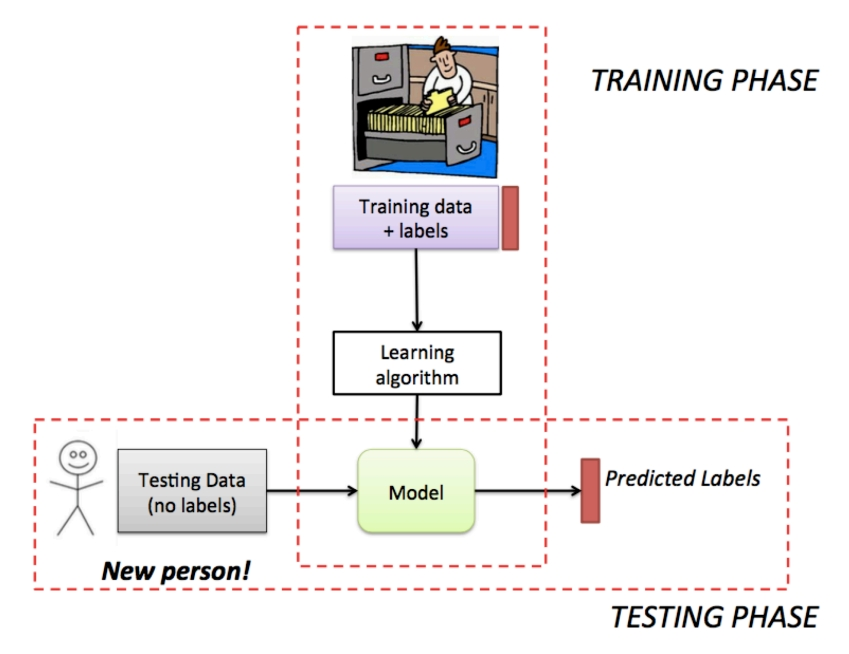

一个好的数据挖掘得到的模式应该具有以下特征：

- easily understood by humans 
- valid on new or test data with some degree of certainty 
- potentially useful 
- novel

数据挖掘的任务：

- Regression: Predicting missing or unavailable **numerical** data values (predictive)
- Classification: Finding a model that describes and distinguishes **categorical** data classes (predictive)
  - Methods: Decision trees, naive Bayesian classification, support vector machines, neural networks, logistic regression
- Clustering: Finding hidden patterns in data by isolating groups of **similar** objects (descriptive)
  - Principle: Maximizing intra-class similarity & minimizing interclass similarity
- Association: Finding items that occur together frequently in data (descriptive)
- Sequence analysis: Discovering sequential patterns (descriptive/predictive)
- Outlier(异常值) detection: Detecting significant deviation from normal behavior (predictive)

### 机器学习

机器学习则是致力于研究如何通过计算的手段，利用经验来改善系统的性能。可以理解为计算机从数据中产生“模型”（model）的算法，即“学习算法”（learning algorithm）。

机器学习作为计算机科学的重要分支，当然也和计算机科学的核心思想类似：给定一个输入空间（训练集、验证集等），通过学习算法实例化一个模型，用这个模型去预测、分类、检测、聚类测试集（或者是没见过的“新样本”）得到一个输出空间。

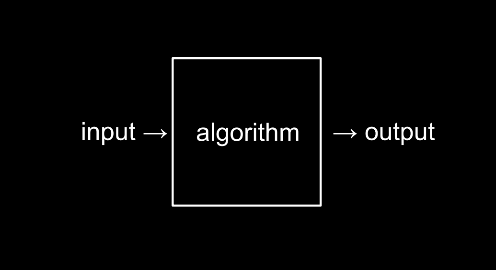

学得模型适用于新样本的能力，称为“泛化”(generalization)能力。具有强泛化能力的模型能很好地适用于整个样本空间。于是，尽管训练集通常只是样本空间的一个很小的采样，我们仍希望它能很好地反映出样本空间的特性，否则就很难期望在训练集上学得的模型能在整个样本空间上都工作得很好。通常假设样本空间中全体样本服从一个未知“分布”(distribution) $\mathcal{D}$，我们获得的每个样本都是独立地从这个分布上采样获得的，即“独立同分布”(independent and identically distributed，简称 $i.i.d.$)。一般而言，训练样本越多，我们得到的关于 $\mathcal{D}$ 的信息越多，这样就越有可能通过学习获得具有强泛化能力的模型。

我们可以把学习过程看作一个在所有假设(hypothesis)组成的空间中进行搜索的过程，搜索目标是找到与训练集“匹配”(fit)的假设，比如说我们要训练一个模型来识别一个西瓜是不是“好瓜”，可能的假设包含对根蒂、敲声、色泽等属性的规定。假设的表示一旦确定，假设空间及其规模大小就确定了，确定了假设空间之后就可以根据训练集来减少假设的可能性和（或）增加规则来形成模型，比如训练集中只有根蒂蜷缩、敲声清脆的西瓜是“好瓜”，那么就可以排除根蒂和敲声其他情况的假设。

当然可能存在一个训练集对应于多个假设的情况出现，这时就需要模型的归纳偏好来发挥作用。归纳偏好可看作学习算法自身在一个可能很庞大的假设空间中对假设进行选择的启发式或“价值观”。如果学习算法没有归纳偏好，那么这个模型对同一个训练集做出的判断可能不一致，比如在判断一个新样本中的西瓜是不是“好瓜”的过程中，可能第一次做出的判断是基于根蒂蜷缩假设，而第二次是基于敲声清脆假设，那么就可能存在对一个根蒂不蜷缩，但是敲声清脆的西瓜的判断不一致的情况，而这样的学习结果是没有意义的。

事实上，归纳偏好对应了学习算法本身所做出的关于“什么样的模型更好”的假设。在具体的现实问题中，这个假设是否成立，即算法的归纳偏好是否与问题本身匹配，大多数时候直接决定了算法能否取得好的性能。

事实上，没有完美的归纳偏好可以使得一个模型适用于所有的情况，换句话说，对于一个学习算法 $\mathfrak{L_a}$ 而言，若它在某些问题上比学习算法 $\mathfrak{L_b}$ 好，则必存在另一些问题，在那里 $\mathfrak{L_b}$ 比 $\mathfrak{L_a}$ 好。这个结论对任何算法均成立。也叫“没有免费的午餐”定理（No Free Lunch Theorem，简称 NFL 定理）：无论学习算法 $\mathfrak{L_a}$ 多聪明、学习算法 $\mathfrak{L_b}$ 多笨拙，它们的期望性能是一样的。

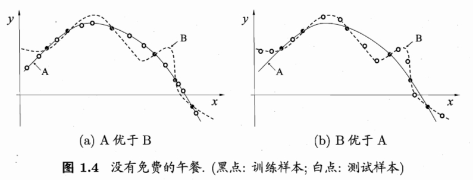

但是这并不意味着机器学习没有任何作用，我们需注意到，NFL 定理有一个重要前提：所有“问题”出现的机会相同、或所有问题同等重要。但实际情形并不是这样。很多时候，我们只关注自己正在试图解决的问题（例如某个具体应用任务），希望为它找到一个解决方案至于这个解决方案在别的问题、甚至在相似的问题上是否为好方案，我们并不关心，例如，为了快速从A地到达B地，如果我们正在考虑的A地是南京鼓楼、B地是南京新街口，那么“骑自行车”是很好的解决方案；这个方案对A地是南京鼓楼、B 地是北京新街口的情形显然很糟糕，但我们对此并不关心。

另外，NFL 定理还包含了均匀分布的假设，但是在实际情况中，一些假设出现的可能性比另外一些假设出现的可能性要高得多，比如圆粒的豌豆比皱粒的豌豆更常见，抛硬币是正反两面着地的情况比侧面着地的情况更常见。





所以，NFL 定理最重要的寓意，是让我们清楚地认识到，脱离具体问题,空泛地谈论“什么学习算法更好”毫无意义，因为若考虑所有潜在的问题，则所有学习算法都一样好。要谈论算法的相对优劣，必须要针对具体的学习问题；在某些问题上表现好的学习算法，在另一些问题上却可能不尽如人意，学习算法自身的归纳偏好与问题是否相配，往往会起到决定性的作用。

数据挖掘是从海量数据中发掘知识，这就必然涉及对“海量数据”的管理和分析。大体来说,数据库领域的研究为数据挖掘提供数据管理技术，而机器学习和统计学的研究为数据挖掘提供数据分析技术。由于统计学界的研究成果通常需要经由机器学习研究来形成有效的学习算法，之后再进入数据挖掘领域，因此从这个意义上说，统计学主要是通过机器学习对数据挖掘发挥影响，而机器学习领域和数据库领域则是数据挖掘的两大支撑。

### 过拟合、欠拟合和误差

> 模型有时也称为“学习器”（learner），可以看作学习算法在给定数据和参数空间上的实例化。学习算法通常有参数需要设置，使用不同的参数值和（或）训练数据，将产生不同的结果。

#### 过拟合（Overfitting）和欠拟合（underfitting）[^1]

[^1]: [欠拟合、过拟合及如何防止过拟合 - 知乎 (zhihu.com)](https://zhuanlan.zhihu.com/p/72038532)

> 过拟合也叫“过配”，欠拟合也叫“欠配”。

用一张图形象地表示过拟合和欠拟合：

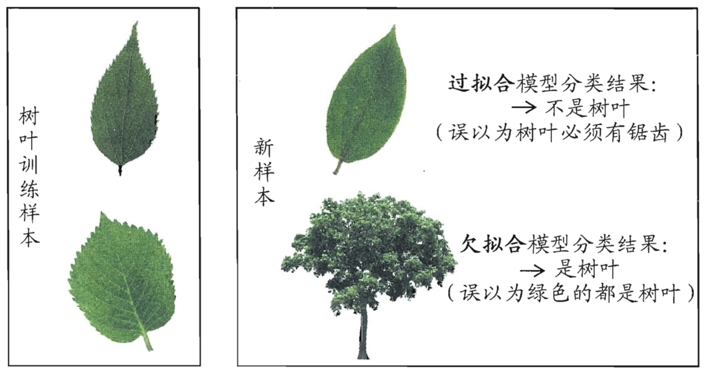

对于深度学习或机器学习模型而言，我们不仅要求它对训练数据集有很好的拟合（训练误差），同时也希望它可以对未知数据集（测试集）有很好的拟合结果（泛化能力），所产生的测试误差被称为泛化误差。度量泛化能力的好坏，最直观的表现就是模型的过拟合（overfitting）和欠拟合（underfitting）。过拟合和欠拟合是用于描述模型在训练过程中的两种状态。一般来说，训练过程会是如下所示的一个曲线图。

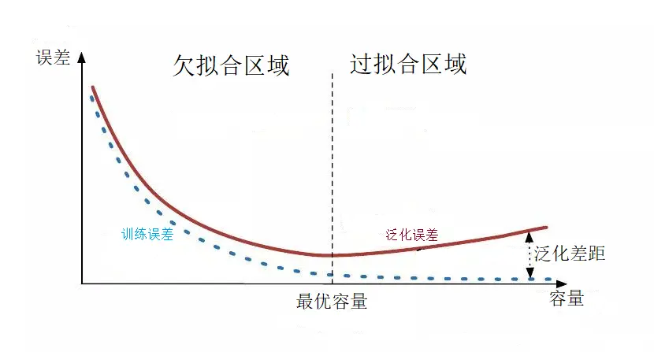

训练刚开始的时候，模型还在学习过程中，处于欠拟合区域。随着训练的进行，训练误差和泛化误差都下降。在到达一个临界点之后，训练集的误差下降，测试集的误差上升了，这个时候就进入了过拟合区域——由于训练出来的模型过度拟合了训练集，对训练集以外的数据却不能准确预测。

##### 欠拟合是什么以及如何解决

欠拟合是指模型不能在训练集上获得足够低的误差。换句换说，就是模型复杂度低，模型在训练集上就表现很差，没法学习到数据背后的规律。

欠拟合基本上都会发生在训练刚开始的时候，经过不断训练之后欠拟合应该不怎么需要考虑了。但是如果还是存在欠拟合，则可以通过增加网络复杂度或者在模型中增加特征的方法来解决欠拟合问题。

##### 过拟合是什么以及如何解决

过拟合是指训练误差和测试误差之间的差距太大。换句换说，就是模型复杂度高于实际问题，模型在训练集上表现很好，但在测试集上却表现很差。模型对训练集"死记硬背"（记住了不适用于测试集的训练集性质或特点），没有理解数据背后的规律，泛化能力差。

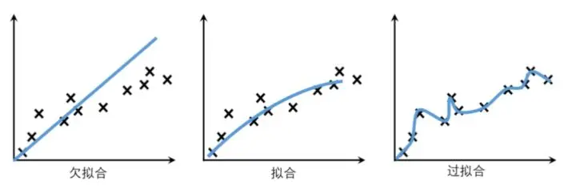

造成过拟合的原因主要有以下几种可能：

- **训练数据集样本单一，样本不足。**如果训练样本只有负样本，然后拿生成的模型去预测正样本，这肯定会导致预测不准确。所以训练样本要尽可能的全面，尽可能覆盖所有的数据类型。
- **训练数据中噪声干扰过大。**噪声指训练数据中的干扰数据。过多的干扰会导致记录了很多噪声特征，忽略了真实输入和输出之间的关系。
- **模型过于复杂。**模型太复杂，已经能够“死记硬背”记下了训练数据的信息，但是遇到没有见过的数据的时候却不能够变通，泛化能力太差。但是我们希望模型对不同的数据都有稳定的输出，所以有时应该尽量简化模型。

要想解决过拟合问题，就要显著减少测试误差而不过度增加训练误差，从而提高模型的泛化能力。我们可以使用正则化（Regularization）方法。**正则化是指修改学习算法，使其降低泛化误差而非训练误差。**

常用的正则化方法根据具体的使用策略不同可分为：

1. 直接提供正则化约束的参数正则化方法，如L1/L2正则化
2. 通过工程上的技巧来实现更低泛化误差的方法，如提前终止（Early stopping）和Dropout
3. 不直接提供约束的隐式正则化方法，如数据增强等。

**方法一：获取和使用更多的数据（数据集增强）——解决过拟合的根本性方法**

让机器学习或深度学习模型泛化能力更好的办法就是使用更多的数据进行训练。但是在实践中，我们拥有的数据量是有限的。解决这个问题的一种方法就是创建“假数据”并添加到训练集中——数据集增强。通过增加训练集的额外副本来增加训练集的大小，进而改进模型的泛化能力。

以图像数据集举例，可以通过旋转图像、缩放图像、随机裁剪、加入随机噪声、平移、镜像等方式来增加数据量。另外，在物体分类问题中，CNN在图像识别的过程中有强大的“不变性”规则，即待辨识的物体在图像中的形状、姿势、位置、图像整体明暗度都不会影响分类结果。这样我们就可以通过图像平移、翻转、缩放、切割等手段将数据库成倍扩充。

**方法二：采用合适的模型（控制模型的复杂度）**

过于复杂的模型会带来过拟合问题。对于模型的设计，目前公认的一个深度学习规律"deeper is better"。国内外各种大牛通过实验和竞赛发现，对于CNN来说，层数越多效果越好，但是也更容易产生过拟合，并且计算所耗费的时间也越长。

根据[奥卡姆剃刀原理（Occam's Razor）](https://en.wikipedia.org/wiki/Occam%27s_razor)：在同样能够解释已知观测现象的假设中，我们应该挑选“最简单”的那一个。对于模型的设计而言，我们应该选择简单、合适的模型解决复杂的问题。

**方法三：降低特征的数量**

对于一些特征工程而言，可以降低特征的数量——删除冗余特征，人工选择保留哪些特征。这种方法也可以解决过拟合问题。

#### 误差（Error），偏差（Bias），方差（Variance）以及噪声（Noise）之间的关系[^2][^3]

[^2]: [机器学习 -偏差与方差 - 知乎 (zhihu.com)](https://zhuanlan.zhihu.com/p/397672531)
[^3]: [误差，偏差，方差，噪声的关系 | GitHub (ustccoder.github.io)](https://ustccoder.github.io/2020/05/19/deep learning variance bias/)

在前面提到了模型的过拟合和欠拟合，那么应该如何刻画这两种情况，或者换句话说，对学习算法除了通过实验估计其泛化性能之外，还能通过什么方式去评估学习算法的好坏，它为什么具有这样的性能。“偏差-方差分解”（bias-variance decomposition）就是从偏差和方差的角度来解释学习算法泛化性能的一种重要工具。

在机器学习中，我们用训练数据集去训练一个模型，通常的做法是定义一个误差（Loss）函数，通过将这个误差的最小化过程，来提高模型的性能。在训练数据集上得到的Loss称之为**训练误差（training error）**，在测试集上得到的Loss称之为**泛化误差（generalization error）**，也即学习模型对训练数据集的预测值和训练数据集的真实值之间的差异叫训练误差，学习模型对新样本（可以是测试集）数据的预测值和真实值之间的差异叫泛化误差。

泛化误差可以通过数学上的变换[^4]将其分解为偏差（Bias）、方差（Variance）和噪声（Noise）。

[^4]: 周志华. 机器学习[M]. 北京：清华大学出版社，2016: 44.

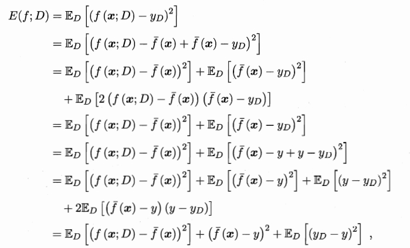

然而我们训练一个学习模型的目的是为了解决训练数据集这个领域中的一般化问题，而不是针对训练数据集这个特定集合的问题，因此单纯地将训练数据集的损失最小化，并不能保证在解决更一般的问题时模型仍然是最优，甚至不能保证模型是可用的。

比如拿热带雨林的树叶作为训练数据集来训练识别树叶的学习模型，我们希望得到的模型应该能够识别所有的树叶，但是这个模型可能在识别寒带、温带的树叶时表现就不好，甚至不能正确识别树叶。





如果我们能够获得所有可能的数据集合，并在这个数据集合上将损失最小化，那么学习得到的模型就可以称之为“真实模型”。当然，在现实生活中我们不可能获取并训练所有可能的数据，所以即使“真实模型”存在，我们也无法获得，或者获得这个模型的成本过高。因此，我们的最终目的是学习一个模型使其更加接近这个真实模型。

> 注意：我们能够用来学习的训练数据集只是全部数据中的一个子集。想象一下，我们现在收集几组不同的数据，因为每一组数据的不同，我们学习到模型的最小损失值也会有所不同，它们与“真实模型”的最小损失也是不一样的。

Bias和Variance分别从两个方面来描述我们学习到的模型与真实模型之间的差距。

- **Bias**（偏差）是用**所有可能的训练数据集**训练出的**所有模型**的输出的**平均值**与**真实模型**的输出值之间的差异，度量了学习算法的期望预测与真实结果的偏离程度。刻画了**学习算法本身的拟合能力**。

- **Variance**（方差）是**不同的训练数据集**训练出的模型输出值之间的差异（预测值离散程度），度量了**同样大小**的训练集的变动导致的学习性能的变化。刻画了**数据扰动所带来的影响**。
- **Noise**（噪声）的存在是学习算法所无法解决的问题，数据的质量决定了学习的上限。假设在数据已经给定的情况下，此时上限已定，我们要做的就是尽可能的接近这个上限。也即在当前任务下**任何学习算法**所能达到的期望泛化误差的下界。刻画了**学习问题本身的难度**。

可以理解为：偏差度量的是单个模型的学习能力，而方差度量的是同一个模型在不同数据集上的稳定性，噪声则是数据的 label 本身就是不准确的，因此模型无论如何学习都不可能消除。

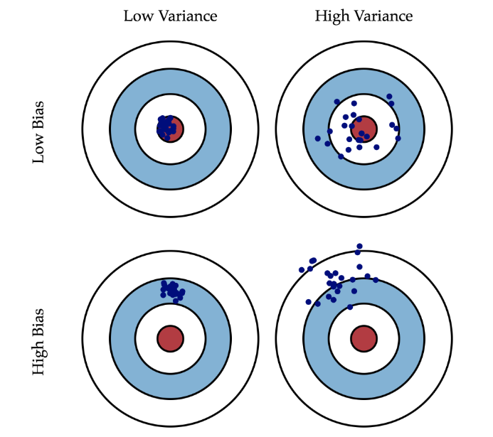

从前面的公式推导中可以得到泛化误差、偏差、方差以及噪声之间的关系[^4]，也就是说，泛化误差可以表示为偏差、方差和噪声之和（证明过程参考[西瓜书](#anchor1)）：
$$
\text{泛化误差} = \text{错误率（error）} = E(f;D) = bias^2(x) + var(x) + \varepsilon^2
$$
“偏差-方差分解”说明，泛化性能是由学习算法的能力、数据的充分性以及学习任务本身的难度所共同决定的。给定学习任务，为了取得好的泛化性能，则需使偏差较小，即能够充分拟合数据，并且使方差较小，即使得数据扰动产生的影响小。

#### 偏差、方差窘境（bias-variance dilemma）

一般来说，偏差与方差是有冲突的，这称为偏差-方差窘境（bias-variance dilemma）。给定学习任务，假定我们能控制学习算法的训练程度，则在训练不足时，学习器的拟合能力不够强，训练数据的扰动不足以使学习器产生显著变化，此时偏差主导了泛化错误率；随着训练程度的加深，学习器的拟合能力逐渐增强，训练数据发生的扰动渐渐能被学习器学到，方差逐渐主导了泛化错误率；在训练程度充足后，学习器的拟合能力已经非常强，训练数据发生的轻微扰动都会导致学习器发生显著变化，若训练数据自身的、非全局的特性被学习器学到了，则将发生过拟合。

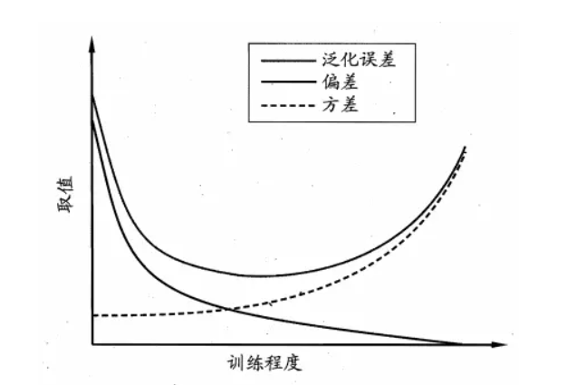

换句话说，**随着模型复杂度，模型迭代次数的增加，方差和偏差可能会出现此消彼长的现象**，训练不足，或者模型过于简单时会出现**Under-fitting(欠拟合)**，此时的模型误差主要来自于偏差，表现为模型在训练集和验证集上面的准确率都不高，说明出现了欠拟合。而训练太多，或者模型过于复杂时会出现**Over-fitting(过拟合)**，此时的模型误差主要来自于方差，表现为模型在训练集上的准确率非常高，但在验证集上面的准确率不高，说明出现了过拟合。



训练集、验证集和测试集这三个名词在机器学习领域极其常见，但很多人并不是特别清楚，尤其是后两个经常被人混用[^5]。

[^5]: [训练集，验证集，测试集分别是什么_训练集 验证集 测试集-CSDN博客](https://blog.csdn.net/qq_24884193/article/details/104071664)

在有监督(supervised)的机器学习中，数据集常被分成2~3个，即：训练集(train set)，验证集(validation set)，测试集(test set)。

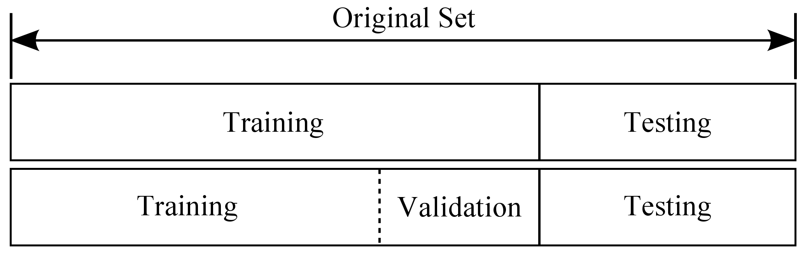

如果给定的样本数据充足，我们通常使用均匀随机抽样的方式将数据集划分成3个部分——训练集、验证集和测试集，这三个集合不能有交集，常见的比例是8:1:1。需要注意的是，通常都会给定训练集和测试集，而不会给验证集。这时候验证集该从哪里得到呢？一般的做法是，从训练集中均匀随机抽样一部分样本作为验证集。

**训练集**：训练集用来训练模型，即确定模型的权重和偏置这些参数，通常我们称这些参数为学习参数。

**验证集**：而验证集用于模型的选择，更具体地来说，验证集并不参与学习参数的确定，也就是验证集并没有参与梯度下降的过程。验证集只是为了选择超参数，比如网络层数、网络节点数、迭代次数、学习率这些都叫超参数。比如在KNN算法中，K值就是一个超参数。所以可以使用验证集来求出误差率最小的K。

> **参数**是模型中可被学习和调整的参数，通过训练数据进行学习和优化；而**超参数**则是手动设置的参数。

**测试集**：测试集只使用一次，即在训练完成后评价最终的模型时使用。它既不参与学习参数过程，也不参数超参数选择过程，而仅仅使用于模型的评价。值得注意的是，千万不能在训练过程中使用测试集，而后再用相同的测试集去测试模型。这样做其实是一个cheat，使得模型测试时准确率很高，或者说这时模型已经过拟合了。

为什么需要划分成三个部分呢？简而言之，这样做是为了防止过拟合。如果我们把所有数据都用来训练模型的话，建立的模型自然是最契合这些数据的，测试表现也好。但换了其它数据集测试这个模型效果可能就没那么好了。还是前面[树叶那个例子](#anchor2)，你把所有热带雨林的树叶都拿去训练了，这个模型识别热带雨林的树叶的效果很好，但是用寒带的树叶来测试这个模型，可能识别树叶的效果就没有识别热带雨林的树叶效果那么好。总而言之，训练集和测试集相同的话，模型评估结果可能比实际要好。

如果训练集比较小怎么办呢？这个时候**交叉验证**就登场了。因为训练集比较小，无法直接像前面那样直接分出训练集，验证集，测试集就可以了（简单交叉验证）。

需要说明的是，在实际情况下，人们不是很喜欢用交叉验证，主要是因为它会耗费较多的计算资源。一般直接把训练集按照50%-90%的比例分成训练集和验证集。但这也是根据具体情况来定的：如果超参数数量多，你可能就想用更大的验证集，而如果验证集的数量不够，那么最好还是用交叉验证吧。至于分成几份比较好，一般都是分成3、5和10份。

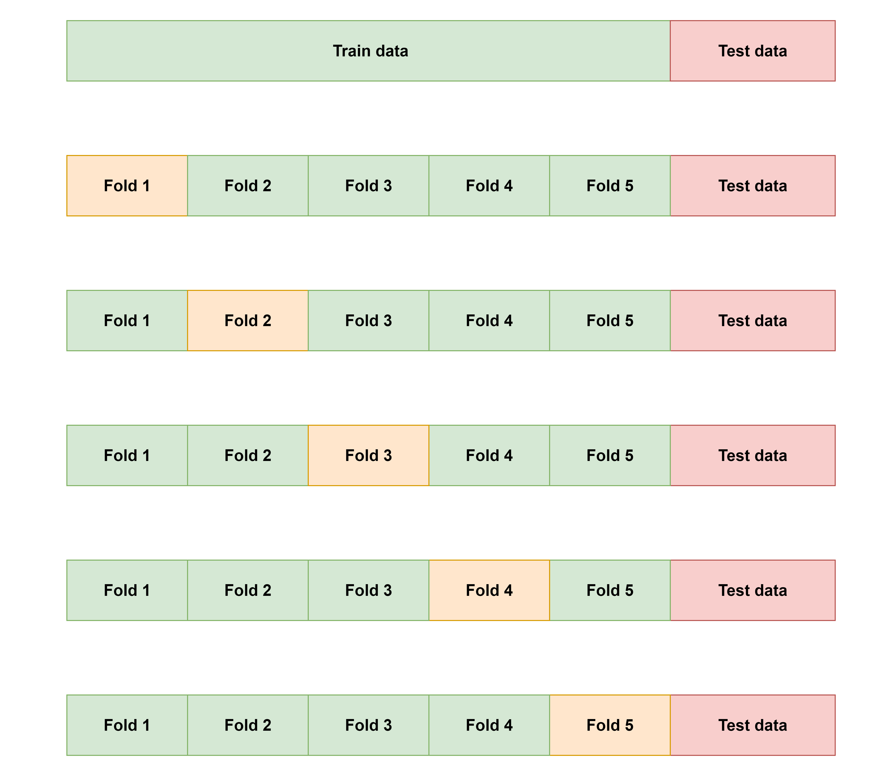

图最上面的部分表示我们拥有的数据，而后我们对数据进行了再次分割，主要是对训练集，假设将训练集分成5份（该数目被称为**折数**，5-fold交叉验证），每次都用其中4份来训练模型，黄色的那份用来验证4份训练出来的模型的准确率，记下准确率。然后再次在这5份中取另外4份做训练集，1份做验证集，再次得到一个模型的准确率，一共做五次（每个fold都做一次验证集）。直到所有5份都做过1次验证集，也即验证集名额循环了一圈，交叉验证的过程就结束。算得这5次准确率的均值，留下准确率最高的模型，即确定该模型的超参数，也即确定了最终模型的超参数。



#### 偏差、方差和过拟合、欠拟合的关系

一般来说，简单的模型会有一个较大的偏差和较小的方差，复杂的模型偏差较小方差较大。

欠拟合：模型不能适配训练样本，有一个很大的偏差，但方差比较小。比如，我们有一个本质上是多项式的连续非线性数据，但模型只能表示线性关系。在此情况下，我们向模型提供多少数据不重要，因为模型根本无法表示数据的基本关系，模型不能适配训练样本，有一个很大的偏差，因此我们需要更复杂的模型。那么，是不是模型越复杂拟合程度越高越好呢？也不是，因为还有方差。

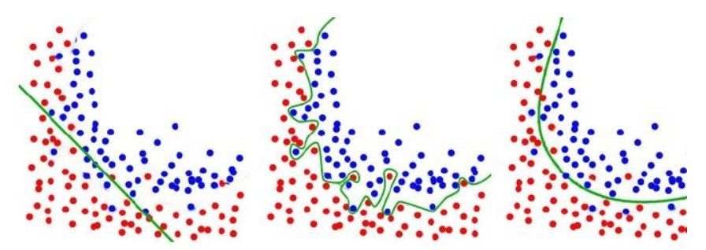

过拟合：模型很好的适配训练样本，但在测试集上表现很糟，有一个很大的方差，但偏差较小。方差大就是指模型过于拟合训练数据，以至于没办法把模型的结果泛化。而泛化正是机器学习要解决的问题，如果一个模型只能对一组特定的数据有效，换了数据就无效，我们就说这个模型过拟合。这就是模型很好的适配训练样本，但在测试集上表现很糟，有一个很大的方差。

#### 偏差、方差与模型复杂度的关系

由前面偏差和方差的介绍，我们来总结一下偏差和方差的来源：我们训练的机器学习模型，必不可少地对数据依赖。但是，如果你不清楚数据服从一个什么样的分布，或是没办法拿到所有可能的数据（大部分情况下拿不到所有数据），那么我们训练出来的模型和真实模型之间存在不一致性。这种不一致性表现在两个方面：偏差和方差。

那么，既然偏差和方差是这么来的，而且还是无法避免的，那么我们有什么办法尽量减少它对模型的影响呢？

一个好的办法就是**正确选择模型的复杂度**。复杂度高的模型通常对训练数据有很好的拟合能力，但是对测试数据就不一定了。而复杂度太低的模型又不能很好的拟合训练数据，更不能很好的拟合测试数据。因此，选择合适的模型复杂度显得尤为重要。

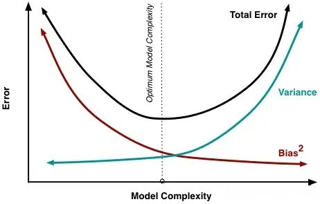

#### 偏差、方差与bagging、boosting的关系

Bagging算法是对训练样本进行采样，产生出若干不同的子集，再从每个数据子集中训练出一个分类器，取这些分类器的平均，所以是降低模型的方差（variance）。Bagging算法和Random Forest这种并行算法都有这个效果。

Boosting则是迭代算法，每一次迭代都根据上一次迭代的预测结果对样本进行权重调整，所以随着迭代不断进行，误差会越来越小，所以模型的偏差（bias）会不断降低。

#### 偏差、方差和K折交叉验证的关系

K-fold Cross Validation的思想：将原始数据分成 `K` 组(一般是均分)，将每个子集数据分别做一次验证集，其余的 `K-1` 组子集数据作为训练集，这样会得到 `K` 个模型，用这 `K` 个模型最终的验证集的分类准确率的平均数作为此 K-CV 下分类器的性能指标。

对于一系列模型 $F(\hat{f}, \theta)$， 我们使用Cross Validation的目的是获得预测误差的无偏估计量CV，从而可以用来选择一个最优的Theta*，使得CV最小。假设K-folds cross validation，CV统计量定义为每个子集中误差的平均值，而K的大小和CV平均值的bias和variance是有关的：
$$
CV = \frac{1}{K}\sum^K_{k=1}\frac{1}{m}\sum^m_{i=1}(\hat{f}^k-y_i)^2
$$
其中，$m = \frac{N}{K}$ 代表每个子集的大小， `N` 是总的训练样本量，`K` 是子集的数目。

当 `K` 较大时，`m` 较小，模型建立在较大的 `N-m` 上，经过更多次数的平均可以学习得到更符合真实数据分布的模型，Bias就小了，但是这样一来模型就更加拟合训练数据集，再去测试集上预测的时候预测误差的期望值就变大了，从而Variance就大了；`K `较小的时候，模型不会过度拟合训练数据，从而Bias较大，但是正因为没有过度拟合训练数据，Variance也较小。

#### 如何降低泛化误差

在这里我们不讨论如何降低噪声，在我们获得数据集时，数据集本身可能就会存在噪声，因此很难进行降低。我们主要讨论如何通过降低偏差和方差来降低泛化误差。同时，由于偏差和方差是无法完全避免的，因此我们只能尽量减少其影响。

整体思路：

1. 在避免偏差时，**需尽量选择正确的模型**，一个非线性问题而我们一直用线性模型去解决，那无论如何，高偏差是无法避免的。
2. 有了正确的模型，**我们还要慎重选择数据集的大小**，通常数据集越大越好，但大到数据集已经对整体所有数据有了一定的代表性后，再多的数据已经不能提升模型了，反而会带来计算量的增加。而训练数据太小一定是不好的，这会带来过拟合，模型复杂度太高，方差很大，不同数据集训练出来的模型变化非常大。
3. 最后，**要选择合适的模型复杂度**，复杂度高的模型通常对训练数据有很好的拟合能力，但是也容易造成过拟合。

如何降低偏差：

1. **增加算法复杂度**，但是要注意单纯的增加算法复杂度可能会导致方差的增加，可以结合正则项进行惩罚。
2. **进行合理的特征工程**，检查是否遗漏重要特征，寻找更具有代表性的特征，使用更多的特征（增加模型复杂度）。
3. **优化网络结构**，因为偏差大意味着网络的拟合效果不好，因此可以更换网络层。

如何降低方差：

1. **增加训练样本**，使用更多的数据，减少数据扰动所造成的影响。样本代表性不足是方差大的首要原因，增加样本也是降低方差最简单的方法。
2. **引入正则项**（L1正则，L2正则，Dropout等）。
3. **特征提取**，对输入的特征进行提取，特征变少方差也会减小。
4. **降低模型复杂度**，或者采用早停，减少迭代周期。
5. **交叉验证法**。

### 评估方法

通常我们把分类错误的样本数占样本总数的比例称为“错误率”（error rate），即如果在 `m` 个样本中有 `a` 个样本分类错误，则错误率 $E = \frac{a}{m}$ ；相应地， $1 - \frac{a}{m}$ 称为“精度”（accuracy），即“精度 = 1 - 错误率”。更一般地，我们把学习器的实际预测输出与样本的真实输出之间的差异称为“误差”（error），学习器在训练集上的误差称为“训练误差”）training error）或“经验误差”（empirical error），在新样本上的误差称为“泛化误差”（generalization error）。显然，我们希望得到泛化误差小的学习器。然而，我们事先并不知道新样本是什么样，实际能做的是努力使经验误差最小化。在很多情况下，我们可以学得一个经验误差很小、在训练集上表现很好的学习器，例如甚至对所有训练样本都分类正确，即分类错误率为零，分类精度为100%。但这是不是我们想要的学习器呢？遗憾的是，这样的学习器在多数情况下都不好。

> 这里所说的“误差”均指误差期望。

#### 留出法（hold-out）

#### 交叉验证法（cross validation）——k折交叉验证（k-fold cross validation）

#### 自助法（bootstrapping）

#### 调参与最终模型

