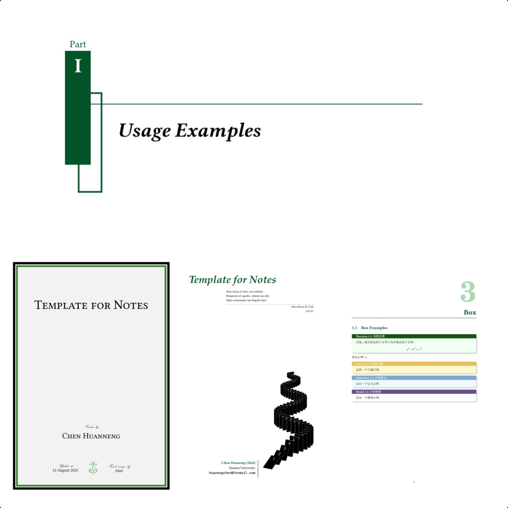
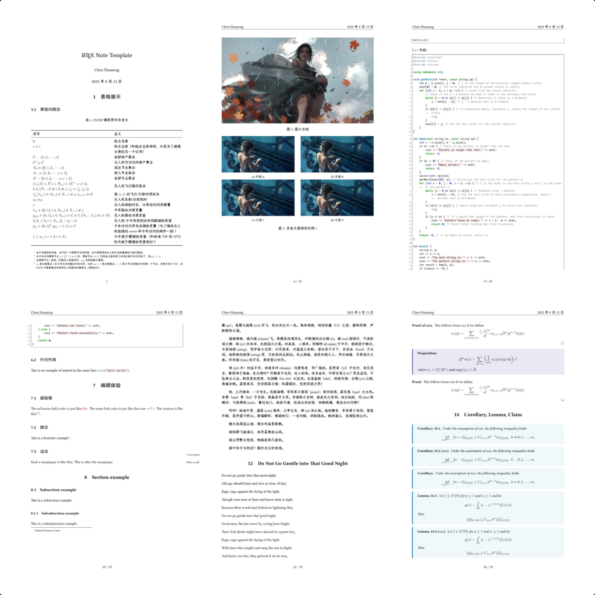

## 编译环境

我在本地编译的环境：

```powershell
PS C:\> tex -version
TeX 3.141592653 (TeX Live 2025)
kpathsea version 6.4.1
Copyright 2025 D.E. Knuth.
There is NO warranty.  Redistribution of this software is
covered by the terms of both the TeX copyright and
the Lesser GNU General Public License.
For more information about these matters, see the file
named COPYING and the TeX source.
Primary author of TeX: D.E. Knuth.

PS C:\> latex -version
pdfTeX 3.141592653-2.6-1.40.27 (TeX Live 2025)
kpathsea version 6.4.1
Copyright 2025 Han The Thanh (pdfTeX) et al.
There is NO warranty.  Redistribution of this software is
covered by the terms of both the pdfTeX copyright and
the Lesser GNU General Public License.
For more information about these matters, see the file
named COPYING and the pdfTeX source.
Primary author of pdfTeX: Han The Thanh (pdfTeX) et al.
Compiled with libpng 1.6.46; using libpng 1.6.46
Compiled with zlib 1.3.1; using zlib 1.3.1
Compiled with xpdf version 4.04

PS C:\> xelatex -version
XeTeX 3.141592653-2.6-0.999997 (TeX Live 2025)
kpathsea version 6.4.1
Copyright 2025 SIL International, Jonathan Kew and Khaled Hosny.
There is NO warranty.  Redistribution of this software is
covered by the terms of both the XeTeX copyright and
the Lesser GNU General Public License.
For more information about these matters, see the file
named COPYING and the XeTeX source.
Primary author of XeTeX: Jonathan Kew.
Compiled with ICU version 76.1; using 76.1
Compiled with zlib version 1.3.1; using 1.3.1
Compiled with FreeType2 version 2.13.3; using 2.13.3
Compiled with Graphite2 version 1.3.14; using 1.3.14
Compiled with HarfBuzz version 10.2.0; using 10.2.0
Compiled with libpng version 1.6.46; using 1.6.46
Compiled with pplib version v2.2
Compiled with fontconfig version 2.15.0; using 2.15.0
```

## 笔记模板和书籍模板

我的笔记模板和书籍模板都可以在我的仓库 [chen-huaneng/latex-template](https://github.com/chen-huaneng/latex-template) 中找到。





## 参考文档

对于特定的包，可以通过命令行查看相应的包说明，比如 `amsthm` 包可以通过下面的命令在本地的 PDF 阅读器打开：
```bash
texdoc amsthm
```

以下是我在编写模板时参考的一些文档或者链接：

- 官方网站，提供了一些文档的链接：[LaTeX Documentation](https://www.latex-project.org/help/documentation/)
- 最基本的 Package, Class 包文档（`texdoc clsguide`）：[LaTeX for package and class authors current version](https://www.latex-project.org/help/documentation/clsguide.pdf)
- 文档编写的一些相关包的介绍：[如何写一个package或者class - 知乎](https://zhuanlan.zhihu.com/p/19705200)
- 一个用于数学笔记的简洁模板：[fenglielie/latexzero: LaTeX Templates for Mathematical Notes](https://github.com/fenglielie/latexzero)

