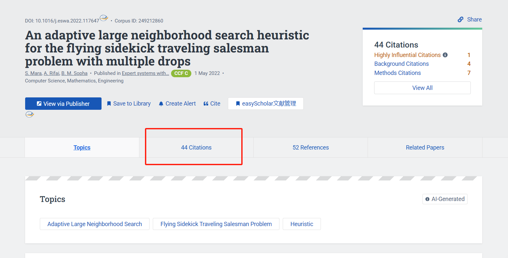
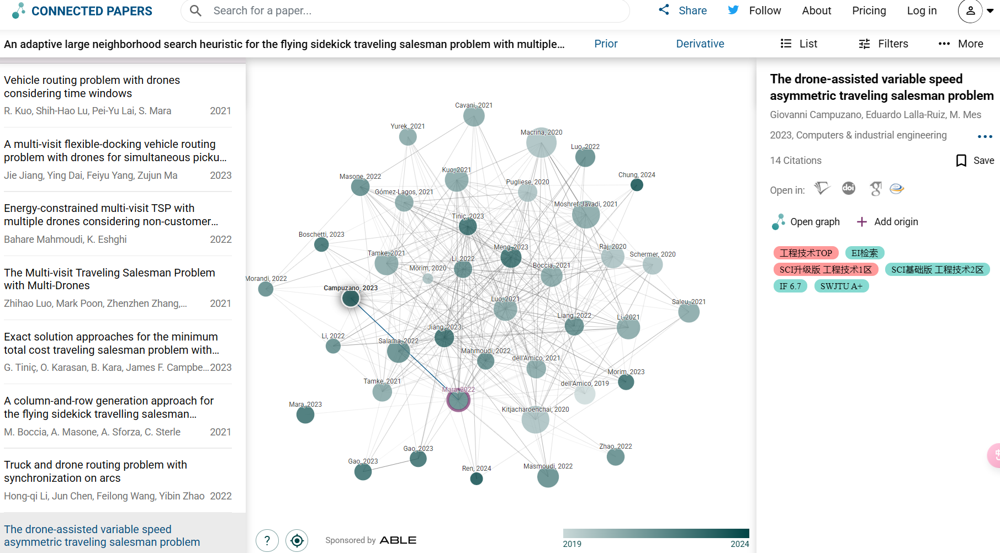

## 文献相关

### 检索引擎

**主要的搜索引擎**：

- [中国知网 (cnki.net)](https://www.cnki.net/) - 著名垄断机构，不多介绍
- [Document Search - All Databases (webofscience.com)](https://www.webofscience.com/wos/alldb/basic-search) - 主要用来查英文文献



- [硕博士应该知道的Web of Science文献检索与分析技巧 - 知乎 (zhihu.com)](https://zhuanlan.zhihu.com/p/384906270)

**Web of Science的基本检索技巧**

A. **不区分大小写：**Gold catalysis 与 gold CATALYSIS 检索结果一致。

B. **检索运算符（布尔运算符）：**AND（与），OR（或），NOT（非）, NEAR，SAME。其中最常用的是前三种。使用 AND 可查找包含被该运算符分开的所有检索词的记录；使用 OR 可查找包含被该运算符分开的任何检索词的记录；使用 NOT 可将包含特定检索词的记录从检索结果中排除；使用 NEAR/x 可查找由该运算符连接的检索词之间相隔指定数量的单词的记录；在“地址”检索中，使用 SAME 将检索限制为出现在“全记录”同一地址中的检索词。

C. **通配符（\*？$）**：星号 (\*) 表示任何字符组，包括空字符(如Fan J*可以指Fan Jie，Fan Jun, Fan Jian, Fan Jia等)；问号 (?) 表示任意一个字符，对于检索最后一个字符不确定的作者姓氏非常有用。例如，Barthold? 可查找 Bartholdi 和 Bartholdy，但不会查找 Barthod；美元符号 (\$) 表示零或一个字符，对于查找同一单词的英国拼写和美国拼写非常有用。例如，flavo$r 可查找 flavor 和 flavour。

D. **括号**：括号用于将合成布尔运算符进行分组。例如：

- (Antibiotic OR Antiviral) AND (Alga* OR Seaweed)
- (Pagets OR Paget's) AND (cell* AND tumor*)



- [PubMed (nih.gov)](https://pubmed.ncbi.nlm.nih.gov/) - 文献相关度高，主要用于关键词精确查找相关文献
- [Google Scholar](https://scholar.google.com/) - 搜索的文献量大，相关性会低一些
- [Mendeley - Reference Management Software](https://www.mendeley.com/?interaction_required=true)
- Sci-Hub 不用多介绍，将知识带给每个人



Sci-Hub 主要用于精确搜索，要先获取需要文献的 DOI (Digital Object Unique Identifier)，然后再根据 DOI 去找对应的 PDF。

DOI 是指数字对象唯一标识符，可以理解为数字资源唯一的“身份证号码”，可以用DOI来标识文献、视频、报告或书籍等数字资源。目前，大部分学术文献（主要为2000年之后的文献）都有专属的 DOI，只要知道了一篇文献的 DOI，就能够查询到该文献的作者、标题、期刊、官方链接等信息。

每个 DOI 都由前缀和后缀两部分组成，之间用 `/` 分开，并且前缀以 `.` 再分为两部分。前缀由国际数字对象识别号基金会（International DOI Foundation）确定，后缀部分由资源发布者自行指定，用于区分一个单独的数字资料，具有唯一性。

一般来说，年份久远（2000年之前）的文献没有 DOI。至于中文文献，因为目前国内 DOI 的使用还处于初级阶段，所以现在还不能通过 DOI 来下载国内文献。

所有 DOI 均以“10”开头，如：

10.1016/j.foodres.2017.07.078

10.1080/09205063.2018.1465664

**镜像网址**：

- [Sci-Hub: 将知识带给每个人](https://sci-hub.se/)
- [Sci-Hub: 对每个人的知识](https://sci-hub.st/)
- [Sci-Hub: 对每个人的知识](https://sci-hub.ru/)
- [Sci-Hub: 对每个人的知识](https://www.sci-hub.ru/)
- [Sci-Hub: 将知识带给每个人](https://www.sci-hub.st/)
- [Sci-Hub: 将知识带给每个人](https://www.sci-hub.se/)
- [Sci-Hub journal:latest sci-hub mirror links](https://www.sci-hub.wf/)
- [sci-hub proxy search links](https://www.sci-hub.ee/)
- [Sci-Hub: removing barriers in the way of science](https://www.sci-hub.ren/)
- [Sci-Hub official website](https://www.sci-hub.yt/)
- [Sci-Hub: 对每个人的知识](https://www.sci-hub.ru/)
- [sci-hub brasil (wellesu.com)](https://www.wellesu.com/)
- [Science Hub (tesble.com)](https://www.tesble.com/)
- [sci-hub:scihub最新可用地址 (kvnp.top)](https://sci-hub.kvnp.top/)
- [Sci-Hub journal:latest sci-hub mirror links](https://sci-hub.shop/)

**论坛**：

- [Sci-Hub最新可用官方网站网址（2024年10月19日更新） - Sci-Hub中文社区](https://discuss.sci-hub.org.cn/d/279)
- [Sci-Hub文献检索 | 科学是照亮世界的火把](https://sci-hub.org.cn/)
- [SCI-Hub论文下载可用网址链接（实时更新） - YoviSun工具集](https://tool.yovisun.com/scihub/)
- [Love Science,Love Sci-Hub! – The latest Sci-Hub working domain (wordpress.com)](https://lovescihub.wordpress.com/)



其他：

- [Home Feed | ResearchGate](https://www.researchgate.net/)
- [PubsOnLine (informs.org)](https://pubsonline.informs.org/)
- [文献互助平台 - 科研通(AbleSci.com)](https://www.ablesci.com/)
- [PubScholar公益学术平台](https://pubscholar.cn/)
- [学术范 - 高效做科研 (xueshufan.com)](https://www.xueshufan.com/user/home)
- [百度学术 - 保持学习的态度 (baidu.com)](https://xueshu.baidu.com/)
- [搜索 学术 (bing.com)](https://cn.bing.com/academic)
- [谷粉学术论坛-文献互助 (yuyingufen.com)](https://bbs.yuyingufen.com/)
- [Crossref Metadata Search](https://search.crossref.org/)
- [Sci-Hub:SciHub科研学术网址导航](https://www.scihub.net.cn/)

### 查找文献中的代码

- [CatalyzeX: open-source AI code to catalyze your research](https://www.catalyzex.com/)
- [The latest in Machine Learning | Papers With Code](https://paperswithcode.com/)
- [GitHub](https://github.com/)：一般通过 [Google Scholar](https://scholar.google.com/) 可以找到相应的作者，然后顺藤摸瓜可以找到相应的 GitHub 仓库，或者直接检索相应的模型，如果都没有的话可能需要用其他办法
- 直接发邮件给 Paper 作者

### 查找相关的文献

这里说的相关，既包括引用（这个比较容易找到）和被引，也包括主题相关（大多数时候关键词检索很难找到想要找的文献）。

- [Semantic Scholar | AI-Powered Research Tool](https://www.semanticscholar.org/)：可以通过查找引用这篇文章的 Paper 来寻找相关的文献



- [Connected Papers | Find and explore academic papers](https://www.connectedpapers.com/)：
  - 年份越往后的颜色越深，越往前则颜色越浅
  - 文献之间的关系是通过相似性而不是引用来连接
  - 文献节点的大小表示被引用的次数的多少



### 读文献的方法论

- [你认为在精读英文文献时有哪些好习惯？ - 知乎 (zhihu.com)](https://www.zhihu.com/question/31189581/answer/1540665172)
- [研究生们刚开始看英文文献是怎么看的？ - 知乎 (zhihu.com)](https://www.zhihu.com/question/345516318/answer/1138235280)
- [研究生新生要怎么看论文？ - 知乎 (zhihu.com)](https://www.zhihu.com/question/304334959/answer/553782865)
- [研究生新生要怎么看论文？ - 知乎 (zhihu.com)](https://www.zhihu.com/question/304334959/answer/1312667716)
- [如何有针对地高效地阅读一篇学术论文？ - 知乎 (zhihu.com)](https://www.zhihu.com/question/23924014/answer/26470331)

### 论文降重

- [PaperPass官网-论文查重-论文降重-论文检测-免费论文查重检测系统-智齿数汇](https://www.paperpass.com/)
- [Scribbr Plagiarism Checker step 1 – Upload document - Scribbr](https://app.scribbr.com/plagiarism-checker)
- [知网查重-知网个人查重服务 (cnki.net)](https://cx.cnki.net/#/login)

### 文献翻译

- [CopyTranslator](https://copytranslator.github.io/)
- [知云文献翻译客户端软件 (zhiyunwenxian.cn)](https://www.zhiyunwenxian.cn/)
- [彩云小译官网 - 高效准确的翻译工具 | 文字翻译 | 文档翻译 | 网页翻译 | 浏览器插件 | 双语对照 | 术语库 (caiyunapp.com)](https://fanyi.caiyunapp.com/)
- [Atman Cloud Translation (atman360.com)](https://fanyi.atman360.com/index) - 主要针对医学领域

### 其他

- [CSRankings: Computer Science Rankings](https://csrankings.org/#/index?all&us) - 根据文献对学校/机构进行排名，针对计算机

## 绘图及数据可视化

- [draw.io](https://www.drawio.com/) 绘制流程图和简单的示意图
- Powerpoint + Icon 绘制简单的示意图
- Python + Matplotlib 数据分析和数据可视化，学习 Python 过程中顺带学习
- [Inkscape](https://inkscape.org/) 通用矢量美化，通过教程跟着做项目，比如 [Inkscape Beginner Tutorial | Icon Drawing with Basic Shapes](https://www.youtube.com/@LogosByNick)
- [Asymptote](https://asymptote.sourceforge.io/) 创建高质量的精确数学图形、科学图表、技术图解、三维线框/曲面图，完美集成 $\LaTeX$，直接从官网文档开始学习
- [GIMP](https://www.gimp.org/) 开源版 Photoshop，后期处理图片，同样通过教程跟着做项目

## FAQ

### 知网中期刊的“综合影响因子”和“复合影响因子”分别是什么意思？

最通俗的解释就是，被引用次数和发表论文总数的占比。分值越高证明该期刊含金量以及大家认同度越高。当然这个分值也不是绝对的，很多期刊收录的论文不管引用还是下载量很高，没有任何影响因子。所以很少有单位评判一本期刊好坏以此为依据。目前大家评判标准还是以：

- **国内：南核—北核—科核—知网专刊——知网收录——其它数据库（万方、维普、龙源）**
- **国际：SSCI——SCI——EI——CPCI**

> [什么是北大核心、南大核心、SCI、SSCI、CSSCI？ - 知乎 (zhihu.com)](https://zhuanlan.zhihu.com/p/84200607)

### 如何获得 Springer 和 Cambridge 出版图书的清晰电子版

Library Genesis 上的一些资源来自个人扫描，而非出版社提供的电子版，往往会很模糊。事实上可以从 Sci-Hub 直接获得：

- [SpringerLink](https://link.springer.com/) 直接使用图书的链接或 doi 即可；
- [CambridgeCore](https://www.cambridge.org/core) 需要使用图书章节的链接或 doi。

### 论文中引用网页内容在文中怎么标注

如果论文格式有要求就按照学校或者通知的要求标注，这里讲一下在 $\LaTeX$ 中如何引用。首先在 `bib` 文件中以如下格式存储，正文中以 `\cite` 或者其他引用命令引用，同时注意在正文前调用 `\usepackage{url}` 使得链接显示：

```latex
@online{PCSELsim2023,
howpublished = {[EB/OL]},
url = {https://www.semergytech.com/products/},
year={[2023-10-12]},
title = {PCSELSim: PCSEL Modeling and Simulation Tool},
author = {Semergytech}
}
```

一部分教程会使用 `@misc` 而非 `@online`，`misc` 对应文献类型为“其他”，属于用通用模板硬凑出相应格式，不推荐。其他格式可以参考 Zepling Lee 维护的 [zepinglee/gbt7714-bibtex-style: GB/T 7714-2015 BibTeX Style](https://github.com/zepinglee/gbt7714-bibtex-style)。对于引用字段的说明：

- 主要责任者：作者名字；如果没有作者，可以写这篇报道的责任机构，比如说央视网、XXX研究所、XXX局等
- 题名：这一项一般没有什么异议，直接复制粘贴就好
- 文献类型标志：在 GB2015 附录 B 的表 B.1 中，可以找到电子公告的文献类型标识代码是 EB
- 文献载体类型：在 GB2015 附录 B 的表 B.2 中，可以找到联机网络的载体类型标识代码是 OL
- 更新或修改日期：资源的发布日期
- 引用日期：在着手写论文到提交论文之间都可以
- 获取和访问路径：网址

### 如何把知网的 `.caj` 文件转换为 `.pdf`

参考：[caj2pdf/caj2pdf: Convert CAJ (China Academic Journals) files to PDF. 转换中国知网 CAJ 格式文献为 PDF。佛系转换，成功与否，皆是玄学。](https://github.com/caj2pdf/caj2pdf)

