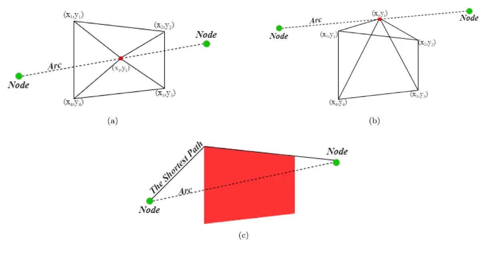
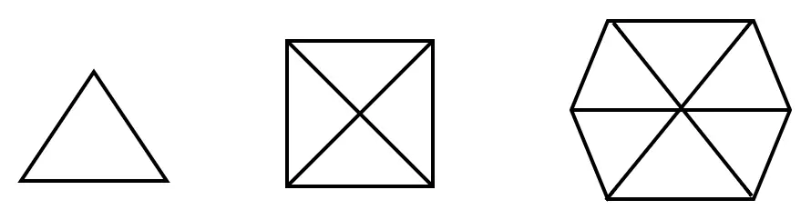
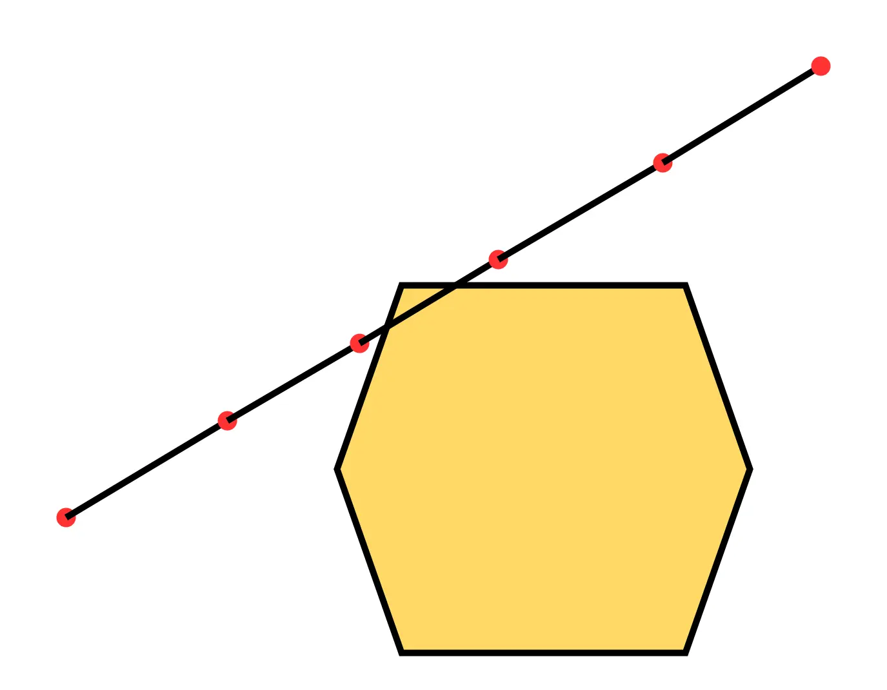
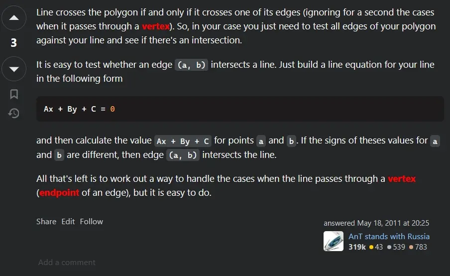

在我读一篇关于[基于机器学习的无人机路线规划](https://doi.org/10.1016/j.cor.2021.105524)问题的论文时，文章中提出了一个检测无人机行驶的路线中如果遇到受限制的区域（比如禁飞区、军事基地等）应该如何绕行的问题，其中就需要先检测飞行的路线是否经过受限制的区域的问题，在这里我们可以将这个问题简化成：

> 给定一条线段的两个端点和一个多边形的所有顶点的坐标值（横坐标和纵坐标），如何判断这条线段是否穿过多边形。

论文中提出了一种方法，大致的思路是：

1. 将线段用多个点划分，将每个点和多边形的两个相邻顶点相连形成三角形
2. 遍历多边形的顶点得到一组三角形，计算所有三角形的面积和
3. 比较三角形的面积和与多边形的面积，如果相等则线段穿过多边形
4. 对所有的划分点重复上面的步骤，如果有一次相等则说明线段穿过这个多边形

比如下图的(a)和(b)就分别表示了线段穿过多边形内部和多边形的顶点的情况，图(c)则表示图(a)的情况，无人机应该如何绕行的情况。

乍一看会觉得这个算法很巧妙，因为文章中用来计算三角形面积和多边形的面积公式只需要用到顶点和端点的坐标值即可。对这个公式感兴趣的可以参考[Shoelace formula - Wikiwand](https://www.wikiwand.com/en/articles/Shoelace_formula)和[【国际数学竞赛】任意多边形面积计算公式 - 知乎](https://zhuanlan.zhihu.com/p/110025234)。



计算任意多边形的面积公式（[Shoelace formula - Wikiwand](https://www.wikiwand.com/en/articles/Shoelace_formula)）：
$$
S_{\text{n vertex polygon area}} = \frac{1}{2}|\sum^n_{i=1}(x_iy_{i+1}-x_{i+1}y_i)|
$$
其中$x_{n+1} = x_1, y_{n+1} = y_1$。



但是这个方法存在几个问题：

1. 如果多边形的边数很多，那么相应的三角形数量也会增加，计算的时间复杂度会随着多边形的边数变化而变化，比如对于正多边形和取点在中心点的情况，三角形的数量就是 $n$，$n$ 是多边形的边数（$n >3$）
2. 如果取的点不好，存在误判的可能，当然可以通过取更多的点来防止这种情况的发生，但是相对于效率而言不是很好的解决方法
3. 如果多边形的边数为 $n$，取点的数量为 $k$，那么这个算法的时间复杂度为 $O(kn)$

比如，如果取的点是红色的点，因为所有的点根据上面的算法得到的三角形面积和的值不等于多边形的面积值，所以会判断这个线段没有穿过多边形。

因为论文提出的算法可能存在的效率底下和误判情况，我就思考能不能用更好的方法来替换上面所说的方法，参考[python - Determine if a line segment intersects a polygon - Stack Overflow](https://stackoverflow.com/questions/6050392/determine-if-a-line-segment-intersects-a-polygon)这个问题，我发现了一个很简单的思路：

> 线段穿过一个多边形的情况有两种：
>
> 1. 第一种是线段穿过了多边形的某个顶点，这种情况只需要遍历多边形的顶点，分别判断顶点是否在线段所在直线上（加上两个端点的坐标大小限制）就可以判断
> 2. 第二种是线段穿过了多边形的某条边，这种情况可以简化成分别判断多边形的边是否跟线段相交，也就是判断两条线段是否相交的问题，这个问题可以参考[Line–line intersection - Wikiwand](https://www.wikiwand.com/en/articles/Line-line_intersection)，简单来说就是判断某条线段的两个端点是否在另一条线段的两侧，如果分布在两侧则相交，否则不相交。

这个算法的好处在于，时间复杂度是 $O(n)$，其中 $n$ 是多边形的边数，而且不会出现误判的情况。

这里只讨论了针对多边形的情况，对于不是多边形，比如说针对任意的封闭曲面的情况，我的一个简单思路是，用多边形去模拟封闭曲面（类似于微积分的思想，以直代曲），当然具体实现可能不是用这种方法，只是提供一种可能的思路。另外，这里讨论的问题也只针对二维的情况，对于三维的情况，这里的方法就不适用了。

类似的问题还有：

> 已知一个点和一个多边形的坐标值，如何判断这个点是否在多边形的内部。

关于这个问题可以参考[performance - How can I determine whether a 2D Point is within a Polygon? - Stack Overflow](https://stackoverflow.com/questions/217578/how-can-i-determine-whether-a-2d-point-is-within-a-polygon)。

