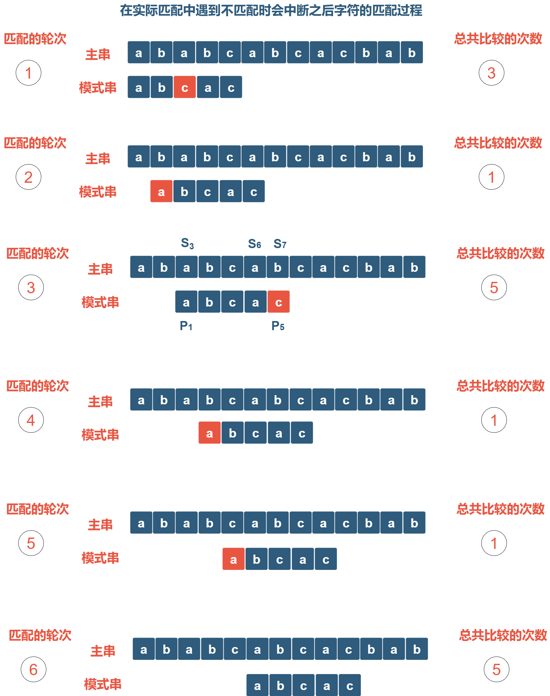
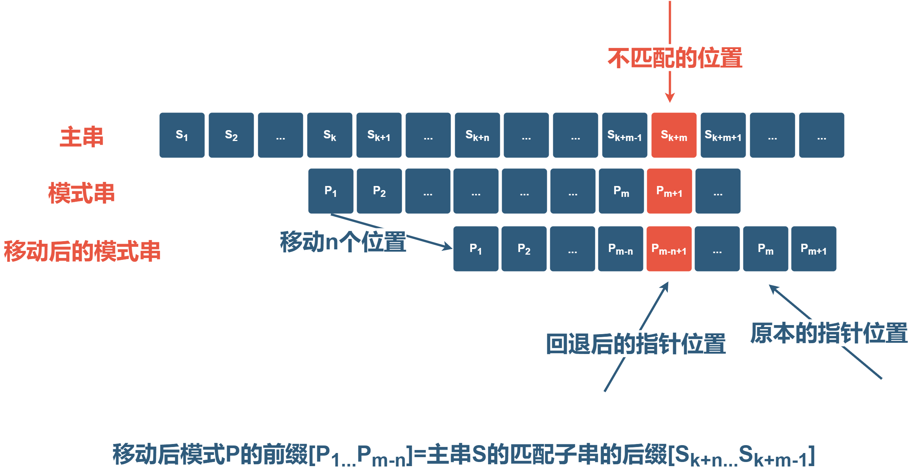
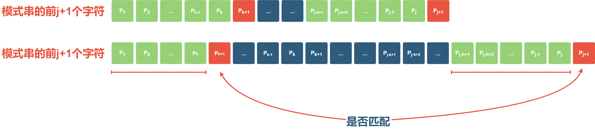

## 字符串

### 求子串和模式匹配

字符串中求子串和模式匹配是两个不同的概念：

-   求子串（Substring Extraction）：在给定字符串中找到的连续字符序列。子串可以是字符串的任意部分，包括单个字符、连续的一段字符或者整个字符串本身[^1]。

-   模式匹配（Pattern Matching）：在一个字符串中查找特定模式（即一组字符）是否存在的过程。这个模式可以是单个字符、一组字符的序列，也可以包含通配符或正则表达式等模式匹配规则。

总的来说，子串是字符串中的一个连续片段，而模式匹配是在字符串中查找特定模式的过程。模式匹配可以涉及到更复杂的匹配规则，而不仅仅是简单的子串查找。

### 字符串模式匹配算法

字符串模式匹配算法主要用于在一个主文本字符串中查找一个或多个模式字符串出现的位置。

#### 朴素字符串搜索

最简单也最直观的字符串匹配算法是暴力搜索（Brute-Force Search），也称为朴素字符串搜索（Naive String Search）。该算法的基本思想是从主字符串的每个位置开始，逐个字符地比较模式字符串和主字符串的子串，如果当前字符匹配则比较下一个字符，如果不匹配则回到主字符串的下一个位置继续比较，直到找到匹配或遍历完整个主字符串。时间复杂度为$O(mn)$，其中 $m$ 是模式字符串的长度，$n$ 是主字符串的长度，空间复杂度为$O(1)$。

#### KMP（Knuth-Morris-Pratt）算法

KMP算法的介绍在[Wikipedia](https://www.wikiwand.com/en/articles/Knuth%E2%80%93Morris%E2%80%93Pratt_algorithm)中可以找到，这里不再赘述，首先讲解KMP算法的原理。KMP算法的核心在于解决暴力求解时主串的指针回退造成的效率低下的问题，所以KMP算法的优势在于**用于和模式串对比的指向主串的指针不会回退**，这也是在匹配过程中，KMP算法匹配的时间复杂度为$O(n+m)$的原因，其中$n$为主串的长度，$m$为模式串的长度（因为指向主串的指针不回退，所以无论最终是否找到与模式串相匹配的子串，指向主串的指针只会遍历一次主串）。

下面以一个例子来说明KMP算法的工作原理。现有主串为ababcabcacbab，模式串为abcac，此时要在主串中找到与模式串相匹配的第一个子串出现的位置（即该匹配的子串的起始位置）。

先由暴力解法讲起，在暴力匹配中，每次遇到不匹配的情况都需要将模式串从头开始遍历，即将主串上的指针向前移动一位后，将模式串的指针回退到模式串的起始位置开始和主串对比。

下面约定，主串为$S$，主串中第$i$个字符记为$S_i$，模式串为$P$，模式串中第$j$个字符记为$P_j$。



通过观察可以知道，在第3轮比较的过程中，通过比较已经得知主串中的$[S_3 \dots S_6]$的字符信息，因而可以知道$S_4,S_5$和$P_1$是不匹配的，因而第4，5轮的匹配是可以通过之前的已知信息来避免的，**而KMP算法的思想也正是通过之前匹配获得的主串和模式串的部分匹配信息来减少匹配次数进而提高算法效率**。接下来将分析如何运用该信息来减少匹配次数。

现在从更一般的情况来进一步分析，有主串$S$和模式串$P$（模式串的长度$\geq m + 1$，主串的长度$\geq$模式串的长度），现在有模式串的前$m$个字符和主串的某个子串相匹配，而第$m + 1$个字符不匹配，即$P_{m + 1} \neq S_{k + m}$。



现已知主串的某一子串$[S_k, S_{k + 1}, \dots, S_{k + m - 1}]$和模式串的由$m$个字符组成的前缀$[P_1, P_2, \dots, P_m]$相匹配，那么为了减少匹配的次数，我们思考能否在主串的匹配子串$[S_k, S_{k + 1}, \dots, S_{k + m - 1}]$中找到这样一个子串（即主串的匹配子串的后缀），满足条件：
$$
[S_{k + n}, S_{k + n + 1}, \dots, S_{k + m - 1}] = [P_1, P_2, \dots, P_{m - n}]
$$
并且使得$n$最小，即使得模式串的前进步数$n$最小（因为要找到主串中第一个匹配的子串，故要使得$n$最小），满足模式串的$m - n$个字符的前缀和主串的匹配子串的$m - n$个字符的后缀相匹配。而由于在移动$n$步之前我们有$[S_k, S_{k + 1}, \dots, S_{k + m - 1}] = [P_1, P_2, \dots, P_m]$，所以实际上主串的匹配子串$[S_{k + n}, S_{k + n + 1}, \dots, S_{k + m - 1}]$可以看成是模式串$P$的一个后缀，又因要使$n$最小并且满足$[S_{k + n}, S_{k + n + 1}, \dots, S_{k + m - 1}] = [P_1, P_2, \dots, P_{m - n}]$，即使得主串的匹配子串的后缀$[S_{k + n}, S_{k + n + 1}, \dots, S_{k + m - 1}]$和模式串的前缀$[P_1, P_2, \dots, P_{m - n}]$的匹配长度最大，所以求使得$n$最小的问题转化为在模式串的某个长度为$m$的子串中求使得前缀和后缀匹配长度最大的问题。我们称字符串的前缀和后缀的最长相等前后缀长度为**部分匹配值（Partial Match）**，记为PM。

仍然使用前面的例子，此时的模式串为$P = [a, b, c, a, c]$。有如下的子串和部分匹配值[^2]：

|   子串    | 长度 |      前缀       |      后缀       | 部分匹配值 |
| :-------: | :--: | :-------------: | :-------------: | :--------: |
|     a     |  1   |        -        |        -        |     0      |
|    a b    |  2   |        a        |        b        |     0      |
|   a b c   |  3   |     {a,ab}      |     {c,bc}      |     0      |
|  a b c a  |  4   |   {a,ab,abc}    |   {a,ca, bca}   |     1      |
| a b c a c |  5   | {a,ab,abc,abca} | {c,ca,cac,bcac} |     0      |

由前面的论述可以知道，部分匹配值只和模式串的字符构成相关，而与主串的字符构成无关（因为求部分匹配值时，主串的匹配子串相当于模式串的一个子串，故求最大长度的前缀和后缀相等的子串时，相当于模式串自身的子串和自己求部分匹配值），所以当模式串确定时就可以确定模式串的部分匹配值，通过部分匹配值就可以得到模式串的最小移动步数$n$（另外由于这样只需要知道模式串的构成时就可以求得部分匹配值而不需要知道主串的信息，故能够使得KMP算法的时间复杂度维持在$O(n + m)$，其中$n$为主串的长度，$m$为模式串的长度）。接下来说明$n$和部分匹配值的关系。

由前面的匹配过程，我们有$m - n$为$[P_1, P_2, \dots, P_m]$模式串子串的部分匹配值，记$[P_1, P_2, \dots, P_m]$的部分匹配值为$next[m]$，$next$是一个数组，$next$名称表示和模式串移动到的下一个位置相关，$m$表示模式串的最后一个匹配字符在模式串中的位置。

当模式串$P = [P_1, P_2, \dots, P_m, P_{m + 1}, \dots]$确定时，由于部分匹配字符串必定以$P_1$开始，所以当最后一个匹配字符$P_m$确定时（或者说当第一个不匹配字符$P_{m + 1}$确定时），模式串的匹配子串$[P_1, P_2, \dots, P_m]$确定且唯一，所以部分匹配值也确定且唯一，即**最后一个不匹配字符在模式串中的位置唯一确定了部分匹配值**。用前面的例子说明如下：

在第3轮匹配时，由于$P_5$和$S_7$不匹配，所以有匹配的模式串子串$[P_1, P_2, P_3, P_4] = [a, b, c, a]$。其部分匹配值为1，所以移动的步数$n = m - next[m] = 4 - next[4] = 4 - 1 = 3$，即跳过第4，5轮的匹配，直接从第6轮匹配继续开始判断。

由前面的推导，我们有一个重要结论：**模式串移动的步数$n$ = 部分匹配的长度$m$ - 和不匹配的字符位置相关的部分匹配值$next[m]$**。

现在的最后一个问题在于已知模式串的情况下如何快速得到模式串的所有部分匹配值。如果使用暴力穷举的方法，效率明显过于低下。下面将会介绍如何快速根据模式串算出所有的部分匹配值，即$next$数组。

另外，因为在实际的代码实现中，改变的不是模式串的位置（这样叙述是为了方便理解），而是改变指向对比当前字符的指针的位置。所以在实际代码实现中，修改的不是模式串，而是改变指向模式串当前字符的指针的位置。**部分匹配值$next$数组也可以理解为下一次进行比较时可以跳过比较的字符数**，这是因为部分匹配值相当于主串的匹配子串的后缀和模式串的前缀相等的最大长度，所以可以直接跳过这些字符进行下一次比较。

写成伪代码则是`j = next[j]`，即指向模式串当前字符（当前指针位置$m + 1$）的指针$j$将直接跳过模式串的匹配前缀的长度$next[j]$个字符继续进行比较。

接下来将介绍如何快速计算给定模式串的$next$数组，计算模式串的$next$数组是一个递推的过程：

![计算$next[j+1]$的过程](KMP-3.png)

1.  当$j = 1$时，即取模式串的第一个字符时，此时显然没有前后缀存在，故$next[1] = 0$。

2.  接下来描述当已知前$j$个字符的PM值时，求前$j + 1$个字符的PM值的过程。当$j > 1$时，设$next[j] = k\,(k < j )$，则$k$应该满足条件$[P_1, P_2, \dots, P_{k}] = [P_{j - k + 1}, \dots, P_{j}]$且不存在$k' > k$也满足该条件。那么应该如何求$next[j + 1]$，此时有两种情况：

    -   若$P_{k + 1} = P_{j + 1}$，则表明在模式串中有$[P_1, P_2, \dots, P_{k + 1}] = [P_{j - k + 1}, \dots, P_{j + 1}]$成立，所以$next[j + 1] = k + 1 = next[j] + 1$。

    -   若$P_{k + 1} \neq P_{j + 1}$，则表明在模式串中有$[P_1, P_2, \dots, P_{k + 1}] \neq [P_{j - k + 1}, \dots, P_{j + 1}]$。此时寻找模式串的最长相等的前后缀难道要使用暴力求解吗，其实我们可以先尝试能否利用之前已知的信息来减少匹配的次数。由于$[P_1, P_2, \dots, P_k] = [P_{j - k + 1}, \dots, P_j]$且不存在$k' > k$也满足该条件，所以最长相等的前后缀应该比$k + 1$小（可以用反证法证明），那么此时只需要找比$k + 1$小的最长相等的前后缀即可，即找到$h$满足$[P_1, P_2, \dots, P_h, P_{h + 1}] = [P_{j - h + 1}, \dots, P_j, P_{j + 1}]$且不存在$h' > h$满足该条件。由于$[P_1, P_2, \dots, P_k] = [P_{j - k + 1}, \dots, P_j]$，因此在寻找满足条件的$h$时，可以先找到满足条件$[P_1, P_2 \dots, P_h] = [P_{j - h + 1}, \dots, P_j]$的$h$，然后再判断$P_{h + 1}$和$P_{j + 1}$是否相等，如果相等则$next[j + 1] = h + 1$，否则继续寻找满足条件的$h$，直到找到满足条件的$h$或者$h = 0$为止。而因为$[P_1, P_2, \dots, P_k] = [P_{j - k + 1}, \dots, P_j]$，所以寻找满足条件$[P_1, P_2 \dots, P_h] = [P_{j - h + 1}, \dots, P_j]$的$h$相当于在$[P_1, P_2, \dots, P_k]$中寻找最长相等的前后缀，而因为$[P_1, P_2, \dots, P_k]$的部分匹配值已经计算出来了，所以可以直接使用$next[k]$来寻找满足条件的$h$，即$h = next[k]$，此时再判断$P_{h + 1}$和$P_{j + 1}$是否相等（即判断$P_{next[k] + 1}$和$P_{j  + 1}$是否相等），如果相等则$next[j + 1] = h + 1 = next[k] + 1$，否则继续寻找满足条件的$h$，即$h = next[next[k]]$，直到找到满足条件的$h$或者$h = 0$为止。



由上述的递推过程中可以看出，KMP算法的时间复杂度为$O(m + n)$，空间复杂度为$O(m)$，其中匹配的时间复杂度为$O(n)$，因为主串的指针不回退，而计算模式串的部分匹配值的时间复杂度为$O(m)$，这是因为在计算模式串的部分匹配值时，并没有使用暴力匹配，而是利用先前已经得到的部分匹配值的信息来减少匹配次数，其中$m$为模式串的长度，$n$为主串的长度。虽然暴力匹配的时间复杂度为$O(mn)$，但在实际应用中，暴力匹配的实际复杂度接近$O(m + n)$，这是因为在大部分文本和模式串中（比如在一本小说中搜索goodbye单词），模式串的第一个字符就和主串不匹配，只有在某些情况下（比如在二进制文本中寻找0101001），KMP算法才比暴力匹配快得多（出现了很多部分匹配的情况）。

现在来考虑当模式串中出现了重复字符时，如何改进$next$数组为$nextval$数组提高效率。以下列例子说明：


|     主串     |  a   |  a   |  a   |  b   |  a   |  a   |  a   |  b   |
| :----------: | :--: | :--: | :--: | :--: | :--: | :--: | :--: | :--: |
|    模式串    |  a   |  a   |  a   |  a   |  b   |      |      |      |
|     $j$      |  1   |  2   |  3   |  4   |  5   |  6   |  7   |  8   |
|  $next[j]$   |  0   |  1   |  2   |  3   |  0   |      |      |      |
| $nextval[j]$ |  0   |  0   |  0   |  0   |  4   |      |      |      |

当$S_4 = b$和$P_4 = a$进行比较时，由于不匹配，所以会进行$next[4] = 3$的跳转，此时模式串的指针会跳到$P_3 = a$，而此时$P_3 = a$和$S_4 = b$仍然不匹配，所以会持续跳转，直到$P_1 = a$和$S_4 = b$进行比较，此时仍然不匹配，才会递增主串的指针，继续进行比较。而由于$P_4$和$P_3, P_2, P_1$都是相同的字符，所以在比较时，主串的$S_4$和模式串的$P_4$不匹配时，就没有必要继续比较模式串的$P_3, P_2, P_1$，因为它们都是相同的字符，即不应该使指针跳转$next[j]$，故修正$next[j]$的值继续递归为$next[next[j]]$直到两者不相同为止，此时的数组命名为$nextval$数组，而与主串的匹配算法不变。

用C++语言实现KMP算法的代码如下[^3]：

```cpp
#include <iostream>
#include <vector>
#include <string>

using namespace std;

void getNext(int *next, const string &p) {
    int m = p.size(), j = 0; // j is the length of the previous longest prefix suffix 
    next[0] = 0; // The first character has no proper prefix or suffix
    for (int i = 1; i < m; ++i) { // Start from the second character
        // Check if the j > 0 because we need to index to the previous next value
        while (j > 0 && p[i] != p[j]) { // Backtrack if there is a mismatch
            j = next[j - 1]; // j - 1 because next is 0-indexed
        }
        if (p[i] == p[j]) { // If characters match, increment j, namely the length of the current prefix
            ++j;
        }
        next[i] = j; // Set the next value for the current character
    }
}

int kmp(const string &s, const string &p) {
    int n = s.size(), m = p.size();
    if (n < m) { // Check if the pattern is longer than the text
        cout << "Pattern is longer than text." << endl;
        return -1;
    }
    if (m == 0) { // Check if the pattern is empty
        cout << "Empty pattern." << endl;
        return -1;
    }
    vector<int> next(m);
    getNext(&next[0], p); // Initialize the next array for the pattern p
    for (int i = 0, j = 0; i < n; ++i) { // i is the index in the main string s and j is the index in the pattern p
        while (j > 0 && s[i] != p[j]) { // Mismatch after j matches
            j = next[j - 1]; // Use the next array to skip unnecessary comparisons, minus 1 because next is 0-indexed
        }
        if (s[i] == p[j]) { // Match found and increment j to check next character
            ++j;
        }
        if (j == m) { // If j equals the length of the pattern, the first occurrence is found
            cout << "Pattern found at index: " << i + 1 - m << endl;
            return 0; // Return after finding the first occurrence
        }
    }
    return -1; // If no match is found, return -1
}

int main() {
    string s, p;
    cin >> s >> p;
    cout << "The main string is: " << s << endl;
    cout << "The pattern string is: " << p << endl;
    int result = kmp(s, p);
    if (result == -1) {
        cout << "Pattern not found." << endl;
    } else {
        cout << "Pattern found successfully." << endl;
    }
    return 0;
}
```

[^1]: 空串是任何串的子串，串本身也是串的子串，所以计算串的子串数目时，要加上空串和串本身。
[^2]: 此处的前缀不包含最后一个字符，后缀不包含第一个字符，否则部分匹配值会和子串的长度一致，这样就失去了计算部分匹配值的意义。
[^3]: 相关的题目参考[LeetCode 28. 找出字符串中第一个匹配项的下标](https://leetcode.cn/problems/find-the-index-of-the-first-occurrence-in-a-string?envType=study-plan-v2&envId=programming-skills)

