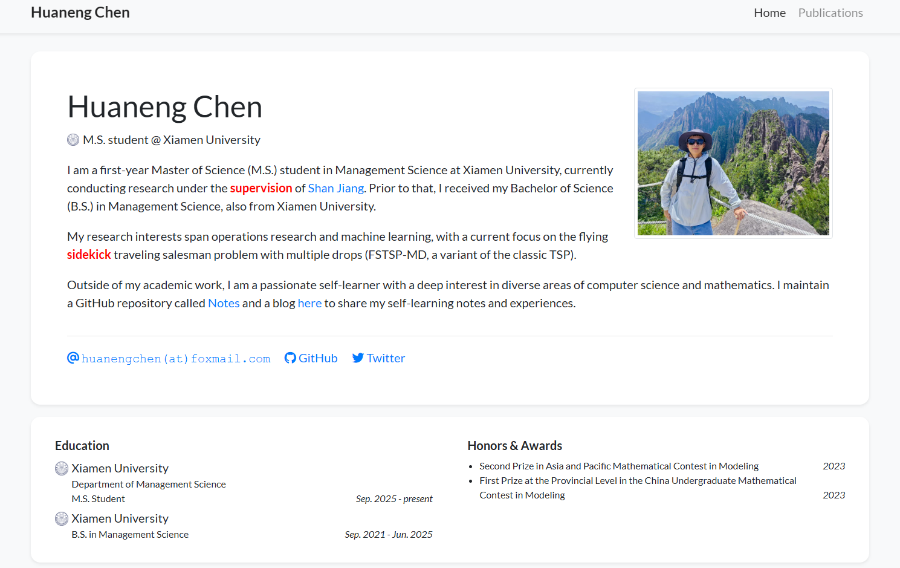

## 需求来源

这个需求来源于我想要在当前博客的页面中添加一个用于展示学术成果的页面，但是当前博客使用的框架是Hexo，主题是Fluid，而想用的学术页面的框架是基于Jekyll的[luost26/academic-homepage](https://github.com/luost26/academic-homepage)，因此需要在我的Github Page部署两个不同的框架，即Hexo和Jekyll。目前的想法是将用于学术成果展示的页面部署在博客的一个子页面下。



## 本地部署

Fork [luost26/academic-homepage](https://github.com/luost26/academic-homepage) 这个项目到自己的仓库中，按照 [luost26/academic-homepage](https://github.com/luost26/academic-homepage) 中本地部署的要求：

1. 查看[Jekyll的Requirement](https://jekyllrb.com/docs/installation/)，安装相应版本的Ruby、GCC、MSYS2以及Make（这里推荐使用[Scoop](https://chen-huaneng.github.io/2024/01/04/2024-01-04-2024-01-04-Scoop/)进行Windows环境下的安装）

2. 安装Jekyll和bundler [gems](https://jekyllrb.com/docs/ruby-101/#gems)：

   ````powershell
   gem install jekyll bundler
   ````

3. Clone forked 的仓库到本地，以我的仓库为例：

   ````powershell
   git clone https://github.com/chen-huaneng/academic-homepage.git
   ````

4. 进入相应的文件夹：

   ````powershell
   cd academic-homepage
   ````

5. 修改 academic-homepage 文件夹中的 `_config.yml` 文件：

   ````yaml
   baseurl: "/academic"  # 确保资源路径正确
   ````

   如果不进行设置会导致 CSS/JS 文件加载失败

6. 构建 Jekyll 站点：

   ```powershell
   bundle install  # 安装依赖
   bundle exec jekyll build  # 生成静态文件到 _site 目录
   ```

7. 复制文件到 Hexo 博客的文件夹下：

   ````powershell
   robocopy "_site" "path\to\hexo\folder\source\academic" /E /NFL /NDL /NP /XO
   ````

8. 在 Hexo 的 `_config.yml` 中添加：

   ```yaml
   skip_render:
   - 'academic/**'  # 禁止 Hexo 处理 academic 目录下的文件
   ```

9. 部署 Hexo 站点：

   ````powershell
   hexo clean && hexo deploy
   ````


## 本地预览

如果想要在本地预览修改效果可以在完成[本地部署](#本地部署)部分的第6步之后在命令行中输入：

```powershell
bundle exec jekyll serve
```

然后在浏览器中打开命令行中输出的相应网址即可。

在子目录 `_data` 、 `_news` 、`_publications` 和 `_showcase` 中修改相应的文件就可以修改相应的网站内容。

## 自定义页面

如果要自定义子页面的 Favicon，在 `_layout` 文件夹下 `default.html` 的 `<head>` 中添加：

```html
<!-- Favicon -->
<link rel="icon" type="image/jpg" sizes="32x32" href="{{ '/assets/images/icon/icon.jpg' | relative_url }}">
```

然后在相应的 `assets` 文件夹下添加相应的图片即可。

如果要添加自定义的联系方式，这里以添加个人博客为例说明。首先在 `_data` 文件夹下的 `profile.yml` 中添加字段：

```yaml
blog: "https://chen-huaneng.github.io"
```

然后在 `_includes\widgets` 文件夹下的 `profile_card.html` 中添加相应的代码：

```html

<a class="pr-3 no-break" target="_blank" href="{{ site.data.profile.blog | relative_url }}">
	<i class="fa-solid fa-pen-to-square"></i> Blog
</a>

```

相应的图标可以在 [Font Awesome](https://fontawesome.com/) 中找到，比如上面 `Blog` 的图标是 `<i class="fa-solid fa-pen-to-square"></i>`。

