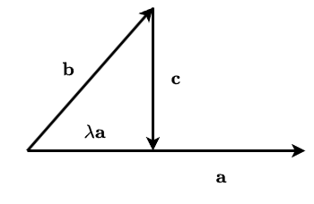

## 接触的契机

Cauchy-Schwarz不等式是一个很有名的不等式，多次在不同的地方遇见。当我读 [Introduction to Linear Optimization](https://book.douban.com/subject/2157943/) 时再次遇见它却不知道如何证明，于是写下此文用于记录各种证明方法以供查阅，本文参考了台湾阳明交通大学应用数学系教授[林琦焜](https://www.math.nycu.edu.tw/faculty/faculty_content.php?S_ID=84&SC_ID=1)的《Cauchy-Schwarz不等式之本質與意義》论文。

<iframe 
  src="/js/pdfjs/web/viewer.html?file=/pdf/Cauchy-Schwarz不等式之本質與意義-林琦焜.pdf" 
  style='width:100%;height:800px'>
</iframe>

## Cauchy-Schwarz不等式的不同形式

Cauchy-Schwarz不等式顾名思义与 Cauchy 有关，我们从最常见的形式开始。

### 实数域基本不等式

已知 $a_1, \cdots, a_n$ 和 $b_1, \cdots,b_n$ 为任意实数序列，则：

$$
\begin{equation}
\left( \sum_{i = 1}^na_ib_i\right)^2 \leq \left( \sum_{i = 1}^na_i^2 \right)\left(\sum_{i = 1}^nb_i^2\right)\label{eq:real-number}
\end{equation}
$$

等式成立的充分必要条件是 $a_i = \lambda b_i, i = 1, 2, \dots, n$。

这是最常见的 Cauchy 不等式，Cauchy 不等式可以推广至复数。由于不等式只有在实数时才有意义，对于复数或向量而言，要谈论大小关系，自然选择其长度来讨论。对任意复数 $z = x + iy$，其长度为 $\vert z\vert = \sqrt{x^2 + y^2}$，因此对于公式 $\eqref{eq:real-number}$ 这种形式的Cauchy 不等式而言只需要将平方和的意义更改为复数的模数（modulus）的平方即可。

### 不等式的复数推广

已知 $a_1, \cdots, a_n$ 和 $b_1, \cdots,b_n$ 为复数，则：
$$
\left\vert \sum_{i = 1}^na_ib_i\right\vert^2 \leq \left( \sum_{i = 1}^n\vert a_i\vert^2 \right)\left(\sum_{i = 1}^n\vert b_i\vert^2\right)\label{eq:plural}
$$
等式成立的充分必要条件是 $a_i = \lambda b_i, i = 1, 2, \dots, n$，其中 $\lambda$ 是复数。

### 向量形式

现在有向量 $\mathbf{a}^{\mathsf{T}} = (a_1, a_2, \dots,a_n)$ 和 $\mathbf{b}^{\mathsf{T}} = (b_1, b_2, \dots, b_n)$，并定义向量 $\mathbf{x}^{\mathsf{T}} = (x_1, x_2, \dots, x_n)$ 的长度为：
$$
\sqrt{\mathbf{x}^{\mathsf{T}}\mathbf{x}} = \Vert\mathbf{x}\Vert = \sqrt{\sum_{i= 1}^nx_i^2}
$$
则 Cauchy 不等式可以表示为：
$$
\vert \mathbf{a}^{\mathsf{T}} \cdot \mathbf{b} \vert \leq \Vert\mathbf{a}\Vert \cdot \Vert \mathbf{b} \Vert
$$
$\mathbf{a}^{\mathsf{T}} \cdot \mathbf{b} = \mathbf{b}^{\mathsf{T}} \cdot \mathbf{a} = \sum_{i = 1}^n a_ib_i$ 为向量点积（inner product）。

向量 $\mathbf{x}$ 的长度也叫做向量的模长 $\Vert \mathbf{x} \Vert$，也叫做向量 $\mathbf{x}$ 的欧几里得范数（Euclidean norm）。

### 积分形式

已知 $f,g$ 是区间 $[a, b]$ 上的连续函数，则：
$$
\left(\int_a^bf(x)g(x)\mathrm{d}x\right)^2 \leq \int_a^bf^2(x)\mathrm{d}x \cdot \int_a^bg^2(x)\mathrm{d}x
$$
当且仅当存在常数 $\lambda$ 和 $\mu$（不全为零），使得 $\lambda f(x) = \mu g(x)$ 在区间 $[a, b]$ 上**几乎处处**成立，即 $f$ 和 $g$ 线性相关时取等。

积分形式是对实数域基本不等式形式的一种推广，因为实数域基本不等式形式是在离散的数中成立，而积分形式是在连续的区间中成立，因此也是Cauchy-Schwarz不等式的连续版本。

## Cauchy-Schwarz不等式的证明方法

### 判别式法

#### 实数域基本不等式

构造二次函数：
$$
f(t) = \sum_{i = 1}^n\left(a_it + b_i\right)^2 \geq 0, \forall t \in \mathbb{R}
$$
将 $f(t)$ 展开得到：
$$
\begin{equation*}
\begin{aligned}
f(t) &= \sum_{i = 1}^n (a_it+b_i)^2 \\
&=t^2\underbrace{\left(\sum_{i=1}^na_i^2\right)}_A + t \cdot \underbrace{\left(2\sum_{i=1}^na_ib_i\right)}_B+\underbrace{\sum_{i = 1}^nb_i^2}_C \\
&= At^2 + Bt + C
\end{aligned}
\end{equation*}
$$
因为 $f(t) \geq 0$ 对所有实数 $t$ 成立，这意味着该二次函数的图像始终在 $t$-轴上方或相切（即无实根或有一个重根），因此其判别式必须非正：
$$
\begin{align*}
\Delta &= B^2 - 4 AC \\
&= \left(2\sum_{i=1}^na_ib_i\right)^2 - 4\sum_{i = 1}^na_i^2\sum_{i = 1}^nb_i^2 \leq 0 \\
&\Rightarrow \left(\sum_{i=1}^na_ib_i\right)^2 \leq \sum_{i = 1}^na_i^2\sum_{i = 1}^nb_i^2
\end{align*}
$$
当判别式 $\Delta = 0$ 时，$f(t) = 0$ 有实根 $t_0$，即存在 $t_0$ 使得对所有 $i$ 有 $a_it_0 + b_0 = 0$，这意味着序列成比例（$a_i = \lambda b_i$，其中 $\lambda = -t_0$）。

#### 积分形式

同样，对于积分形式，也可以构造函数：
$$
h(t) = \int_a^b\left[f(x)t+g(x)\right]^2\mathrm{d}x
$$
因为被积函数 $\left[f(x)t+g(x)\right]^2 \geq 0, \forall x,t \in \mathbb{R}$，所以积分 $h(t) \geq 0$ 对所有实数 $t$ 均成立，将积分展开：
$$
\begin{align*}
h(t) &= \int_a^b\left[f(x)t+g(x)\right]^2\mathrm{d}x \\
&= t^2\underbrace{\int_a^b[f(x)]^2\mathrm{d}x}_A + t \cdot \underbrace{2\int_a^bf(x)g(x)\mathrm{d}x}_B + \underbrace{\int_a^b[g(x)]^2\mathrm{d}x}_C \\
&= At^2 + Bt + C
\end{align*}
$$
由于这个关于 $t$ 的二次函数始终非负（或恒为零），其判别式必须小于等于零：
$$
\begin{align*}
\Delta &= B^2 - 4AC \\
&= \left(2\int_a^bf(x)g(x)\mathrm{d}x\right)^2 - 4\int_a^b[f(x)]^2\mathrm{d}x\int_a^b[g(x)]^2\mathrm{d}x \leq 0\\
&\Rightarrow \left(\int_a^bf(x)g(x)\mathrm{d}x\right)^2 \leq \int_a^bf^2(x)\mathrm{d}x \cdot \int_a^bg^2(x)\mathrm{d}x
\end{align*}
$$
当 $\Delta = 0$ 时，存在某个 $t_0$ 使得 $h(t_0) = 0$。由于积分非负，这意味着被积函数 $\left[f(x)t_0+g(x)\right]^2 = 0$ 在区间 $[a,b]$ 上**几乎处处**成立，即 $f(x)t_0 + g(x) = 0$ **几乎处处**成立。取 $\lambda = -t_0, \mu = 1$ 即满足 $\lambda f(x) = \mu g(x)$ **几乎处处**成立（或者其中一个函数恒为零）。

另外，由积分形式的Cauchy-Schwarz不等式可以很容易地得到Minkowski不等式的一个退化形式：
$$
\left(\int_a^b[f(x)+g(x)]^2\mathrm{d}x\right)^{\frac{1}{2}} \leq \left(\int_a^bf^2(x)\mathrm{d}x\right)^{\frac{1}{2}} + \left(\int_a^bg^2(x)\mathrm{d}x\right)^{\frac{1}{2}}
$$
其中 $f,g$ 是区间 $[a, b]$ 上的连续函数，证明如下：
$$
\begin{align*}
\int_a^b[f(x)+g(x)]^2\mathrm{d}x &= \int_a^bf^2(x)\mathrm{d}x + 2\underbrace{\int_a^bf(x)g(x)\mathrm{d}x}_{\text{Cauchy-Schwarz}} + \int_a^bg^2(x)\mathrm{d}x \\
&\leq \int_a^bf^2(x)\mathrm{d}x + 2 \underbrace{\left(\int_a^bf^2(x)\mathrm{d}x\right)^{\frac{1}{2}}\left(\int_a^bg^2(x)\mathrm{d}x\right)^{\frac{1}{2}}}_{\text{inequality}} + \int_a^bg^2(x)\mathrm{d}x \\
&= \left[\left(\int_a^bf^2(x)\mathrm{d}x\right)^{\frac{1}{2}} + \left(\int_a^bg^2(x)\mathrm{d}x\right)^{\frac{1}{2}}\right]^2 \\
&\Rightarrow \left(\int_a^b[f(x)+g(x)]^2\mathrm{d}x\right)^{\frac{1}{2}} \leq \left(\int_a^bf^2(x)\mathrm{d}x\right)^{\frac{1}{2}} + \left(\int_a^bg^2(x)\mathrm{d}x\right)^{\frac{1}{2}}
\end{align*}
$$

#### 向量形式

现假设向量 $\mathbf{a}$ 和 $\mathbf{b}$ 线性无关（即非平行向量，或者说它们的夹角 $\theta \neq 0$），因此由向量 $\mathbf{a}$ 和 $\mathbf{b}$ 所形成的平面上的任意向量（除了向量 $\mathbf{a}$ 外）可以表示为：
$$
\mathbf{c} = \mathbf{b} - \lambda \mathbf{a}, \lambda \in \mathbb{R}
$$
现在考虑向量 $\mathbf{c}$ 的范数：
$$
\begin{equation}
\begin{aligned}
\Vert\mathbf{c}\Vert^2 &= \mathbf{c}^{\mathsf{T}} \cdot \mathbf{c} \\
&= (\mathbf{b} - \lambda \mathbf{a})^{\mathsf{T}}(\mathbf{b} - \lambda \mathbf{a}) \\
&= \lambda^2 \underbrace{\Vert\mathbf{a}\Vert^2}_A - \lambda\cdot \underbrace{2\mathbf{a}^{\mathsf{T}} \cdot \mathbf{b}}_B + \underbrace{\Vert\mathbf{b}\Vert^2}_C
\end{aligned}\label{eq:vector}
\end{equation}
$$
公式 $\eqref{eq:vector}$ 可以看作是关于 $\lambda$ 的二次方程，由于 $\Vert\mathbf{c}\Vert^2 \geq 0$，并且 $\Vert\mathbf{a}\Vert^2 \geq 0$，所以公式 $\eqref{eq:vector}$ 代表的是开口向上并且在 $\lambda$ 轴上方的抛物线，由于与 $\lambda$ 轴不相交，所以没有实根，因此判别式小于零：
$$
\begin{align*}
\Delta &= B^2 - 4AC \\
&= (2 \mathbf{a}^{\mathsf{T}} \cdot \mathbf{b})^2 - 4\Vert\mathbf{a}\Vert^2\Vert\mathbf{b}\Vert^2 < 0 \\
&\Rightarrow \vert \mathbf{a}^{\mathsf{T}} \cdot \mathbf{b} \vert < \Vert\mathbf{a}\Vert \cdot \Vert \mathbf{b} \Vert
\end{align*}
$$
 加上向量 $\mathbf{a}$ 和 $\mathbf{b}$ 线性相关，即它们相互平行的情况，即可得到取等的情况。

### 转换为二重积分（配方法）

关于积分形式，还有另外一个历史上很有名的证明方法，直接考虑积分差：
$$
I = \int_a^bf^2(x)\mathrm{d}x \cdot \int_a^bg^2(x)\mathrm{d}x - \left(\int_a^bf(x)g(x)\mathrm{d}x\right)^2
$$
注意到 $f(x)$ 和 $f(y)$，$g(x)$ 和 $g(y)$ 是独立变量，因此可以将其写成二重积分形式：
$$
\begin{align*}
I &= \iint \limits_{\Omega} f^2(x)g^2(y)\mathrm{d}x\mathrm{d}y - \iint \limits_{\Omega} f(x)g(x)f(y)g(y)\mathrm{d}x\mathrm{d}y \\
&= \iint \limits_{\Omega} \left[f^2(x)g^2(y) - f(x)g(x)f(y)g(y)\right]\mathrm{d}x\mathrm{d}y \\
&= \frac{1}{2} \iint \limits_{\Omega} \left[f^2(x)g^2(y) - 2f(x)g(x)f(y)g(y) + f^2(y)g^2(x)\right]\mathrm{d}x\mathrm{d}y \\
&= \frac{1}{2} \iint \limits_{\Omega} \left[f(x)g(y) - f(y)g(x)\right]^2\mathrm{d}x\mathrm{d}y \geq 0 \\
&\Rightarrow I \geq 0 \\
&\Rightarrow \left(\int_a^bf(x)g(x)\mathrm{d}x\right)^2 \leq \int_a^bf^2(x)\mathrm{d}x \cdot \int_a^bg^2(x)\mathrm{d}x
\end{align*}
$$
因为 $\left[f(x)g(y) - f(y)g(x)\right]^2 \geq 0$ 对所有 $x, y$ 成立，所以其二重积分 $I \geq 0$

当且仅当 $I = 0$，即 $\frac{1}{2} \iint \limits_{\Omega} \left[f(x)g(y) - f(y)g(x)\right]^2\mathrm{d}x\mathrm{d}y = 0$。由于被积函数非负，这要求 $\left[f(x)g(y) - f(y)g(x)\right]^2 = 0$ 在 $\Omega$ 上**几乎处处**成立，即 $f(x)g(y) = f(y)g(x)$ **几乎处处**成立，这等价于 $f$ 和 $g$ 线性相关（**几乎处处**成比例）。例如，若在某点 $y_0$ 有 $g(y_0) \neq 0$，则 $f(x) = \frac{f(y_0)}{g(y_0)}g(x)$ **几乎处处**成立。

### 投影——最短距离

对于向量形式，还可以取：
$$
\begin{align*}
\lambda &= \frac{\mathbf{a}^{\mathsf{T}}\cdot\mathbf{b}}{\Vert\mathbf{a}\Vert^2} \\
\mathbf{c} &= \mathbf{b} - \lambda \mathbf{a} \\
&= \mathbf{b} - \frac{\mathbf{a}^{\mathsf{T}}\cdot\mathbf{b}}{\Vert\mathbf{a}\Vert^2} \mathbf{a}
\end{align*}
$$
带回公式 $\eqref{eq:vector}$ 得到：
$$
\begin{equation}
0 \leq \Vert\mathbf{c}\Vert^2 = \left(\frac{\mathbf{a}^{\mathsf{T}}\cdot\mathbf{b}}{\Vert\mathbf{a}\Vert^2}\right)^2 \Vert\mathbf{a}\Vert^2 - \left(\frac{\mathbf{a}^{\mathsf{T}}\cdot\mathbf{b}}{\Vert\mathbf{a}\Vert^2}\right)\cdot 2\mathbf{a}^{\mathsf{T}} \cdot \mathbf{b} + \Vert\mathbf{b}\Vert^2\label{eq:vector2}
\end{equation}
$$
整理得：
$$
\begin{align*}
\left(\mathbf{a}^\mathsf{T} \cdot \mathbf{b}\right)^2 \leq \Vert\mathbf{a}\Vert^2\Vert\mathbf{b}\Vert^2 \\
\Rightarrow \vert\mathbf{a}^\mathsf{T} \cdot \mathbf{b}\vert \leq \Vert\mathbf{a}\Vert\Vert\mathbf{b}\Vert
\end{align*}
$$
至于 $\lambda$ 为什么如此取值，首先看向量 $\mathbf{a}$ 和 $\mathbf{c}$ 之间的关系：
$$
\mathbf{a}^\mathsf{T} \cdot \mathbf{c} = \mathbf{a}^\mathsf{T} \cdot (\mathbf{b} - \lambda \mathbf{a}) = \mathbf{a}^\mathsf{T} \cdot \mathbf{b} - \lambda\Vert\mathbf{a}\Vert^2
$$
因此有：
$$
\mathbf{a}^\mathsf{T} \cdot \mathbf{c}  = 0 \Leftrightarrow \mathbf{a} \perp \mathbf{c} \Leftrightarrow \lambda = \frac{\mathbf{a}^{\mathsf{T}}\cdot\mathbf{b}}{\Vert\mathbf{a}\Vert^2}
$$
换句话说，$\lambda$ 取 $\frac{\mathbf{a}^{\mathsf{T}}\cdot\mathbf{b}}{\Vert\mathbf{a}\Vert^2}$ 是有几何意义的，并非无中生有靠灵感而得来。此时 $\lambda \mathbf{a}$ 正是向量 $\mathbf{b}$ 在 $\mathbf{a}$ 上的投影，而 $\Vert\mathbf{c}\Vert$ 则是 $\mathbf{b}$ 到 $\mathbf{a}$ 的最短距离。$\lambda$ 还有一个很出名的解释就是 Lagrange 乘子（Lagrange multiplier）：为求 $\mathbf{b}$ 到 $\mathbf{a}$ 的最短距离我们必须调整 $\lambda$ 使得 $\mathbf{a} \perp (\mathbf{b} - \lambda \mathbf{a})$，如果是函数则该条件换为微分或梯度（gradient）等于零。 

回到公式 $\eqref{eq:vector2}$，我们可以化简为：
$$
\begin{equation}
\Vert\mathbf{a}\Vert^2\Vert\mathbf{b}\Vert^2 - \left(\mathbf{a}^{\mathsf{T}}\cdot\mathbf{b}\right)^2 = \Vert\mathbf{a}\Vert^2\Vert\mathbf{c}\Vert^2\label{eq:vector3}
\end{equation}
$$
右边 $\Vert\mathbf{a}\Vert^2\Vert\mathbf{c}\Vert^2$ 就是Cauchy-Schwarz不等式的误差项，显然 $\Vert\mathbf{a}\Vert \ne 0$，所以Cauchy-Schwarz不等式要成为等式当且仅当 $\Vert\mathbf{c}\Vert = 0, \mathbf{b} = \lambda \mathbf{a}$ 成立，也就是说 $\mathbf{a}, \mathbf{b}$ 是两平行的向量。

其实公式 $\eqref{eq:vector3}$ 就是 Lagrange 恒等式（Lagrange identity），设 $n \in \mathbb{N}_+, a_1, a_2,\dots,a_n \in \mathbb{R}, b_1, b_2,\dots,b_n \in \mathbb{R}$，向量 $\mathbf{a}^{\mathsf{T}} = (a_1,a_2,\cdots,a_n), \mathbf{b}^{\mathsf{T}} = (b_1,b_2,\cdots,b_n)$，则：
$$
\left(\sum_{i = 1}^na_i^2\right)\left(\sum_{i = 1}^nb_i^2\right) - \left(\sum_{i = 1}^na_ib_i\right)^2 = \sum_{1 \leq i < j \leq n}(a_ib_j - a_jb_i)^2
$$
或者表示为行列式：
$$
\Gamma(\mathbf{a}, \mathbf{b})
= \begin{vmatrix}
\sum \limits_{i = 1}^na_i^2 & \sum \limits_{i = 1}^na_ib_i \\
\sum \limits_{i = 1}^na_ib_i & \sum \limits_{i = 1}^n b_i^2
\end{vmatrix}
= \sum_{1 \leq i < j \leq n} \begin{vmatrix}
a_i & a_j \\
b_i & b_j
\end{vmatrix}^2
$$
该恒等式可以利用归纳法加上行列式的性质进行证明。

### 算术—几何平均不等式

谈Cauchy-Schwarz不等式不得不提算术—几何平均不等式（AM-GM均值不等式），因为这是当初Cauchy的目的之一。
$$
\begin{equation}
\sqrt{ab} \leq \frac{a + b}{2} \Leftrightarrow ab \leq \frac{1}{2}(a^2 + b^2)\label{eq:am-gm}
\end{equation}
$$
利用这个不等式也可以证明Cauchy-Schwarz不等式，令：
$$
\tilde{a_i} = \frac{a_i}{\sqrt{\sum_{i = 1}^n}a_i^2}, \tilde{b_i} = \frac{b_i}{\sqrt{\sum_{i = 1}^n}b_i^2}
$$
带回公式 $\eqref{eq:am-gm}$ 得到：
$$
\tilde{a}\tilde{b} \leq \frac{\tilde{a}_i^2 + \tilde{b}_i^2}{2}
$$
或者：
$$
\frac{a_ib_i}{\sqrt{\sum_{i = 1}^na_i^2}\sqrt{\sum_{i = 1}^nb_i^2}} \leq \frac{1}{2}\left(\frac{a_i^2}{\sum_{i = 1}^na_i^2} + \frac{b_i^2}{\sum_{i = 1}^nb_i^2}\right)
$$
取有限项求和得到：
$$
\frac{\sum_{i = 1}^na_ib_i}{\sqrt{\sum_{i = 1}^na_i^2}\sqrt{\sum_{i = 1}^nb_i^2}} \leq \frac{1}{2}\left(\frac{\sum_{i = 1}^na_i^2}{\sum_{i = 1}^na_i^2} + \frac{\sum_{i = 1}^nb_i^2}{\sum_{i = 1}^nb_i^2}\right) = 1
$$
因此有：
$$
\sum_{i = 1}^na_ib_i \leq \sqrt{\sum_{i = 1}^na_i^2}\sqrt{\sum_{i = 1}^nb_i^2}
$$

### 数学归纳法

略

