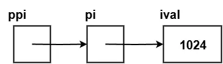

## 类型

### 有符号类型和无符号类型

C++ 中有两种类型，有符号类型（signed type）和无符号类型（unsigned type），有符号类型可以表示正数、负数和零，而无符号类型只能表示大于或等于零的数。在决定使用有符号类型还是无符号类型时，以下的建议可以帮助你做出选择：

- 如果你知道变量只会存储非负数（例如计数器、索引等），可以使用无符号类型，这样可以增加可表示的最大值。
- 使用 `int` 来进行整数运算，因为 `short` 太小，并且在实际中，`long` 经常和 `int` 的大小相同，如果数据的值超过了 `int` 规定的最小字节数，则可以使用 `long long`。
- 不要使用 plain`char` 类型或 `bool` 类型来进行数值运算，而是只在存储字符或布尔值的时候使用。使用 `char` 类型来进行计算的时候可能会导致意外的结果，这是因为 `char` 类型在某些机器上是 signed 的，而在其他机器上是 unsigned 的，这取决于编译器的实现。如果需要使用小整数（tiny integer），需要显式地使用 `signed char` 或者 `unsigned char`。
- 使用 `double` 来进行浮点数运算，因为 `float` 的精度通常不足以满足大多数应用的需求，并且相对于 `float` 来说，`double` 的计算消耗可以忽略不计，实际上在某些机器中双精度浮点数的计算要快于单精度浮点数的计算。使用 `long double` 获得的更高精度通常是没有必要的，并且需要消耗大量的运行时（run-time）资源。

### 类型转换

类型转换（type conversion）会自动发生在使用某种类型用于需要另一种类型的上下文中。具体的转换后的结果取决于类型允许的值的范围和类型的大小：

- 当将一个非布尔值类型的算术类型赋值给布尔值类型时，非零值会转换为 true，零值会转换为 false。
- 当将一个布尔值类型赋值给非布尔值类型时，true 会转换为1，false 会转换为0。
- 当将一个浮点数类型赋值给整数类型时，会截断小数部分，保留整数部分。
- 当将一个整数类型赋值给浮点数类型时，会将整数转换为浮点数，保留小数部分为 0，如果整数的值超出了浮点数类型的表示范围，则会导致精度丢失。
- 当将一个超出类型表示范围的值赋值给一个无符号类型时，赋予的值会取该无符号类型能表示的最大值的模（modulo）的余数。例如，如果将 -1 赋值给一个 8-bit 的 `unsigned char`，则结果为 255，因为 8-bit 的无符号整数类型的表示范围是 0 到 255，即对 256 取模，-1 对 256 取模的余数是 255。
- 当将一个超出类型表示范围的值赋值给一个有符号类型时，结果是未定义的（undefined），程序可能看起来正常运行、可能崩溃或者产生垃圾值。

当表达式中涉及无符号类型和有符号类型的运算时，C++ 会将有符号类型转换为无符号类型，这可能导致意外的结果。例如，如果将一个负数与一个无符号整数相加，结果可能是一个非常大的正数，因为负数被转换为无符号整数后，其值变成了一个很大的正数。

### 字面量

字面量（literal）是指在代码中直接写出的值，C++ 支持多种类型的字面量，包括整数、浮点数、字符、字符串等。由单引号括起来的字符是字符字面量，由双引号括起来的字符串是字符串字面量，字符串字面量是由一个字符数组表示的，字符数组的最后一个元素是空字符（`'\0'`），表示字符串的结束。相邻的两个字符串字面量（只被空格、制表符或换行符分隔）会被连接成一个字符串字面量。

```cpp
std::cout << "a really, really long string literal "
			 "that spans two lines." << std::endl;
```

## 变量

变量（variable）是一个存储数据的命名位置，可以在程序中使用变量来存储和操作数据。变量的类型决定了它可以存储的数据类型和大小以及可以对变量进行的操作。C++ 中的变量必须先声明后使用，声明变量时需要指定变量的类型和名称。

### 初始化和赋值

变量的初始化（initialization）和赋值（assignment）是两个不同的概念。初始化是在变量声明时给变量赋予一个初始值，而赋值是在变量已经声明后，给变量重新赋值。

列表初始化（list initialization）是 C++11 引入的一种初始化方式，它使用花括号（`{}`）来初始化变量。列表初始化可以用于所有类型的变量，包括内置类型和用户定义的类型。列表初始化的好处是可以防止窄化转换（narrowing conversion），即从一个较大的类型转换为一个较小的类型时可能导致数据丢失。

```cpp
long double ld = 3.1415926536;
int a{ld}, b = {ld};
int c(ld), d = ld;
```

在上面的代码中，变量 `a` 和 `b` 使用列表初始化，而变量 `c` 和 `d` 使用普通的初始化方式。由于 `ld` 是一个长双精度浮点数（long double），而 `int` 是一个整数类型，列表初始化会防止窄化转换，因此 `a` 和 `b` 初始化会发生错误，而 `c` 和 `d` 会被初始化为 3。

变量如果没有进行初始化，变量会进行默认初始化（default initialization），被赋予的值取决于变量的位置和类型。如果内置类型（built-in）的变量在任何函数体外声明，则会被初始化为 0，如果在函数体内声明，则不会被初始化，变量的值是未定义的。因此为了避免使用未初始化的变量导致未定义行为，建议在声明内置类型的变量时总是进行初始化。

### 声明和定义

在 C++ 中，变量的声明（declaration）和定义（definition）是两个不同的概念。声明是告诉编译器变量的类型和名称，而定义是为变量分配内存空间并有可能初始化变量。为了获得一个声明但不定义变量，可以使用 `extern` 关键字，`extern` 关键字用于声明一个变量在其他文件中定义，而不是在当前文件中定义。

> 变量只能被定义一次，但是可以被声明多次。

```cpp
extern int i; // declares but dose not define i
int j; // declares and defines j
```

任何带有显式初始化的声明都是定义，同样可以给带有关键字 `extern` 的变量进行初始化，但是这样相当于覆盖了关键字 `extern` 的含义，实际上是定义了一个变量而不是声明一个变量。

```cpp
extern double pi = 3.1416; // definition
```

但是在函数内部如果给带有 `extern` 关键字的变量进行初始化，则会导致编译错误。

声明和定义的设计是为了在多个文件中共享变量，通过在一个文件中定义变量并在其他文件中声明变量，可以实现跨文件的变量共享。这样可以避免在每个文件中都定义相同的变量，从而减少代码重复和内存浪费。

### 标识符

标识符（identifier）是 C++ 中用于命名变量、函数、类等的名称。标识符由字母、数字和下划线组成，但不能以数字开头。标识符是区分大小写的，这意味着 `myVariable` 和 `myvariable` 是两个不同的标识符。

标识符的命名可以遵循一些约定，以提高代码的可读性和可维护性。以下是一些常见的命名约定：

- 标识符应该具有描述性，能够清楚地表达其含义。
- 变量名通常使用小写字母。
- 类名通常使用大写字母开头的驼峰命名法（CamelCase）。
- 具有多个单词的标识符可以用下划线分隔（`my_variable`）或使用驼峰命名法（`myVariable`）。

## 复合类型

### 引用

引用（reference）定义了一个已经存在的对象的别名（alias）。当定义一个引用时，不是复制初始化的值，而是绑定（bind）到一个已经存在的对象上。引用一旦绑定到一个对象，就不能再绑定到其他对象，因此引用必须在声明时进行初始化。

```cpp
int ival = 1024;
int &refVal = ival; // refVal refers to (is another name for) ival
int &refVal2; // error: a reference must be initialized
refVal = 2; // assigns 2 to the object to which refVal refers, i.e., ival
int ii = refVal; // same as ii = ival
int &refVal3 = refVal; // refVal3 is bound to the object to which refVal is bound, i.e., to ival
```

当引用被创建之后，对引用的任何操作都等同于对原始对象的操作。由于引用不是一个独立的对象，而是原始对象的别名，它没有自己的存储空间，编译后通常是指针的语法糖，因此无法定义一个指向引用的引用（reference to a reference）。

> 语法糖（syntactic sugar）是指计算机语言中添加的某种语法，这种语法对语言的功能并没有影响，但是更加方便使用。

```cpp
int& &refVal4 = refVal; // error: a reference cannot be bound to another reference
```

可以在单次定义中定义多个引用，每个引用的标识符是由前缀 `&` 分隔的。

```cpp
int i = 1024, i2 = 2048; // i and i2 are both ints
int &r = i, r2 = i2; // r is a reference bound to i; r2 is an int
int i3 = 1024, &ri = i3; // i3 is an int; ri is a reference bound to i3
int &r3 = i3, &r4 = i2; // both r3 and r4 are references
```

引用的类型和被引用的原始对象的类型必须完全相同，并且不能将引用绑定到字面量（literal）或更一般的表达式结果上。

> 例外的情况参见[指向 `const` 的引用](#anchor1)。

```cpp
int &refVal5 = 10; // error: initializer must be an object
double dval = 3.14;
int &refVal6 = dval; // error: initializer must be an int object
```

### 指针

指针（pointer）是一个对象，它存储了另一个对象的地址。指针和引用都是间接访问对象的方式。不同于其他的内置类型，定义在块作用域（block scope）中的指针变量不会被自动初始化，因此在使用指针之前必须先对其进行初始化，否则会导致未定义行为（undefined behavior）。

```cpp
int *ip1, *ip2; //both ip1 and ip2 are pointers to int
double dp, *dp2; // dp2 is a pointer to double; dp is a double
```

通过取地址操作符（address-of operator,  `&`）可以获取一个对象的地址，并将其赋值给一个指针变量。

```cpp
int ival = 42;
int *p = &ival; // p holds the address of ival; p is a pointer to ival
```

由于引用不是对象，因此不能获取引用的地址，所以不能定义一个指向引用的指针。同样，指针的类型和被指向的对象的类型必须完全相同，这是因为指针的类型决定了指针解引用（dereference）时的行为，即如何访问指针所指向的对象。

> 例外的情况参见[指针和 `const`](#anchor2)。

存储在指针中的地址可以是以下几种类型之一：

- 指向一个对象的地址。
- 指向一个对象末尾之后的地址（past the end of an object），这通常用于表示一个数组的末尾。
- 空指针（null pointer），表示指针不指向任何对象。
- 非法的指针，除了以上三种情况之外的指针。

虽然第二和第三种情况是合法的，但是它们不指向任何有效的对象，因此在解引用这些指针时会导致未定义行为。

空指针（null pointer）是一个特殊的指针，它不指向任何对象。有以下几种方式可以定义一个空指针：

```cpp
int *p1 = nullptr; // equivalent to int *p1 = 0;
int *p2 = 0; // directly initializes p2 from the literal constant 0
// must #include cstdlib
int *p3 = NULL; // NULL is defined in cstdlib, equivalent to 0
int zero = 0;
int *p4 = zero; // error: cannot assign an int to a pointer
```

最推荐使用的初始化指针的方法是使用 `nullptr`，这是 C++11 标准引入的，`nullptr` 是一个可以被转换成任何其他指针类型的特殊类型的字面量。尽管指针可以通过赋值 0 来表示空指针，但是将整数变量赋值给指针是非法的，尽管这个整数变量的值恰好是 0。最好在创建指针时指向需要被指针指向的对象，或者赋值为空指针，这样能避免一些不必要的运行时错误。

和算术表达式可以用于条件判断类似，指针也可以用于条件判断，任何非零指针表示 `true`。给定两个合法的同类型指针可以进行比较，当这两个指针指向同一个地址时则判断为这两个指针相等[^1]。由于这些操作都用到了指针的值，因此用于条件判断或者比较的指针必须是合法的指针，如果指针是非法的，则条件判断或比较的结果是未定义的。

`void` 是一个特殊的指针类型，它可以指向任何类型的对象，但是不能直接解引用（dereference）或进行算术运算。同其他类型的指针类似，`void*` 指针也存储了一个地址，但是存储在该地址的对象的类型是未知的。

```cpp
double obj = 3.14, *pd = &obj;
// ok: void* can hold the address value of any data pointer type
void *pv = &obj; // obj can be an object of any type
pv = pd; // pv can hold a pointer to any type
```
但是对于 `void*` 指针只能进行有限的操作：将它和其他指针进行比较、将它传递给函数、将它作为函数的返回值以及将它赋值给另外一个 `void*` 指针。不能对 `void*` 指针进行解引用或算术运算，因为编译器不知道存储在该地址的对象的类型，而对象的类型决定了可以对该对象进行的操作。

一般来说，我们将 `void*` 指针来将内存作为内存处理（deal with memory as memory），而不是用于访问存储在内存中的对象。

### 复合类型声明

C++ 中的变量定义可以包含一个基类型（base type）和一系列的声明符号（declarators），声明符号可以是指针、引用或数组等。在同一个定义中可以将不同的声明符号与相应的变量以不同的方式和基类型关联起来。因此，在一个定义中可以定义多个不同类型的变量。

```cpp
// i is an int; p is a pointer to int; r is a reference to int
int i = 1024, *p = &i, &r = i;
int* p1, p2; // p1 is a pointer to int; p2 is an int
int *p3, *p4; // both p3 and p4 are pointers to int
```

由于存在 `int* p;` 这样的定义方式，因此容易混淆基类型和声明符号的关系，基类型是 `int`，而声明符号 `*` 用于修饰变量 `p`，表示 `p` 是一个指向整数的指针，而不是一个整数。因此推荐将声明符号紧贴变量名，以提高代码的可读性。



声明符号的理解方式是从右到左的，即声明符号修饰的是它右边的变量名。比如指向指针的指针（pointers to pointers）是指一个指针变量存储了另一个指针的地址。如上图所示，`pi` 是指向整数的指针，而 `ppi` 是指向指针的指针。

```cpp
int ival = 1024;
int *pi = &ival; // pi points to an int
int **ppi = &pi; // ppi points to a pointer to an int
```

由于引用不是一个对象，因此不能定义指向引用的指针，但是由于指针是一个对象，因此可以定义指向指针的引用。

```cpp
int i = 42;
int *p; // p is a pointer to int
int *&r = p; // r is a reference to the pointer p
r = &i; // r refers to a pointer; assigning &i to r makes p point to i
*r = 0; // dereferencing r yields i, the object to which p points; changes i to 0
```

同样理解指向指针的引用也是从右到左，即最接近变量名的声明符号 `&` 修饰变量名 `r`，表示 `r` 是一个引用，剩余的声明符号说明了该引用指向的是一个指针类型，最后基类型说明该变量是一个指向指向整数类型的指针的引用（`r` is a reference to a pointer to an `int`）。

## `const` 限定符

可以通过 `const` 限定符（qualifier）来定义一个常量（constant），常量是一个在程序运行时不能被修改的值。使用 `const` 限定符可以防止意外修改变量的值，从而提高代码的安全性和可读性。由于创建常量之后不能进行修改，因此常量必须在声明时进行初始化，同样初始化器（initializer）可以是任意复杂的表达式。

```cpp
const int bufSize = 512; // input buffer size
bufSize = 512; // error: attempt to write to const object
const int i = get_size(); // ok: initialized at run time
const int j = 42; // ok: initialized at compile time
const int k; // error: k is uninitialized const
```

由于对象的类型决定了可以对对象进行的操作集合，因此带有 `const` 限定符的对象和不带 `const` 限定符的对象可以进行的操作是不同的。其中一个限制是不能对带有 `const` 限定符的对象进行修改操作。

带有 `const` 限定符的对象在编译时经常会被优化为字面量（literal），即编译器会将变量名替换成其相应的值。为了替换变量名，编译器需要知道变量的初始化值，当一个程序被分为多个文件时，每个使用到 `const` 限定符修饰的变量的文件都需要知道该变量的初始化值，因此需要在每个文件中都进行定义。为了支持这种情况，并且防止多次定义同名变量， `const` 限定符修饰的变量默认被定义为属于文件的（defined as local to the file），因此在多个不同的文件中使用同名的 `const` 限定符修饰的变量就像在不同文件中定义了不同的变量。

如果需要在多个文件中共享同一个 `const` 限定符修饰的变量，即在一个文件中定义该变量并在其他文件中进行声明并使用该变量，则需要在定义该变量的文件中使用 `extern` 关键字进行定义，并在需要使用该变量的其他文件中声明时也使用 `extern` 关键字。

```cpp
// file_1.cc defines and initializes a const that is accessible to other files
extern const int bufSize = fcn();
// file_1.h
extern const int bufSize; // same bufSize as defined in file_1.cc
```

<a id="anchor1"></a>

### 指向 `const` 的引用

对于指向 `const` 限定符修饰的对象的引用，不能对引用的对象进行修改。

> `const`  reference is a reference to  `const` ：由于引用不是一个对象，因此不能用限定符 `const` 修饰引用，由于引用无法修改指向其他的对象，因此从某种程度来说引用本身就是 `const` 的。

```cpp
const int ci = 1024;
const int &r1 = ci; // ok: both reference and underlying object are const
r1 = 42; // error: r1 is a reference to const
int &r2 = ci; // error: nonconst reference to a const object
```

由于 `ci` 不能修改，因此同样也不能用引用来间接修改 `ci` 的值。由于 `const` 限定符修饰的对象不能被修改，因此不能将 `const` 限定符修饰的对象绑定到一个非 `const` 限定符修饰的引用上。

在引用中，引用指向的对象的类型和引用本身的类型必须完全相同，而在 `const` 修饰的引用中是一个例外，即可以将任何可以经过类型转换变成引用的类型的表达式绑定到 `const` 限定符修饰的引用上（a reference to  `const` ）。特别是，可以将一个 `const` 限定符修饰的引用指向一个非 `const` 限定符修饰的对象、一个字面量或者更一般的表达式结果上。

```cpp
int i = 42;
const int &r1 = i; // we can bind a const int& to a plain int object
const int &r2 = 42; // ok: r2 is a reference to a literal
const int &r3 = r1 * 2; // ok: r3 is a reference to an expression result
int &r4 = r1 * 2; // error: r4 is a plain, nonconst reference
```

理解在初始化时， `const` 限定符修饰的引用可以绑定到一个非 `const` 限定符修饰的对象、字面量或表达式结果上，是因为编译器会将这些对象经过类型转换后变成 `const` 限定符修饰的一个临时（temporary）对象，然后将其绑定到 `const` 限定符修饰的引用上。这种类型转换是安全的，因为 `const` 限定符修饰的对象不能被修改，因此不会影响原始对象的值。

> 当需要存储计算表达式的值时，编译器就会创建一个无名对象（unnamed object），即临时对象。C++ 程序员通常将 temporary object 简称为 temporary。

```cpp
double dval = 3.14;
const int &ri = dval;
```

在上面的代码中， `dval` 是一个双精度浮点数，而 `ri` 是一个 `const` 限定符修饰的整数引用。编译器会将 `dval` 转换为一个临时的 `const int` 对象，然后将其绑定到 `ri` 上。由于 `ri` 是一个 `const` 限定符修饰的引用，因此不能对其进行修改。

```cpp
const int temp = dval; // create a temporary const int from the double
const int &ri = temp; // bind ri to that temporary
```

因此下面的代码输出的两次结果中 `ri` 都是 3，因为 `ri` 绑定到的临时对象的值是 3。同时也说明，尽管不能通过 `const` 限定符修饰的引用来修改原始对象的值，但是可以通过修改原始对象或通过其他方式来修改原始对象的值（如果原始对象是非 `const` 限定符修饰的对象）。

```cpp
double dval = 3.14;
const int &ri = dval;
double &ri2 = dval; // ri2 is a reference to dval, not to the temporary
std::cout << "Value of ri: " << ri << std::endl;
std::cout << "Value of ri2: " << ri2 << std::endl;
dval = 1.71; // Changing dval
std::cout << "Updated value of ri: " << ri << std::endl; // ri remains unchanged
std::cout << "Value of ri2: " << ri2 << std::endl; // ri2 reflects the change in dval
```

<a id="anchor2"></a>

### 指针和 `const`

和引用一样，被 `const` 限定符修饰的指针不能修改指向的对象的值，但是能够指向非 `const` 限定符修饰的对象，即指针的类型和被指向的对象的类型可以不完全相同。

```cpp
const double pi = 3.14; // pi is const; its value may not be changed
double *ptr = &pi; // error: ptr is a plain pointer
const double *cptr = &pi; // ok: cptr may point to a double that is const
*cptr = 42; // error: cannot assign to *cptr
double dval = 3.14; // dval is a double; its value can be changed
cptr = &dval; // ok: but can't change dval through cptr
```

不同于引用，由于指针是一个对象，因此可以定义由 `const` 限定符修饰的指针，即指针本身是 `const` 的，不能修改指针的值，即不能修改指针指向的对象。和其他类型一样， `const` 限定符修饰的指针必须在声明时进行初始化，并且在初始化之后该指针指向的对象不能被修改。通过在 `*` 后面添加 `const` 限定符来表明指针本身是 `const` 的，而不是指向的对象是 `const` 的。

> 至于能否修改指针指向的对象的值则取决于指针指向的对象是否有 `const` 修饰符修饰。

```cpp
int errNumb = 0;
int *const curErr = &errNumb; // curErr will always point to errNumb
const double pi = 3.14159;
const double *const pip = &pi; // pip is a const pointer to a const object
```

 `curErr` 是一个 `const` 限定符修饰的指针，指向一个整数类型的对象 `errNumb` ，因此不能修改 `curErr` 指向的对象，但是可以修改 `errNumb` 的值。因为 `pip` 是一个 `const` 限定符修饰的指针并且它指向的对象是 `const double` 类型的，因此不能修改 `pip` 指向的对象，也不能通过指针 `pip` 修改 `pi` 的值。

### 顶层 `const` 和底层 `const`

一般地，将修饰对象本身的 `const` 限定符称为顶层 `const` （top-level  `const` ），它可以出现在任何对象类型中，包括内置类型、类类型和指针类型等。而底层 `const` （low-level  `const` ）则出现在像指针和引用的复合类型（compound types）的基类型中。指针不像其他类型，它可以同时有顶层 `const` 和底层 `const` 。

```cpp
int i = 0;
int *const p1 = &i; // we can't change the value of p1; const is top-level
const int ci = 42; // we cannot change ci; const is top-level
const int *p2 = &ci; // we can change p2; const is low-level
const int *const p3 = p2; // right-most const is top-level; left-most const is low-level
const int &r = ci; // const in reference types is always top-level
```

顶层 `const` 和底层 `const` 在复制对象时比较重要，当复制对象时，顶层 `const` 会被忽略，而底层 `const` 则永远不会被忽略。当复制对象时，两个对象必须有相同的底层 `const` 或者它们之间的底层 `const` 可以进行转换。一般而言，可以将非 `const` 限定符修饰的类型赋值给 `const` 限定符修饰的类型，但是不能将 `const` 限定符修饰的类型赋值给非 `const` 限定符修饰的类型。

```cpp
i = ci; // ok: copying the value of ci; top-level const in ci is ignored
p2 = p3; // ok: pointed-to type matches; top-level const in p3 is ignored
int *p = p3; // error: p3 has a low-level const but p doesn't
p2 = p3; // ok: p2 has the same low-level const qualification as p3
p2 = &i; // ok: we can convert int* to const int*
int &r = ci; // error: can't bind an ordinary int& to a const int object
const int &r2 = i; //ok: can bind const int& to plain int
```

[^1]: 两个指针都为空指针、指向同一个对象或者都指向同一个对象之后的地址。

