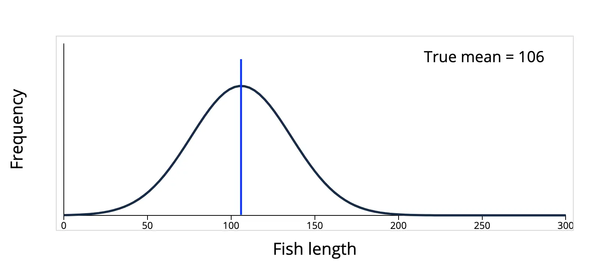
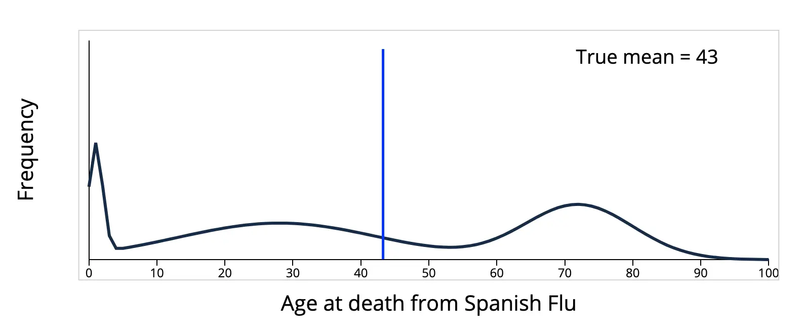

按照定义，方差的 estimator 应该是：
$$
\begin{equation}
S^2 = \frac{1}{n}\sum_{i = 1}^n\left(X_i - \overline{X}\right)^2 \label{eq:sample-variance}
\end{equation}
$$
但是这个 estimator 有 bias，因为：
$$
\begin{align*}
E(S^2) &= \frac{1}{n}\sum_{i = 1}^nE\left[\left(X_i - \overline{X}\right)^2\right] \\
&= \frac{1}{n}E\left[\sum_{i = 1}^n\left(X_i - \mu + \mu - \overline{X}\right)^2\right]\\
&= \frac{1}{n}E\left[\sum_{i = 1}^n\left(X_i - \mu\right)^2  - n \left(\overline{X} - \mu \right)^2\right] \\
&= \frac{1}{n} \left[\sum_{i = 1}^nE\left(\left(X_i - \mu\right)^2\right) - nE\left(\left(\overline{X} - \mu\right)^2\right)\right] \\
&= \frac{1}{n}\left[n\operatorname{Var}(X) - n\operatorname{Var}(\overline{X})\right] \\
&= \operatorname{Var}(X) - \operatorname{Var}(\overline{X}) \\
&= \sigma^2 - \frac{\sigma^2}{n} = \frac{n - 1}{n}\sigma^2
\end{align*}
$$

> 关于 $\operatorname{Var}(\overline{X}) = \frac{\sigma^2}{n}$ 的证明参考：[Prove that $E (\overline{X} - \mu)^2 = \frac{1}{n}\sigma^2$](https://math.stackexchange.com/questions/1363505/prove-that-e-overlinex-mu2-frac1n-sigma2)

因此为了避免使用有 bias 的 estimator，通常使用它的修正值：
$$
S^2 = \frac{1}{n - 1}\sum_{i = 1}^n\left(X_i - \overline{X}\right)^2
$$
这个时候就引出了问题，为什么分母是 $n - 1$ 而不是 $n - 2$ 或者 $n - 3$ 之类的，又或者为什么一定要进行这个修正呢，不进行修正会造成什么后果。接下来我们就对这些问题进行分析。

正常情况下，如果已知随机变量 $X$ 的期望为 $\mu$，那么可以按照下面这个公式计算方差 $\sigma^2$：
$$
\sigma^2 = E\left[\left(X - \mu\right)^2\right]
$$
但是在现实应用中往往不知道准确分布，也就无法得知 $X$ 的具体分布是什么，计算起来也很复杂，因此在实践中经常采样之后，用下面的 $S^2$ 来近似 $\sigma^2$：
$$
S^2 = \frac{1}{n}\sum_{i = 1}^n\left(X_i - \mu\right)^2
$$
但是在现实中，往往连 $X$ 的期望 $\mu$ 也不清楚，只知道样本的均值：
$$
\overline{X} = \frac{1}{n}\sum_{i = 1}^nX_i
$$
那么就会按照公式 $\eqref{eq:sample-variance}$ 来计算 $S^2$，其中 $n - 1$ 是为了对自由度进行校正，这叫做贝塞尔校正（[Bessel's correction](https://www.wikiwand.com/en/articles/Bessel's_correction)），为什么是减掉 $1$，这是因为当我们计算出样本均值 $\overline{X}$ 后，当我们再用公式 $\eqref{eq:sample-variance}$ 计算样本方差的时候，我们只需要知道样本中任意 $n - 1$ 个值（比如 $X_1, X_2, \dots,X_{n -1}$），我们就可以通过样本均值 $\overline{X}$ 和这 $n - 1$ 个值来计算得到剩下的那个值（比如这里是 $X_n$）。也就是说，当我们用样本均值 $\overline{X}$ 来代替总体的期望 $\mu$ 用于计算样本方差的时候，样本中就只剩下 $n - 1$ 个独立不互相依赖的值（也就是所谓的“自由度”，Degrees of freedom），因为另外一个值可以通过样本均值 $\overline{X}$ 和那 $n - 1$ 个样本值通过计算得到。

自由度的意义就是要求这些变量（样本）之间是相互独立，互不干扰的。比如说多个专家在对一个项目的可行性进行评估的时候，如果刚好有一个专家是另外两个专家的上级，那么这两个专家难免会受到上级的影响（利益相关）从而做出的判断就不是独立于那个上级专家的判断，这样就造成了两个专家的“自由度”的丧失，从而导致最终结果出现偏差。

这也是为什么在统计实践中，需要通过减少偏差来提高数据的可信性，通过竭力避免样本数据之间各种各样的隐含的关联关系（比如样本均值 $\overline{X}$ 和 $n$ 个样本之间的关系 $\overline{X} = \frac{1}{n}\sum_{i = 1}^nX_i$）提高数据之间的独立性就是这样一种提高数据可信性的方法之一。而解决的策略也十分清晰，就是发现其中的隐含关系，然后通过校正来避免 bias。

那么自由度变小会对样本方差产生什么样的影响呢，答案是样本方差会变小。

我们知道，方差是通过计算样本和均值之间的距离来描述样本的分散程度，数据之间差异越大，方差越大，数据之间越是趋同，方差越小。在样本方差中，因为样本均值 $\overline{X}$ 就是根据样本来计算的，让原本独立、随机的、没有偏差的样本数据，在计算加工过程中引入了偏差，减少了数据之间的差异性，这种趋同效应使得样本方差 $S^2$ 变小了。

所以样本方差 $S^2$ 公式里分母的 $n - 1$ 减去的 $1$ 是为了校正样本均值 $\overline{X}$ 的引入所带来的偏差，它不是代表某一个样本，而是对自由度的补偿，让缩小的样本方差重新变大一点。这也是在推导过程中最终得到 $\frac{n - 1}{n}\sigma^2$ 的一个直观理解。

样本方差偏小是不是采样出现问题？因为越接近平均值，就越容易被采样？从直觉上来说好像是这样的，比如下面的这个鱼类长度的分布，数据聚集在平均值 $106$ （蓝线）附近，如果在这个群体中采样，在平均值周围的确有更大的概率被采样到。

但是，直觉是靠不住的，因为上面的分布只是现实世界复杂多样的分布中的一种，还有很多的分布，其数据不在平均值附近，而是分散在四处。例如，下面这个西班牙流感死亡年龄的分布：

数据并没有聚集在平均值 $43$ 附近，如果采样，就会发现样本更大的概率是远离平均值，而不是在平均值附近。所以样本方差出现偏小的原因，并不是平均值附近被采样到的概率更大，这只是在部分情况下成立，在很多情况下并不成立。

总结一下，样本方差出现偏差的原因和采样无关，也和平均值附近更容易被采样无关，更好的解释是，计算过程中引入的样本平均值降低了样本的自由度，减少了数据的差异性，而我们通过贝塞尔校正使样本方差的分母为 $n - 1$ 来弥补丢失的样本自由度，从而使得样本方差是无偏的（unbiased）。

## 参考资料

- [为什么样本方差（sample variance）的分母是 n-1？](https://www.zhihu.com/question/20099757/answer/658048814) 一个很好的回答，用多个例子通俗易懂地说明了样本方差的分母是 $n - 1$ 的原因和偏差产生的原因

