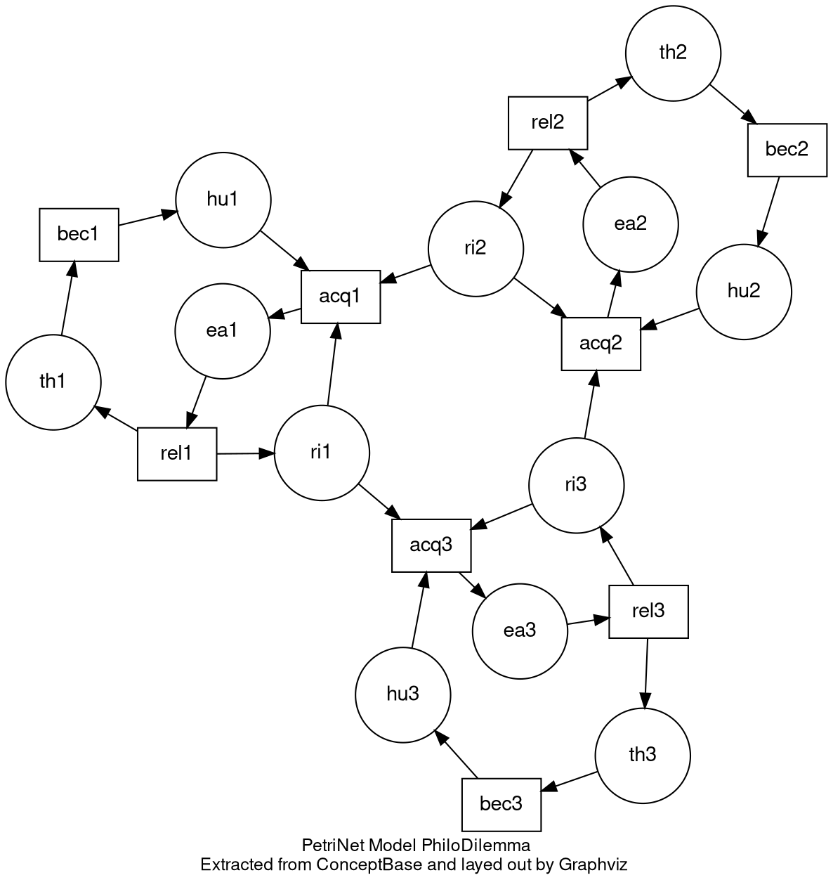
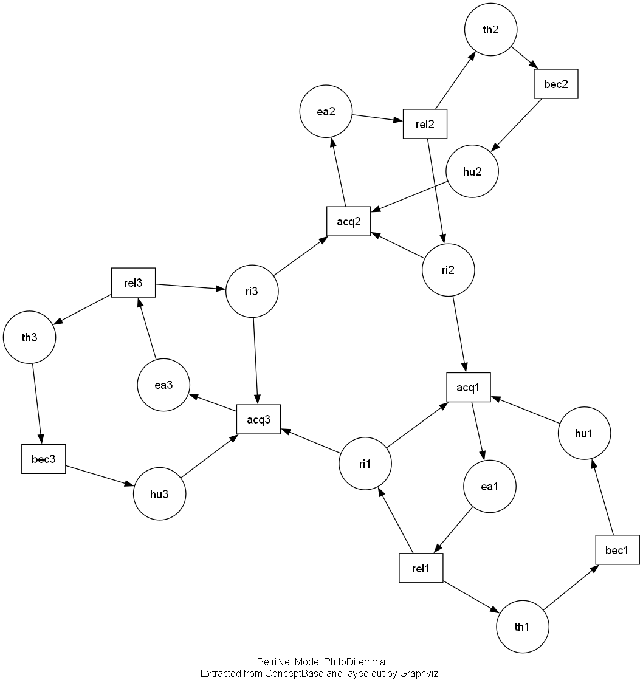

## Graphviz 是什么

[Graphviz](https://graphviz.org/about/) 是一个开源的、用文本描述来绘制关系图、网络图的工具包。不需要用鼠标拖拽画图，而是用简单的文本语言（主要是 `DOT` 语言）描述图中的点和线（节点和边），然后 Graphviz 自动计算布局并生成图片。

Graphviz 的核心思想是声明式绘图。只需要说清楚“有什么节点”和“哪些节点之间有连接”，以及一些基本的样式要求（颜色、形状、标签），剩下的布局（节点摆在哪、线怎么走）交给 Graphviz 的布局引擎（如 dot, neato, fdp 等）自动完成。

## 为什么选择 Graphviz

相比于 draw.io 等交互式图形化绘图软件，Graphviz 绘图的主要优势在于：

- 可以使用代码生成图，而不需要自己控制图形的位置，数据来源可以是数据库、API 或者其他程序（比如根据 TSP 求解代码自动生成最短路径的可视化，不需要手动绘制图形）
- 图表需要频繁修改且需要版本控制（Git）支持
- 处理非常庞大或结构高度重复的图，如果图中有成百上千个节点和连接则适合用 Graphviz 绘图
- 对图表风格一致性的要求比较高，需要生成大量风格（颜色、形状、字体、连线样式）完全一致的图表
- 支持 `pdf`、`svg`、`png` 等格式

如果主要画需要精细控制布局的图，或者图表是临时性（一次性）的，或者说图表复杂度不高，且更新频率很低，则采用 draw.io 等交互式图形化绘图软件会更好。

## 入门 Graphviz

### 安装 Graphviz

Windows 中如果安装了 Scoop，直接在命令行中输入：

```powershell
scoop install main/graphviz
```

如果安装成功，在命令行中输入下面的命令会显示 Graphviz 的版本信息：

```powershell
dot -V
```

把下面的代码保存到一个 `.dot` 文件中：



比如保存为 `example.dot` 文件，然后在命令行中输入：

```powershell
neato -Tpng example.dot > example.png
```

渲染完之后会在文件夹下看到一个 `example.png` 文件，打开就可以看到效果，大致像下面这样：



当然可以把 `-Tpng` 改成 `-Tpdf` ，把 `example.png` 改成 `example.pdf` 来输出 PDF 格式的图片。

### Graphviz 学习资料

- [Graphviz Online](https://dreampuf.github.io/GraphvizOnline/) 在线编译渲染图片，左边是 `dot` 语言代码，右边会实时渲染相应的图片，还可以选择导出的格式
- [Edotor — Your Favorite Online Graphviz Editor](https://edotor.net/) 同样是一个在线编译的网站
- [Graphviz — graphviz 0.21 documentation](https://graphviz.readthedocs.io/en/stable/index.html) Python 的 Graphviz 包文档，里面有关 Graphviz 的部分是通用的，可以集成 Python 实现更多功能
- [Documentation | Graphviz](https://graphviz.org/documentation/) Graphviz 官方文档，适合作为查询手册，哪里不知道就来查询一下

